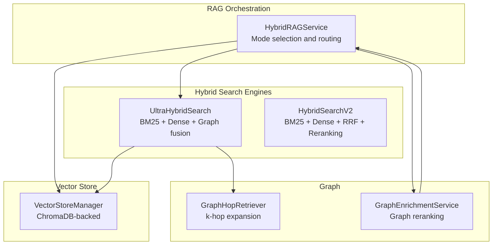
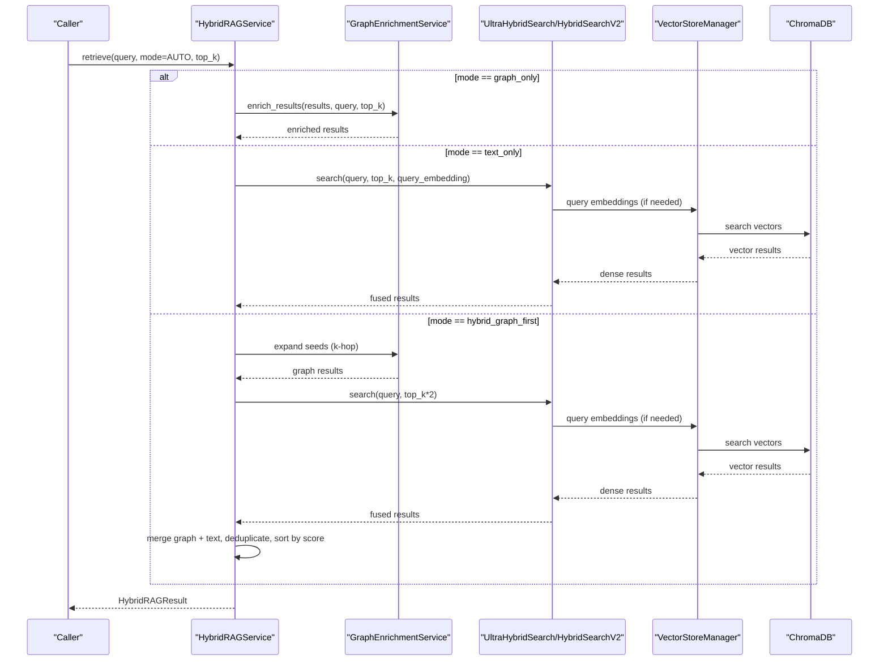
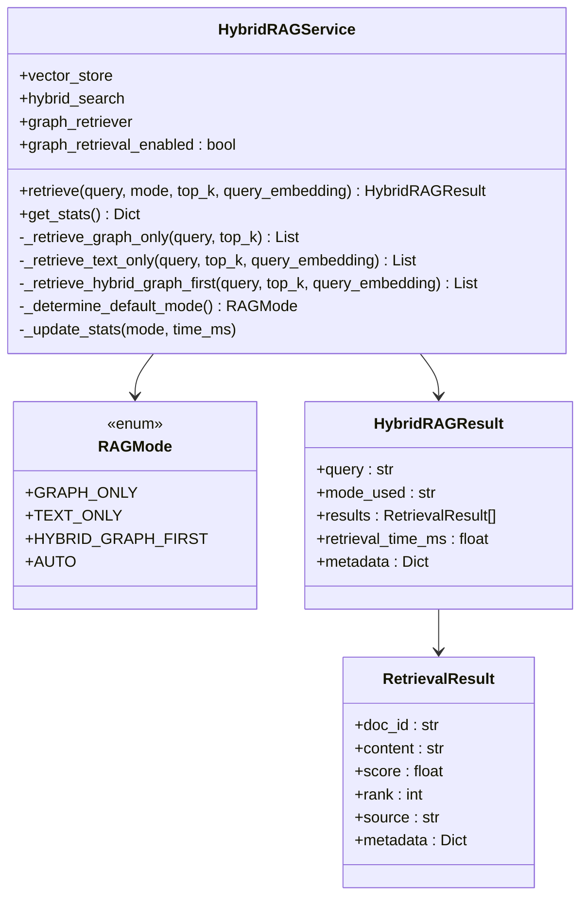
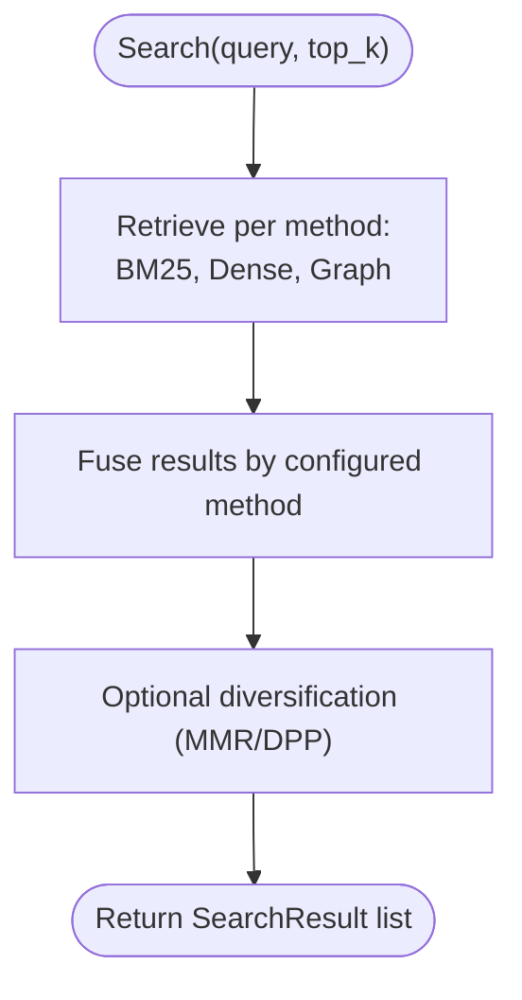
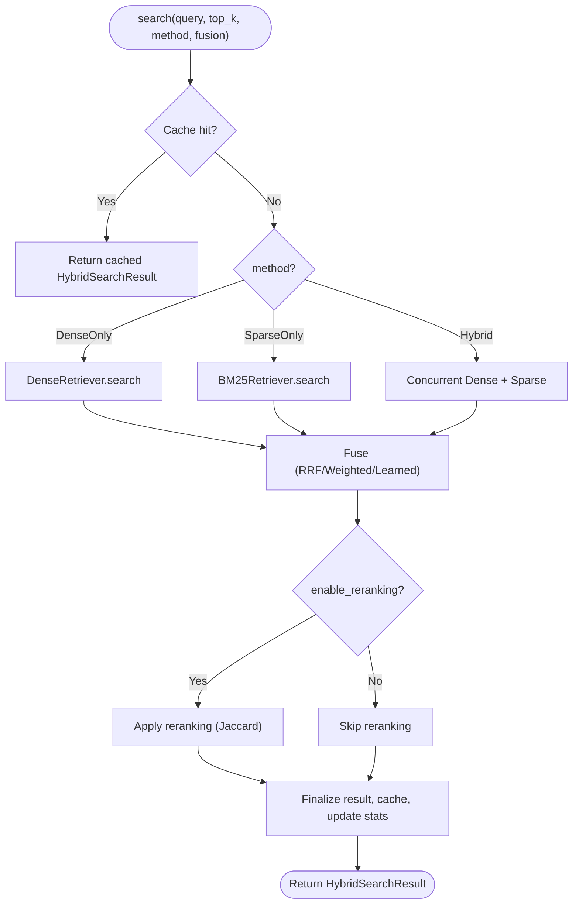
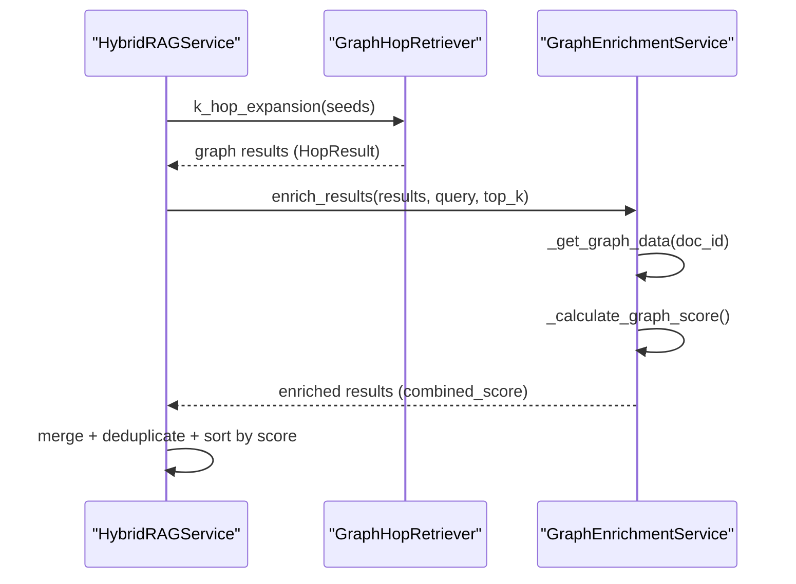
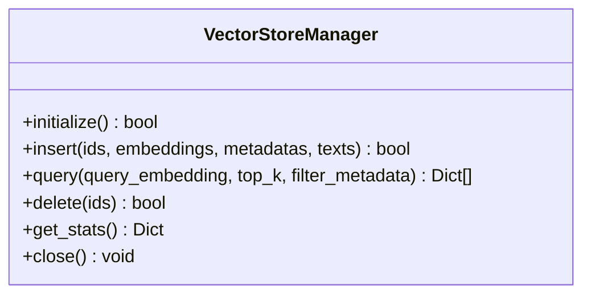
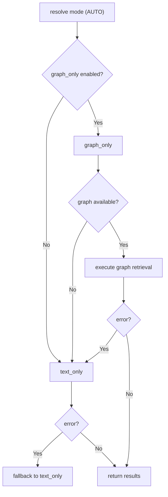
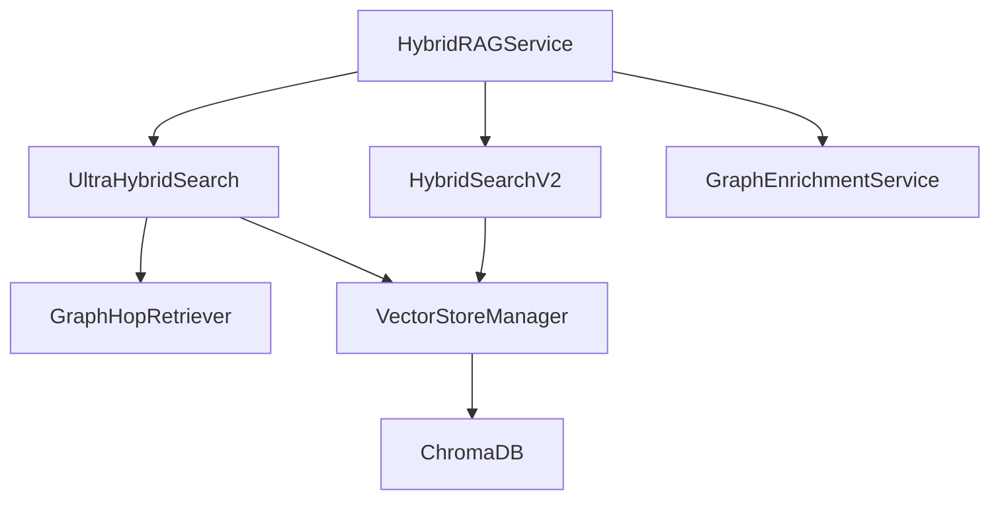

# Hybrid Retrieval System

<cite>
**Referenced Files in This Document**
- [hybrid_rag_service.py](file://mahoun/rag/hybrid_rag_service.py)
- [ultra_hybrid_search.py](file://mahoun/retrieval/ultra_hybrid_search.py)
- [hybrid_search_v2.py](file://mahoun/retrieval/hybrid_search_v2.py)
- [graph_hop.py](file://mahoun/retrieval/graph_hop.py)
- [rag_integration.py](file://mahoun/graph/services/rag_integration.py)
- [manager.py](file://mahoun/pipelines/vector_store/manager.py)
- [runtime_config.py](file://mahoun/core/runtime_config.py)
- [test_rag_components.py](file://tests/test_rag_components.py)
</cite>

## Table of Contents
1. [Introduction](#introduction)
2. [Project Structure](#project-structure)
3. [Core Components](#core-components)
4. [Architecture Overview](#architecture-overview)
5. [Detailed Component Analysis](#detailed-component-analysis)
6. [Dependency Analysis](#dependency-analysis)
7. [Performance Considerations](#performance-considerations)
8. [Troubleshooting Guide](#troubleshooting-guide)
9. [Conclusion](#conclusion)
10. [Appendices](#appendices)

## Introduction
This document explains the Hybrid Retrieval System that combines BM25 sparse retrieval, dense vector similarity, and graph-based traversal into a unified RAG service. It covers dynamic weighting of results, confidence-aware reranking, integration with ChromaDB for dense retrieval and Neo4j for graph traversal, configuration-driven modes (RAGMode), fallback strategies, and practical performance optimizations for low-latency, high-throughput production deployments.

## Project Structure
The Hybrid Retrieval System spans several modules:
- RAG orchestration and mode selection
- Hybrid search engines (two variants)
- Graph hop expansion and enrichment
- Vector store integration (ChromaDB)
- Runtime configuration and feature flags
- Tests demonstrating retrieval behavior

**Diagram sources**
- [hybrid_rag_service.py](file://mahoun/rag/hybrid_rag_service.py#L1-L200)
- [ultra_hybrid_search.py](file://mahoun/retrieval/ultra_hybrid_search.py#L1-L200)
- [hybrid_search_v2.py](file://mahoun/retrieval/hybrid_search_v2.py#L1-L200)
- [graph_hop.py](file://mahoun/retrieval/graph_hop.py#L1-L120)
- [rag_integration.py](file://mahoun/graph/services/rag_integration.py#L1-L120)
- [manager.py](file://mahoun/pipelines/vector_store/manager.py#L1-L120)

**Section sources**
- [hybrid_rag_service.py](file://mahoun/rag/hybrid_rag_service.py#L1-L120)
- [ultra_hybrid_search.py](file://mahoun/retrieval/ultra_hybrid_search.py#L1-L120)
- [hybrid_search_v2.py](file://mahoun/retrieval/hybrid_search_v2.py#L1-L120)
- [graph_hop.py](file://mahoun/retrieval/graph_hop.py#L1-L120)
- [rag_integration.py](file://mahoun/graph/services/rag_integration.py#L1-L120)
- [manager.py](file://mahoun/pipelines/vector_store/manager.py#L1-L120)

## Core Components
- HybridRAGService: Orchestrates retrieval across modes (graph_only, text_only, hybrid_graph_first), applies fallbacks, and aggregates statistics.
- UltraHybridSearch: Multi-strategy fusion (BM25, Dense, Graph) with configurable diversification and weights.
- HybridSearchV2: Production-grade BM25 + Dense hybrid with RRF fusion, caching, and optional reranking.
- GraphHopRetriever: Performs k-hop expansion from seed entities to enrich retrieval results.
- GraphEnrichmentService: Enriches and reranks results using graph-derived signals.
- VectorStoreManager: ChromaDB-backed vector store with initialization, insertion, and querying.
- Runtime configuration: Controls graph availability, retrieval mode, and feature flags.

**Section sources**
- [hybrid_rag_service.py](file://mahoun/rag/hybrid_rag_service.py#L1-L200)
- [ultra_hybrid_search.py](file://mahoun/retrieval/ultra_hybrid_search.py#L1-L200)
- [hybrid_search_v2.py](file://mahoun/retrieval/hybrid_search_v2.py#L1-L200)
- [graph_hop.py](file://mahoun/retrieval/graph_hop.py#L1-L120)
- [rag_integration.py](file://mahoun/graph/services/rag_integration.py#L1-L120)
- [manager.py](file://mahoun/pipelines/vector_store/manager.py#L1-L120)
- [runtime_config.py](file://mahoun/core/runtime_config.py#L1-L120)

## Architecture Overview
The system supports three operational modes:
- graph_only: Uses graph traversal when available.
- text_only: Uses BM25 + Dense fusion (via UltraHybridSearch or HybridSearchV2).
- hybrid_graph_first: Starts with graph, then augments with text and merges/fusion.

**Diagram sources**
- [hybrid_rag_service.py](file://mahoun/rag/hybrid_rag_service.py#L134-L377)
- [ultra_hybrid_search.py](file://mahoun/retrieval/ultra_hybrid_search.py#L508-L615)
- [hybrid_search_v2.py](file://mahoun/retrieval/hybrid_search_v2.py#L725-L821)
- [manager.py](file://mahoun/pipelines/vector_store/manager.py#L309-L409)
- [rag_integration.py](file://mahoun/graph/services/rag_integration.py#L96-L154)

## Detailed Component Analysis

### HybridRAGService
- Modes: RAGMode includes graph_only, text_only, hybrid_graph_first, and AUTO.
- Default mode selection depends on runtime settings and graph retriever availability.
- Fallback behavior: On errors or disabled features, falls back to text_only.
- Hybrid graph-first flow: Executes graph expansion (if enabled), then text retrieval, merges, deduplicates, and sorts by score.

**Diagram sources**
- [hybrid_rag_service.py](file://mahoun/rag/hybrid_rag_service.py#L1-L200)

**Section sources**
- [hybrid_rag_service.py](file://mahoun/rag/hybrid_rag_service.py#L1-L200)
- [hybrid_rag_service.py](file://mahoun/rag/hybrid_rag_service.py#L134-L377)

### UltraHybridSearch
- Multi-strategy retrievers: BM25, Dense, Graph.
- Fusion methods: RRF, Weighted, CombSUM, Borda, Learned.
- Diversification: MMR, DPP, or None.
- Pipeline: Retrieve per method, fuse, diversify, produce SearchResult list with metadata.

**Diagram sources**
- [ultra_hybrid_search.py](file://mahoun/retrieval/ultra_hybrid_search.py#L508-L615)

**Section sources**
- [ultra_hybrid_search.py](file://mahoun/retrieval/ultra_hybrid_search.py#L1-L200)
- [ultra_hybrid_search.py](file://mahoun/retrieval/ultra_hybrid_search.py#L508-L615)

### HybridSearchV2 (Production-Grade)
- BM25 sparse retrieval and dense vector similarity.
- RRF fusion, weighted sum, learned fusion.
- Caching with LRU + TTL, thread-safe executor, and comprehensive metrics.
- Optional reranking using query-term overlap (Jaccard) to refine scores.

**Diagram sources**
- [hybrid_search_v2.py](file://mahoun/retrieval/hybrid_search_v2.py#L725-L821)
- [hybrid_search_v2.py](file://mahoun/retrieval/hybrid_search_v2.py#L1248-L1288)

**Section sources**
- [hybrid_search_v2.py](file://mahoun/retrieval/hybrid_search_v2.py#L1-L200)
- [hybrid_search_v2.py](file://mahoun/retrieval/hybrid_search_v2.py#L725-L821)
- [hybrid_search_v2.py](file://mahoun/retrieval/hybrid_search_v2.py#L1248-L1288)

### Graph Integration
- GraphHopRetriever expands seeds from initial retrieval results using k-hop traversal, scoring paths and relationships.
- GraphEnrichmentService enriches and reranks results using graph-derived signals (centrality, citations, related docs, entities) and a combined score.

**Diagram sources**
- [graph_hop.py](file://mahoun/retrieval/graph_hop.py#L105-L235)
- [rag_integration.py](file://mahoun/graph/services/rag_integration.py#L96-L154)

**Section sources**
- [graph_hop.py](file://mahoun/retrieval/graph_hop.py#L1-L235)
- [rag_integration.py](file://mahoun/graph/services/rag_integration.py#L1-L200)

### Vector Store Integration (ChromaDB)
- VectorStoreManager initializes ChromaDB with persistence, inserts embeddings with metadata, and queries vectors with optional filters.
- Converts distances to similarity for cosine distance metrics.

**Diagram sources**
- [manager.py](file://mahoun/pipelines/vector_store/manager.py#L1-L120)
- [manager.py](file://mahoun/pipelines/vector_store/manager.py#L309-L409)

**Section sources**
- [manager.py](file://mahoun/pipelines/vector_store/manager.py#L1-L120)
- [manager.py](file://mahoun/pipelines/vector_store/manager.py#L309-L409)

### Configuration and Fallback Strategies
- RAGMode controls operational behavior; AUTO selects based on runtime settings.
- Feature flags: MAHOUN_GRAPH_RETRIEVAL_ENABLED toggles graph-only mode.
- Runtime settings: get_runtime_settings determines graph availability and retrieval mode.
- Fallbacks: On errors or disabled features, the service gracefully falls back to text-only.

**Diagram sources**
- [hybrid_rag_service.py](file://mahoun/rag/hybrid_rag_service.py#L134-L210)
- [runtime_config.py](file://mahoun/core/runtime_config.py#L1-L120)

**Section sources**
- [hybrid_rag_service.py](file://mahoun/rag/hybrid_rag_service.py#L101-L170)
- [runtime_config.py](file://mahoun/core/runtime_config.py#L1-L120)

### Retrieval Accuracy Improvements (Tests)
- Tests demonstrate end-to-end RAG components, including citation extraction and indexing pipeline readiness, validating that retrieval results can be integrated into downstream systems.

**Section sources**
- [test_rag_components.py](file://tests/test_rag_components.py#L1-L101)

## Dependency Analysis
Key dependencies and relationships:
- HybridRAGService depends on UltraHybridSearch/HybridSearchV2 for text retrieval and on GraphEnrichmentService for graph augmentation.
- UltraHybridSearch composes BM25Retriever, DenseRetriever, and GraphHopRetriever.
- HybridSearchV2 composes BM25Retriever and DenseRetriever with caching and optional reranking.
- VectorStoreManager integrates with ChromaDB for dense retrieval.
- Runtime configuration governs graph availability and mode selection.

**Diagram sources**
- [hybrid_rag_service.py](file://mahoun/rag/hybrid_rag_service.py#L1-L200)
- [ultra_hybrid_search.py](file://mahoun/retrieval/ultra_hybrid_search.py#L1-L200)
- [hybrid_search_v2.py](file://mahoun/retrieval/hybrid_search_v2.py#L1-L200)
- [graph_hop.py](file://mahoun/retrieval/graph_hop.py#L1-L120)
- [rag_integration.py](file://mahoun/graph/services/rag_integration.py#L1-L120)
- [manager.py](file://mahoun/pipelines/vector_store/manager.py#L1-L120)

**Section sources**
- [hybrid_rag_service.py](file://mahoun/rag/hybrid_rag_service.py#L1-L200)
- [ultra_hybrid_search.py](file://mahoun/retrieval/ultra_hybrid_search.py#L1-L200)
- [hybrid_search_v2.py](file://mahoun/retrieval/hybrid_search_v2.py#L1-L200)
- [graph_hop.py](file://mahoun/retrieval/graph_hop.py#L1-L120)
- [rag_integration.py](file://mahoun/graph/services/rag_integration.py#L1-L120)
- [manager.py](file://mahoun/pipelines/vector_store/manager.py#L1-L120)

## Performance Considerations
- Latency targets: HybridSearchV2 targets sub-100ms for top-10 results and sub-50ms for cached queries.
- Concurrency: HybridSearchV2 uses a thread pool for CPU-intensive tasks and async operations for IO-bound tasks.
- Caching: LRU + TTL cache reduces repeated computation and improves throughput.
- Reranking cost: Optional reranking adds minimal overhead; HybridSearchV2’s Jaccard-based reranking is lightweight.
- Vector search scaling: ChromaDB-backed VectorStoreManager supports persistence and efficient similarity search.
- Graph traversal: GraphHopRetriever’s k-hop expansion is bounded by max_hops and per-hop result limits.

[No sources needed since this section provides general guidance]

## Troubleshooting Guide
Common issues and resolutions:
- Result ranking inconsistencies:
  - Use HybridSearchV2’s optional reranking to refine scores via query-term overlap.
  - Ensure consistent scoring across methods (dense vs BM25) by enabling fusion and diversification.
- Latency spikes:
  - Enable caching (LRU + TTL) to reduce repeated computations.
  - Reduce top_k for initial retrieval to minimize downstream processing.
  - Prefer HybridSearchV2 for production-grade latency guarantees.
- Graph retrieval failures:
  - Verify graph availability and feature flags (graph-only disabled).
  - Fall back to text-only mode automatically; confirm fallback logic is functioning.
- Vector store errors:
  - Confirm ChromaDB initialization and collection creation.
  - Validate embedding dimensions and metadata serialization.

**Section sources**
- [hybrid_search_v2.py](file://mahoun/retrieval/hybrid_search_v2.py#L1248-L1288)
- [hybrid_rag_service.py](file://mahoun/rag/hybrid_rag_service.py#L134-L210)
- [manager.py](file://mahoun/pipelines/vector_store/manager.py#L137-L227)

## Conclusion
The Hybrid Retrieval System provides a robust, configurable, and production-ready solution that blends BM25, dense vector search, and graph traversal. Through dynamic weighting, optional reranking, and careful fallback strategies, it maintains high accuracy and low latency. Integration with ChromaDB and Neo4j enables scalable, explainable retrieval suitable for high-throughput environments.

## Appendices

### Configuration Options (RAGMode and Fallbacks)
- RAGMode:
  - graph_only: Pure graph retrieval when enabled.
  - text_only: BM25 + Dense fusion.
  - hybrid_graph_first: Graph expansion followed by text fusion.
  - AUTO: Default determined by runtime settings and graph retriever presence.
- Feature flags:
  - MAHOUN_GRAPH_RETRIEVAL_ENABLED: Enables graph-only mode.
- Runtime settings:
  - get_runtime_settings controls graph availability and retrieval mode.

**Section sources**
- [hybrid_rag_service.py](file://mahoun/rag/hybrid_rag_service.py#L101-L170)
- [runtime_config.py](file://mahoun/core/runtime_config.py#L1-L120)

### Example Usage References
- HybridRAGService usage patterns and initialization helper are documented in the module comments and helper function.

**Section sources**
- [hybrid_rag_service.py](file://mahoun/rag/hybrid_rag_service.py#L1-L120)
- [hybrid_rag_service.py](file://mahoun/rag/hybrid_rag_service.py#L397-L452)