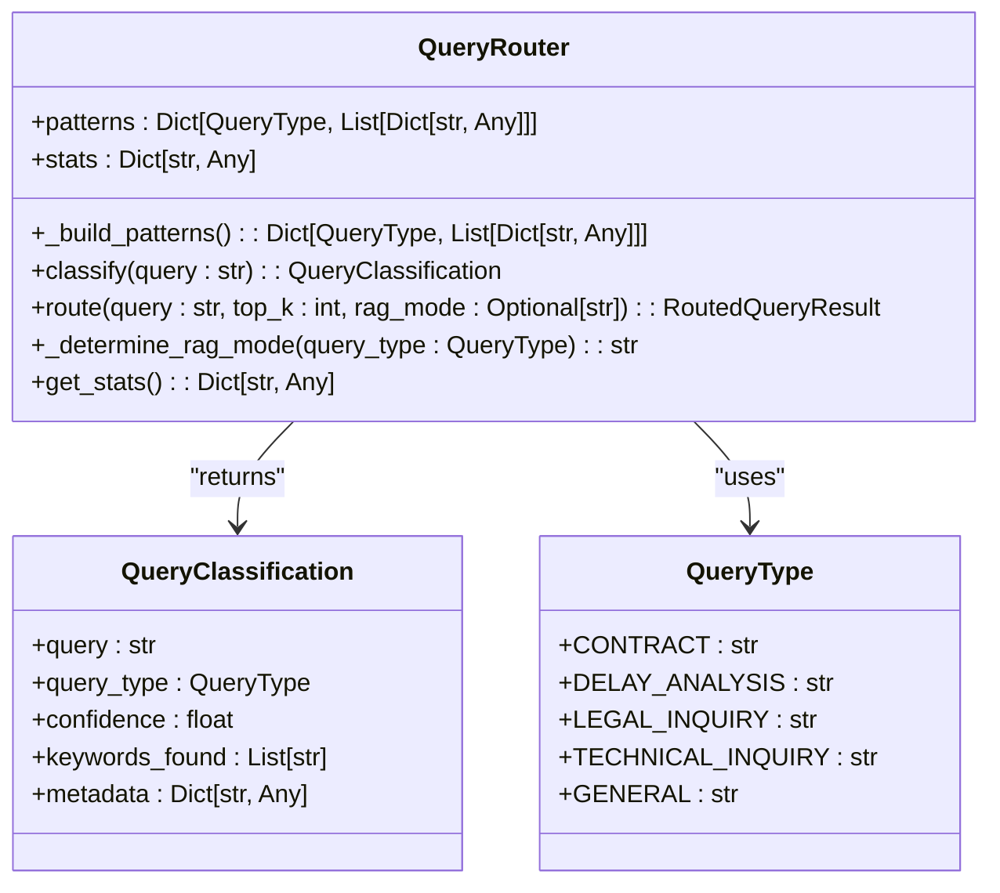
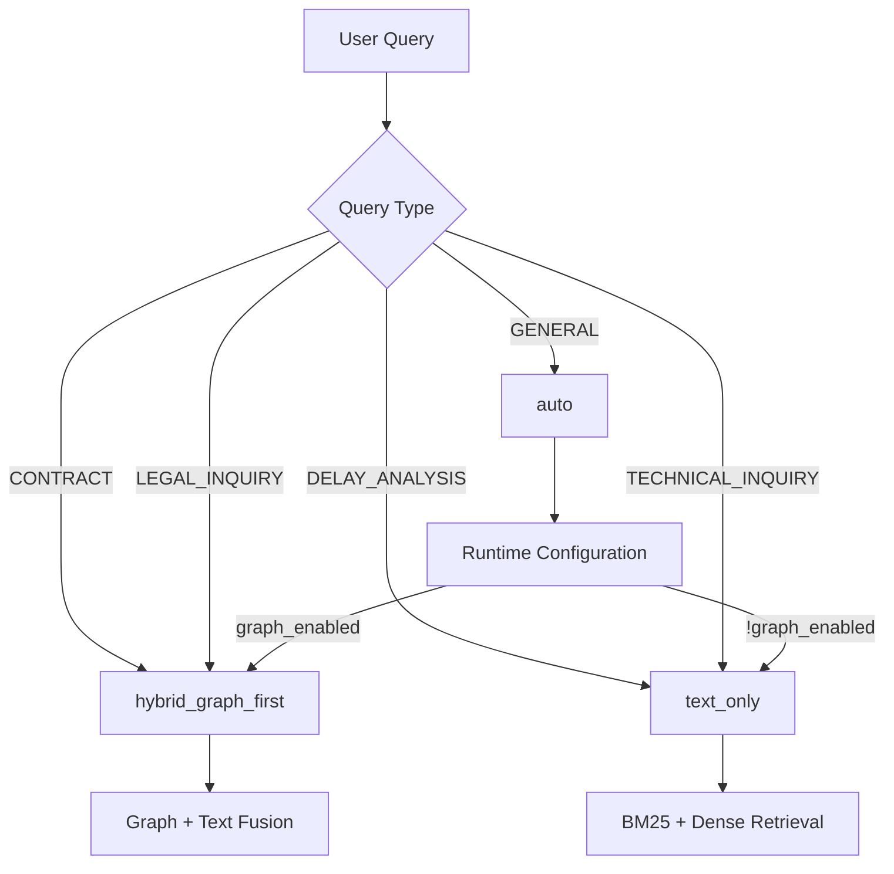
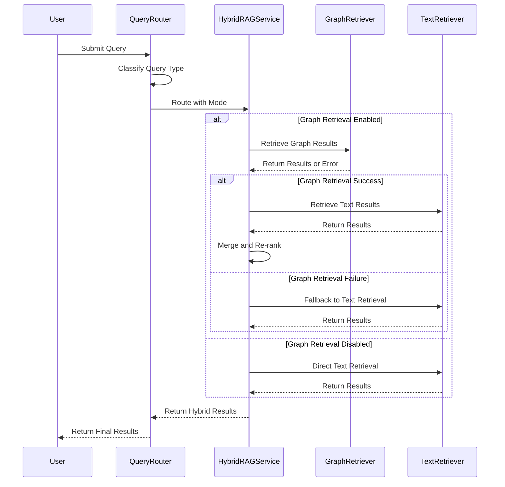
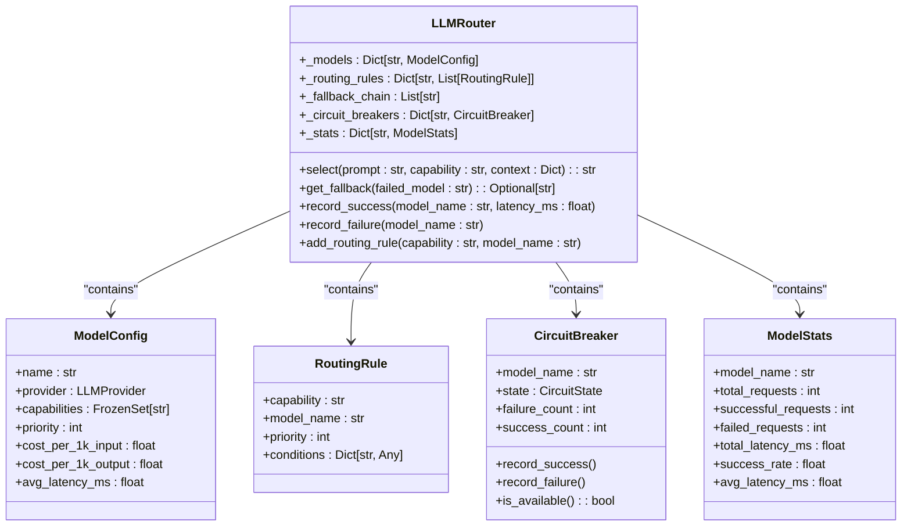
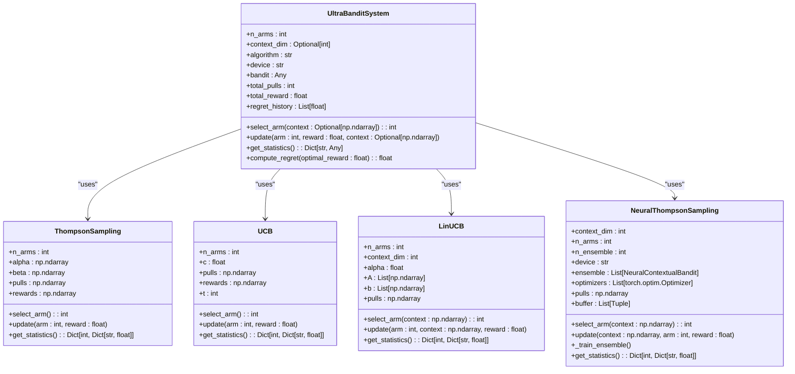
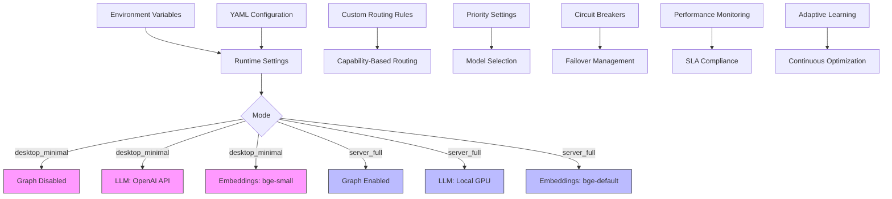
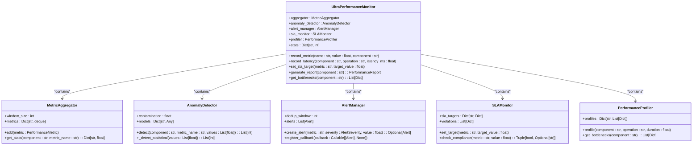

# Intelligent Query Routing

<cite>
**Referenced Files in This Document**   
- [query_router.py](file://mahoun/rag/query_router.py)
- [test_llm_router_properties.py](file://tests/test_llm_router_properties.py)
- [ultra_bandit_system.py](file://mahoun/self_improve/ultra_bandit_system.py)
- [hybrid_rag_service.py](file://mahoun/rag/hybrid_rag_service.py)
- [router.py](file://mahoun/core/llm/router.py)
- [runtime_config.py](file://mahoun/core/runtime_config.py)
</cite>

## Table of Contents
1. [Introduction](#introduction)
2. [Query Classification System](#query-classification-system)
3. [Routing Strategy and RAG Mode Selection](#routing-strategy-and-rag-mode-selection)
4. [Confidence Scoring and Fallback Mechanism](#confidence-scoring-and-fallback-mechanism)
5. [LLM Router Integration and Dynamic Model Selection](#llm-router-integration-and-dynamic-model-selection)
6. [Adaptive Learning with Ultra Bandit System](#adaptive-learning-with-ultra-bandit-system)
7. [Configuration Options and Custom Routing Rules](#configuration-options-and-custom-routing-rules)
8. [Performance Monitoring and Optimization](#performance-monitoring-and-optimization)
9. [Common Issues and Solutions](#common-issues-and-solutions)

## Introduction
The Intelligent Query Routing system in MAHOUN is designed to classify user queries and route them to the most appropriate retrieval strategy based on query intent. This system leverages pattern matching, keyword detection, and confidence scoring to determine query types such as contract-related, delay analysis, legal inquiry, or technical inquiry. The routing mechanism integrates with the LLM router for dynamic model selection and employs an adaptive learning system to continuously improve classification accuracy and routing efficiency. This document provides a comprehensive overview of the query routing architecture, implementation details, and optimization strategies.

## Query Classification System

The QueryClassification system identifies query intent through pattern matching and keyword detection. It supports multiple query types including contract, delay analysis, legal inquiry, and technical inquiry. The classification process involves analyzing the input query against predefined patterns and keywords associated with each query type. The system computes scores for each query type based on pattern matches and normalizes these scores to generate a confidence level between 0 and 1.

**Diagram sources**
- [query_router.py](file://mahoun/rag/query_router.py#L25-L32)
- [query_router.py](file://mahoun/rag/query_router.py#L34-L42)
- [query_router.py](file://mahoun/rag/query_router.py#L54-L323)

**Section sources**
- [query_router.py](file://mahoun/rag/query_router.py#L25-L228)

## Routing Strategy and RAG Mode Selection

The routing strategy determines the appropriate RAG mode based on the classified query type. Contract and legal inquiries are routed to hybrid_graph_first mode to leverage graph relationships, while delay analysis and technical inquiries use text_only mode for structured text retrieval. The system automatically selects the optimal retrieval strategy through the _determine_rag_mode method, which maps query types to specific RAG modes. The HybridRAGService supports multiple operational modes including graph_only, text_only, and hybrid_graph_first, with automatic fallback to text_only if graph retrieval is unavailable.

**Diagram sources**
- [query_router.py](file://mahoun/rag/query_router.py#L285-L313)
- [hybrid_rag_service.py](file://mahoun/rag/hybrid_rag_service.py#L29-L34)
- [hybrid_rag_service.py](file://mahoun/rag/hybrid_rag_service.py#L127-L132)

**Section sources**
- [query_router.py](file://mahoun/rag/query_router.py#L285-L313)
- [hybrid_rag_service.py](file://mahoun/rag/hybrid_rag_service.py#L127-L132)

## Confidence Scoring and Fallback Mechanism

The confidence scoring mechanism normalizes pattern match scores to produce a confidence level between 0 and 1. When the maximum score is zero, indicating no pattern matches, the system defaults to GENERAL query type with 0.5 confidence. The fallback routing logic ensures resilience by automatically switching to alternative retrieval strategies when primary methods fail. If graph-only retrieval is disabled or fails, the system falls back to text_only mode. The HybridRAGService implements error handling that catches exceptions during retrieval and automatically falls back to text_only mode, ensuring continuous service availability.

**Diagram sources**
- [query_router.py](file://mahoun/rag/query_router.py#L200-L212)
- [hybrid_rag_service.py](file://mahoun/rag/hybrid_rag_service.py#L159-L217)
- [hybrid_rag_service.py](file://mahoun/rag/hybrid_rag_service.py#L219-L376)

**Section sources**
- [query_router.py](file://mahoun/rag/query_router.py#L200-L212)
- [hybrid_rag_service.py](file://mahoun/rag/hybrid_rag_service.py#L159-L217)

## LLM Router Integration and Dynamic Model Selection

The LLM router integration enables dynamic model selection based on query complexity and capability requirements. The system uses a priority-based fallback chain with circuit breakers to ensure high availability. Model selection is deterministic, meaning identical inputs always produce the same output, ensuring reproducibility and auditability. The router supports multiple routing strategies including priority, round-robin, least latency, and least cost. Routing rules can be configured by capability, cost, or latency, allowing fine-grained control over model selection.

**Diagram sources**
- [router.py](file://mahoun/core/llm/router.py#L117-L150)
- [router.py](file://mahoun/core/llm/router.py#L171-L290)
- [router.py](file://mahoun/core/llm/router.py#L321-L800)

**Section sources**
- [router.py](file://mahoun/core/llm/router.py#L117-L150)
- [router.py](file://mahoun/core/llm/router.py#L171-L290)
- [router.py](file://mahoun/core/llm/router.py#L321-L800)

## Adaptive Learning with Ultra Bandit System

The ultra_bandit_system.py implements advanced multi-armed bandit algorithms for adaptive learning and optimization. This system supports Thompson Sampling, UCB (Upper Confidence Bound), LinUCB for contextual bandits, and Neural Thompson Sampling with ensemble networks. The UltraBanditSystem class provides a unified interface to multiple bandit algorithms, enabling exploration-exploitation trade-offs in model selection and routing decisions. The system maintains statistics on arm performance and computes cumulative regret to measure optimization effectiveness.

**Diagram sources**
- [ultra_bandit_system.py](file://mahoun/self_improve/ultra_bandit_system.py#L40-L75)
- [ultra_bandit_system.py](file://mahoun/self_improve/ultra_bandit_system.py#L78-L117)
- [ultra_bandit_system.py](file://mahoun/self_improve/ultra_bandit_system.py#L124-L167)
- [ultra_bandit_system.py](file://mahoun/self_improve/ultra_bandit_system.py#L206-L291)
- [ultra_bandit_system.py](file://mahoun/self_improve/ultra_bandit_system.py#L346-L416)

**Section sources**
- [ultra_bandit_system.py](file://mahoun/self_improve/ultra_bandit_system.py#L40-L416)

## Configuration Options and Custom Routing Rules

The system provides extensive configuration options for custom routing rules and performance monitoring. Runtime settings are controlled through environment variables and YAML configuration files, allowing mode-specific configurations for desktop_minimal and server_full deployments. The runtime_config.py module manages settings for graph operations, LoRA training, LLM backends, and embedding models. Custom routing rules can be defined by capability, with priority-based rule evaluation ensuring deterministic behavior. The system supports enterprise graph mode with hybrid retrieval and local full backends for maximum performance.

**Diagram sources**
- [runtime_config.py](file://mahoun/core/runtime_config.py#L32-L64)
- [runtime_config.py](file://mahoun/core/runtime_config.py#L149-L238)
- [router.py](file://mahoun/core/llm/router.py#L469-L503)

**Section sources**
- [runtime_config.py](file://mahoun/core/runtime_config.py#L32-L278)
- [router.py](file://mahoun/core/llm/router.py#L469-L503)

## Performance Monitoring and Optimization

The system includes comprehensive performance monitoring through the UltraPerformanceMonitor class, which collects metrics on latency, throughput, error rates, and resource utilization. The monitoring system implements ML-based anomaly detection using statistical methods and isolation forests to identify performance issues. SLA monitoring tracks compliance with performance targets, while the performance profiler identifies bottlenecks in critical operations. The system generates detailed performance reports with recommendations for optimization, including cache hit rate improvements and latency reduction strategies.

**Diagram sources**
- [ultra_performance_monitoring.py](file://mahoun/self_improve/ultra_performance_monitoring.py#L121-L162)
- [ultra_performance_monitoring.py](file://mahoun/self_improve/ultra_performance_monitoring.py#L164-L232)
- [ultra_performance_monitoring.py](file://mahoun/self_improve/ultra_performance_monitoring.py#L235-L304)
- [ultra_performance_monitoring.py](file://mahoun/self_improve/ultra_performance_monitoring.py#L306-L372)
- [ultra_performance_monitoring.py](file://mahoun/self_improve/ultra_performance_monitoring.py#L374-L423)
- [ultra_performance_monitoring.py](file://mahoun/self_improve/ultra_performance_monitoring.py#L425-L745)

**Section sources**
- [ultra_performance_monitoring.py](file://mahoun/self_improve/ultra_performance_monitoring.py#L121-L745)

## Common Issues and Solutions

Common issues in the query routing system include misclassification of queries, routing latency, and resource constraints in desktop_minimal mode. Misclassification can occur when queries contain keywords from multiple categories, leading to ambiguous pattern matches. This is addressed through confidence scoring and the default GENERAL classification for low-confidence matches. Routing latency issues are mitigated by the fallback mechanism and circuit breakers that prevent cascading failures. In desktop_minimal mode, graph operations are disabled by default to conserve resources, with automatic fallback to text-only retrieval. The adaptive learning system continuously improves classification accuracy through feedback loops and performance monitoring.

**Section sources**
- [query_router.py](file://mahoun/rag/query_router.py#L207-L212)
- [hybrid_rag_service.py](file://mahoun/rag/hybrid_rag_service.py#L159-L217)
- [runtime_config.py](file://mahoun/core/runtime_config.py#L186-L208)
- [ultra_performance_monitoring.py](file://mahoun/self_improve/ultra_performance_monitoring.py#L570-L600)