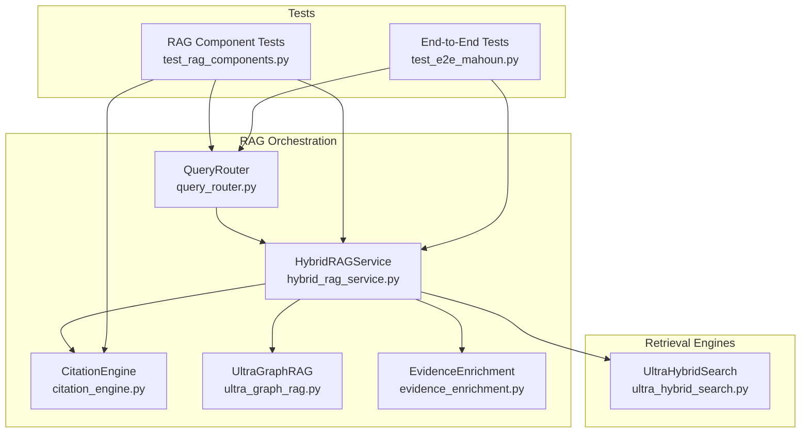
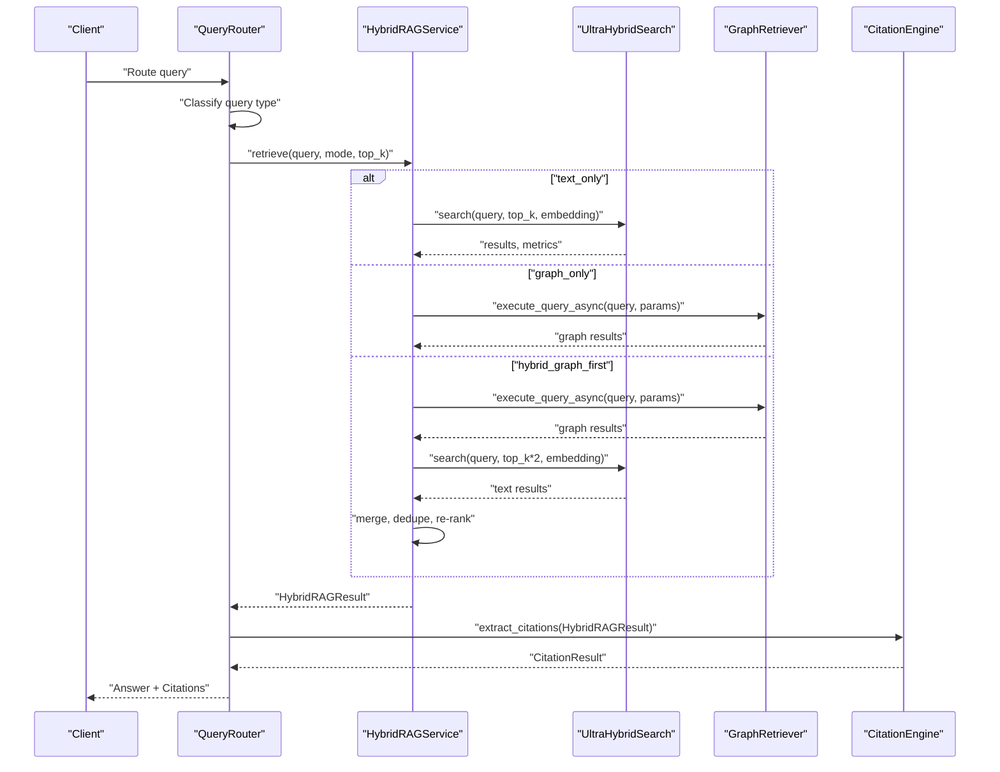
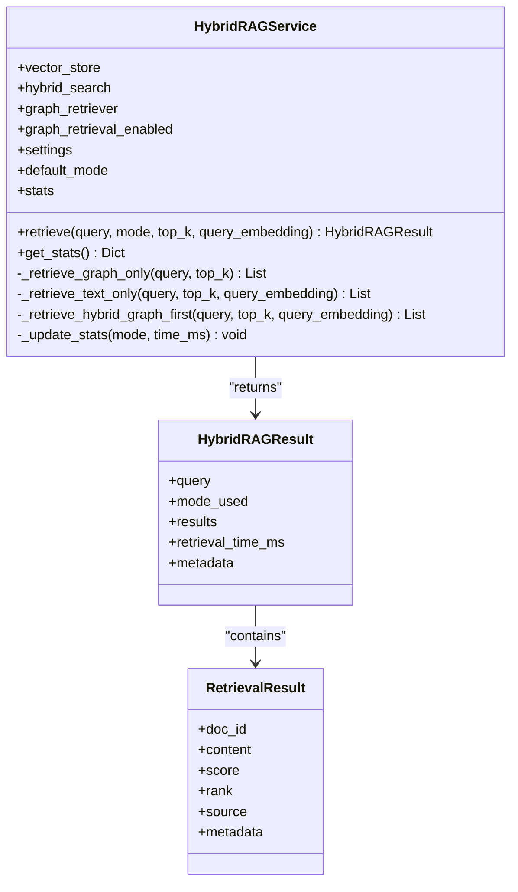
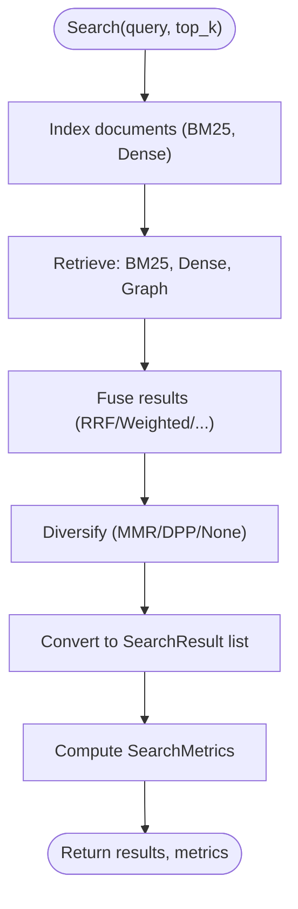
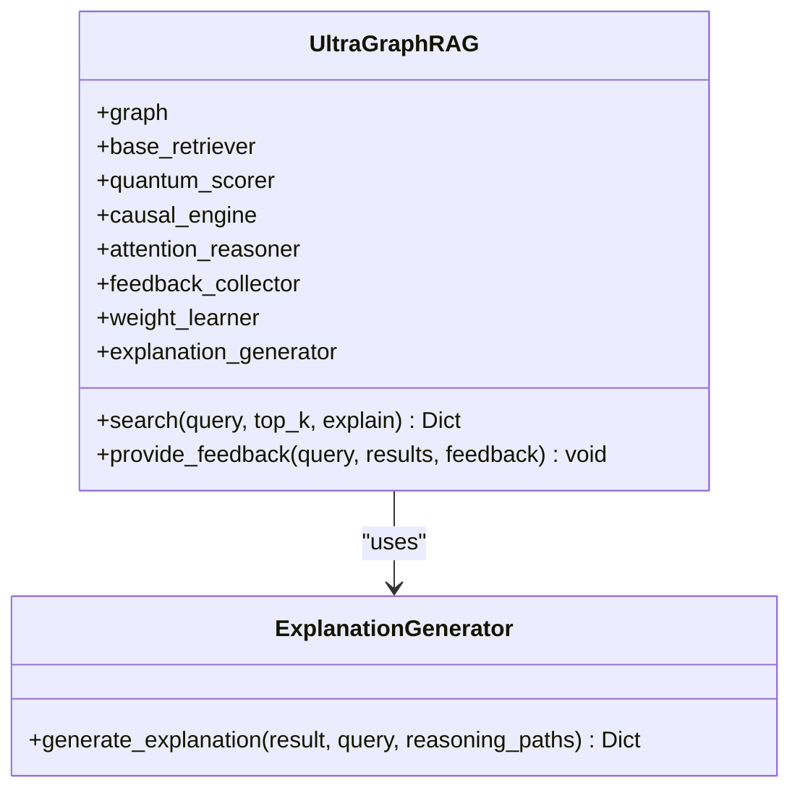
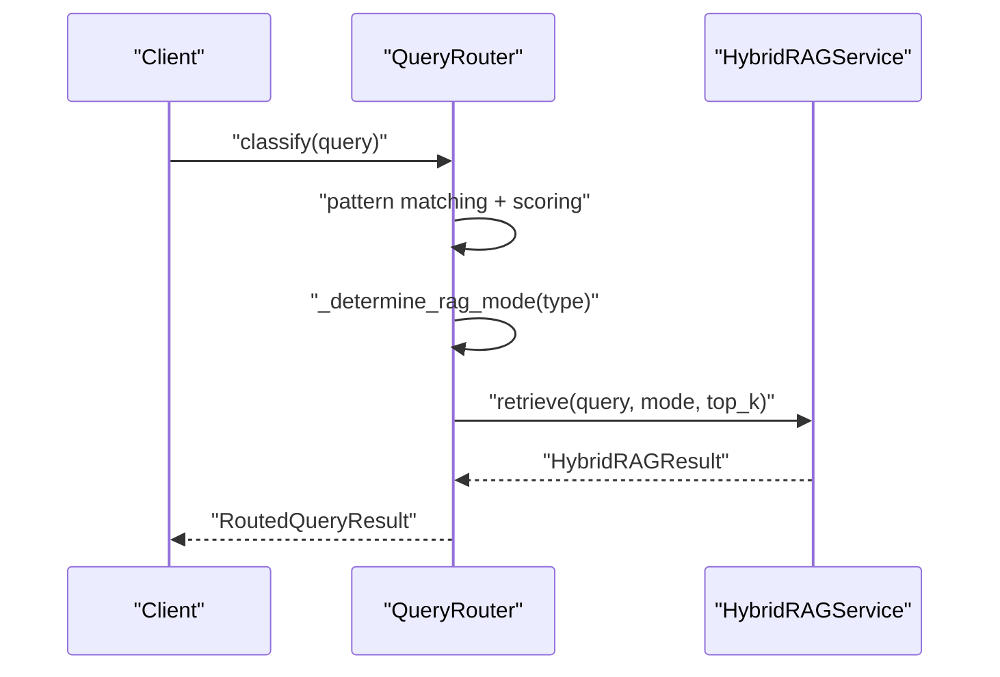
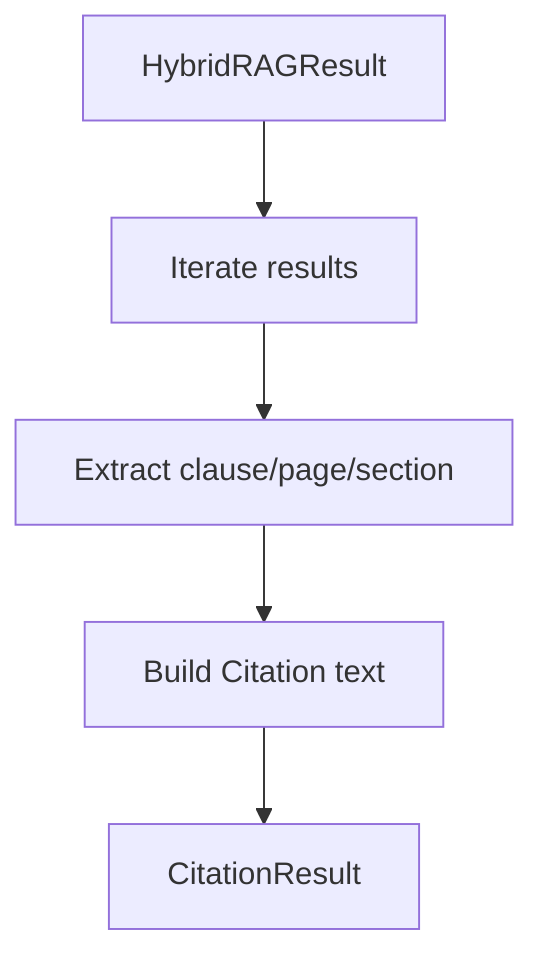
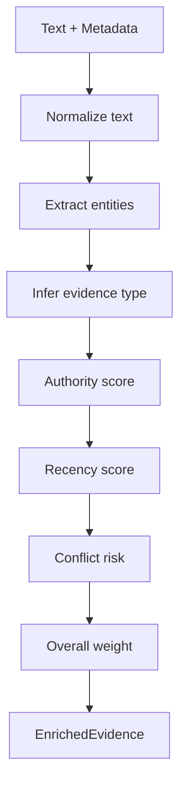
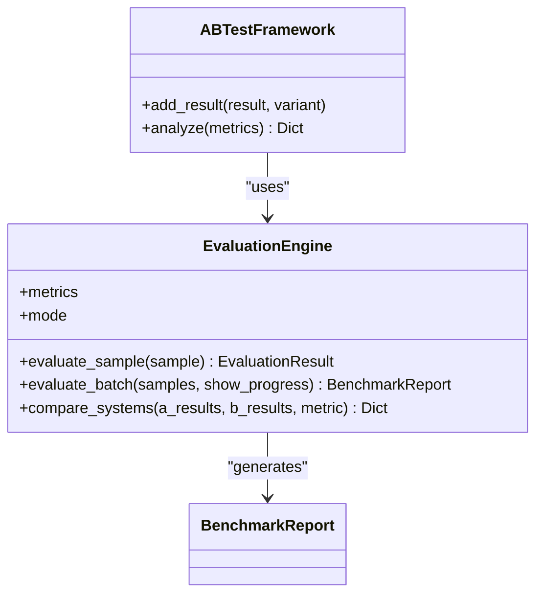
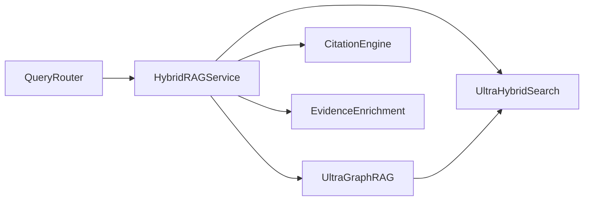

# RAG Architecture

<cite>
**Referenced Files in This Document**
- [hybrid_rag_service.py](file://mahoun/rag/hybrid_rag_service.py)
- [ultra_graph_rag.py](file://mahoun/rag/ultra_graph_rag.py)
- [citation_engine.py](file://mahoun/rag/citation_engine.py)
- [query_router.py](file://mahoun/rag/query_router.py)
- [evidence_enrichment.py](file://mahoun/rag/evidence_enrichment.py)
- [ultra_evaluation_system.py](file://mahoun/rag/ultra_evaluation_system.py)
- [ultra_hybrid_search.py](file://mahoun/retrieval/ultra_hybrid_search.py)
- [test_rag_components.py](file://tests/test_rag_components.py)
- [test_e2e_mahoun.py](file://tests/test_e2e_mahoun.py)
</cite>

## Table of Contents
1. [Introduction](#introduction)
2. [Project Structure](#project-structure)
3. [Core Components](#core-components)
4. [Architecture Overview](#architecture-overview)
5. [Detailed Component Analysis](#detailed-component-analysis)
6. [Dependency Analysis](#dependency-analysis)
7. [Performance Considerations](#performance-considerations)
8. [Troubleshooting Guide](#troubleshooting-guide)
9. [Conclusion](#conclusion)
10. [Appendices](#appendices)

## Introduction
This document describes the RAG architecture with a hybrid retrieval-augmented generation approach that integrates a knowledge graph. It focuses on:
- hybrid_rag_service.py: orchestrates BM25, dense vector search, and graph traversal.
- ultra_graph_rag.py: knowledge graph-enhanced retrieval with advanced reasoning.
- citation_engine.py: provenance tracking and citation formatting.
- query_router.py: intelligent query distribution across retrieval methods.
- evidence_enrichment.py: contextual enrichment for retrieved results.
- ultra_evaluation_system.py: comprehensive evaluation and benchmarking.
- Supporting retrieval engine ultra_hybrid_search.py for BM25/dense fusion.
- Test coverage from test_rag_components.py and test_e2e_mahoun.py.

## Project Structure
The RAG stack is organized around modular services and retrieval engines:
- RAG orchestration and routing live under mahoun/rag/.
- Retrieval engines live under mahoun/retrieval/.
- Tests reside under tests/.

**Diagram sources**
- [query_router.py](file://mahoun/rag/query_router.py#L1-L349)
- [hybrid_rag_service.py](file://mahoun/rag/hybrid_rag_service.py#L1-L452)
- [ultra_graph_rag.py](file://mahoun/rag/ultra_graph_rag.py#L1-L644)
- [citation_engine.py](file://mahoun/rag/citation_engine.py#L1-L335)
- [evidence_enrichment.py](file://mahoun/rag/evidence_enrichment.py#L1-L250)
- [ultra_hybrid_search.py](file://mahoun/retrieval/ultra_hybrid_search.py#L1-L697)
- [test_rag_components.py](file://tests/test_rag_components.py#L1-L101)
- [test_e2e_mahoun.py](file://tests/test_e2e_mahoun.py#L1-L178)

**Section sources**
- [hybrid_rag_service.py](file://mahoun/rag/hybrid_rag_service.py#L1-L452)
- [ultra_hybrid_search.py](file://mahoun/retrieval/ultra_hybrid_search.py#L1-L697)
- [ultra_graph_rag.py](file://mahoun/rag/ultra_graph_rag.py#L1-L644)
- [citation_engine.py](file://mahoun/rag/citation_engine.py#L1-L335)
- [query_router.py](file://mahoun/rag/query_router.py#L1-L349)
- [evidence_enrichment.py](file://mahoun/rag/evidence_enrichment.py#L1-L250)
- [ultra_evaluation_system.py](file://mahoun/rag/ultra_evaluation_system.py#L1-L721)
- [test_rag_components.py](file://tests/test_rag_components.py#L1-L101)
- [test_e2e_mahoun.py](file://tests/test_e2e_mahoun.py#L1-L178)

## Core Components
- HybridRAGService: Unified retrieval service supporting graph-only, text-only, and hybrid-graph-first modes with graceful fallbacks and runtime mode selection.
- UltraHybridSearch: Enterprise-grade hybrid search combining BM25, dense vectors, optional graph, and result fusion/diversification.
- UltraGraphRAG: Graph-enhanced retrieval with causal inference, attention-based reasoning, and explainability.
- QueryRouter: Classifies queries and routes to appropriate RAG mode based on intent.
- CitationEngine: Extracts and formats citations from retrieval results with metadata parsing.
- EvidenceEnrichment: Normalizes and enriches evidence with entity extraction, authority, recency, and conflict signals.
- UltraEvaluationSystem: Comprehensive offline/online evaluation with retrieval and generation metrics, A/B testing, and recommendations.

**Section sources**
- [hybrid_rag_service.py](file://mahoun/rag/hybrid_rag_service.py#L1-L452)
- [ultra_hybrid_search.py](file://mahoun/retrieval/ultra_hybrid_search.py#L1-L697)
- [ultra_graph_rag.py](file://mahoun/rag/ultra_graph_rag.py#L1-L644)
- [query_router.py](file://mahoun/rag/query_router.py#L1-L349)
- [citation_engine.py](file://mahoun/rag/citation_engine.py#L1-L335)
- [evidence_enrichment.py](file://mahoun/rag/evidence_enrichment.py#L1-L250)
- [ultra_evaluation_system.py](file://mahoun/rag/ultra_evaluation_system.py#L1-L721)

## Architecture Overview
The system integrates three retrieval modalities:
- Text-only: BM25 + dense vectors via UltraHybridSearch.
- Graph-only: Neo4j-backed traversal via UltraGraphRAG.
- Hybrid-first: Graph-first retrieval followed by text retrieval and fusion.

**Diagram sources**
- [query_router.py](file://mahoun/rag/query_router.py#L230-L283)
- [hybrid_rag_service.py](file://mahoun/rag/hybrid_rag_service.py#L134-L218)
- [ultra_hybrid_search.py](file://mahoun/retrieval/ultra_hybrid_search.py#L508-L614)
- [ultra_graph_rag.py](file://mahoun/rag/ultra_graph_rag.py#L535-L618)
- [citation_engine.py](file://mahoun/rag/citation_engine.py#L92-L127)

## Detailed Component Analysis

### HybridRAGService
- Modes: GRAPH_ONLY, TEXT_ONLY, HYBRID_GRAPH_FIRST, AUTO.
- Behavior:
  - AUTO selects graph-first when graph is enabled and retriever available; otherwise text-only.
  - Graceful degradation: falls back to text_only on errors; returns metadata with error details.
  - Hybrid-first: executes graph retrieval (enterprise mode), then text retrieval, merges, deduplicates, and re-ranks.
- Initialization helper constructs vector store, hybrid search, and service with defaults.

**Diagram sources**
- [hybrid_rag_service.py](file://mahoun/rag/hybrid_rag_service.py#L29-L218)

**Section sources**
- [hybrid_rag_service.py](file://mahoun/rag/hybrid_rag_service.py#L127-L218)
- [hybrid_rag_service.py](file://mahoun/rag/hybrid_rag_service.py#L312-L377)
- [hybrid_rag_service.py](file://mahoun/rag/hybrid_rag_service.py#L397-L452)

### UltraHybridSearch
- Configurable strategies: BM25, dense vectors, optional graph.
- Fusion methods: RRF, weighted, combsum, combmnz, borda, learned.
- Diversification: MMR, DPP, none.
- Multi-stage pipeline: retrieval → fusion → diversification → result conversion.

**Diagram sources**
- [ultra_hybrid_search.py](file://mahoun/retrieval/ultra_hybrid_search.py#L439-L614)

**Section sources**
- [ultra_hybrid_search.py](file://mahoun/retrieval/ultra_hybrid_search.py#L56-L84)
- [ultra_hybrid_search.py](file://mahoun/retrieval/ultra_hybrid_search.py#L508-L614)

### UltraGraphRAG
- Mode-aware: respects runtime settings to disable heavy graph components in desktop-minimal mode.
- Advanced reasoning: causal inference, attention-based reasoning, and explainability.
- Feedback loop: collects user feedback and adapts fusion weights.

**Diagram sources**
- [ultra_graph_rag.py](file://mahoun/rag/ultra_graph_rag.py#L482-L644)

**Section sources**
- [ultra_graph_rag.py](file://mahoun/rag/ultra_graph_rag.py#L494-L534)
- [ultra_graph_rag.py](file://mahoun/rag/ultra_graph_rag.py#L535-L618)
- [ultra_graph_rag.py](file://mahoun/rag/ultra_graph_rag.py#L619-L644)

### QueryRouter
- Classifies queries into CONTRACT, DELAY_ANALYSIS, LEGAL_INQUIRY, TECHNICAL_INQUIRY, GENERAL.
- Determines RAG mode per query type (e.g., hybrid for contracts/legal, text-only for delays/tech).
- Routes to HybridRAGService and returns classification + retrieval result.

**Diagram sources**
- [query_router.py](file://mahoun/rag/query_router.py#L168-L218)
- [query_router.py](file://mahoun/rag/query_router.py#L285-L313)
- [query_router.py](file://mahoun/rag/query_router.py#L230-L283)

**Section sources**
- [query_router.py](file://mahoun/rag/query_router.py#L25-L52)
- [query_router.py](file://mahoun/rag/query_router.py#L91-L167)
- [query_router.py](file://mahoun/rag/query_router.py#L230-L314)

### CitationEngine
- Extracts citations from HybridRAG results using patterns for clauses, pages, sections.
- Builds formatted citations and supports markdown rendering.

**Diagram sources**
- [citation_engine.py](file://mahoun/rag/citation_engine.py#L92-L127)

**Section sources**
- [citation_engine.py](file://mahoun/rag/citation_engine.py#L25-L47)
- [citation_engine.py](file://mahoun/rag/citation_engine.py#L92-L178)
- [citation_engine.py](file://mahoun/rag/citation_engine.py#L253-L310)

### EvidenceEnrichment
- Normalizes text and extracts entities (articles, clauses, rulings, circulars, judgments, dates).
- Infers evidence type and computes authority, recency, and conflict risk.
- Produces enriched evidence with overall weight.

**Diagram sources**
- [evidence_enrichment.py](file://mahoun/rag/evidence_enrichment.py#L209-L250)

**Section sources**
- [evidence_enrichment.py](file://mahoun/rag/evidence_enrichment.py#L14-L39)
- [evidence_enrichment.py](file://mahoun/rag/evidence_enrichment.py#L209-L250)

### UltraEvaluationSystem
- Supports offline, online, A/B testing, adversarial, and human evaluation modes.
- Computes retrieval metrics (precision, recall, ndcg, mrr), generation metrics (semantic similarity, faithfulness), and end-to-end metrics.
- Provides statistical comparisons and recommendations.

**Diagram sources**
- [ultra_evaluation_system.py](file://mahoun/rag/ultra_evaluation_system.py#L368-L599)

**Section sources**
- [ultra_evaluation_system.py](file://mahoun/rag/ultra_evaluation_system.py#L39-L83)
- [ultra_evaluation_system.py](file://mahoun/rag/ultra_evaluation_system.py#L165-L272)
- [ultra_evaluation_system.py](file://mahoun/rag/ultra_evaluation_system.py#L368-L599)

## Dependency Analysis
- HybridRAGService depends on UltraHybridSearch for text-only retrieval and optionally on a graph retriever for graph-only/hybrid modes.
- QueryRouter depends on HybridRAGService and uses classification heuristics to route to appropriate modes.
- CitationEngine depends on HybridRAGService results to build citations.
- UltraGraphRAG depends on a base retriever and optional graph components; it can be used standalone or integrated via HybridRAGService.
- UltraHybridSearch composes BM25, dense retrievers, and optional graph retriever with fusion and diversification.

**Diagram sources**
- [query_router.py](file://mahoun/rag/query_router.py#L230-L283)
- [hybrid_rag_service.py](file://mahoun/rag/hybrid_rag_service.py#L134-L218)
- [ultra_hybrid_search.py](file://mahoun/retrieval/ultra_hybrid_search.py#L439-L614)
- [ultra_graph_rag.py](file://mahoun/rag/ultra_graph_rag.py#L535-L618)
- [citation_engine.py](file://mahoun/rag/citation_engine.py#L92-L127)
- [evidence_enrichment.py](file://mahoun/rag/evidence_enrichment.py#L209-L250)

**Section sources**
- [hybrid_rag_service.py](file://mahoun/rag/hybrid_rag_service.py#L134-L218)
- [ultra_hybrid_search.py](file://mahoun/retrieval/ultra_hybrid_search.py#L439-L614)
- [ultra_graph_rag.py](file://mahoun/rag/ultra_graph_rag.py#L535-L618)
- [query_router.py](file://mahoun/rag/query_router.py#L230-L283)
- [citation_engine.py](file://mahoun/rag/citation_engine.py#L92-L127)
- [evidence_enrichment.py](file://mahoun/rag/evidence_enrichment.py#L209-L250)

## Performance Considerations
- Latency optimization:
  - Use text-only mode for low-latency scenarios when graph is unavailable or disabled.
  - Enable parallel retrieval in UltraHybridSearch to reduce total latency.
  - Tune top_k and final_k to balance recall and latency.
  - Consider caching frequent queries and embeddings to reduce repeated computation.
- Throughput:
  - Use diversification judiciously; MMR adds overhead but improves result variety.
  - Monitor method usage and adjust weights dynamically if using learned fusion.
- Production hardening:
  - Implement circuit breakers around graph retriever calls.
  - Add timeouts and retries for external graph services.
  - Use asynchronous retrieval and batching where applicable.

[No sources needed since this section provides general guidance]

## Troubleshooting Guide
Common retrieval accuracy and result coherence issues:
- Low recall:
  - Increase top_k in UltraHybridSearch and HybridRAGService.
  - Improve embedding quality or tune BM25 parameters.
  - Add query expansion or re-ranking.
- High hallucination rate:
  - Improve context relevance by increasing top_k and enabling diversification.
  - Add faithfulness checks and citation requirements.
- Poor graph integration:
  - Verify graph connectivity and graph-only mode flags.
  - Ensure graph retriever is available and enterprise graph mode is configured.
- Inconsistent citations:
  - Validate metadata presence (title, page, section) and content patterns.
  - Adjust citation extraction patterns for multilingual content.

Evaluation-driven solutions:
- Use UltraEvaluationSystem to measure recall, precision, ndcg, mrr, faithfulness, hallucination rate, and semantic similarity.
- Run A/B tests comparing different fusion weights and diversification strategies.
- Apply recommendations from evaluation reports to improve retrieval and generation quality.

**Section sources**
- [ultra_evaluation_system.py](file://mahoun/rag/ultra_evaluation_system.py#L39-L83)
- [ultra_evaluation_system.py](file://mahoun/rag/ultra_evaluation_system.py#L430-L599)
- [hybrid_rag_service.py](file://mahoun/rag/hybrid_rag_service.py#L134-L218)
- [ultra_hybrid_search.py](file://mahoun/retrieval/ultra_hybrid_search.py#L508-L614)
- [citation_engine.py](file://mahoun/rag/citation_engine.py#L92-L178)

## Conclusion
The RAG architecture combines robust text retrieval (BM25 + dense) with optional graph traversal and advanced reasoning. HybridRAGService orchestrates retrieval modes, QueryRouter intelligently routes queries, CitationEngine ensures provenance, and EvidenceEnrichment augments results with contextual signals. UltraEvaluationSystem provides comprehensive benchmarking and actionable recommendations for continuous improvement in production environments.

[No sources needed since this section summarizes without analyzing specific files]

## Appendices

### Test Coverage Highlights
- Component tests validate QueryRouter classification and CitationEngine extraction.
- End-to-end tests demonstrate workflows integrating RAG with agents and reporting.

**Section sources**
- [test_rag_components.py](file://tests/test_rag_components.py#L1-L101)
- [test_e2e_mahoun.py](file://tests/test_e2e_mahoun.py#L1-L178)