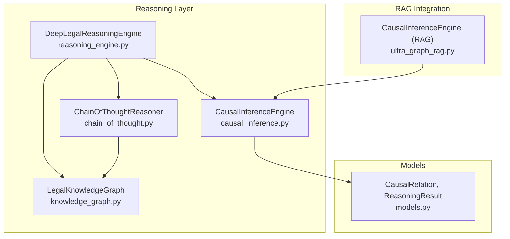
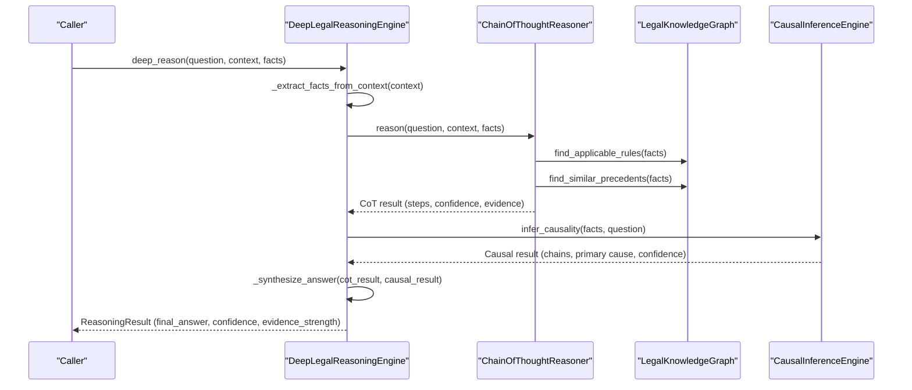
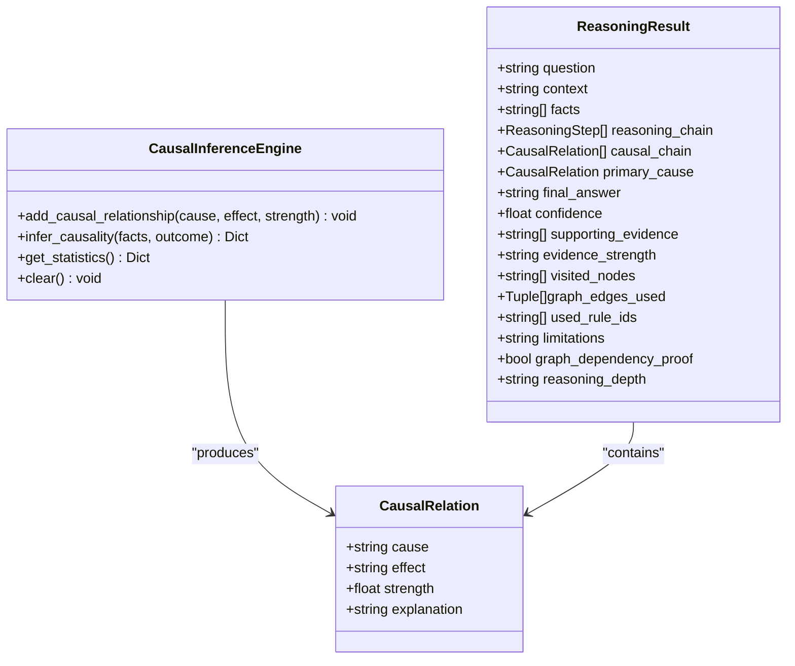
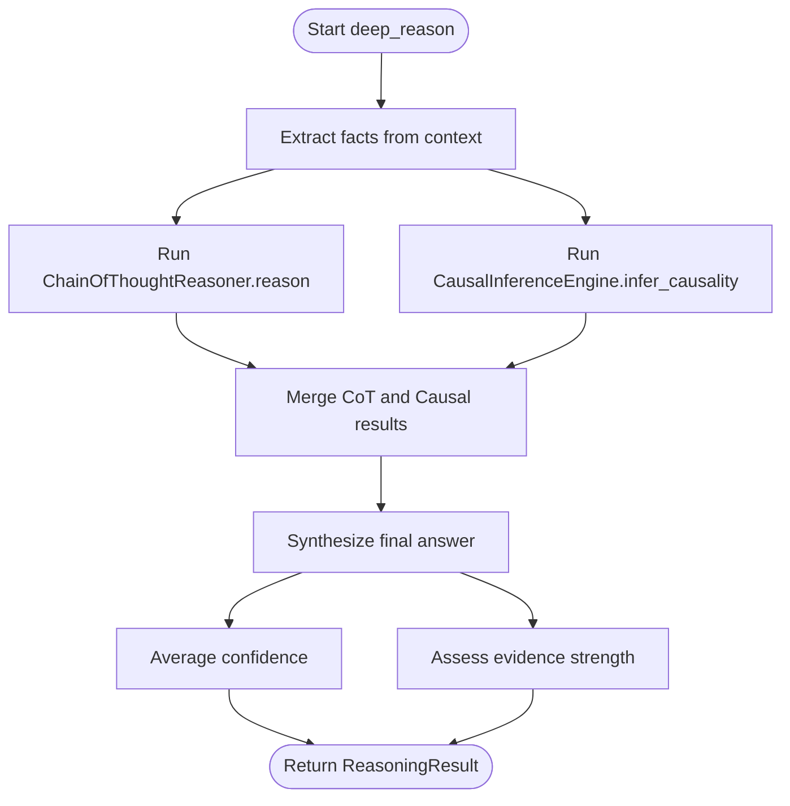
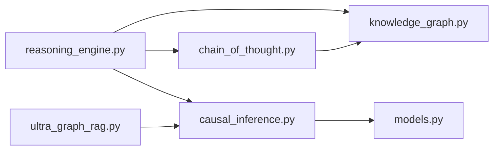

# Causal Inference Engine

<cite>
**Referenced Files in This Document**
- [causal_inference.py](file://mahoun/reasoning/causal_inference.py)
- [reasoning_engine.py](file://mahoun/reasoning/reasoning_engine.py)
- [chain_of_thought.py](file://mahoun/reasoning/chain_of_thought.py)
- [knowledge_graph.py](file://mahoun/reasoning/knowledge_graph.py)
- [models.py](file://mahoun/core/models.py)
- [ultra_graph_rag.py](file://mahoun/rag/ultra_graph_rag.py)
- [test_graph_native_ultra_extreme.py](file://tests/test_graph_native_ultra_extreme.py)
</cite>

## Table of Contents
1. [Introduction](#introduction)
2. [Project Structure](#project-structure)
3. [Core Components](#core-components)
4. [Architecture Overview](#architecture-overview)
5. [Detailed Component Analysis](#detailed-component-analysis)
6. [Dependency Analysis](#dependency-analysis)
7. [Performance Considerations](#performance-considerations)
8. [Troubleshooting Guide](#troubleshooting-guide)
9. [Conclusion](#conclusion)

## Introduction
This document explains the Causal Inference Engine designed to identify cause-effect relationships in legal texts. It focuses on:
- Probabilistic strength scoring for causal relationships
- Methods to extend the causal knowledge base
- Methods to analyze fact patterns and infer causal chains
- Integration with the Deep Legal Reasoning Engine to synthesize causal insights with chain-of-thought reasoning
- Handling causal ambiguity via confidence scoring and primary cause identification
- Performance considerations for traversing complex causal graphs

## Project Structure
The causal inference capability is implemented primarily in the reasoning module and integrated with the broader Deep Legal Reasoning Engine. The key files are:
- Causal inference core: causal_inference.py
- Deep reasoning integration: reasoning_engine.py
- Chain of thought reasoning: chain_of_thought.py
- Legal knowledge graph: knowledge_graph.py
- Shared data models: models.py
- Additional causal inference support in RAG: ultra_graph_rag.py
- Example usage in tests: test_graph_native_ultra_extreme.py

**Diagram sources**
- [reasoning_engine.py](file://mahoun/reasoning/reasoning_engine.py#L1-L210)
- [chain_of_thought.py](file://mahoun/reasoning/chain_of_thought.py#L1-L150)
- [knowledge_graph.py](file://mahoun/reasoning/knowledge_graph.py#L1-L120)
- [causal_inference.py](file://mahoun/reasoning/causal_inference.py#L160-L279)
- [models.py](file://mahoun/core/models.py#L57-L110)
- [ultra_graph_rag.py](file://mahoun/rag/ultra_graph_rag.py#L160-L240)

**Section sources**
- [reasoning_engine.py](file://mahoun/reasoning/reasoning_engine.py#L1-L210)
- [causal_inference.py](file://mahoun/reasoning/causal_inference.py#L160-L279)
- [chain_of_thought.py](file://mahoun/reasoning/chain_of_thought.py#L1-L150)
- [knowledge_graph.py](file://mahoun/reasoning/knowledge_graph.py#L1-L120)
- [models.py](file://mahoun/core/models.py#L57-L110)
- [ultra_graph_rag.py](file://mahoun/rag/ultra_graph_rag.py#L160-L240)

## Core Components
- CausalInferenceEngine: Adds causal relationships and infers causal chains from facts with confidence and primary cause selection.
- DeepLegalReasoningEngine: Orchestrates chain-of-thought reasoning and causal inference, synthesizes results, and produces a final answer with confidence and evidence strength.
- ChainOfThoughtReasoner: Performs six-step reasoning (analysis, concept extraction, rule identification, precedent analysis, logical reasoning, conclusion) and tracks confidence and evidence.
- LegalKnowledgeGraph: Stores legal rules and precedents, supports finding applicable rules and similar precedents.
- CausalRelation and ReasoningResult: Data models for causal relations and complete reasoning results.

Key methods:
- add_causal_relationship: Extend the causal knowledge base with cause-effect pairs and strength.
- infer_causality: Analyze facts and a question to produce causal chains, primary cause, and confidence.
- deep_reason: Combine CoT and causal inference to produce a final answer and traceable result.

**Section sources**
- [causal_inference.py](file://mahoun/reasoning/causal_inference.py#L183-L266)
- [reasoning_engine.py](file://mahoun/reasoning/reasoning_engine.py#L130-L212)
- [chain_of_thought.py](file://mahoun/reasoning/chain_of_thought.py#L66-L149)
- [knowledge_graph.py](file://mahoun/reasoning/knowledge_graph.py#L334-L426)
- [models.py](file://mahoun/core/models.py#L57-L110)

## Architecture Overview
The Deep Legal Reasoning Engine composes multiple components:
- Chain of thought reasoning extracts and applies legal rules and precedents, computing confidence and gathering evidence.
- Causal inference identifies causal relationships from facts and outcomes, selecting the highest-strength primary cause.
- The engine synthesizes both streams, averages confidence, assesses evidence strength, and returns a structured result.

**Diagram sources**
- [reasoning_engine.py](file://mahoun/reasoning/reasoning_engine.py#L130-L212)
- [chain_of_thought.py](file://mahoun/reasoning/chain_of_thought.py#L66-L149)
- [knowledge_graph.py](file://mahoun/reasoning/knowledge_graph.py#L334-L426)
- [causal_inference.py](file://mahoun/reasoning/causal_inference.py#L205-L266)

## Detailed Component Analysis

### CausalInferenceEngine
Responsibilities:
- Maintain a list of causal relationships with probabilistic strengths.
- Infer causal chains from a set of facts and an outcome, returning:
  - causal_chain: list of CausalRelation
  - primary_cause: highest-strength CausalRelation
  - confidence: maximum strength among matched relationships

Implementation highlights:
- add_causal_relationship stores a dictionary with cause, effect, and strength.
- infer_causality performs substring-based matching between facts and cause/effect, constructs CausalRelation instances, selects the maximum strength as confidence, and returns the chain and primary cause.

**Diagram sources**
- [causal_inference.py](file://mahoun/reasoning/causal_inference.py#L183-L266)
- [models.py](file://mahoun/core/models.py#L57-L110)

**Section sources**
- [causal_inference.py](file://mahoun/reasoning/causal_inference.py#L183-L266)
- [models.py](file://mahoun/core/models.py#L57-L110)

### DeepLegalReasoningEngine Integration
Responsibilities:
- Initialize knowledge graph, chain-of-thought reasoner, and causal engine.
- Perform deep_reason by running CoT and causal inference in parallel, then synthesize a final answer.
- Aggregate confidence from both streams and assess evidence strength.
- Provide explainability via explain_reasoning.

Key integration points:
- _initialize_legal_knowledge adds basic legal rules and registers them with the graph builder.
- deep_reason calls chain_reasoner.reason and causal_engine.infer_causality, then merges results.
- _synthesize_answer augments the CoT answer with causal insights and confidence qualifiers.
- _assess_evidence_strength combines the number of supporting evidences and causal confidence.

**Diagram sources**
- [reasoning_engine.py](file://mahoun/reasoning/reasoning_engine.py#L130-L212)
- [chain_of_thought.py](file://mahoun/reasoning/chain_of_thought.py#L66-L149)
- [causal_inference.py](file://mahoun/reasoning/causal_inference.py#L205-L266)

**Section sources**
- [reasoning_engine.py](file://mahoun/reasoning/reasoning_engine.py#L130-L212)
- [chain_of_thought.py](file://mahoun/reasoning/chain_of_thought.py#L66-L149)
- [models.py](file://mahoun/core/models.py#L57-L110)

### ChainOfThoughtReasoner
Responsibilities:
- Six-step reasoning pipeline: question analysis, concept extraction, rule identification, precedent analysis, logical reasoning, conclusion generation.
- Tracks confidence, evidence, reachable nodes, used edges, and contradictions.
- Integrates with a graph adapter to enforce graph connectivity constraints.

Highlights:
- reason returns a structured result including reasoning steps, confidence, supporting evidence, and metadata.
- _calculate_confidence aggregates confidence from rules and precedents.
- _detect_contradictions records conflicting conclusions.

**Section sources**
- [chain_of_thought.py](file://mahoun/reasoning/chain_of_thought.py#L66-L149)
- [chain_of_thought.py](file://mahoun/reasoning/chain_of_thought.py#L315-L343)
- [chain_of_thought.py](file://mahoun/reasoning/chain_of_thought.py#L390-L402)

### LegalKnowledgeGraph
Responsibilities:
- Persist and manage legal rules and precedents with version histories.
- Find applicable rules and similar precedents based on facts.
- Provide CRUD operations and JSON persistence.

Highlights:
- find_applicable_rules uses keyword matching to compute match scores.
- find_similar_precedents uses Jaccard similarity.

**Section sources**
- [knowledge_graph.py](file://mahoun/reasoning/knowledge_graph.py#L334-L426)
- [knowledge_graph.py](file://mahoun/reasoning/knowledge_graph.py#L191-L373)

### Additional Causal Inference in RAG
The RAG module includes a separate CausalInferenceEngine tailored for graph reasoning, focusing on causal paths and backdoor criterion checks. While distinct from the reasoning module’s engine, it complements the system by enabling causal path discovery in graph contexts.

**Section sources**
- [ultra_graph_rag.py](file://mahoun/rag/ultra_graph_rag.py#L160-L240)

## Dependency Analysis
- DeepLegalReasoningEngine depends on:
  - ChainOfThoughtReasoner for logical reasoning and evidence gathering
  - LegalKnowledgeGraph for rules and precedents
  - CausalInferenceEngine for causal chains and primary cause
- CausalInferenceEngine depends on:
  - CausalRelation model for representing relationships
- ChainOfThoughtReasoner depends on:
  - LegalKnowledgeGraph for rule and precedent retrieval
- Data models (ReasoningResult, CausalRelation) are shared across components.

**Diagram sources**
- [reasoning_engine.py](file://mahoun/reasoning/reasoning_engine.py#L1-L120)
- [chain_of_thought.py](file://mahoun/reasoning/chain_of_thought.py#L1-L65)
- [knowledge_graph.py](file://mahoun/reasoning/knowledge_graph.py#L1-L60)
- [causal_inference.py](file://mahoun/reasoning/causal_inference.py#L160-L182)
- [models.py](file://mahoun/core/models.py#L57-L110)
- [ultra_graph_rag.py](file://mahoun/rag/ultra_graph_rag.py#L160-L200)

**Section sources**
- [reasoning_engine.py](file://mahoun/reasoning/reasoning_engine.py#L1-L120)
- [chain_of_thought.py](file://mahoun/reasoning/chain_of_thought.py#L1-L65)
- [knowledge_graph.py](file://mahoun/reasoning/knowledge_graph.py#L1-L60)
- [causal_inference.py](file://mahoun/reasoning/causal_inference.py#L160-L182)
- [models.py](file://mahoun/core/models.py#L57-L110)
- [ultra_graph_rag.py](file://mahoun/rag/ultra_graph_rag.py#L160-L200)

## Performance Considerations
- Causal inference complexity:
  - infer_causality iterates over all facts and all stored relationships, yielding O(F×R) comparisons. For large knowledge bases, consider:
    - Indexing relationships by cause/effect substrings
    - Using precomputed candidate sets filtered by keyword overlap
    - Early stopping when sufficient candidates are found
- CoT reasoning:
  - Rule and precedent searches are O(R) and O(P) respectively. For large corpora:
    - Use inverted indices or embeddings for similarity search
    - Cache frequent queries and their results
- Graph traversal:
  - If integrating with graph adapters, limit search depth and prune unreachable nodes early
- Confidence aggregation:
  - Averaging confidences is simple but may mask low-quality matches. Consider weighted aggregation or thresholding.

[No sources needed since this section provides general guidance]

## Troubleshooting Guide
Common issues and solutions:
- Causal ambiguity:
  - Symptom: Multiple competing causal relationships with high strengths.
  - Solution: Use primary_cause to highlight the strongest link; rely on confidence to qualify conclusions; leverage explain_reasoning to surface contradictions and limitations.
- Low confidence:
  - Symptom: Confidence below thresholds leads to cautious answers.
  - Solution: Increase causal knowledge base coverage; improve fact extraction; ensure sufficient supporting evidence from CoT.
- Contradictions:
  - Symptom: Conflicting rules or precedents are used.
  - Solution: The engine detects contradictions and surfaces them in limitations or final answer; adjust rule precedence or seek additional evidence.
- Evidence strength:
  - Symptom: Weak evidence strength despite moderate confidence.
  - Solution: Improve fact granularity and ensure rule/precedent matches exceed thresholds.

**Section sources**
- [reasoning_engine.py](file://mahoun/reasoning/reasoning_engine.py#L224-L282)
- [chain_of_thought.py](file://mahoun/reasoning/chain_of_thought.py#L390-L402)
- [test_graph_native_ultra_extreme.py](file://tests/test_graph_native_ultra_extreme.py#L284-L339)

## Conclusion
The Causal Inference Engine provides a practical, probabilistic approach to identifying cause-effect relationships in legal texts. Combined with the Deep Legal Reasoning Engine and Chain-of-Thought reasoning, it offers:
- Extensible causal knowledge base via add_causal_relationship
- Fact-driven causal chain inference via infer_causality
- Integrated synthesis of causal insights with logical reasoning
- Confidence scoring and primary cause identification to handle ambiguity
- Robustness against contradictions and weak evidence

For complex scenarios, augment the system with improved indexing, similarity search, and graph traversal heuristics to scale performance while maintaining interpretability.