# Chain-of-Thought Reasoning

<cite>
**Referenced Files in This Document**
- [chain_of_thought.py](file://mahoun/reasoning/chain_of_thought.py)
- [ultra_reasoning_service.py](file://mahoun/reasoning/ultra_reasoning_service.py)
- [reasoning_engine.py](file://mahoun/reasoning/reasoning_engine.py)
- [models.py](file://mahoun/core/models.py)
- [knowledge_graph.py](file://mahoun/reasoning/knowledge_graph.py)
- [ollama_llm.py](file://mahoun/pipelines/llm/ollama_llm.py)
- [reranking_cot.py](file://mahoun/reasoning/reranking_cot.py)
- [legal_reasoning_test.py](file://tests/legal_reasoning_test.py)
</cite>

## Table of Contents
1. [Introduction](#introduction)
2. [Project Structure](#project-structure)
3. [Core Components](#core-components)
4. [Architecture Overview](#architecture-overview)
5. [Detailed Component Analysis](#detailed-component-analysis)
6. [Dependency Analysis](#dependency-analysis)
7. [Performance Considerations](#performance-considerations)
8. [Troubleshooting Guide](#troubleshooting-guide)
9. [Conclusion](#conclusion)
10. [Appendices](#appendices)

## Introduction
This document explains the Chain-of-Thought (CoT) reasoning implementation in the legal domain, focusing on the five-step process used by the Ultra Reasoning Service and the legacy Deep Legal Reasoning Engine. It details the ReasoningStep and ReasoningResult dataclasses for structured reasoning output, describes integration with OllamaLLMService for answer generation and self-consistency checks across multiple reasoning paths, and provides practical examples from ultra_reasoning_service.py. It also covers contradiction detection between evidence sources using the _detect_contradictions method and offers guidance on performance considerations for executing multiple reasoning paths and managing LLM latency.

## Project Structure
The CoT reasoning system spans several modules:
- Reasoning engines and services: ultra_reasoning_service.py, reasoning_engine.py, chain_of_thought.py
- Data models: models.py (ReasoningStep, ReasoningResult)
- Legal knowledge graph: knowledge_graph.py (rules and precedents)
- LLM integration: pipelines/llm/ollama_llm.py
- Additional CoT for reranking: reranking_cot.py
- Practical examples: tests/legal_reasoning_test.py

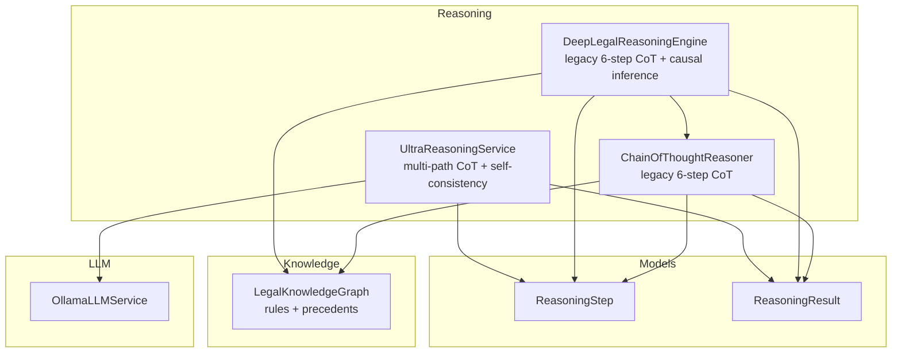

**Diagram sources**
- [ultra_reasoning_service.py](file://mahoun/reasoning/ultra_reasoning_service.py#L260-L556)
- [reasoning_engine.py](file://mahoun/reasoning/reasoning_engine.py#L27-L213)
- [chain_of_thought.py](file://mahoun/reasoning/chain_of_thought.py#L21-L150)
- [models.py](file://mahoun/core/models.py#L57-L110)
- [knowledge_graph.py](file://mahoun/reasoning/knowledge_graph.py#L59-L120)
- [ollama_llm.py](file://mahoun/pipelines/llm/ollama_llm.py#L15-L120)

**Section sources**
- [ultra_reasoning_service.py](file://mahoun/reasoning/ultra_reasoning_service.py#L260-L556)
- [reasoning_engine.py](file://mahoun/reasoning/reasoning_engine.py#L27-L213)
- [chain_of_thought.py](file://mahoun/reasoning/chain_of_thought.py#L21-L150)
- [models.py](file://mahoun/core/models.py#L57-L110)
- [knowledge_graph.py](file://mahoun/reasoning/knowledge_graph.py#L59-L120)
- [ollama_llm.py](file://mahoun/pipelines/llm/ollama_llm.py#L15-L120)

## Core Components
- UltraReasoningService: Orchestrates multi-step CoT, self-consistency checks, uncertainty quantification, and answer generation via OllamaLLMService. It produces ReasoningResult with confidence, uncertainty, contradictions, and alternative answers.
- DeepLegalReasoningEngine: Legacy engine performing a full six-step CoT plus causal inference, integrating a LegalKnowledgeGraph and returning a ReasoningResult with causal chain and evidence strength.
- ChainOfThoughtReasoner (legacy): Implements a six-step CoT pipeline with graph-aware rule application and contradiction detection, returning a structured result with reasoning_chain and supporting_evidence.
- ReasoningStep and ReasoningResult: Data models for structured reasoning output, used by both engines.
- LegalKnowledgeGraph: Stores legal rules and precedents, enabling rule identification and precedent analysis.
- OllamaLLMService: Async LLM integration for answer generation and chat completions.

**Section sources**
- [ultra_reasoning_service.py](file://mahoun/reasoning/ultra_reasoning_service.py#L260-L556)
- [reasoning_engine.py](file://mahoun/reasoning/reasoning_engine.py#L27-L213)
- [chain_of_thought.py](file://mahoun/reasoning/chain_of_thought.py#L21-L150)
- [models.py](file://mahoun/core/models.py#L57-L110)
- [knowledge_graph.py](file://mahoun/reasoning/knowledge_graph.py#L59-L120)
- [ollama_llm.py](file://mahoun/pipelines/llm/ollama_llm.py#L15-L120)

## Architecture Overview
The Ultra Reasoning Service executes a five-step CoT pipeline asynchronously, generating a reasoning chain with explicit confidence and alternatives. It then synthesizes an answer using OllamaLLMService. Self-consistency is achieved by generating multiple reasoning paths and aggregating answers. The Deep Legal Reasoning Engine augments CoT with causal inference and integrates a knowledge graph for rules and precedents.

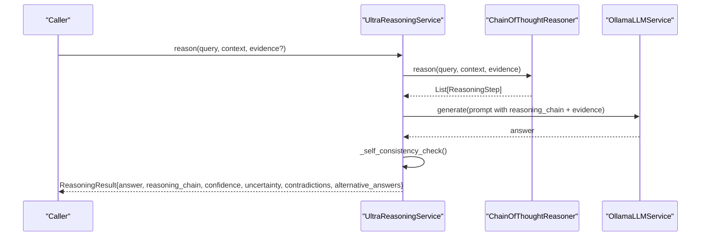

**Diagram sources**
- [ultra_reasoning_service.py](file://mahoun/reasoning/ultra_reasoning_service.py#L300-L440)
- [ultra_reasoning_service.py](file://mahoun/reasoning/ultra_reasoning_service.py#L384-L414)
- [ultra_reasoning_service.py](file://mahoun/reasoning/ultra_reasoning_service.py#L415-L440)

## Detailed Component Analysis

### Ultra Reasoning Service
- Five-step reasoning:
  1) Query Analysis: Identifies query type and key concepts.
  2) Evidence Evaluation: Computes average relevance and credibility.
  3) Legal Framework Identification: Detects legal references and sets confidence.
  4) Logical Inference: Derives confidence based on high-quality evidence.
  5) Conclusion Synthesis: Aggregates step confidences into final confidence.
- Answer generation: Uses OllamaLLMService.generate with a prompt containing reasoning steps and evidence.
- Self-consistency: Generates multiple alternative reasoning paths and returns most common answers with average confidence.
- Contradiction detection: Simplified detection using negation heuristics across high-relevance evidence.
- Data models: ReasoningStep and ReasoningResult define structured outputs with confidence, uncertainty, and alternatives.

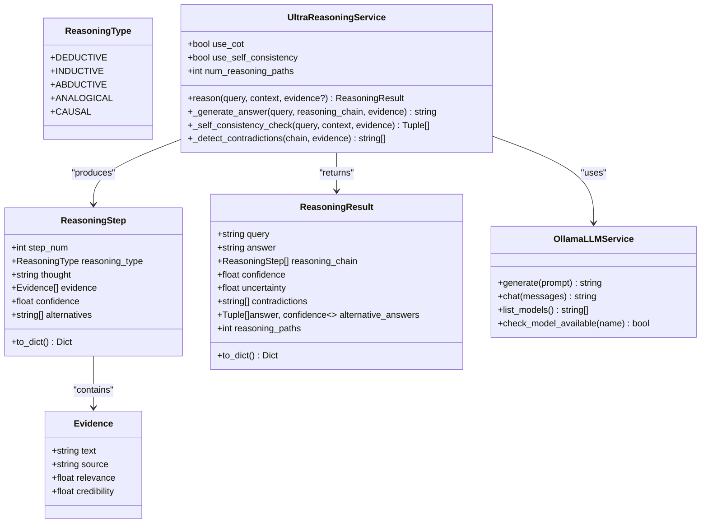

**Diagram sources**
- [ultra_reasoning_service.py](file://mahoun/reasoning/ultra_reasoning_service.py#L30-L120)
- [ultra_reasoning_service.py](file://mahoun/reasoning/ultra_reasoning_service.py#L120-L232)
- [ultra_reasoning_service.py](file://mahoun/reasoning/ultra_reasoning_service.py#L260-L556)
- [ollama_llm.py](file://mahoun/pipelines/llm/ollama_llm.py#L15-L120)

**Section sources**
- [ultra_reasoning_service.py](file://mahoun/reasoning/ultra_reasoning_service.py#L120-L232)
- [ultra_reasoning_service.py](file://mahoun/reasoning/ultra_reasoning_service.py#L300-L440)
- [ultra_reasoning_service.py](file://mahoun/reasoning/ultra_reasoning_service.py#L441-L491)

### Deep Legal Reasoning Engine (Legacy)
- Performs a six-step CoT process:
  1) Analyze question
  2) Extract legal concepts
  3) Find applicable rules
  4) Find precedents
  5) Apply logical reasoning
  6) Generate conclusion
- Integrates LegalKnowledgeGraph for rules and precedents.
- Adds causal inference in parallel and synthesizes final answer with confidence and evidence strength.
- Produces ReasoningResult with causal_chain, primary_cause, and supporting_evidence.

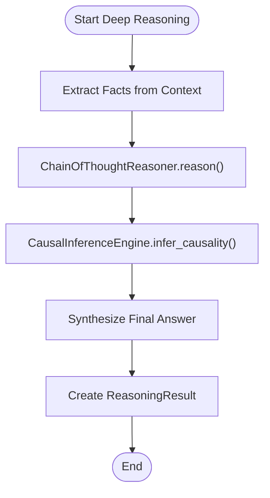

**Diagram sources**
- [reasoning_engine.py](file://mahoun/reasoning/reasoning_engine.py#L130-L213)

**Section sources**
- [reasoning_engine.py](file://mahoun/reasoning/reasoning_engine.py#L130-L213)

### Legacy ChainOfThoughtReasoner (6-step)
- Implements the full six-step CoT pipeline with graph-aware rule application and reachability expansion.
- Calculates confidence based on number of rules and precedents found.
- Gathers supporting evidence from rules and precedents.
- Detects contradictions by checking multiple targets for the same source in rule applications.

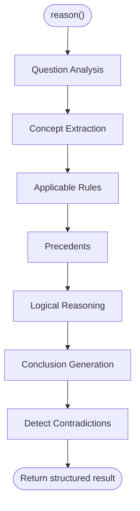

**Diagram sources**
- [chain_of_thought.py](file://mahoun/reasoning/chain_of_thought.py#L66-L150)
- [chain_of_thought.py](file://mahoun/reasoning/chain_of_thought.py#L390-L402)

**Section sources**
- [chain_of_thought.py](file://mahoun/reasoning/chain_of_thought.py#L66-L150)
- [chain_of_thought.py](file://mahoun/reasoning/chain_of_thought.py#L315-L362)
- [chain_of_thought.py](file://mahoun/reasoning/chain_of_thought.py#L390-L402)

### Data Models: ReasoningStep and ReasoningResult
- ReasoningStep: Captures a single reasoning step with step label, reasoning text, confidence, and evidence.
- ReasoningResult: Encapsulates the complete reasoning outcome, including question, context, facts, reasoning_chain, causal_chain, primary_cause, final_answer, confidence, supporting_evidence, evidence_strength, and graph-related metadata.

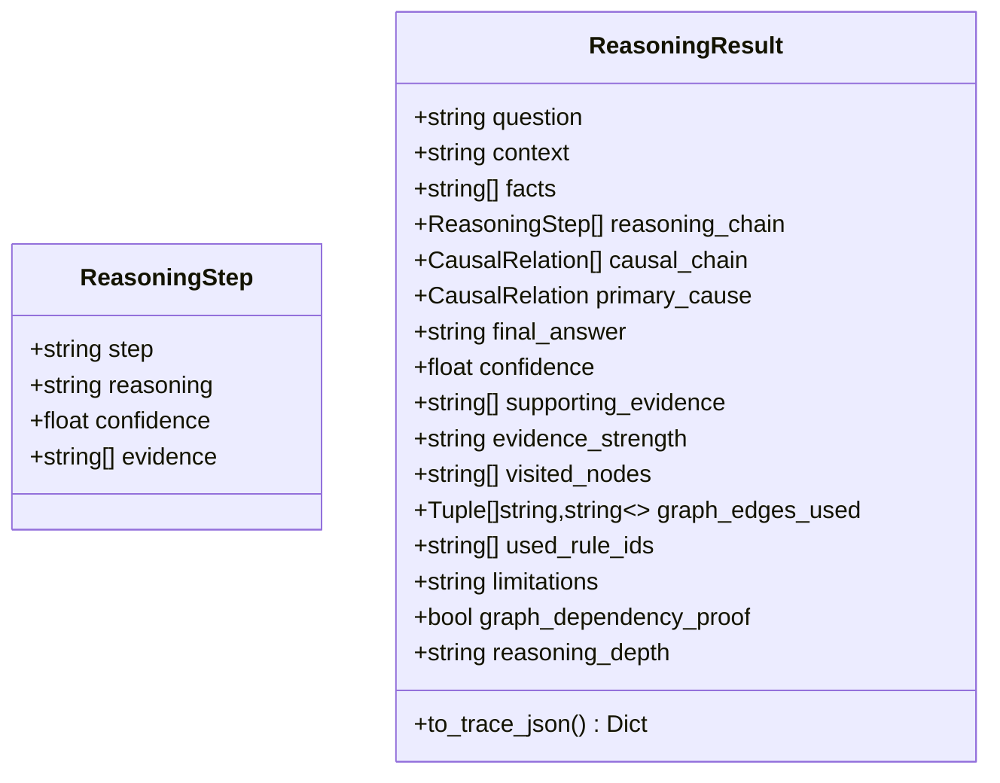

**Diagram sources**
- [models.py](file://mahoun/core/models.py#L57-L110)

**Section sources**
- [models.py](file://mahoun/core/models.py#L57-L110)

### Integration with OllamaLLMService
- UltraReasoningService initializes OllamaLLMService with model and base URL from runtime settings or environment variables.
- _generate_answer composes a prompt including reasoning steps and evidence, then calls OllamaLLMService.generate to produce the final answer.
- The service gracefully handles unavailability by returning a fallback answer derived from the reasoning chain and evidence.

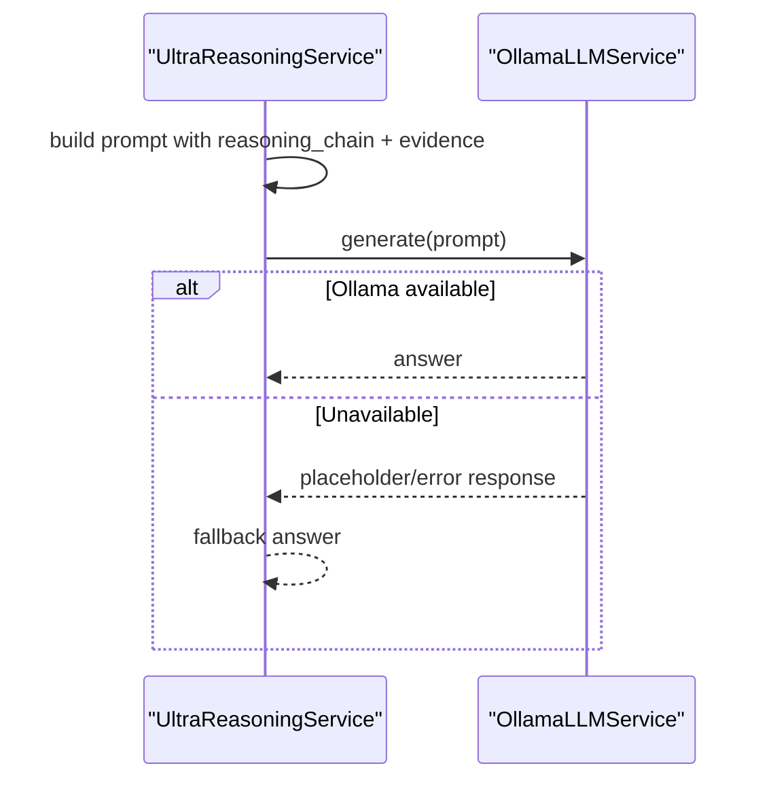

**Diagram sources**
- [ultra_reasoning_service.py](file://mahoun/reasoning/ultra_reasoning_service.py#L384-L414)
- [ollama_llm.py](file://mahoun/pipelines/llm/ollama_llm.py#L61-L118)

**Section sources**
- [ultra_reasoning_service.py](file://mahoun/reasoning/ultra_reasoning_service.py#L280-L290)
- [ultra_reasoning_service.py](file://mahoun/reasoning/ultra_reasoning_service.py#L384-L414)
- [ollama_llm.py](file://mahoun/pipelines/llm/ollama_llm.py#L61-L118)

### Self-Consistency Checking Across Multiple Paths
- _self_consistency_check generates alternative reasoning chains by calling reason() multiple times and collects answers with their confidences.
- It aggregates answers by frequency and returns the most common answers along with their average confidence, improving robustness.

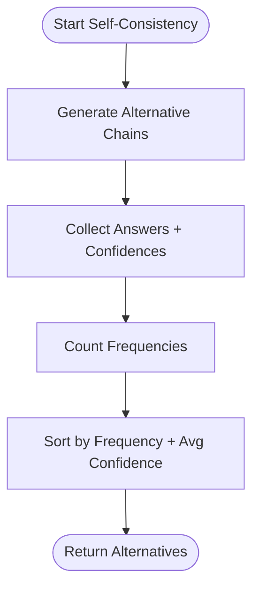

**Diagram sources**
- [ultra_reasoning_service.py](file://mahoun/reasoning/ultra_reasoning_service.py#L415-L440)

**Section sources**
- [ultra_reasoning_service.py](file://mahoun/reasoning/ultra_reasoning_service.py#L415-L440)

### Contradiction Detection Between Evidence Sources
- UltraReasoningService: _detect_contradictions identifies contradictions among high-relevance evidence items using a simple heuristic (negation words).
- Legacy ChainOfThoughtReasoner: _detect_contradictions detects conflicting conclusions by grouping rule targets by source condition and flagging sources with multiple distinct targets.

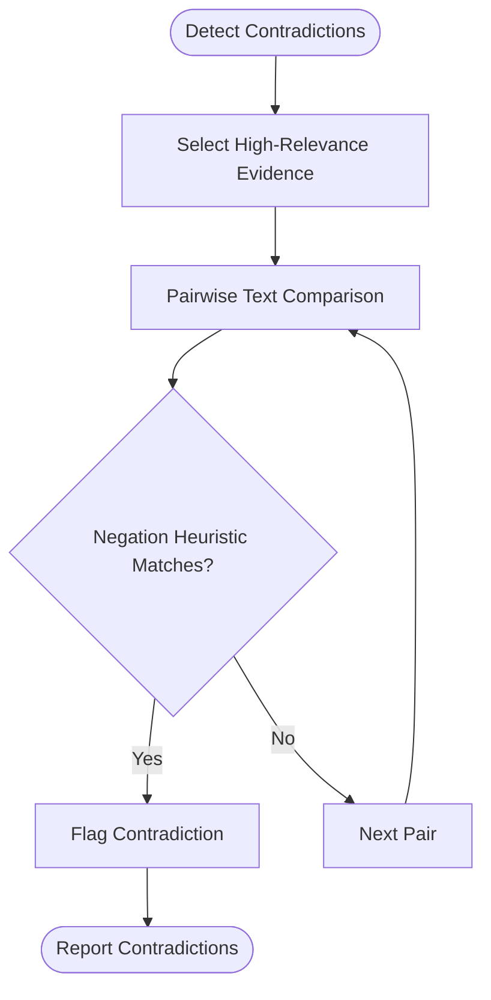

**Diagram sources**
- [ultra_reasoning_service.py](file://mahoun/reasoning/ultra_reasoning_service.py#L441-L458)
- [ultra_reasoning_service.py](file://mahoun/reasoning/ultra_reasoning_service.py#L459-L464)

**Section sources**
- [ultra_reasoning_service.py](file://mahoun/reasoning/ultra_reasoning_service.py#L441-L464)
- [chain_of_thought.py](file://mahoun/reasoning/chain_of_thought.py#L390-L402)

### Practical Examples from ultra_reasoning_service.py
- Example usage demonstrates constructing Evidence objects, invoking reason(), and printing the answer, reasoning chain, confidence, uncertainty, contradictions, and alternative answers.
- The example shows multi-path reasoning and confidence calibration via self-consistency.

**Section sources**
- [ultra_reasoning_service.py](file://mahoun/reasoning/ultra_reasoning_service.py#L493-L556)

### Conceptual Overview
- The Ultra Reasoning Service provides a modular, explainable, and robust legal reasoning pipeline with uncertainty quantification and self-consistency.
- The legacy Deep Legal Reasoning Engine extends CoT with causal inference and graph integration for comprehensive legal analysis.

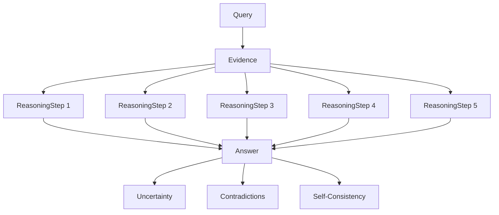

[No sources needed since this diagram shows conceptual workflow, not actual code structure]

## Dependency Analysis
- UltraReasoningService depends on:
  - ChainOfThoughtReasoner for five-step CoT reasoning
  - OllamaLLMService for answer generation
  - Data models ReasoningStep and ReasoningResult for structured outputs
- DeepLegalReasoningEngine depends on:
  - ChainOfThoughtReasoner (legacy)
  - LegalKnowledgeGraph for rules and precedents
  - CausalInferenceEngine for causal analysis
  - ReasoningResult for final output
- ChainOfThoughtReasoner depends on:
  - LegalKnowledgeGraph for rule and precedent retrieval
  - Graph adapters for reachability and edge validation

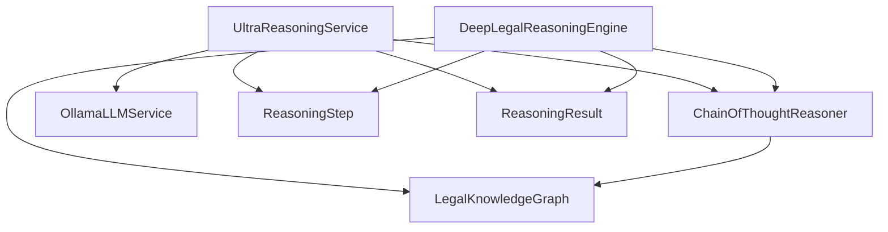

**Diagram sources**
- [ultra_reasoning_service.py](file://mahoun/reasoning/ultra_reasoning_service.py#L260-L556)
- [reasoning_engine.py](file://mahoun/reasoning/reasoning_engine.py#L27-L120)
- [chain_of_thought.py](file://mahoun/reasoning/chain_of_thought.py#L21-L65)
- [knowledge_graph.py](file://mahoun/reasoning/knowledge_graph.py#L59-L120)

**Section sources**
- [ultra_reasoning_service.py](file://mahoun/reasoning/ultra_reasoning_service.py#L260-L556)
- [reasoning_engine.py](file://mahoun/reasoning/reasoning_engine.py#L27-L120)
- [chain_of_thought.py](file://mahoun/reasoning/chain_of_thought.py#L21-L65)
- [knowledge_graph.py](file://mahoun/reasoning/knowledge_graph.py#L59-L120)

## Performance Considerations
- Multi-path reasoning cost: Each additional reasoning path increases LLM calls and computation time. Use num_reasoning_paths judiciously; start small (e.g., 3) and scale based on latency budgets.
- LLM latency mitigation:
  - Batch requests when possible (e.g., multiple alternative chains) and reuse the same client session.
  - Tune model parameters (temperature, max_tokens) to balance quality and speed.
  - Monitor Ollama availability and handle fallbacks gracefully to avoid blocking the pipeline.
- Graph operations: Expand reachability and path-finding can be expensive. Limit max_depth and prune unnecessary expansions.
- Concurrency: Use async I/O for LLM calls and graph operations to maximize throughput.
- Caching: Cache repeated reasoning steps or intermediate results where appropriate to reduce redundant computations.

[No sources needed since this section provides general guidance]

## Troubleshooting Guide
- Ollama server not available:
  - Symptoms: Placeholder responses or errors from OllamaLLMService.generate.
  - Resolution: Verify base_url and model availability; ensure Ollama service is running; use fallback logic in _generate_answer.
- Low confidence or inconsistent answers:
  - Use self-consistency checks to gather alternative answers and adjust confidence accordingly.
- Contradictions flagged:
  - Review high-relevance evidence pairs flagged by _detect_contradictions and resolve conflicts manually or by enhancing the heuristic.
- Graph dependency proof missing:
  - Ensure graph adapters are provided and reachable nodes expanded; verify edges exist between conditions and conclusions.

**Section sources**
- [ollama_llm.py](file://mahoun/pipelines/llm/ollama_llm.py#L61-L118)
- [ultra_reasoning_service.py](file://mahoun/reasoning/ultra_reasoning_service.py#L384-L414)
- [ultra_reasoning_service.py](file://mahoun/reasoning/ultra_reasoning_service.py#L441-L464)
- [chain_of_thought.py](file://mahoun/reasoning/chain_of_thought.py#L434-L512)

## Conclusion
The Chain-of-Thought reasoning system combines structured, explainable legal reasoning with modern LLM integration and self-consistency checks. The Ultra Reasoning Service implements a five-step CoT pipeline with uncertainty quantification and multi-path validation, while the legacy Deep Legal Reasoning Engine extends this with causal inference and graph integration. Data models provide consistent output structures, and OllamaLLMService enables robust answer generation. Practical examples demonstrate multi-path reasoning and confidence calibration, and built-in contradiction detection helps maintain reliability.

[No sources needed since this section summarizes without analyzing specific files]

## Appendices
- Practical example usage and outputs are demonstrated in ultra_reasoning_service.py’s example section.
- Additional CoT reasoning for document reranking is available in reranking_cot.py, showcasing explainable reasoning steps for ranking decisions.

**Section sources**
- [ultra_reasoning_service.py](file://mahoun/reasoning/ultra_reasoning_service.py#L493-L556)
- [reranking_cot.py](file://mahoun/reasoning/reranking_cot.py#L1-L120)