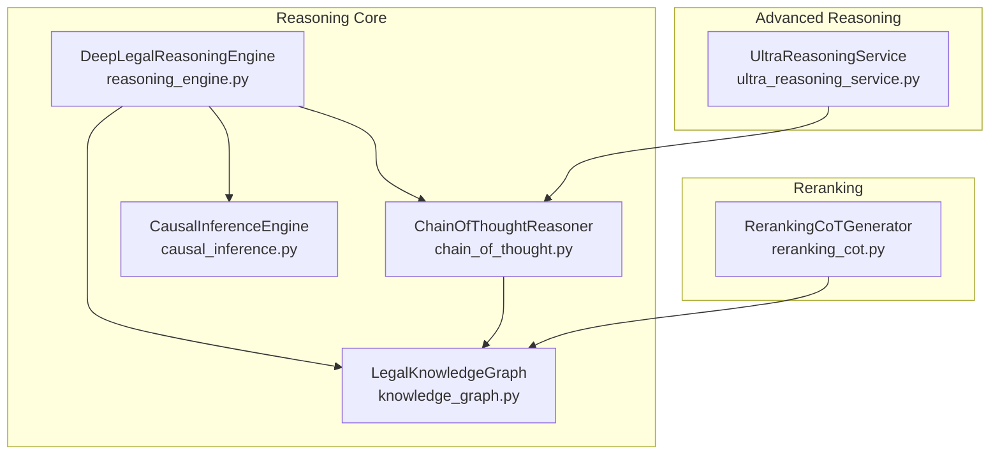
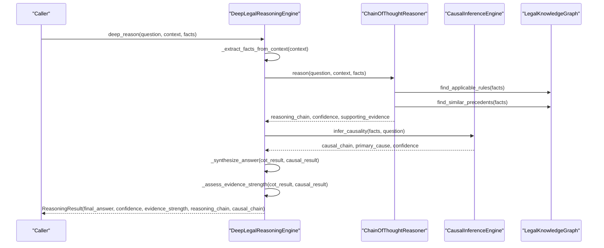
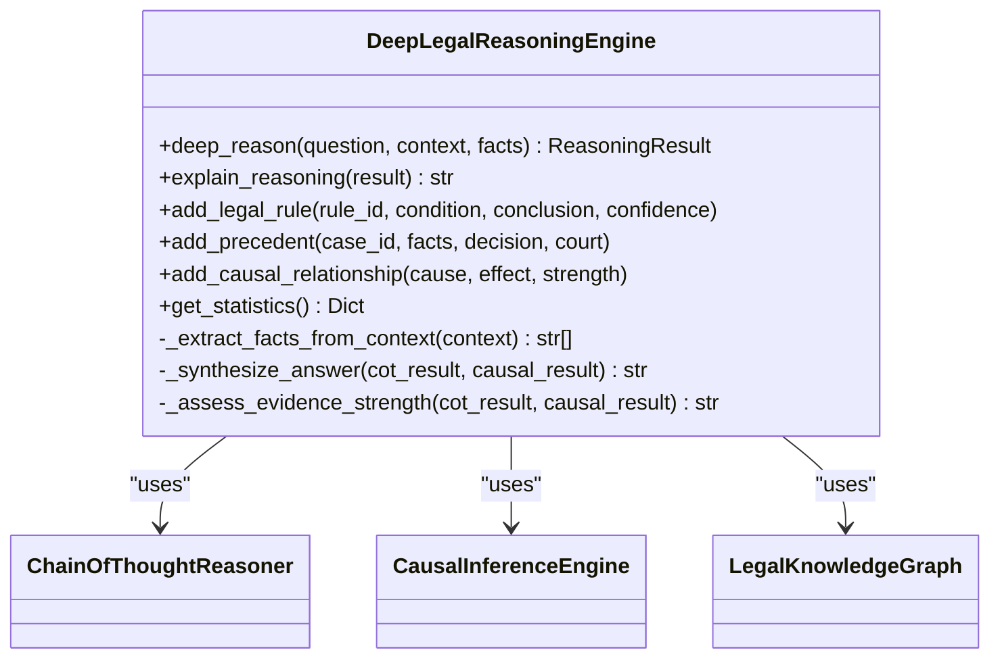
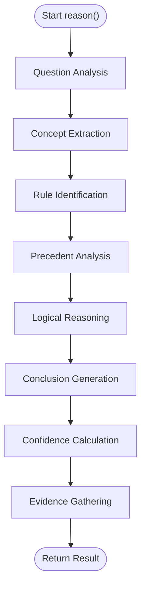
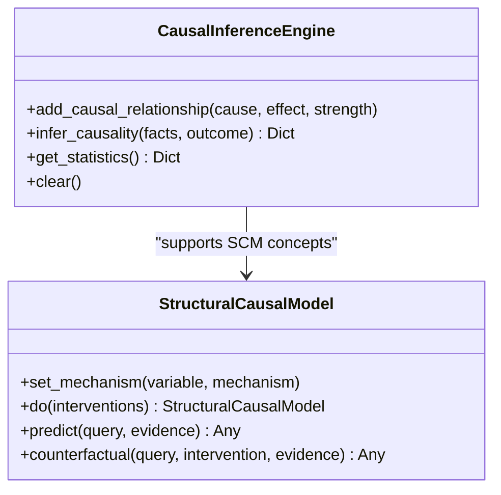
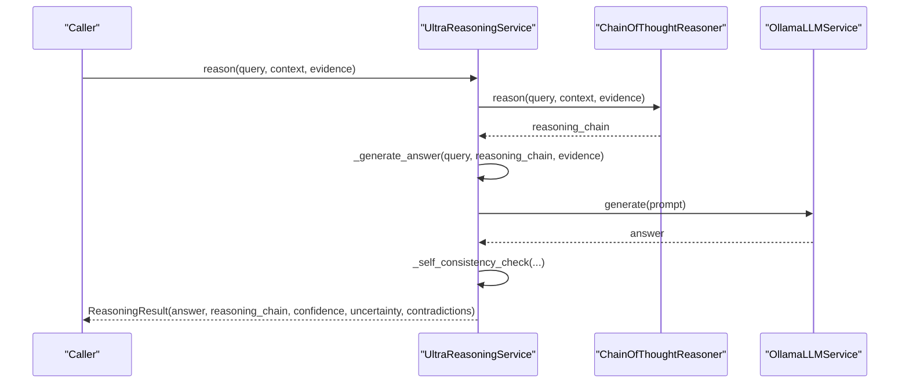
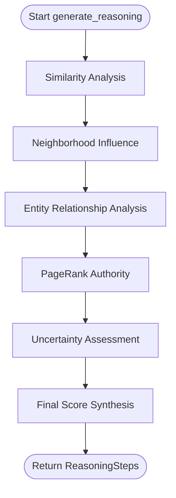
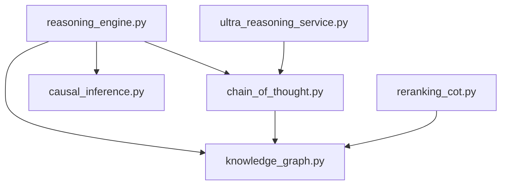

# Reasoning Engine

<cite>
**Referenced Files in This Document**
- [reasoning_engine.py](file://mahoun/reasoning/reasoning_engine.py)
- [chain_of_thought.py](file://mahoun/reasoning/chain_of_thought.py)
- [causal_inference.py](file://mahoun/reasoning/causal_inference.py)
- [ultra_reasoning_service.py](file://mahoun/reasoning/ultra_reasoning_service.py)
- [knowledge_graph.py](file://mahoun/reasoning/knowledge_graph.py)
- [reranking_cot.py](file://mahoun/reasoning/reranking_cot.py)
- [legal_reasoning_test.py](file://tests/legal_reasoning_test.py)
- [test_graph_based_reasoning.py](file://tests/test_graph_based_reasoning.py)
</cite>

## Table of Contents
1. [Introduction](#introduction)
2. [Project Structure](#project-structure)
3. [Core Components](#core-components)
4. [Architecture Overview](#architecture-overview)
5. [Detailed Component Analysis](#detailed-component-analysis)
6. [Dependency Analysis](#dependency-analysis)
7. [Performance Considerations](#performance-considerations)
8. [Troubleshooting Guide](#troubleshooting-guide)
9. [Conclusion](#conclusion)
10. [Appendices](#appendices)

## Introduction
This document explains the Reasoning Engine focused on causal inference and chain-of-thought reasoning for legal domains. It covers the integrated architecture that combines:
- Chain-of-thought reasoning for multi-step logical deduction
- Causal inference for identifying cause-effect relationships in legal texts
- A knowledge graph for storing rules and precedents
- An ultra-advanced reasoning service for multi-path, self-consistent, and uncertainty-aware reasoning
- Practical examples from legal reasoning tests and reranking explanations

It also addresses common issues in reasoning accuracy and logical consistency, and provides performance guidance for complex reasoning tasks with large context windows.

## Project Structure
The reasoning subsystem resides under mahoun/reasoning and integrates tightly with the knowledge graph and graph builder. The key modules are:
- reasoning_engine.py: orchestrates CoT + causal inference + knowledge graph + evidence assessment
- chain_of_thought.py: stepwise legal reasoning with graph-aware rule/precedent application
- causal_inference.py: causal modeling and inference for legal outcomes
- ultra_reasoning_service.py: advanced multi-step reasoning with self-consistency and uncertainty
- knowledge_graph.py: persistent storage and retrieval of legal rules and precedents
- reranking_cot.py: explainable CoT for document reranking decisions
- Tests: legal_reasoning_test.py and test_graph_based_reasoning.py demonstrate practical scenarios

**Diagram sources**
- [reasoning_engine.py](file://mahoun/reasoning/reasoning_engine.py#L1-L210)
- [chain_of_thought.py](file://mahoun/reasoning/chain_of_thought.py#L1-L150)
- [causal_inference.py](file://mahoun/reasoning/causal_inference.py#L161-L266)
- [knowledge_graph.py](file://mahoun/reasoning/knowledge_graph.py#L1-L120)
- [ultra_reasoning_service.py](file://mahoun/reasoning/ultra_reasoning_service.py#L260-L360)
- [reranking_cot.py](file://mahoun/reasoning/reranking_cot.py#L36-L116)

**Section sources**
- [reasoning_engine.py](file://mahoun/reasoning/reasoning_engine.py#L1-L210)
- [chain_of_thought.py](file://mahoun/reasoning/chain_of_thought.py#L1-L150)
- [causal_inference.py](file://mahoun/reasoning/causal_inference.py#L161-L266)
- [knowledge_graph.py](file://mahoun/reasoning/knowledge_graph.py#L1-L120)
- [ultra_reasoning_service.py](file://mahoun/reasoning/ultra_reasoning_service.py#L260-L360)
- [reranking_cot.py](file://mahoun/reasoning/reranking_cot.py#L36-L116)

## Core Components
- DeepLegalReasoningEngine: orchestrates a 6-step chain-of-thought, causal inference, and synthesizes a final answer with confidence and evidence strength.
- ChainOfThoughtReasoner: performs six-step reasoning (question analysis, concept extraction, rule identification, precedent analysis, logical reasoning, conclusion generation) and tracks graph dependencies.
- CausalInferenceEngine: maintains causal relationships and infers primary causes from facts and outcomes.
- LegalKnowledgeGraph: stores legal rules and precedents, supports versioning and similarity-based retrieval.
- UltraReasoningService: advanced multi-step reasoning with self-consistency checks, uncertainty quantification, and contradiction detection.
- RerankingCoTGenerator: generates explainable chain-of-thought reasoning for reranking decisions, including similarity, neighborhood influence, entity analysis, PageRank authority, and uncertainty.

**Section sources**
- [reasoning_engine.py](file://mahoun/reasoning/reasoning_engine.py#L130-L212)
- [chain_of_thought.py](file://mahoun/reasoning/chain_of_thought.py#L66-L149)
- [causal_inference.py](file://mahoun/reasoning/causal_inference.py#L161-L266)
- [knowledge_graph.py](file://mahoun/reasoning/knowledge_graph.py#L191-L373)
- [ultra_reasoning_service.py](file://mahoun/reasoning/ultra_reasoning_service.py#L260-L358)
- [reranking_cot.py](file://mahoun/reasoning/reranking_cot.py#L36-L116)

## Architecture Overview
The reasoning engine integrates multiple modules:
- Input: question, context, and facts
- Chain-of-thought: six-step reasoning pipeline with rule and precedent application
- Causal inference: identifies cause-effect relationships and primary causes
- Knowledge graph: persistent storage and retrieval of rules and precedents
- Synthesis: combines CoT and causal results, assesses evidence strength, and produces confidence
- Advanced reasoning: optional ultra reasoning service for multi-path, self-consistency, and uncertainty

**Diagram sources**
- [reasoning_engine.py](file://mahoun/reasoning/reasoning_engine.py#L130-L212)
- [chain_of_thought.py](file://mahoun/reasoning/chain_of_thought.py#L66-L149)
- [causal_inference.py](file://mahoun/reasoning/causal_inference.py#L205-L266)
- [knowledge_graph.py](file://mahoun/reasoning/knowledge_graph.py#L334-L426)

## Detailed Component Analysis

### DeepLegalReasoningEngine
- Responsibilities:
  - Initializes knowledge graph, graph builder, chain-of-thought reasoner, and causal inference engine
  - Performs 6-step chain-of-thought reasoning
  - Runs causal inference in parallel
  - Synthesizes final answer, calculates confidence, and assesses evidence strength
  - Provides explainability via human-readable explanation
- Key methods:
  - deep_reason: orchestrates the full pipeline
  - _synthesize_answer: merges CoT and causal insights
  - _assess_evidence_strength: evaluates evidence quality
  - explain_reasoning: formats reasoning steps, causal analysis, and confidence metrics

**Diagram sources**
- [reasoning_engine.py](file://mahoun/reasoning/reasoning_engine.py#L130-L212)
- [chain_of_thought.py](file://mahoun/reasoning/chain_of_thought.py#L66-L149)
- [causal_inference.py](file://mahoun/reasoning/causal_inference.py#L161-L266)
- [knowledge_graph.py](file://mahoun/reasoning/knowledge_graph.py#L191-L373)

**Section sources**
- [reasoning_engine.py](file://mahoun/reasoning/reasoning_engine.py#L130-L212)
- [reasoning_engine.py](file://mahoun/reasoning/reasoning_engine.py#L224-L391)

### ChainOfThoughtReasoner
- Responsibilities:
  - Six-step reasoning: question analysis, concept extraction, rule identification, precedent analysis, logical reasoning, conclusion generation
  - Graph-aware rule application and path finding
  - Tracks contradictions and records rule applications
  - Gathers supporting evidence and calculates confidence
- Key methods:
  - reason: orchestrates the six-step process and returns structured results
  - _graph_allows_rule: enforces graph connectivity for rule application
  - _detect_contradictions: detects conflicting conclusions across rule applications

**Diagram sources**
- [chain_of_thought.py](file://mahoun/reasoning/chain_of_thought.py#L66-L149)

**Section sources**
- [chain_of_thought.py](file://mahoun/reasoning/chain_of_thought.py#L66-L149)
- [chain_of_thought.py](file://mahoun/reasoning/chain_of_thought.py#L213-L314)
- [chain_of_thought.py](file://mahoun/reasoning/chain_of_thought.py#L315-L362)
- [chain_of_thought.py](file://mahoun/reasoning/chain_of_thought.py#L363-L512)

### CausalInferenceEngine
- Responsibilities:
  - Stores causal relationships with strengths
  - Infers causal chains from facts and outcomes
  - Identifies primary cause and calculates confidence
- Key methods:
  - add_causal_relationship: adds a directed relationship with strength
  - infer_causality: scans facts and outcomes to find matches and compute confidence

**Diagram sources**
- [causal_inference.py](file://mahoun/reasoning/causal_inference.py#L161-L266)
- [causal_inference.py](file://mahoun/reasoning/causal_inference.py#L20-L81)

**Section sources**
- [causal_inference.py](file://mahoun/reasoning/causal_inference.py#L161-L266)
- [causal_inference.py](file://mahoun/reasoning/causal_inference.py#L20-L81)

### UltraReasoningService
- Responsibilities:
  - Multi-step reasoning with self-consistency checks
  - Uncertainty quantification and contradiction detection
  - Generates explainable reasoning steps with alternatives
- Key methods:
  - reason: orchestrates CoT, optional self-consistency, and produces final answer
  - _self_consistency_check: explores alternative reasoning paths
  - _detect_contradictions: detects contradictory evidence

**Diagram sources**
- [ultra_reasoning_service.py](file://mahoun/reasoning/ultra_reasoning_service.py#L300-L358)
- [ultra_reasoning_service.py](file://mahoun/reasoning/ultra_reasoning_service.py#L384-L414)
- [ultra_reasoning_service.py](file://mahoun/reasoning/ultra_reasoning_service.py#L415-L440)

**Section sources**
- [ultra_reasoning_service.py](file://mahoun/reasoning/ultra_reasoning_service.py#L260-L358)
- [ultra_reasoning_service.py](file://mahoun/reasoning/ultra_reasoning_service.py#L360-L491)

### RerankingCoTGenerator
- Responsibilities:
  - Generates explainable chain-of-thought reasoning for reranking decisions
  - Computes similarity, neighborhood influence, entity analysis, PageRank authority, uncertainty, and final score synthesis
- Key methods:
  - generate_reasoning: orchestrates six-step CoT for reranking
  - _generate_similarity_step, _generate_neighborhood_step, _generate_entity_step, _generate_pagerank_step, _generate_uncertainty_step, _generate_synthesis_step

**Diagram sources**
- [reranking_cot.py](file://mahoun/reasoning/reranking_cot.py#L58-L116)
- [reranking_cot.py](file://mahoun/reasoning/reranking_cot.py#L118-L521)

**Section sources**
- [reranking_cot.py](file://mahoun/reasoning/reranking_cot.py#L36-L116)
- [reranking_cot.py](file://mahoun/reasoning/reranking_cot.py#L118-L521)

## Dependency Analysis
- DeepLegalReasoningEngine depends on:
  - ChainOfThoughtReasoner for six-step reasoning
  - CausalInferenceEngine for causal relationships
  - LegalKnowledgeGraph for rules and precedents
- ChainOfThoughtReasoner depends on LegalKnowledgeGraph for rule/precedent retrieval and optional graph adapters for connectivity checks.
- UltraReasoningService composes ChainOfThoughtReasoner and uses an LLM service for answer generation.
- RerankingCoTGenerator consumes LegalDocument, LegalEntity, and UncertaintyEstimate models to produce explainable reasoning steps.

**Diagram sources**
- [reasoning_engine.py](file://mahoun/reasoning/reasoning_engine.py#L130-L212)
- [chain_of_thought.py](file://mahoun/reasoning/chain_of_thought.py#L66-L149)
- [causal_inference.py](file://mahoun/reasoning/causal_inference.py#L161-L266)
- [knowledge_graph.py](file://mahoun/reasoning/knowledge_graph.py#L191-L373)
- [ultra_reasoning_service.py](file://mahoun/reasoning/ultra_reasoning_service.py#L260-L358)
- [reranking_cot.py](file://mahoun/reasoning/reranking_cot.py#L36-L116)

**Section sources**
- [reasoning_engine.py](file://mahoun/reasoning/reasoning_engine.py#L130-L212)
- [chain_of_thought.py](file://mahoun/reasoning/chain_of_thought.py#L66-L149)
- [ultra_reasoning_service.py](file://mahoun/reasoning/ultra_reasoning_service.py#L260-L358)

## Performance Considerations
- Large context windows:
  - Prefer chunking and retrieval strategies that limit context length to reduce latency and memory usage.
  - Use similarity thresholds and top-k retrievals to cap the number of documents processed in CoT and causal inference.
- Graph traversal:
  - Limit graph expansion depth to prevent combinatorial explosion during rule application and path finding.
  - Cache reachable nodes and edges to avoid repeated computations.
- Parallelization:
  - Run causal inference and CoT in parallel where safe to improve throughput.
- Uncertainty and self-consistency:
  - Self-consistency checks increase computation; tune num_reasoning_paths based on latency budgets.
- Persistence:
  - Persist knowledge graph rules and precedents to disk to avoid reloading and to support versioning.

[No sources needed since this section provides general guidance]

## Troubleshooting Guide
Common issues and solutions:
- Low confidence or weak evidence strength:
  - Ensure sufficient facts and strong matches in the knowledge graph; add more relevant rules and precedents.
  - Use RerankingCoTGenerator to understand why documents were ranked lower and adjust retrieval parameters.
- Contradictory rules:
  - ChainOfThoughtReasoner detects contradictions; surface both sides in the final answer and mark limitations.
  - Review rule versions and update outdated rules.
- Causal inference yields no primary cause:
  - Expand causal relationships with higher-strength links and ensure facts align with outcomes.
- Explainability gaps:
  - Use DeepLegalReasoningEngine.explain_reasoning to generate human-readable explanations of reasoning steps and causal insights.
- Self-consistency failures:
  - Reduce num_reasoning_paths or adjust LLM prompts to stabilize answer generation.

**Section sources**
- [chain_of_thought.py](file://mahoun/reasoning/chain_of_thought.py#L390-L402)
- [reasoning_engine.py](file://mahoun/reasoning/reasoning_engine.py#L345-L391)
- [ultra_reasoning_service.py](file://mahoun/reasoning/ultra_reasoning_service.py#L415-L440)

## Conclusion
The Reasoning Engine integrates chain-of-thought reasoning, causal inference, and a knowledge graph to deliver robust, explainable legal reasoning. It supports advanced workflows via the UltraReasoningService and provides practical reranking explanations through RerankingCoTGenerator. Tests demonstrate real-world scenarios, including contract disputes, contradictory rules, and multi-step reasoning with graph traversal.

[No sources needed since this section summarizes without analyzing specific files]

## Appendices

### Practical Examples

- Legal reasoning test scenario (force majeure vs waiver clause conflict):
  - Demonstrates analyzing conflicting contract clauses, applying statutory law, reconciling precedents, and building evidence-based arguments.
  - Highlights hierarchy of sources and resolution of precedent conflicts.

- Graph-based reasoning tests:
  - Verify that the engine uses the knowledge graph, applies rules and precedents, and produces multi-step reasoning with graph traversal.

**Section sources**
- [legal_reasoning_test.py](file://tests/legal_reasoning_test.py#L1-L286)
- [test_graph_based_reasoning.py](file://tests/test_graph_based_reasoning.py#L1-L603)