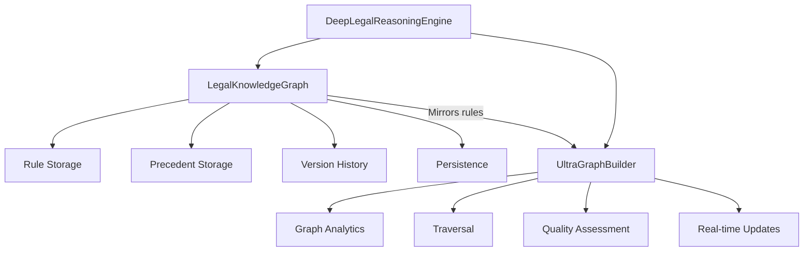
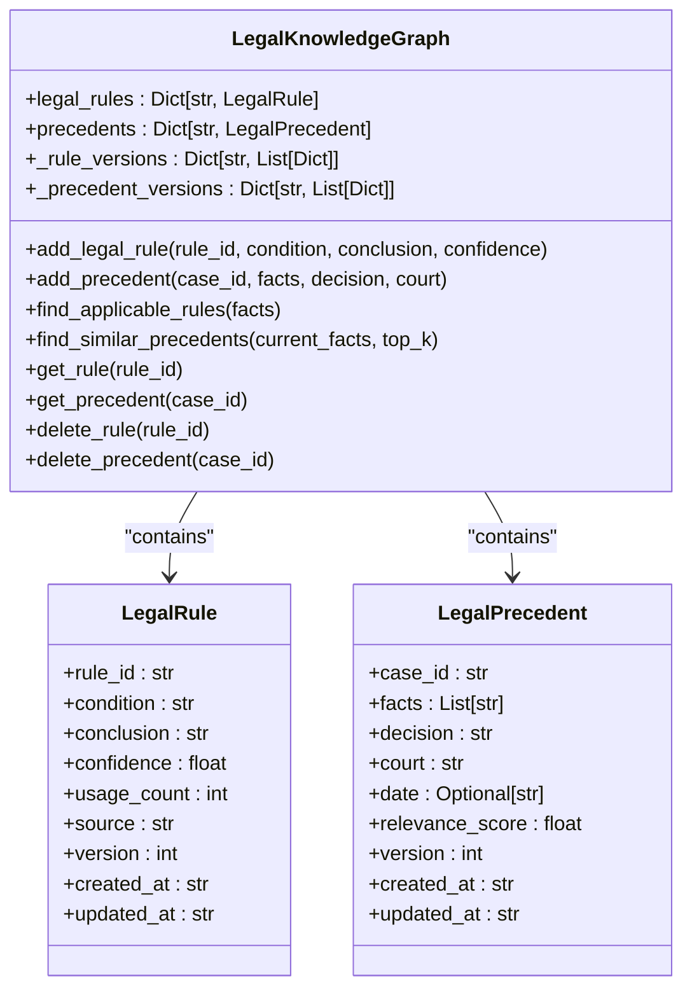
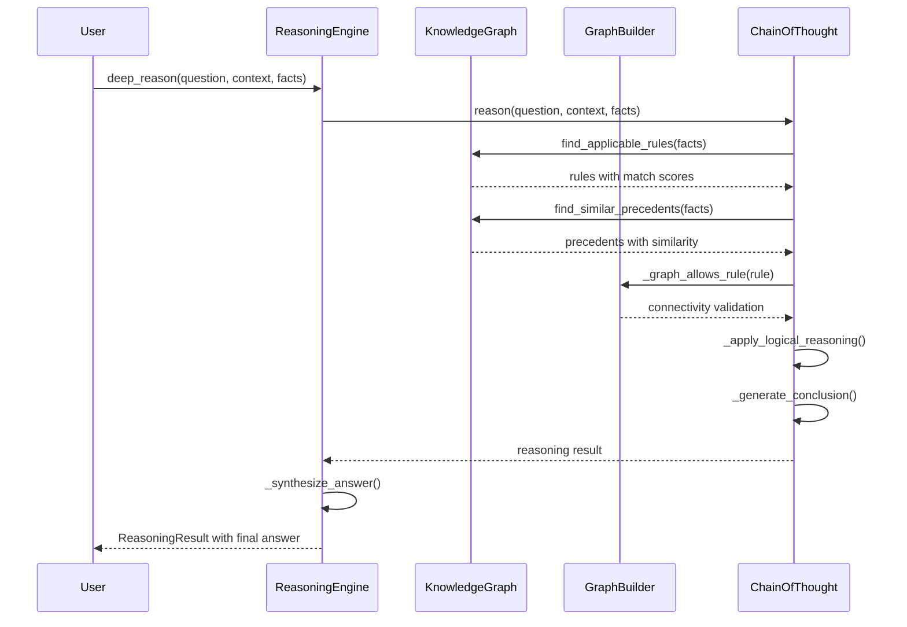
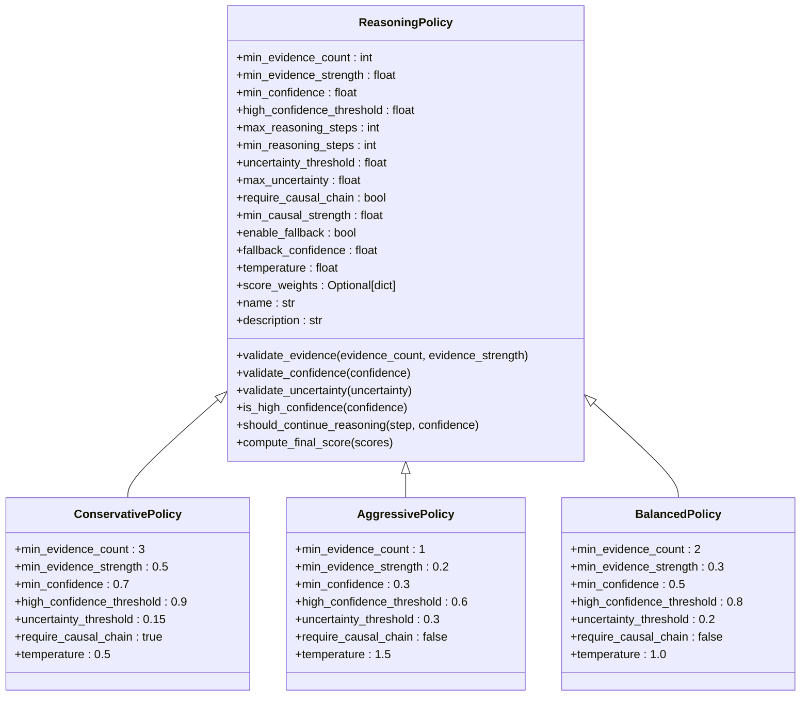
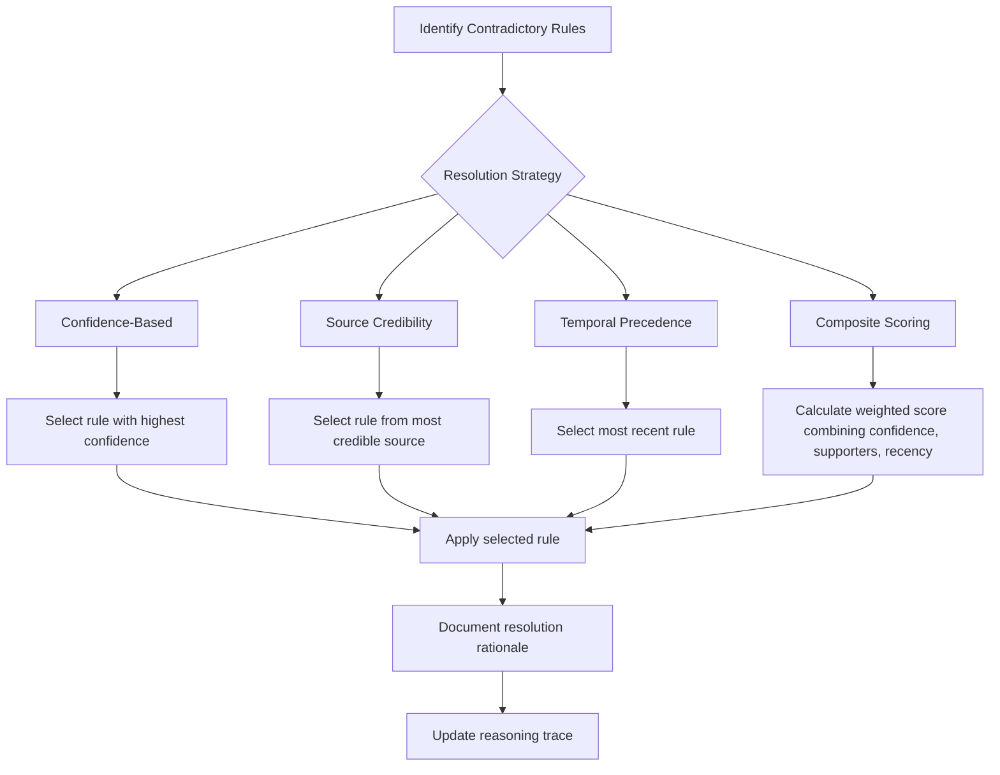

# Reasoning Policies and Knowledge Management

<cite>
**Referenced Files in This Document**   
- [reasoning_engine.py](file://mahoun/reasoning/reasoning_engine.py)
- [knowledge_graph.py](file://mahoun/reasoning/knowledge_graph.py)
- [ultra_graph_builder.py](file://mahoun/graph/ultra_graph_builder.py)
- [policies.py](file://mahoun/reasoning/policies.py)
- [chain_of_thought.py](file://mahoun/reasoning/chain_of_thought.py)
- [causal_inference.py](file://mahoun/reasoning/causal_inference.py)
- [evidence_linked_verdict.py](file://mahoun/reasoning/evidence_linked_verdict.py)
- [test_graph_contradiction_resolution.py](file://tests/test_graph_contradiction_resolution.py)
</cite>

## Table of Contents
1. [Introduction](#introduction)
2. [Legal Knowledge Graph Architecture](#legal-knowledge-graph-architecture)
3. [Rule and Precedent Management](#rule-and-precedent-management)
4. [Knowledge Graph Integration with Reasoning Engine](#knowledge-graph-integration-with-reasoning-engine)
5. [Reasoning Policies and Decision Control](#reasoning-policies-and-decision-control)
6. [Contradiction Detection and Resolution](#contradiction-detection-and-resolution)
7. [Performance Considerations for Large Knowledge Graphs](#performance-considerations-for-large-knowledge-graphs)
8. [Conclusion](#conclusion)

## Introduction

The DeepLegalReasoningEngine implements a sophisticated knowledge management system centered around a Legal Knowledge Graph (LKG) that stores and organizes legal rules, precedents, and causal relationships. This system enables advanced legal reasoning through a combination of rule-based inference, precedent analysis, and causal modeling. The architecture integrates two complementary graph systems: the LegalKnowledgeGraph for structured rule storage and the UltraGraphBuilder for advanced graph analytics and traversal capabilities. The reasoning engine combines chain-of-thought processing with causal inference to produce comprehensive legal analyses, while reasoning policies provide configurable control over the decision-making process. This documentation details the implementation of legal knowledge management, rule application workflows, contradiction handling mechanisms, and performance optimization strategies within the system.

## Legal Knowledge Graph Architecture

The Legal Knowledge Graph serves as the central repository for legal knowledge within the DeepLegalReasoningEngine. It is implemented through two interconnected components: the LegalKnowledgeGraph class for structured knowledge storage and the UltraGraphBuilder for advanced graph operations. The LegalKnowledgeGraph provides persistent storage of legal rules and precedents in JSON format, with built-in version history tracking that maintains archives of previous rule and precedent versions whenever updates occur. Each legal rule is stored as a LegalRule object containing metadata such as rule ID, condition, conclusion, confidence score, usage count, source, and version information. Similarly, precedents are stored as LegalPrecedent objects with case ID, facts, decision, court information, and relevance scoring. The system supports CRUD operations for both rules and precedents, with automatic persistence to storage files (rules.json, precedents.json, and versions.json) after each modification.

The UltraGraphBuilder complements the LegalKnowledgeGraph by providing advanced graph analytics and traversal capabilities. It implements a multi-layered architecture with GraphNode and GraphEdge data structures that include quality metrics, confidence scores, and validation status. The builder supports real-time graph updates, quality assessment through the GraphQualityAssessor component, and advanced analytics via the GraphAnalyticsEngine. Key features include centrality computation, community detection, shortest path algorithms, and subgraph extraction. The integration between the two systems is established through the _register_rule_with_graph method in the reasoning engine, which mirrors LegalKnowledgeGraph rules into the UltraGraphBuilder as Condition → Conclusion relationships with IMPLIES type. This dual-graph architecture enables both reliable knowledge persistence and sophisticated graph-based reasoning.



**Diagram sources**
- [knowledge_graph.py](file://mahoun/reasoning/knowledge_graph.py#L59-L499)
- [ultra_graph_builder.py](file://mahoun/graph/ultra_graph_builder.py#L316-L780)
- [reasoning_engine.py](file://mahoun/reasoning/reasoning_engine.py#L47-L58)

**Section sources**
- [knowledge_graph.py](file://mahoun/reasoning/knowledge_graph.py#L59-L499)
- [ultra_graph_builder.py](file://mahoun/graph/ultra_graph_builder.py#L316-L780)

## Rule and Precedent Management

The system provides comprehensive APIs for managing legal knowledge through the add_legal_rule and add_precedent methods. The add_legal_rule method accepts a rule ID, condition, conclusion, and optional confidence score to create or update a legal rule in the knowledge base. When a rule is added, the system first checks if a rule with the same ID already exists. If so, it archives the previous version in the _rule_versions dictionary before creating a new version with an incremented version number. This versioning system preserves the complete history of rule modifications while ensuring that the current version is always accessible. The confidence parameter (defaulting to 1.0) represents the reliability of the rule, which is factored into reasoning calculations. Similarly, the add_precedent method manages legal precedents by accepting a case ID, list of facts, decision, court name, and optional date. Precedents also support versioning, with previous versions archived in the _precedent_versions dictionary upon updates.

The knowledge graph employs similarity-based search algorithms to identify applicable rules and precedents during reasoning. For rule matching, the find_applicable_rules method uses keyword matching between rule conditions and input facts, calculating a match score based on the proportion of condition keywords found in the fact text. This simple but effective approach identifies potentially relevant rules for further evaluation. For precedent retrieval, the find_similar_precedents method implements a Jaccard similarity calculation, comparing the set of words in current case facts with those in stored precedents. The similarity score is calculated as the size of the intersection divided by the size of the union of word sets, with a threshold of 0.1 for relevance. Both methods return results sorted by their respective scores, enabling the reasoning engine to prioritize the most relevant knowledge elements. The system also tracks usage metrics, incrementing the usage_count for rules and updating the relevance_score for precedents whenever they are accessed.



**Diagram sources**
- [knowledge_graph.py](file://mahoun/reasoning/knowledge_graph.py#L59-L499)

**Section sources**
- [knowledge_graph.py](file://mahoun/reasoning/knowledge_graph.py#L191-L333)
- [reasoning_engine.py](file://mahoun/reasoning/reasoning_engine.py#L345-L375)

## Knowledge Graph Integration with Reasoning Engine

The integration between the knowledge graph entities and reasoning workflows is orchestrated through the DeepLegalReasoningEngine, which combines multiple reasoning components into a cohesive system. During initialization, the engine creates instances of the LegalKnowledgeGraph, UltraGraphBuilder, ChainOfThoughtReasoner, and CausalInferenceEngine, establishing the foundational architecture for legal reasoning. The _initialize_legal_knowledge method demonstrates this integration by adding basic legal rules to the knowledge graph and mirroring them into the UltraGraphBuilder through the _register_rule_with_graph method. This dual-storage approach enables both persistent rule management and advanced graph-based traversal during reasoning.

The reasoning workflow follows a six-step chain-of-thought process that systematically applies knowledge graph entities. The process begins with question analysis to determine the type of legal inquiry, followed by legal concept extraction from the context. The third step, implemented in _find_applicable_rules, queries the LegalKnowledgeGraph to identify rules relevant to the input facts. The fourth step retrieves similar precedents through find_similar_precedents. In the fifth step, _apply_logical_reasoning applies the identified rules and precedents, with the UltraGraphBuilder ensuring that rule applications satisfy graph connectivity requirements through the _graph_allows_rule method. This method verifies that the condition node is reachable from facts and that an IMPLIES edge exists between condition and conclusion nodes. The final step generates a conclusion by synthesizing the reasoning results. Throughout this process, the system maintains detailed provenance through the rule_applications list, which records each applied rule along with its source, target, and any graph edges used.



**Diagram sources**
- [reasoning_engine.py](file://mahoun/reasoning/reasoning_engine.py#L130-L212)
- [chain_of_thought.py](file://mahoun/reasoning/chain_of_thought.py#L66-L149)
- [knowledge_graph.py](file://mahoun/reasoning/knowledge_graph.py#L334-L426)

**Section sources**
- [reasoning_engine.py](file://mahoun/reasoning/reasoning_engine.py#L27-L212)
- [chain_of_thought.py](file://mahoun/reasoning/chain_of_thought.py#L21-L149)

## Reasoning Policies and Decision Control

The system implements configurable reasoning policies through the ReasoningPolicy class hierarchy, which provides fine-grained control over the decision-making process. The base ReasoningPolicy class defines a comprehensive set of parameters that govern reasoning behavior, including evidence requirements (min_evidence_count, min_evidence_strength), confidence thresholds (min_confidence, high_confidence_threshold), reasoning control (max_reasoning_steps, min_reasoning_steps), uncertainty management (uncertainty_threshold, max_uncertainty), and causal reasoning requirements (require_causal_chain, min_causal_strength). These policies also include fallback behavior settings and scoring weights that determine how different factors contribute to the final confidence score. The policy system supports three predefined configurations: ConservativePolicy, which requires higher evidence and confidence levels; AggressivePolicy, which operates with lower thresholds for faster but riskier reasoning; and BalancedPolicy, which provides a moderate approach suitable for general use.

The policy framework is integrated into the reasoning workflow through validation methods that assess whether reasoning criteria are met at each stage. The validate_evidence method checks if sufficient evidence of adequate strength is available, while validate_confidence ensures that confidence levels meet minimum requirements. The should_continue_reasoning method determines whether to extend the reasoning chain based on current step count and confidence level. These policy checks influence the reasoning depth and thoroughness, with conservative policies typically requiring more steps and higher confidence before reaching a conclusion. The compute_final_score method implements weighted averaging of different score components (evidence, confidence, causal, consistency) according to the policy's score_weights configuration. This flexible policy system allows the engine to adapt its reasoning approach to different legal domains, risk tolerances, and performance requirements, providing a mechanism to balance thoroughness against efficiency.



**Diagram sources**
- [policies.py](file://mahoun/reasoning/policies.py#L28-L321)

**Section sources**
- [policies.py](file://mahoun/reasoning/policies.py#L28-L321)

## Contradiction Detection and Resolution

The system implements a comprehensive contradiction management system that detects and resolves conflicting legal rules and precedents through multiple mechanisms. Contradiction detection occurs at multiple levels: during rule application in the ChainOfThoughtReasoner, where the _detect_contradictions method identifies multiple conclusions derived from the same condition, and through explicit CONTRADICTS relationships in the UltraGraphBuilder. The _detect_contradictions method uses a defaultdict to group target conclusions by their source conditions, flagging any condition that leads to multiple distinct conclusions. This detection is integrated into the reasoning workflow, with the contradictions_detected flag set in the final result when conflicts are identified. The system also supports semantic contradiction detection through NLI (Natural Language Inference) verification, where the ContradictionDetector analyzes text pairs to identify logical inconsistencies.

Contradiction resolution employs several strategies based on confidence scoring and other metadata. The primary approach, demonstrated in test cases, prioritizes rules with higher confidence scores, selecting the conclusion from the rule with the highest confidence value. Alternative strategies include source credibility assessment, where conclusions from more credible sources (e.g., court decisions vs. opinions) are preferred, and temporal precedence, where newer rules take priority over older ones. The system can also employ composite scoring that combines multiple factors such as confidence, number of supporters, and recency. In complex scenarios with multiple contradictions, the system uses graph analytics to identify the most authoritative rules based on centrality and connectivity within the knowledge graph. The resolution process is transparent, with the reasoning engine documenting which rules were considered and why certain conclusions were selected over others, providing clear audit trails for legal compliance.



**Diagram sources**
- [chain_of_thought.py](file://mahoun/reasoning/chain_of_thought.py#L390-L402)
- [test_graph_contradiction_resolution.py](file://tests/test_graph_contradiction_resolution.py#L236-L393)
- [evidence_linked_verdict.py](file://mahoun/reasoning/evidence_linked_verdict.py#L487-L612)

**Section sources**
- [chain_of_thought.py](file://mahoun/reasoning/chain_of_thought.py#L390-L402)
- [test_graph_contradiction_resolution.py](file://tests/test_graph_contradiction_resolution.py#L236-L393)

## Performance Considerations for Large Knowledge Graphs

The system incorporates several performance optimizations to handle large knowledge graphs during real-time reasoning. The UltraGraphBuilder implements efficient data structures and algorithms to minimize query latency, including adjacency list indexing (edge_index) for O(1) edge lookups and node indexing (node_index) for fast node retrieval. The builder uses deque for BFS (Breadth-First Search) operations in path finding and reachability analysis, ensuring optimal traversal performance. For large-scale operations, the system supports batch processing with configurable batch_size parameters and implements lazy loading through the should_skip_graph function, which disables heavy graph operations in resource-constrained environments like Desktop-Minimal mode.

Query performance is further enhanced through selective graph construction and traversal. The system only builds graph indexes when necessary through the ensure_indexes method, avoiding unnecessary computational overhead. The find_path and query_neighbors methods implement depth limiting (max_depth parameter) to prevent excessive traversal in large graphs. The reasoning engine optimizes knowledge retrieval by first checking the LegalKnowledgeGraph's in-memory storage before potentially accessing persistent storage, and by using simple but efficient keyword matching and Jaccard similarity calculations rather than computationally intensive NLP models for initial filtering. The system also implements result caching and early termination strategies, such as stopping the reasoning chain when high confidence is achieved, to reduce processing time. For extremely large graphs, the UltraGraphBuilder supports export to Neo4j, enabling the use of specialized graph database optimizations for complex queries.

```mermaid
graph TD
A[Performance Challenges] --> B[Indexing]
A --> C[Traversal Optimization]
A --> D[Memory Management]
A --> E[Query Optimization]
B --> F[Adjacency List Index]
B --> G[Node ID Index]
B --> H[Lazy Index Building]
C --> I[BFS with deque]
C --> J[Depth Limiting]
C --> K[Early Termination]
D --> L[Selective Loading]
D --> M[Batch Processing]
D --> N[Minimal Mode]
E --> O[Keyword Matching]
E --> P[Jaccard Similarity]
E --> Q[Neo4j Export]
F --> R[O(1) Edge Lookup]
I --> S[Optimal Path Finding]
L --> T[Reduced Memory Footprint]
O --> U[Fast Filtering]
```

**Diagram sources**
- [ultra_graph_builder.py](file://mahoun/graph/ultra_graph_builder.py#L505-L640)
- [knowledge_graph.py](file://mahoun/reasoning/knowledge_graph.py#L334-L426)
- [reasoning_engine.py](file://mahoun/reasoning/reasoning_engine.py#L339-L390)

**Section sources**
- [ultra_graph_builder.py](file://mahoun/graph/ultra_graph_builder.py#L505-L640)
- [knowledge_graph.py](file://mahoun/reasoning/knowledge_graph.py#L334-L426)

## Conclusion

The DeepLegalReasoningEngine's knowledge management system represents a sophisticated integration of rule-based reasoning, graph analytics, and policy-driven decision control. The dual-architecture approach combining the persistent LegalKnowledgeGraph with the analytical UltraGraphBuilder enables both reliable knowledge storage and advanced reasoning capabilities. The system's comprehensive APIs for rule and precedent management, coupled with versioning and similarity-based retrieval, provide a robust foundation for legal knowledge organization. The integration of configurable reasoning policies allows adaptation to different legal domains and risk profiles, while the multi-faceted contradiction detection and resolution system ensures logical consistency in complex legal analyses. Performance optimizations such as efficient indexing, selective traversal, and batch processing enable real-time reasoning even with large knowledge graphs. Together, these components create a powerful framework for automated legal reasoning that balances thoroughness, accuracy, and efficiency, providing a solid foundation for advanced legal AI applications.