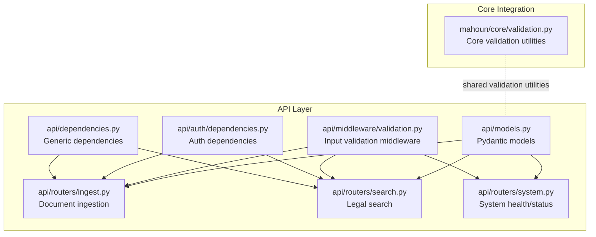
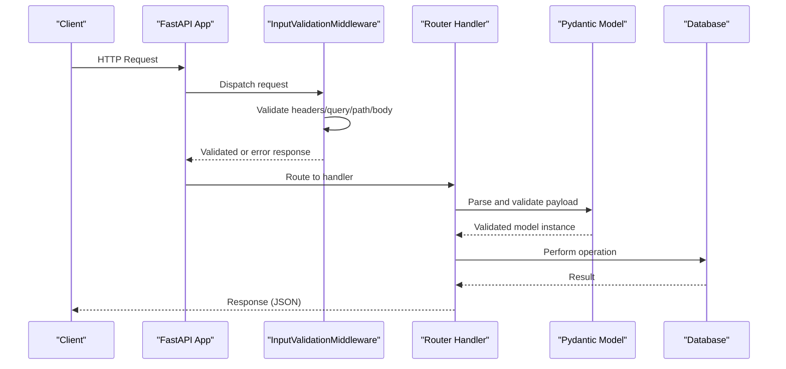
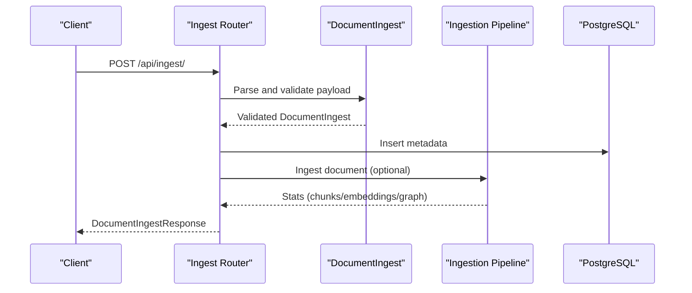
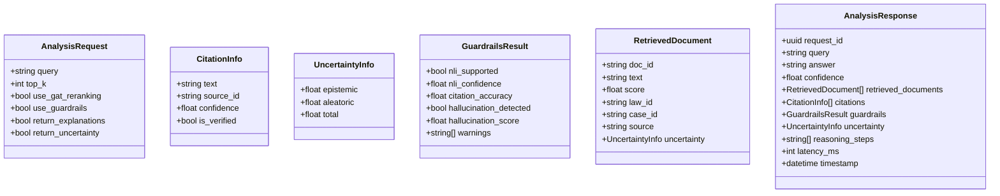
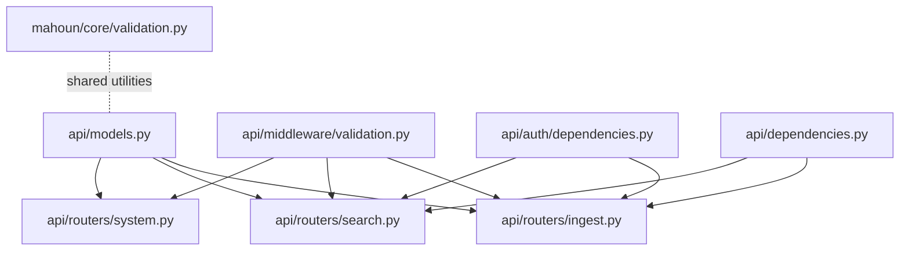

# API Data Models

<cite>
**Referenced Files in This Document**
- [api/models.py](file://api/models.py)
- [api/main.py](file://api/main.py)
- [api/routers/ingest.py](file://api/routers/ingest.py)
- [api/routers/search.py](file://api/routers/search.py)
- [api/routers/system.py](file://api/routers/system.py)
- [api/middleware/validation.py](file://api/middleware/validation.py)
- [api/auth/dependencies.py](file://api/auth/dependencies.py)
- [api/dependencies.py](file://api/dependencies.py)
- [mahoun/core/validation.py](file://mahoun/core/validation.py)
</cite>

## Table of Contents
1. [Introduction](#introduction)
2. [Project Structure](#project-structure)
3. [Core Components](#core-components)
4. [Architecture Overview](#architecture-overview)
5. [Detailed Component Analysis](#detailed-component-analysis)
6. [Dependency Analysis](#dependency-analysis)
7. [Performance Considerations](#performance-considerations)
8. [Troubleshooting Guide](#troubleshooting-guide)
9. [Conclusion](#conclusion)
10. [Appendices](#appendices)

## Introduction
This document provides comprehensive data model documentation for the API layer entities defined in api/models.py. It explains the Pydantic v2 schemas used for request and response validation, including field types, defaults, and validation logic. It also describes serialization/deserialization behavior, integration with FastAPI endpoints, and how these models interface with core system models and enforce input/output contracts. Guidance is included for extending or customizing models for new endpoints while maintaining consistency with the overall architecture. Schema versioning and backward compatibility considerations are addressed, along with examples of common request payloads and error responses.

## Project Structure
The API data models are centralized in api/models.py and consumed by FastAPI routers under api/routers/*. Validation middleware ensures robust input sanitization and enforcement. Authentication and authorization dependencies integrate with the User model to control access to protected endpoints.

**Diagram sources**
- [api/models.py](file://api/models.py#L1-L276)
- [api/routers/ingest.py](file://api/routers/ingest.py#L1-L335)
- [api/routers/search.py](file://api/routers/search.py#L1-L388)
- [api/routers/system.py](file://api/routers/system.py#L1-L227)
- [api/middleware/validation.py](file://api/middleware/validation.py#L26-L190)
- [api/auth/dependencies.py](file://api/auth/dependencies.py#L1-L101)
- [api/dependencies.py](file://api/dependencies.py#L1-L47)
- [mahoun/core/validation.py](file://mahoun/core/validation.py#L276-L311)

**Section sources**
- [api/models.py](file://api/models.py#L1-L276)
- [api/routers/ingest.py](file://api/routers/ingest.py#L1-L335)
- [api/routers/search.py](file://api/routers/search.py#L1-L388)
- [api/routers/system.py](file://api/routers/system.py#L1-L227)
- [api/middleware/validation.py](file://api/middleware/validation.py#L26-L190)
- [api/auth/dependencies.py](file://api/auth/dependencies.py#L1-L101)
- [api/dependencies.py](file://api/dependencies.py#L1-L47)
- [mahoun/core/validation.py](file://mahoun/core/validation.py#L276-L311)

## Core Components
This section summarizes the primary Pydantic models used across the API layer, grouped by functional domains.

- Authentication and User
  - UserLogin: Username and password fields with length constraints.
  - UserRegister: Username, email, password, and optional full name; password strength validator; enum serialization behavior.
  - Token: Access token, token type, and expiration seconds.
  - User: User identity with role, activity flags, timestamps, and enum serialization.

- Documents and Ingestion
  - DocumentType: Enumerated document categories.
  - DocumentIngest: Title, content, type, optional identifiers and metadata; enum serialization behavior.
  - DocumentIngestResponse: Ingestion outcome with counts and identifiers.

- Legal Analysis and Explainability
  - AnalysisRequest: Query, top-k, and flags for reranking, guardrails, explanations, and uncertainty.
  - CitationInfo: Source citation details.
  - UncertaintyInfo: Epistemic, aleatoric, and total uncertainty scores.
  - GuardrailsResult: NLI verification, citation accuracy, hallucination detection, and warnings.
  - RetrievedDocument: Document chunk with optional uncertainty.
  - AnalysisResponse: Complete analysis with request ID, answer, confidence, retrieved documents, citations, optional guardrails and uncertainty, reasoning steps, latency, and timestamp.

- Audit and Admin
  - AuditLogEntry: Audit trail fields including request ID, endpoint, method, query, answer, verification, hallucination checks, uncertainty, latency, status code, IP, and timestamp.
  - AuditLogQuery: Query parameters for audit logs with pagination and date filters.
  - ExplainabilityRequest: Request ID for explainability.
  - ReasoningStep: Step number, description, evidence, and confidence.
  - GraphPath: Nodes, edges, and path score for graph reasoning.
  - ExplainabilityResponse: Explainability output including reasoning steps, optional graph path, evidence documents, and confidence breakdown.

- System and Health
  - SystemStats: Aggregate system metrics.
  - HealthStatus: System health with status, version, timestamp, service statuses, and metrics.

- Error Handling
  - ErrorResponse: Standardized error envelope with error code, message, optional details, optional request ID, and timestamp.

**Section sources**
- [api/models.py](file://api/models.py#L1-L276)

## Architecture Overview
The API layer enforces strict input validation using Pydantic models and FastAPI’s automatic request parsing. Validation middleware adds an additional layer of security and sanitization. Routers depend on these models to define request/response contracts, and authentication dependencies ensure role-based access control.

**Diagram sources**
- [api/middleware/validation.py](file://api/middleware/validation.py#L26-L190)
- [api/routers/ingest.py](file://api/routers/ingest.py#L113-L190)
- [api/routers/search.py](file://api/routers/search.py#L194-L308)
- [api/models.py](file://api/models.py#L1-L276)

**Section sources**
- [api/middleware/validation.py](file://api/middleware/validation.py#L26-L190)
- [api/routers/ingest.py](file://api/routers/ingest.py#L113-L190)
- [api/routers/search.py](file://api/routers/search.py#L194-L308)
- [api/models.py](file://api/models.py#L1-L276)

## Detailed Component Analysis

### Authentication and User Models
- UserLogin
  - Fields: username (min length 3, max 50), password (min length 8).
  - Validation: Length constraints enforced by Pydantic Field.
- UserRegister
  - Fields: username (min length 3, max 50), email (validated), password (min length 8), full_name (optional).
  - Validation: Password strength validator enforces minimum length, presence of uppercase, lowercase, and digit.
  - Serialization: use_enum_values=True for role fields.
- Token
  - Fields: access_token (string), token_type (default "bearer"), expires_in (int).
- User
  - Fields: id (UUID), username, email, full_name (optional), role (UserRole enum), is_active, is_verified, created_at, last_login (optional).
  - Serialization: use_enum_values=True for role.

Integration with FastAPI:
- Authentication dependencies (get_current_user, get_current_active_user, require_admin, require_analyst) consume the User model to enforce access control.

**Section sources**
- [api/models.py](file://api/models.py#L36-L83)
- [api/auth/dependencies.py](file://api/auth/dependencies.py#L12-L101)
- [api/dependencies.py](file://api/dependencies.py#L12-L47)

### Document Ingestion Models
- DocumentType
  - Enum values: law, case, contract, regulation, other.
- DocumentIngest
  - Fields: title (min length 1, max 500), content (min length 10), doc_type (enum), optional law_id, case_id, date_published, source, metadata (default empty dict).
  - Serialization: use_enum_values=True for doc_type.
- DocumentIngestResponse
  - Fields: doc_id (string), status (string), message (string), chunks_created (int), embeddings_created (int), graph_nodes_created (int).

Routers:
- Ingest endpoint consumes DocumentIngest and returns DocumentIngestResponse.
- Upload endpoint supports file uploads and returns structured metadata.

**Diagram sources**
- [api/routers/ingest.py](file://api/routers/ingest.py#L113-L252)
- [api/models.py](file://api/models.py#L90-L112)

**Section sources**
- [api/models.py](file://api/models.py#L24-L31)
- [api/models.py](file://api/models.py#L90-L112)
- [api/routers/ingest.py](file://api/routers/ingest.py#L113-L252)

### Legal Analysis and Explainability Models
- AnalysisRequest
  - Fields: query (min length 5, max 1000), top_k (default 10, range 1–50), use_gat_reranking (bool), use_guardrails (bool), return_explanations (bool), return_uncertainty (bool).
- CitationInfo
  - Fields: text, source_id, confidence (float), is_verified (bool).
- UncertaintyInfo
  - Fields: epistemic, aleatoric, total (float).
- GuardrailsResult
  - Fields: nli_supported (bool), nli_confidence (float), citation_accuracy (float), hallucination_detected (bool), hallucination_score (float), warnings (list of strings, default empty).
- RetrievedDocument
  - Fields: doc_id, text, score (float), optional law_id, case_id, source, uncertainty (optional).
- AnalysisResponse
  - Fields: request_id (UUID), query, answer, confidence (float), retrieved_documents (list of RetrievedDocument), citations (list of CitationInfo), guardrails (optional GuardrailsResult), uncertainty (optional UncertaintyInfo), reasoning_steps (optional list of strings), latency_ms (int), timestamp (datetime).

Explainability models:
- ExplainabilityRequest: request_id (UUID).
- ReasoningStep: step_number (int), description (string), evidence (list of strings), confidence (float).
- GraphPath: nodes (list of dicts), edges (list of dicts), path_score (float).
- ExplainabilityResponse: request_id (UUID), query, answer, reasoning_steps (list of ReasoningStep), graph_path (optional GraphPath), evidence_documents (list of RetrievedDocument), confidence_breakdown (dict of floats).

**Diagram sources**
- [api/models.py](file://api/models.py#L117-L176)

**Section sources**
- [api/models.py](file://api/models.py#L117-L176)

### Audit and Admin Models
- AuditLogEntry
  - Fields: id (UUID), user_id (optional UUID), request_id (UUID), endpoint (string), method (string), query_text (optional), answer_generated (optional), nli_verification (optional dict), hallucination_check (optional dict), uncertainty_score (optional float), latency_ms (int), status_code (int), ip_address (string), created_at (datetime).
- AuditLogQuery
  - Fields: user_id (optional UUID), start_date (optional datetime), end_date (optional datetime), endpoint (optional string), page (int, default 1, min 1), page_size (int, default 20, min 1, max 100).

System and health:
- SystemStats: Aggregate metrics including totals and rates.
- HealthStatus: Status, version, timestamp, service statuses, and metrics.

**Section sources**
- [api/models.py](file://api/models.py#L181-L208)
- [api/models.py](file://api/models.py#L246-L264)

### Error Models
- ErrorResponse
  - Fields: error (string), message (string), details (optional dict), request_id (optional UUID), timestamp (datetime, default factory).

This model standardizes error responses across the API, enabling consistent client-side handling.

**Section sources**
- [api/models.py](file://api/models.py#L269-L276)

## Dependency Analysis
The API layer depends on:
- Pydantic v2 for model definition, field validators, and serialization.
- FastAPI for routing, dependency injection, and automatic OpenAPI generation.
- Authentication dependencies for role-based access control.
- Validation middleware for input sanitization and enforcement.
- Core validation utilities for shared sanitization and validation patterns.

**Diagram sources**
- [api/models.py](file://api/models.py#L1-L276)
- [api/routers/ingest.py](file://api/routers/ingest.py#L1-L335)
- [api/routers/search.py](file://api/routers/search.py#L1-L388)
- [api/routers/system.py](file://api/routers/system.py#L1-L227)
- [api/middleware/validation.py](file://api/middleware/validation.py#L26-L190)
- [api/auth/dependencies.py](file://api/auth/dependencies.py#L1-L101)
- [api/dependencies.py](file://api/dependencies.py#L1-L47)
- [mahoun/core/validation.py](file://mahoun/core/validation.py#L276-L311)

**Section sources**
- [api/models.py](file://api/models.py#L1-L276)
- [api/routers/ingest.py](file://api/routers/ingest.py#L1-L335)
- [api/routers/search.py](file://api/routers/search.py#L1-L388)
- [api/routers/system.py](file://api/routers/system.py#L1-L227)
- [api/middleware/validation.py](file://api/middleware/validation.py#L26-L190)
- [api/auth/dependencies.py](file://api/auth/dependencies.py#L1-L101)
- [api/dependencies.py](file://api/dependencies.py#L1-L47)
- [mahoun/core/validation.py](file://mahoun/core/validation.py#L276-L311)

## Performance Considerations
- Field constraints reduce unnecessary processing by rejecting invalid inputs early.
- Optional fields minimize payload sizes when not required.
- Enum serialization (use_enum_values=True) ensures compact representation and avoids string parsing overhead.
- Validation middleware prevents oversized payloads and malformed headers, reducing downstream processing costs.

[No sources needed since this section provides general guidance]

## Troubleshooting Guide
Common validation failures and error responses:
- Validation errors: InputValidationMiddleware returns structured JSON with error code, message, and path when validation fails.
- Password strength errors: UserRegister triggers validation errors if password lacks required characteristics.
- Missing or unsupported Content-Type: Middleware rejects requests with missing or unsupported content types.
- Excessive query parameters or overly long keys: Middleware enforces limits and raises validation errors.

Graceful degradation:
- Search router converts exceptions to empty results with preserved query text and filters, preventing cascading failures.

**Section sources**
- [api/middleware/validation.py](file://api/middleware/validation.py#L26-L190)
- [api/routers/search.py](file://api/routers/search.py#L297-L335)
- [api/models.py](file://api/models.py#L42-L63)

## Conclusion
The API data models in api/models.py provide a robust, strongly-typed foundation for request and response validation. They integrate seamlessly with FastAPI routers, authentication dependencies, and validation middleware to enforce input/output contracts, improve security, and ensure consistent error handling. Extending these models for new endpoints follows established patterns: define Pydantic models with appropriate field validators, integrate with routers using response_model, and leverage shared validation utilities for consistency.

[No sources needed since this section summarizes without analyzing specific files]

## Appendices

### Example Request Payloads and Responses
- Document ingestion request
  - Fields: title, content, doc_type, optional law_id, case_id, date_published, source, metadata.
  - Reference: [DocumentIngest](file://api/models.py#L90-L101)
- Legal analysis request
  - Fields: query, top_k, use_gat_reranking, use_guardrails, return_explanations, return_uncertainty.
  - Reference: [AnalysisRequest](file://api/models.py#L117-L125)
- Error response
  - Fields: error, message, details, request_id, timestamp.
  - Reference: [ErrorResponse](file://api/models.py#L269-L276)

### Schema Versioning and Backward Compatibility
- Use enum serialization (use_enum_values=True) to maintain stable string representations for enums.
- Keep optional fields for new additions to preserve backward compatibility.
- Prefer adding new fields with defaults rather than changing existing ones.
- Centralize validation logic in field validators and model validators to avoid duplication.

**Section sources**
- [api/models.py](file://api/models.py#L49-L50)
- [api/models.py](file://api/models.py#L101-L102)
- [api/models.py](file://api/models.py#L84-L84)

### Extending Models for New Endpoints
Steps:
- Define a new Pydantic model with Field constraints and validators.
- Integrate with a FastAPI router using response_model and Depends for authentication.
- Leverage InputValidationMiddleware for additional input sanitization.
- Use shared validation utilities from mahoun/core/validation.py for consistent sanitization.

Guidance:
- Reuse enums and common structures to minimize drift.
- Add comprehensive tests to validate both positive and negative cases.
- Document examples in router docstrings for OpenAPI generation.

**Section sources**
- [api/models.py](file://api/models.py#L1-L276)
- [api/routers/ingest.py](file://api/routers/ingest.py#L113-L190)
- [api/routers/search.py](file://api/routers/search.py#L194-L308)
- [api/middleware/validation.py](file://api/middleware/validation.py#L26-L190)
- [mahoun/core/validation.py](file://mahoun/core/validation.py#L276-L311)