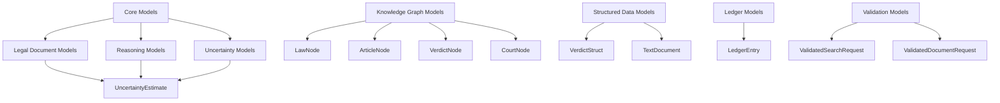
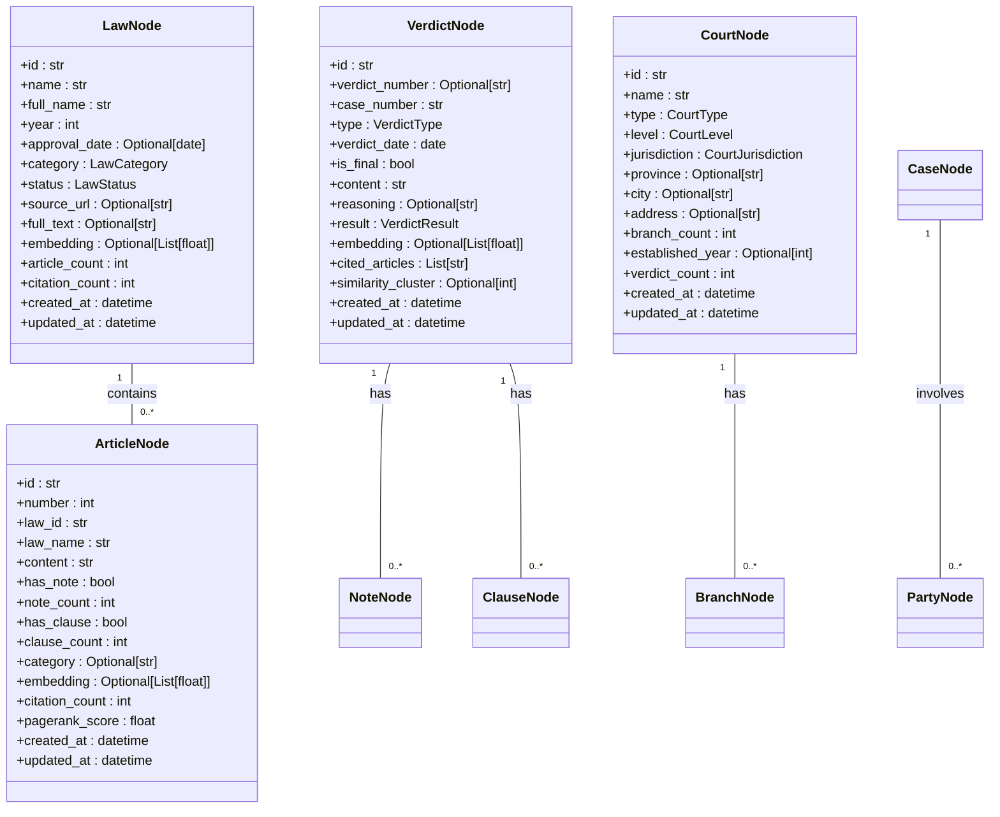
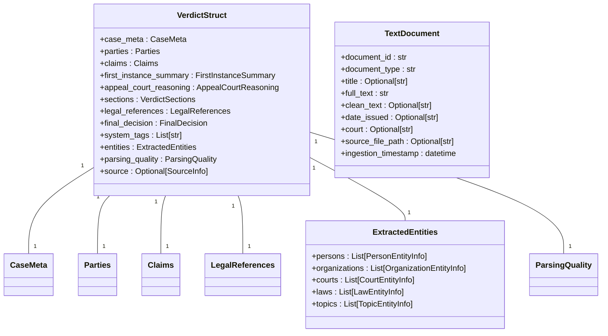
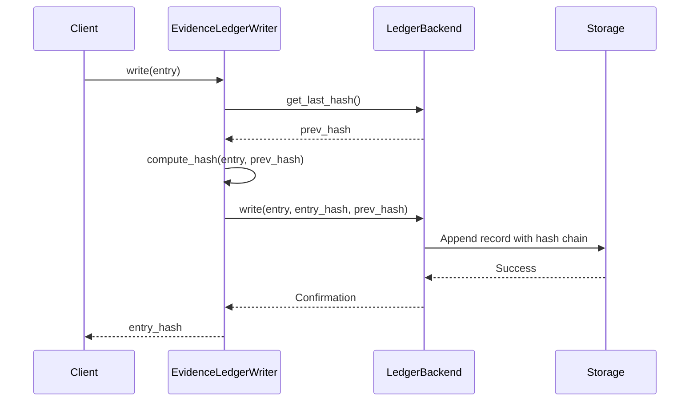
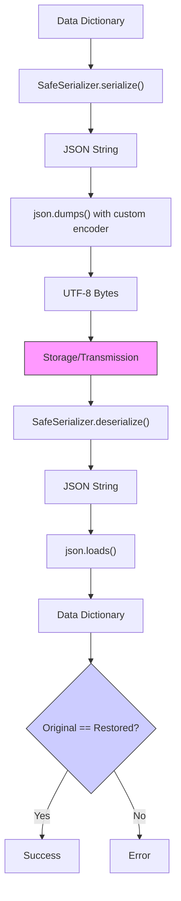

# Core System Models

<cite>
**Referenced Files in This Document**   
- [mahoun/core/models.py](file://mahoun/core/models.py)
- [mahoun/ledger/models.py](file://mahoun/ledger/models.py)
- [mahoun/graph/neo4j/models.py](file://mahoun/graph/neo4j/models.py)
- [mahoun/schemas/legal_struct_schema.py](file://mahoun/schemas/legal_struct_schema.py)
- [mahoun/schemas/text_schema.py](file://mahoun/schemas/text_schema.py)
- [mahoun/core/validation.py](file://mahoun/core/validation.py)
- [mahoun/core/serialization.py](file://mahoun/core/serialization.py)
- [mahoun/ledger/writer.py](file://mahoun/ledger/writer.py)
- [mahoun/ledger/storage.py](file://mahoun/ledger/storage.py)
</cite>

## Table of Contents
1. [Introduction](#introduction)
2. [Core Model Categories](#core-model-categories)
3. [Legal Document Models](#legal-document-models)
4. [Reasoning and Uncertainty Models](#reasoning-and-uncertainty-models)
5. [Knowledge Graph Models](#knowledge-graph-models)
6. [Structured Legal Data Models](#structured-legal-data-models)
7. [Ledger and Audit Models](#ledger-and-audit-models)
8. [Validation and Security Models](#validation-and-security-models)
9. [Serialization and Data Integrity](#serialization-and-data-integrity)
10. [Integration with Runtime Components](#integration-with-runtime-components)
11. [Troubleshooting Guide](#troubleshooting-guide)

## Introduction

The Mahoun system employs a comprehensive set of Pydantic-based domain models to manage system state, configuration, and internal data transfer across its components. These models serve as the foundational data structures that ensure type safety, data integrity, and consistent validation throughout the system. The core models support critical runtime operations in components such as the orchestrator, health checker, and configuration system by providing standardized data representations that can be reliably serialized, validated, and transferred between system boundaries.

These models are organized into several categories based on their functional domains: legal document processing, reasoning and uncertainty estimation, knowledge graph representation, structured legal data extraction, ledger and audit trails, and input validation. Each model is designed with specific validation rules and data type constraints to ensure data quality and security. The models support both internal system operations and integration with external APIs and persistence layers, serving as the contract between different system components.

The use of Pydantic enables automatic validation, serialization, and documentation of these models, reducing the potential for data-related errors and improving system reliability. These models are extensively used throughout the system, from ingestion pipelines that process legal documents to the reasoning engines that generate legal insights and the ledger system that maintains an immutable audit trail of all significant operations.

**Section sources**
- [mahoun/core/models.py](file://mahoun/core/models.py#L1-L147)

## Core Model Categories

The Mahoun system's domain models are organized into several distinct categories based on their functional purpose and usage patterns. The primary categorization includes core models in the `mahoun/core/models.py` file, which define fundamental data structures for legal documents, reasoning processes, and uncertainty estimation. These models serve as the foundation for the system's data representation and are used across multiple components.

The knowledge graph models in `mahoun/graph/neo4j/models.py` represent the legal knowledge graph's node types, including laws, articles, courts, verdicts, and other legal entities. These models define the structure of the graph database and ensure consistency in how legal knowledge is represented and queried. They include comprehensive validation rules, particularly for embeddings which must have exactly 1024 dimensions.

The structured legal data models in `mahoun/schemas/` directory provide canonical representations for parsed legal documents, with `legal_struct_schema.py` defining the L2 schema for structured verdict data and `text_schema.py` defining the L1 schema for raw text documents. These models are specifically designed to match the output of the system's parsing components, ensuring zero-friction integration between document processing and downstream analysis.

Additional model categories include ledger and audit models that maintain an immutable record of system operations, validation models that ensure input safety, and serialization utilities that handle secure data transformation. Each category serves a specific purpose in the system architecture while maintaining consistency in design patterns and validation approaches.

**Diagram sources**
- [mahoun/core/models.py](file://mahoun/core/models.py#L1-L147)
- [mahoun/graph/neo4j/models.py](file://mahoun/graph/neo4j/models.py#L1-L268)
- [mahoun/schemas/legal_struct_schema.py](file://mahoun/schemas/legal_struct_schema.py#L1-L310)
- [mahoun/schemas/text_schema.py](file://mahoun/schemas/text_schema.py#L1-L69)

**Section sources**
- [mahoun/core/models.py](file://mahoun/core/models.py#L1-L147)
- [mahoun/graph/neo4j/models.py](file://mahoun/graph/neo4j/models.py#L1-L268)
- [mahoun/schemas/legal_struct_schema.py](file://mahoun/schemas/legal_struct_schema.py#L1-L310)
- [mahoun/schemas/text_schema.py](file://mahoun/schemas/text_schema.py#L1-L69)

## Legal Document Models

The legal document models in `mahoun/core/models.py` provide the foundational data structures for representing legal documents within the Mahoun system. The `LegalDocument` model serves as the primary container for legal text content and associated metadata, with fields for unique identification, document type classification, and temporal tracking of creation and processing events. This model is used throughout the system for document ingestion, retrieval, and analysis operations.

The `LegalDocType` enumeration defines the supported document types, including laws, verdicts, regulations, articles, contracts, and opinions, providing a standardized taxonomy for document classification. Each `LegalDocument` instance includes a text field for the full document content, a metadata dictionary for flexible additional information storage, and optional fields for title and source file references.

Complementing the document model is the `LegalEntity` model, which represents parties involved in legal contexts such as persons, organizations, courts, and other legal actors. This model includes fields for entity name, type classification, role specification, and metadata storage. The `LegalEntity` model is used in conjunction with document processing to extract and represent the key actors mentioned in legal texts.

These models are designed to support the system's document processing pipeline, from initial ingestion through analysis and storage. They provide the basic building blocks for more complex representations in the knowledge graph and structured data layers, serving as the entry point for legal information into the system. The models are validated using Pydantic's built-in validation mechanisms, ensuring data integrity and consistency across system operations.

**Section sources**
- [mahoun/core/models.py](file://mahoun/core/models.py#L22-L51)

## Reasoning and Uncertainty Models

The reasoning and uncertainty models in `mahoun/core/models.py` provide the data structures for representing the system's analytical processes and confidence assessments. The `ReasoningStep` dataclass captures individual steps in a chain of thought reasoning process, with fields for the step description, detailed reasoning, confidence score, and supporting evidence. This model enables the system to maintain a transparent audit trail of its reasoning process.

The `CausalRelation` dataclass represents causal relationships between facts, with fields for cause and effect descriptions, strength assessment, and explanatory text. This model supports the system's causal inference capabilities, allowing it to identify and represent cause-effect relationships within legal contexts. The `ReasoningResult` dataclass serves as the comprehensive container for complete reasoning outcomes, aggregating multiple reasoning steps, causal chains, and supporting evidence into a single structured result.

For uncertainty quantification, the `UncertaintyEstimate` dataclass provides a structured representation of different types of uncertainty, distinguishing between epistemic (model) uncertainty and aleatoric (data) uncertainty. This model includes fields for both uncertainty components, a total uncertainty score, confidence level, method specification, and detailed breakdown information. The model's `__post_init__` method automatically calculates the total uncertainty as the sum of epistemic and aleatoric components when not explicitly provided.

These models are integral to the system's reasoning engines, providing the data structures needed to represent complex analytical processes with appropriate confidence assessments. They support the system's ability to explain its reasoning, quantify uncertainty, and provide transparent decision-making processes that can be audited and verified.

**Section sources**
- [mahoun/core/models.py](file://mahoun/core/models.py#L57-L129)

## Knowledge Graph Models

The knowledge graph models in `mahoun/graph/neo4j/models.py` define the structure of the legal knowledge graph, representing various legal entities as nodes with specific attributes and relationships. These Pydantic models ensure data consistency and validation for all nodes in the graph database, providing a type-safe interface for graph operations.

The `LawNode` model represents legislation with fields for unique identification, name, approval year, category, status, and full text. It includes validation for the 1024-dimensional embedding vector and uses the `LawCategory` and `LawStatus` enumerations to standardize classification. The `ArticleNode` model represents individual articles within laws, with fields for article number, parent law reference, content, and structural features like notes and clauses.

Court-related models include `CourtNode` for judicial institutions and `BranchNode` for specific court branches, capturing hierarchical relationships within the judicial system. The `VerdictNode` model represents court decisions with fields for verdict number, case reference, type, date, content, and result classification using the `VerdictResult` enumeration. The `CaseNode` model represents legal cases with type, status, and filing date information.

Person and party models include `PersonNode` for individuals with privacy-preserving name hashing, and `PartyNode` for parties involved in legal proceedings with role classification using the `PartyType` enumeration. All models include temporal tracking with `created_at` and `updated_at` fields, and the `model_config` with `use_enum_values=True` ensures proper serialization of enumeration values.

**Diagram sources**
- [mahoun/graph/neo4j/models.py](file://mahoun/graph/neo4j/models.py#L34-L268)

**Section sources**
- [mahoun/graph/neo4j/models.py](file://mahoun/graph/neo4j/models.py#L34-L268)

## Structured Legal Data Models

The structured legal data models in `mahoun/schemas/legal_struct_schema.py` and `mahoun/schemas/text_schema.py` provide canonical representations for parsed legal documents at different levels of processing. The `VerdictStruct` model in `legal_struct_schema.py` represents the L2 layer of structured legal information extracted from Persian court verdicts, designed to match exactly the output of the system's parsing components.

The `VerdictStruct` model is composed of several nested components that capture different aspects of a legal verdict. The `CaseMeta` component contains metadata about the case, including court level, procedural stage, case type, and finality status. The `Parties` component captures information about plaintiffs, defendants, and third-party objectors through the `PartyInfo` model. The `Claims` component represents the main claims and references to execution files.

The `LegalReferences` component captures citations to substantive law, procedural law, and Islamic jurisprudence principles, while the `ExtractedEntities` model contains entities identified by the system's NER subsystem, including persons, organizations, courts, laws, and legal topics. The `ParsingQuality` component provides quality metrics for the parsing process, helping to identify extractions that may require manual review.

The `TextDocument` model in `text_schema.py` represents the L1 layer of raw or normalized text with minimal metadata, used for RAG indexing, search, and retrieval operations. It includes fields for document identification, type classification, full text content, cleaned text, issuance date, court information, and source file path. This model serves as the primary representation for documents in the vector store and search systems.

**Diagram sources**
- [mahoun/schemas/legal_struct_schema.py](file://mahoun/schemas/legal_struct_schema.py#L265-L310)
- [mahoun/schemas/text_schema.py](file://mahoun/schemas/text_schema.py#L17-L69)

**Section sources**
- [mahoun/schemas/legal_struct_schema.py](file://mahoun/schemas/legal_struct_schema.py#L1-L310)
- [mahoun/schemas/text_schema.py](file://mahoun/schemas/text_schema.py#L1-L69)

## Ledger and Audit Models

The ledger and audit models in `mahoun/ledger/models.py` and related files provide an immutable record of significant system operations, ensuring data integrity and enabling tamper detection through cryptographic hash chaining. The `LedgerEntry` dataclass in `models.py` represents a single entry in the evidence ledger, capturing essential information about verdict processing events.

The `LedgerEntry` model includes fields for `verdict_id` and `case_id` to identify the legal case being processed, along with `referenced_ltm_nodes` and `referenced_facts` lists that track the knowledge graph nodes and facts referenced during analysis. It also includes `confidence` score, `invariant_version`, `guard_mode`, and temporal information with `created_at`. Optional fields for `event_type` and `request_id` provide additional context for the ledger entry.

The ledger system is implemented with multiple backend options through the `LedgerBackend` abstract class and its concrete implementations: `JSONLLedgerBackend` for append-only JSONL files, `SQLiteLedgerBackend` for relational storage with ACID guarantees, and `NoOpLedgerBackend` for testing purposes. The `EvidenceLedgerWriter` class orchestrates the writing process, computing SHA-256 hashes that incorporate both the current entry and the previous hash to create a tamper-evident chain.

The system enforces critical invariants: EL-I1 ensures every entry has evidence references, EL-I4 guarantees immutability through append-only storage, and EL-I6 enables tamper detection through the hash chain. The `create_ledger_writer` factory function allows configuration of the appropriate backend based on deployment environment, with safeguards preventing the use of non-persistent backends in production.

**Diagram sources**
- [mahoun/ledger/models.py](file://mahoun/ledger/models.py#L6-L21)
- [mahoun/ledger/writer.py](file://mahoun/ledger/writer.py#L303-L412)
- [mahoun/ledger/storage.py](file://mahoun/ledger/storage.py#L20-L102)

**Section sources**
- [mahoun/ledger/models.py](file://mahoun/ledger/models.py#L6-L21)
- [mahoun/ledger/writer.py](file://mahoun/ledger/writer.py#L303-L412)
- [mahoun/ledger/storage.py](file://mahoun/ledger/storage.py#L20-L102)

## Validation and Security Models

The validation and security models in `mahoun/core/validation.py` provide robust input validation and sanitization capabilities to protect the system against injection attacks and ensure data quality. These models leverage Pydantic's validation framework to enforce constraints on incoming requests, with specialized models for different types of operations.

The `ValidatedSearchRequest` model ensures search queries are safe and within bounds, with field constraints limiting query length to 2000 characters and results to between 1 and 100 items. The `sanitize_query` validator applies string sanitization to remove potentially harmful content while preserving search functionality. This model prevents common attack vectors such as SQL injection and command injection by sanitizing input before processing.

The `ValidatedDocumentRequest` model handles document ingestion requests with comprehensive validation, ensuring titles and document types are within acceptable length limits and content does not exceed 1MB. It includes specialized validators for different fields, with `sanitize_strings` for title and type fields, and `sanitize_content` for the document content itself. The model also validates metadata dictionaries, limiting them to 50 fields and ensuring key-value pairs meet security requirements.

These validation models are integrated throughout the system's API endpoints and internal processing pipelines, providing a consistent security posture across all data entry points. The validation framework is designed to fail fast on invalid input, preventing malformed or malicious data from propagating through the system. The use of Pydantic's validation capabilities ensures that validation logic is centralized, reusable, and automatically documented.

**Section sources**
- [mahoun/core/validation.py](file://mahoun/core/validation.py#L259-L311)

## Serialization and Data Integrity

The serialization system in `mahoun/core/serialization.py` provides secure, JSON-based serialization and deserialization capabilities with strong security guarantees against code execution vulnerabilities. The `SafeSerializer` class implements a comprehensive serialization framework that avoids dangerous formats like pickle, which could enable arbitrary code execution.

The serialization system uses a custom JSON encoder that handles complex types including datetime objects, Path objects, numpy arrays, and sets, converting them to JSON-safe primitives. The `serialize` method converts data dictionaries to UTF-8 encoded JSON bytes, while the `deserialize` method safely reconstructs dictionaries from JSON bytes. Both methods include comprehensive error handling to catch and report serialization issues.

For file operations, the `save` and `load` methods provide secure persistence capabilities, with the `load` method explicitly refusing to process pickle files for security reasons. The system includes a `compute_hash` method that generates SHA-256 hashes of serialized data using sorted keys for deterministic hashing, enabling integrity verification of stored data.

The serialization system is designed with defense-in-depth principles, including multiple layers of validation and error handling. Property-based tests verify critical properties such as serialization round-trip consistency, deterministic hashing, and rejection of insecure formats. The system ensures that all serialized data can be safely deserialized without executing arbitrary code, maintaining the security posture of the entire application.

**Diagram sources**
- [mahoun/core/serialization.py](file://mahoun/core/serialization.py#L54-L200)

**Section sources**
- [mahoun/core/serialization.py](file://mahoun/core/serialization.py#L1-L200)

## Integration with Runtime Components

The core domain models are deeply integrated with the Mahoun system's runtime components, serving as the primary data transfer objects between different system layers. The orchestrator component uses these models to coordinate processing workflows, passing structured data between ingestion, analysis, and storage stages. The health checker component validates model instances as part of system health assessments, ensuring data integrity across components.

In the configuration system, models are used to represent runtime configuration state, with validation ensuring that configuration changes meet system requirements before being applied. The models support dynamic reconfiguration by providing a standardized format for configuration updates that can be validated, serialized, and distributed across system components.

The models enable seamless integration between API endpoints and internal processing components, with request and response models providing a contract between external clients and internal services. This integration pattern ensures that data entering the system through APIs is immediately subject to the same validation and processing rules as data generated internally.

The models also facilitate integration with persistence layers, serving as the interface between in-memory representations and database storage. The knowledge graph models map directly to Neo4j node types, while the ledger models correspond to database records with cryptographic integrity checks. This tight integration ensures data consistency across different storage systems while maintaining the benefits of type-safe, validated data structures.

**Section sources**
- [mahoun/core/models.py](file://mahoun/core/models.py#L1-L147)
- [mahoun/ledger/models.py](file://mahoun/ledger/models.py#L6-L21)
- [mahoun/graph/neo4j/models.py](file://mahoun/graph/neo4j/models.py#L1-L268)

## Troubleshooting Guide

When encountering model validation errors, the most common issues typically involve field constraints such as string length limits, required fields, or invalid enumeration values. For `LegalDocument` validation failures, verify that the `id` and `text` fields are provided and that text content does not exceed size limits. For knowledge graph models, ensure that embedding vectors have exactly 1024 dimensions as required by the validation rules.

Serialization issues often stem from non-JSON-serializable types in data dictionaries. When using `SafeSerializer`, ensure that all values are JSON-safe primitives or types supported by the custom encoder (datetime, Path, numpy types). Avoid complex objects that cannot be converted to dictionaries via `__dict__`. If serialization fails, check for circular references or unsupported types like functions or class instances.

For ledger-related issues, verify that the storage backend is properly configured and that the process has write permissions to the ledger directory. Hash chain verification failures indicate potential data corruption or tampering; in such cases, restore from backup and investigate the source of the integrity violation. The system will block verdict publication if ledger writes fail, so ensure the ledger system is operational before processing critical documents.

When debugging validation errors in API requests, examine the specific field that triggered the validation failure and ensure it meets all constraints (length, format, allowed values). Use the example values in model docstrings as a reference for correct formatting. For persistent issues, enable debug logging to capture detailed information about the validation process and error conditions.

**Section sources**
- [mahoun/core/models.py](file://mahoun/core/models.py#L1-L147)
- [mahoun/core/validation.py](file://mahoun/core/validation.py#L259-L311)
- [mahoun/core/serialization.py](file://mahoun/core/serialization.py#L1-L200)
- [mahoun/ledger/writer.py](file://mahoun/ledger/writer.py#L303-L412)