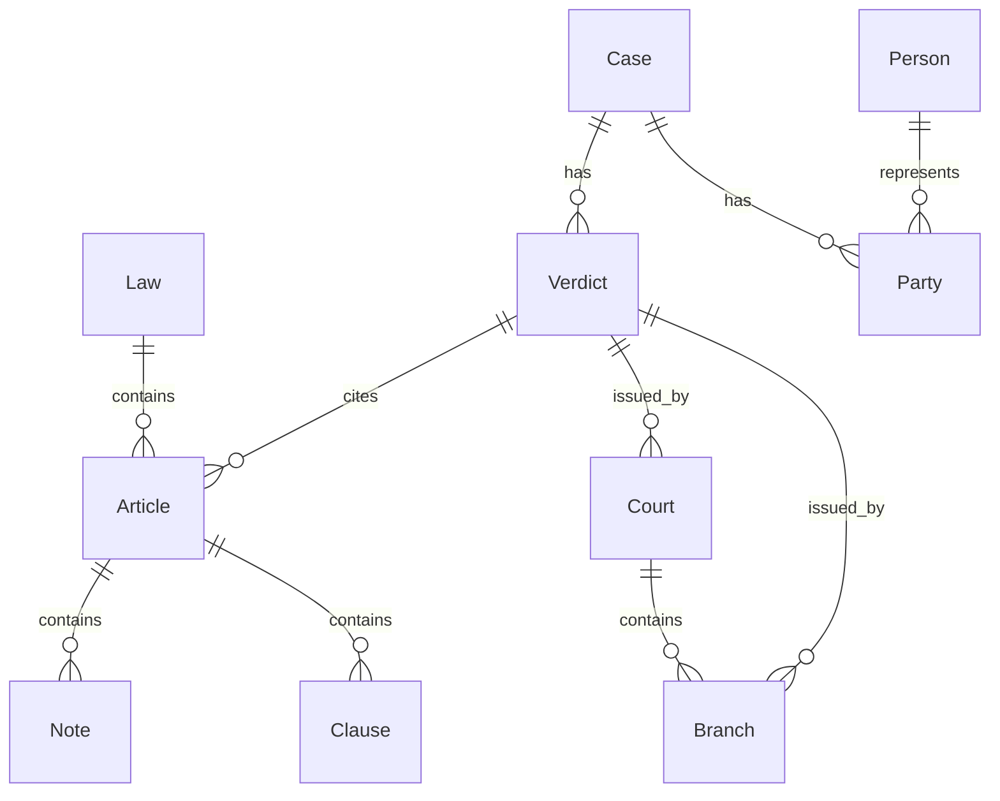

# Data Models

<cite>
**Referenced Files in This Document**   
- [models.py](file://mahoun/ledger/models.py)
- [models.py](file://mahoun/graph/neo4j/models.py)
- [models.py](file://api/models.py)
- [models.py](file://mahoun/core/models.py)
- [schema.py](file://mahoun/graph/neo4j/schema.py)
- [storage.py](file://mahoun/ledger/storage.py)
- [privacy.py](file://mahoun/ledger/privacy.py)
- [versions.py](file://mahoun/invariants/versions.py)
- [ledger_invariants.py](file://mahoun/invariants/ledger_invariants.py)
- [connection.py](file://mahoun/graph/neo4j/connection.py)
- [operations.py](file://mahoun/graph/neo4j/operations.py)
- [writer.py](file://mahoun/ledger/writer.py)
</cite>

## Table of Contents
1. [Introduction](#introduction)
2. [Core Entity Models](#core-entity-models)
3. [API Models](#api-models)
4. [Graph Data Model](#graph-data-model)
5. [Ledger and Audit Models](#ledger-and-audit-models)
6. [Data Validation and Business Logic](#data-validation-and-business-logic)
7. [Database Schema and Constraints](#database-schema-and-constraints)
8. [Data Access Patterns](#data-access-patterns)
9. [Data Lifecycle and Retention](#data-lifecycle-and-retention)
10. [Data Security and Privacy](#data-security-and-privacy)
11. [Data Migration and Versioning](#data-migration-and-versioning)
12. [Conclusion](#conclusion)

## Introduction
This document provides comprehensive documentation for the core data models in the MAHOUN Enterprise system. The system employs a multi-layered data architecture consisting of API models for request/response validation, core system models for internal processing, a Neo4j-based graph model for legal knowledge representation, and a ledger model for auditability and integrity verification. The data models are designed to support complex legal reasoning, evidence-based verdict generation, and strict compliance requirements. This documentation details the entity relationships, field definitions, data types, constraints, and business logic across these model layers, providing a complete reference for developers, architects, and compliance officers.

## Core Entity Models

The core entity models form the foundation of the MAHOUN system's data architecture, providing type-safe structures for legal documents, reasoning processes, and uncertainty estimation. These models are defined in the `mahoun/core/models.py` file and are used across various components of the system for consistent data representation.

The `LegalDocument` model serves as the base representation for all legal content, containing fields for document ID, text content, metadata, document type, title, source file, and timestamps for creation and processing. This model supports various legal document types through the `LegalDocType` enumeration, including laws, verdicts, regulations, articles, contracts, and opinions.

For reasoning processes, the system implements a chain-of-thought approach with the `ReasoningStep` dataclass, which captures individual reasoning steps with their description, confidence level, and supporting evidence. The `ReasoningResult` model aggregates these steps into a comprehensive reasoning chain, including causal relationships between facts, supporting evidence, confidence metrics, and graph traversal information. This model enables transparent, auditable reasoning that can be traced and verified.

Uncertainty estimation is handled by the `UncertaintyEstimate` dataclass, which quantifies both epistemic (model) and aleatoric (data) uncertainty, providing a total uncertainty score and confidence level. This allows the system to express the reliability of its conclusions and identify areas of potential doubt in its reasoning.

**Section sources**
- [models.py](file://mahoun/core/models.py#L1-L147)

## API Models

The API models, defined in `api/models.py`, provide Pydantic v2 models for request and response validation across the system's endpoints. These models ensure data integrity and consistency in interactions between clients and the API.

Authentication models include `UserLogin` for credential submission, `UserRegister` for user registration with password strength validation, and `Token` for JWT authentication responses. The `User` model represents authenticated users with fields for ID, username, email, role, active status, verification status, and timestamps.

Document ingestion models consist of `DocumentIngest` for submitting new documents to the system and `DocumentIngestResponse` for acknowledging successful ingestion with statistics on created chunks, embeddings, and graph nodes. These models support various document types through the `DocumentType` enumeration.

The analysis models form a comprehensive framework for legal reasoning requests and responses. The `AnalysisRequest` model captures query parameters including the query text, result count, and various processing flags. The response model, `AnalysisResponse`, includes the generated answer, confidence score, retrieved documents with uncertainty information, citation verification results, guardrail assessments, and reasoning steps.

Audit models provide comprehensive logging capabilities with the `AuditLogEntry` model capturing detailed information about API interactions, including user ID, request ID, endpoint, method, query text, generated answer, verification results, latency, status code, IP address, and timestamp. The `AuditLogQuery` model enables filtering of audit logs by various criteria.

Explainability models support transparency with the `ExplainabilityResponse` model providing detailed reasoning steps, graph paths, evidence documents, and confidence breakdowns for generated answers. This enables users to understand the basis for the system's conclusions.

**Section sources**
- [models.py](file://api/models.py#L1-L276)

## Graph Data Model

The graph data model, implemented in `mahoun/graph/neo4j/models.py`, represents a comprehensive legal knowledge graph with 10 interconnected node types. This Neo4j-based model captures the complex relationships between legal entities, enabling sophisticated reasoning and retrieval capabilities.

The model includes `LawNode` for representing laws with fields for ID, name, full name, approval year, category, status, source URL, full text, embedding, article count, citation count, and timestamps. Each law contains multiple `ArticleNode` instances, which represent individual articles within a law, linked by the `law_id` field. Articles may contain `NoteNode` instances (notes or amendments) and `ClauseNode` instances (subdivisions), creating a hierarchical structure.

The court system is modeled with `CourtNode` representing courts with attributes for name, type, level, jurisdiction, location, branch count, establishment year, and verdict count. Each court has multiple `BranchNode` instances representing its branches.

Legal cases are represented by `CaseNode` with fields for case number, type, status, filing date, and description. Cases are linked to `VerdictNode` instances representing court decisions, with relationships capturing the verdict's content, reasoning, result, and cited articles. The `VerdictNode` also includes an embedding for semantic similarity searches and a similarity cluster ID for grouping related verdicts.

Person entities are represented by `PersonNode` with hashed identifiers for privacy, while `PartyNode` links parties to cases with their role (plaintiff, defendant, or third party) and legal entity status. This separation ensures privacy while maintaining the ability to track relationships.

The model employs strict data validation through Pydantic field validators, including dimension validation for 1024-dimensional text embeddings and validation of article numbers to ensure they are positive integers. The use of enumerations for categories, statuses, types, and jurisdictions ensures data consistency and prevents invalid values.

**Section sources**
- [models.py](file://mahoun/graph/neo4j/models.py#L1-L268)

## Ledger and Audit Models

The ledger and audit models provide a tamper-evident, append-only record of system decisions and evidence references, ensuring auditability and integrity. The core `LedgerEntry` model, defined in `mahoun/ledger/models.py`, captures essential information about verdicts and their evidentiary basis.

Each ledger entry includes the `verdict_id` and `case_id` as primary identifiers, along with references to supporting evidence through `referenced_ltm_nodes` (rule, statute, and precedent IDs) and `referenced_facts` (fact IDs). The entry records the system's confidence level, the invariant version used, the guard mode, creation timestamp, event type, and request ID.

The ledger system enforces critical invariants defined in `mahoun/invariants/ledger_invariants.py`, including evidence requirements (EL-I1), immutability (EL-I4), verdict blocking on ledger failure (EL-I3), and privacy preservation (EL-I7). These invariants are non-negotiable guarantees that maintain system integrity and trustworthiness.

The `FileLedgerWriter` implementation in `mahoun/ledger/storage.py` provides a production-grade ledger writer with hash-chain integrity. Each entry's hash is computed from its content and the previous entry's hash, creating a cryptographic chain that detects any tampering. Entries are stored in daily JSONL files with a head pointer maintaining the current chain state.

The system supports multiple backend implementations through the `EvidenceLedgerWriter` interface, including JSONL file storage, SQLite database storage, and a no-op backend for testing. The SQLite backend provides ACID guarantees and efficient querying capabilities, while the JSONL backend offers simplicity and ease of integration with log processing systems.

**Section sources**
- [models.py](file://mahoun/ledger/models.py#L1-L21)
- [storage.py](file://mahoun/ledger/storage.py#L1-L102)
- [writer.py](file://mahoun/ledger/writer.py#L1-L412)

## Data Validation and Business Logic

The system implements comprehensive data validation and business logic through Pydantic models, custom validators, and invariant enforcement mechanisms. These validation layers ensure data integrity, consistency, and compliance with business rules across all components.

Pydantic models employ field-level validation through the `@field_validator` decorator, with custom validation methods for critical fields. The `LawNode`, `ArticleNode`, and `VerdictNode` models all include validators for their 1024-dimensional embedding fields, ensuring that only properly dimensioned vectors are accepted. The `ArticleNode` model validates that article numbers are positive integers, preventing invalid legal references.

Password strength validation is implemented in the `UserRegister` model with a custom validator that enforces minimum length (8 characters) and requires uppercase letters, lowercase letters, and digits. This ensures that user credentials meet basic security requirements.

The system enforces business logic through a comprehensive set of invariants defined in `mahoun/invariants/ledger_invariants.py`. These invariants are formal specifications of system guarantees, each with a unique ID, name, description, enforcement locations, and failure consequences. The invariants cover critical aspects such as evidence requirements, immutability, privacy preservation, and audit sufficiency.

Privacy filtering is implemented in `mahoun/ledger/privacy.py` through the `filter_facts_for_ledger` function, which ensures that sensitive fact values are never stored in the evidence ledger. The function validates that facts of sensitive types (personal ID, medical, biometric, address) do not contain value fields and returns only opaque identifiers for storage.

The `UserRegister` model uses Pydantic's `ConfigDict(use_enum_values=True)` to ensure that enum values are serialized as their string representations rather than their names, providing consistent API responses. This pattern is also used in other models to ensure predictable serialization behavior.

**Section sources**
- [models.py](file://mahoun/graph/neo4j/models.py#L1-L268)
- [models.py](file://api/models.py#L1-L276)
- [privacy.py](file://mahoun/ledger/privacy.py#L1-L61)
- [ledger_invariants.py](file://mahoun/invariants/ledger_invariants.py#L1-L103)

## Database Schema and Constraints

The database schema for the Neo4j graph database is comprehensively defined in `mahoun/graph/neo4j/schema.py`, establishing constraints, indexes, and structural integrity rules for the legal knowledge graph.

The schema enforces uniqueness constraints on the primary identifier of each node type through unique constraints. These include `unique_law_id` for Law nodes, `unique_article_id` for Article nodes, `unique_court_id` for Court nodes, `unique_verdict_id` for Verdict nodes, and similar constraints for all 10 node types. These constraints ensure that each entity has a unique identifier, preventing duplicate entries and maintaining data integrity.

Indexes are created for frequently queried fields to optimize performance. B-tree indexes are established for exact match queries on fields such as law name (`law_name_idx`), law year (`law_year_idx`), article number (`article_number_idx`), court name (`court_name_idx`), and verdict case number (`verdict_case_number_idx`). These indexes significantly improve query performance for common access patterns.

Full-text indexes are implemented for content search capabilities on key text fields. The `law_fulltext_idx` enables full-text search across law names, full names, and full text. The `article_fulltext_idx` supports searching within article content, while the `verdict_fulltext_idx` allows searching verdict content and reasoning. These indexes leverage Neo4j's full-text search capabilities for efficient text retrieval.

The schema manager provides methods for initializing, validating, and managing the database schema. The `initialize_schema` method creates constraints and indexes in the proper order (constraints first, then indexes), while the `validate_schema` method verifies that all required constraints and indexes exist. This ensures that the database structure meets the system's requirements before operation.

The system also defines a default schema for the RAG (Retrieval-Augmented Generation) system with constraints and indexes for Document, Chunk, and Entity nodes, supporting the document retrieval and processing pipeline.

**Diagram sources **
- [schema.py](file://mahoun/graph/neo4j/schema.py#L1-L441)
- [models.py](file://mahoun/graph/neo4j/models.py#L1-L268)

**Section sources**
- [schema.py](file://mahoun/graph/neo4j/schema.py#L1-L441)

## Data Access Patterns

The system implements optimized data access patterns through the Neo4j connection and operations layers, providing efficient querying, transaction management, and batch processing capabilities.

The `Neo4jConnection` class in `mahoun/graph/neo4j/connection.py` implements a singleton pattern with connection pooling, ensuring efficient resource utilization. The connection supports retry logic with exponential backoff for handling transient failures, enhancing system resilience. The connection pool is configured with a maximum size of 50 connections, connection timeout of 30 seconds, and maximum transaction retry time of 30 seconds.

High-level graph operations are provided by the `GraphOperations` class in `mahoun/graph/neo4j/operations.py`, which offers methods for creating, reading, updating, and deleting nodes and relationships. The `create_node` method supports both CREATE and MERGE operations, allowing for idempotent node creation. The `create_relationship` method establishes connections between nodes with optional properties and merge semantics.

Batch operations are optimized for performance with methods like `batch_create_nodes` and `batch_create_typed_relationships`. These methods process large volumes of data in batches, reducing the overhead of individual transactions. The `batch_create_typed_relationships` method groups relationships by type for efficiency and uses transactions for consistency, with automatic rollback on errors.

The system implements a comprehensive health check mechanism through the `health_check` method, which verifies connectivity, measures response time, and reports node and relationship counts. This enables monitoring of database health and performance.

Query execution is optimized through the use of parameterized Cypher queries, preventing injection attacks and enabling query plan caching. The execute_query, execute_read, and execute_write methods provide appropriate transaction contexts for different operation types, ensuring data consistency.

The operations layer also includes convenience functions like `create_document`, `create_relationship`, and `batch_create_nodes` that provide simplified interfaces for common operations, reducing boilerplate code and improving developer productivity.

**Section sources**
- [connection.py](file://mahoun/graph/neo4j/connection.py#L1-L476)
- [operations.py](file://mahoun/graph/neo4j/operations.py#L1-L800)

## Data Lifecycle and Retention

The data lifecycle management in the MAHOUN system is designed to ensure data integrity, compliance, and efficient storage while supporting the system's legal reasoning capabilities.

The evidence ledger implements an append-only, immutable storage model where entries cannot be modified or deleted once written. This ensures the integrity of the audit trail and prevents tampering with historical decisions. The hash-chain integrity mechanism, where each entry's hash depends on the previous entry's hash, enables tamper detection and provides cryptographic proof of data integrity.

Data retention policies are implemented through daily partitioning of ledger entries in the JSONL backend. Entries are stored in files named by date (e.g., "2025-01-15.jsonl"), allowing for efficient archival and deletion of older data based on retention requirements. The head pointer file ("ledger.head") maintains the current state of the hash chain, enabling quick access to the latest entry.

The system supports data archival through the ability to verify the integrity of the entire ledger chain. The `verify_chain` method in the ledger backends checks that each entry's hash matches the expected value based on its content and the previous entry's hash. This allows for periodic verification of archived data integrity.

For the graph database, data lifecycle management is supported through the ability to delete nodes and their relationships using the `delete_node` method with DETACH DELETE semantics. This ensures that when a node is removed, all connected relationships are also removed, maintaining graph consistency.

The system does not implement automatic data deletion but provides the mechanisms for manual or scheduled cleanup operations. This approach aligns with legal requirements for data retention while allowing organizations to define their own retention policies based on jurisdictional requirements.

**Section sources**
- [storage.py](file://mahoun/ledger/storage.py#L1-L102)
- [writer.py](file://mahoun/ledger/writer.py#L1-L412)
- [operations.py](file://mahoun/graph/neo4j/operations.py#L1-L800)

## Data Security and Privacy

The MAHOUN system implements comprehensive data security and privacy measures, particularly in the ledger and privacy components, to protect sensitive information and ensure compliance with legal requirements.

The privacy filtering mechanism in `mahoun/ledger/privacy.py` ensures that sensitive fact values are never stored in the evidence ledger. The `filter_facts_for_ledger` function validates that facts of sensitive types (PERSONAL_ID, MEDICAL, BIOMETRIC, ADDRESS) do not contain value fields and returns only opaque identifiers for storage. This prevents irreversible personal data leaks and associated legal liabilities.

The system enforces the privacy preservation invariant (EL-I7) at multiple levels, ensuring that the evidence ledger contains only references to evidence, not the evidence content itself. This separation of concerns maintains privacy while preserving the ability to audit decisions.

Authentication and authorization are implemented through JWT tokens with role-based access control. The `UserRole` enumeration defines different permission levels (admin, analyst, viewer), enabling fine-grained access control to system functionality and data.

The ledger's hash-chain integrity provides tamper-evident storage, where any modification to historical entries would break the cryptographic chain and be immediately detectable. This ensures the integrity of audit records and prevents unauthorized alterations to decision records.

Credentials for the Neo4j database are managed through a secrets system, with the `require_secret` and `get_secret` functions ensuring that sensitive information is not hardcoded in configuration files. This reduces the risk of credential exposure in source code or configuration files.

The system also implements input validation and sanitization through Pydantic models, preventing injection attacks and ensuring that only properly formatted data is processed. The use of parameterized queries in the Neo4j operations further protects against Cypher injection attacks.

**Section sources**
- [privacy.py](file://mahoun/ledger/privacy.py#L1-L61)
- [ledger_invariants.py](file://mahoun/invariants/ledger_invariants.py#L1-L103)
- [models.py](file://api/models.py#L1-L276)
- [connection.py](file://mahoun/graph/neo4j/connection.py#L1-L476)

## Data Migration and Versioning

The MAHOUN system implements a robust data migration and versioning strategy to ensure compatibility, auditability, and smooth evolution of the data models over time.

Invariant versioning is managed through `mahoun/invariants/versions.py`, which tracks the current version of system invariants and maintains a changelog of changes. The current version "1.1.0" includes a change from "1.0.0" that added privacy filtering for sensitive facts. This versioning enables the system to validate that ledger entries were created under the appropriate invariant rules and facilitates migration when invariants change.

The `LedgerEntry` model includes an `invariant_version` field that records which version of the invariants was in effect when the entry was created. This allows for historical analysis of decisions under different rule sets and supports migration strategies when invariants evolve.

The system supports schema migrations through the `SchemaManager` class in `mahoun/graph/neo4j/schema.py`, which provides methods for creating, dropping, and validating constraints and indexes. The `initialize_schema` method allows for the application of schema changes in a controlled manner, ensuring that constraints are created before indexes and that the database structure is consistent.

Data migration paths are supported through the ability to verify the integrity of existing data against new schema requirements. The `validate_schema` method checks that all required constraints and indexes exist, enabling validation of migrated data. The system's use of unique constraints on primary identifiers ensures that data can be safely updated without creating duplicates.

The append-only nature of the evidence ledger simplifies migration, as historical data remains unchanged while new data is written according to the current schema. This allows for gradual migration of processing logic without affecting the integrity of historical records.

Version management is also implemented in the Pydantic models through the use of stable field names and backward-compatible changes. When model changes are required, the system can support multiple versions through conditional logic or by maintaining separate model versions for different API endpoints.

**Section sources**
- [versions.py](file://mahoun/invariants/versions.py#L1-L17)
- [ledger_invariants.py](file://mahoun/invariants/ledger_invariants.py#L1-L103)
- [schema.py](file://mahoun/graph/neo4j/schema.py#L1-L441)
- [models.py](file://mahoun/ledger/models.py#L1-L21)

## Conclusion
The MAHOUN Enterprise system employs a sophisticated, multi-layered data architecture that balances the need for rich, interconnected legal knowledge representation with strict requirements for auditability, privacy, and integrity. The system's data models are carefully designed to support complex legal reasoning while ensuring compliance with regulatory requirements and best practices for data security.

The integration of a Neo4j-based graph model with a tamper-evident evidence ledger creates a powerful foundation for trustworthy AI-assisted legal analysis. The graph model enables sophisticated relationship traversal and semantic reasoning, while the ledger provides an immutable, verifiable record of decisions and their evidentiary basis.

Key strengths of the system include its comprehensive invariant enforcement, robust privacy protections, and well-defined data access patterns. The use of Pydantic models for validation, combined with Neo4j constraints and indexes, ensures data integrity at multiple levels. The hash-chain integrity of the ledger provides cryptographic proof of data immutability, addressing critical trust and compliance requirements.

The system's design supports evolution through careful versioning of invariants and schema management capabilities, allowing for controlled changes to the data models over time. This ensures that the system can adapt to changing legal requirements and technological advancements while maintaining the integrity of historical data.

Overall, the data architecture of the MAHOUN system represents a thoughtful balance between functionality, security, and compliance, making it well-suited for deployment in regulated legal environments where trust, transparency, and accountability are paramount.