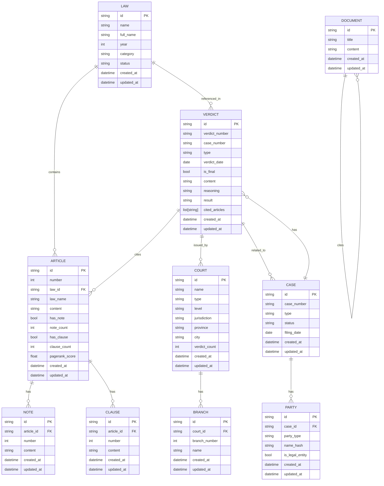

# Graph Data Models

<cite>
**Referenced Files in This Document**   
- [models.py](file://mahoun/graph/neo4j/models.py)
- [schema.py](file://mahoun/graph/neo4j/schema.py)
- [init_schema.py](file://mahoun/graph/neo4j/init_schema.py)
- [operations.py](file://mahoun/graph/neo4j/operations.py)
- [graph_query_service.py](file://mahoun/graph/graph_query_service.py)
- [document_citation_graph.py](file://mahoun/graph/document_citation_graph.py)
- [ultra_graph_builder.py](file://mahoun/graph/ultra_graph_builder.py)
- [connection.py](file://mahoun/graph/neo4j/connection.py)
- [algorithms.py](file://mahoun/graph/neo4j/algorithms.py)
- [query_builder.py](file://mahoun/graph/neo4j/query_builder.py)
</cite>

## Table of Contents
1. [Introduction](#introduction)
2. [Node Types and Models](#node-types-and-models)
3. [Relationship Types](#relationship-types)
4. [Schema Constraints and Indexes](#schema-constraints-and-indexes)
5. [Python Model to Neo4j Mapping](#python-model-to-neo4j-mapping)
6. [Graph Schema Diagrams](#graph-schema-diagrams)
7. [Data Access Patterns](#data-access-patterns)
8. [Data Consistency and Referential Integrity](#data-consistency-and-referential-integrity)
9. [Schema Evolution and Migration](#schema-evolution-and-migration)
10. [Performance Optimization](#performance-optimization)
11. [Conclusion](#conclusion)

## Introduction

This document provides comprehensive documentation for the Neo4j-based knowledge graph implementation in the legal AI system. The knowledge graph serves as the central repository for legal entities, relationships, and reasoning, enabling sophisticated legal analysis, precedent retrieval, and contractual obligation tracking. The implementation leverages Neo4j's native graph database capabilities to model complex legal hierarchies and relationships, including laws, articles, courts, verdicts, and parties. This documentation details the data model, schema design, access patterns, and performance considerations to ensure optimal usage and maintenance of the graph database.

**Section sources**
- [models.py](file://mahoun/graph/neo4j/models.py#L1-L268)
- [schema.py](file://mahoun/graph/neo4j/schema.py#L1-L441)

## Node Types and Models

The knowledge graph defines a comprehensive set of node types to represent various legal entities. Each node type is implemented as a Pydantic model in the `models.py` file, ensuring data validation and type safety. The primary node types include:

- **LawNode**: Represents a legal code or statute, with properties such as name, year, category, and status. The `id` property serves as a unique identifier, and the `embedding` property stores a 1024-dimensional text embedding for semantic search.
- **ArticleNode**: Represents an article within a law, with properties including number, content, and references to the parent law. The `pagerank_score` property indicates the article's importance within the legal corpus.
- **NoteNode**: Represents a note (تبصره) associated with an article, providing additional commentary or clarification.
- **ClauseNode**: Represents a clause (بند) within an article, allowing for hierarchical structuring of legal text.
- **CourtNode**: Represents a judicial court, with properties such as name, type, level, jurisdiction, and location. The `verdict_count` property tracks the number of verdicts associated with the court.
- **BranchNode**: Represents a branch (شعبه) of a court, with a reference to the parent court.
- **VerdictNode**: Represents a judicial verdict, with properties including verdict number, case number, date, type, result, and content. The `cited_articles` property stores a list of article IDs referenced in the verdict.
- **CaseNode**: Represents a legal case, with properties such as case number, type, status, and filing date.
- **PersonNode**: Represents a person involved in legal proceedings, with a hashed name for privacy.
- **PartyNode**: Represents a party (طرف دعوا) in a legal case, with a reference to the case and the party's role.

These node models are designed to capture the essential attributes of legal entities while supporting advanced features such as text embeddings for semantic similarity and PageRank scores for importance ranking.

**Section sources**
- [models.py](file://mahoun/graph/neo4j/models.py#L1-L268)

## Relationship Types

The knowledge graph defines a rich set of relationship types to capture the complex interconnections between legal entities. These relationships are implemented in the `operations.py` file and are used to create and manage connections between nodes. The primary relationship types include:

- **CITES**: Represents a citation from one document or verdict to another, forming the basis of the document citation graph.
- **REFERS_TO**: Represents a reference from a verdict to a specific law article, enabling precedent tracking and legal reasoning.
- **HAS_PARTY**: Represents the relationship between a case and its parties, with a role property indicating the party's role (e.g., plaintiff, defendant).
- **HAS_TAG**: Represents the relationship between a verdict and its tags, allowing for categorization and filtering.
- **BELONGS_TO**: Represents the hierarchical relationship between articles, notes, and clauses, and their parent entities (e.g., an article belongs to a law).
- **LOCATED_AT**: Represents the relationship between a court branch and its location.
- **ISSUED_BY**: Represents the relationship between a verdict and the court that issued it.
- **RELATED_TO**: A generic relationship for connecting entities that have a non-specific association.

These relationships enable complex graph traversals and queries, such as finding all verdicts that cite a specific law article or identifying all parties involved in a particular case. The relationships also support properties such as confidence scores and evidence, allowing for nuanced reasoning and analysis.

**Section sources**
- [operations.py](file://mahoun/graph/neo4j/operations.py#L1-L800)

## Schema Constraints and Indexes

The knowledge graph schema is managed through a comprehensive set of constraints and indexes to ensure data integrity and optimize query performance. The schema is defined in the `schema.py` file and initialized using the `init_schema.py` script. The constraints and indexes are designed to support the specific access patterns and requirements of the legal AI system.

### Constraints

The schema includes unique constraints on the `id` property for all node types to ensure entity integrity. These constraints are defined in the `create_constraints` method of the `SchemaManager` class and include:

- `unique_law_id`: Ensures each law has a unique identifier.
- `unique_article_id`: Ensures each article has a unique identifier.
- `unique_note_id`: Ensures each note has a unique identifier.
- `unique_clause_id`: Ensures each clause has a unique identifier.
- `unique_court_id`: Ensures each court has a unique identifier.
- `unique_branch_id`: Ensures each branch has a unique identifier.
- `unique_verdict_id`: Ensures each verdict has a unique identifier.
- `unique_case_id`: Ensures each case has a unique identifier.
- `unique_person_id`: Ensures each person has a unique identifier.
- `unique_party_id`: Ensures each party has a unique identifier.

These constraints prevent the creation of duplicate nodes and maintain referential integrity across the graph.

### Indexes

The schema includes a variety of indexes to optimize query performance for frequently accessed properties. The indexes are defined in the `create_indexes` and `create_fulltext_indexes` methods of the `SchemaManager` class and include:

- **B-tree indexes**: Created on frequently queried properties such as `name`, `year`, `number`, and `case_number` for efficient exact match and range queries.
- **Full-text indexes**: Created on text properties such as `name`, `full_name`, `content`, and `reasoning` to support keyword search and fuzzy matching.
- **Vector indexes**: Created on the `embedding` property to support similarity search using cosine distance.

The indexes are designed to support the primary access patterns of the system, such as searching for laws by name, finding articles by number, and retrieving verdicts by case number. The full-text indexes enable powerful text search capabilities, while the vector indexes support advanced semantic search and recommendation features.

**Section sources**
- [schema.py](file://mahoun/graph/neo4j/schema.py#L1-L441)
- [init_schema.py](file://mahoun/graph/neo4j/init_schema.py#L1-L111)

## Python Model to Neo4j Mapping

The Python models defined in `models.py` are mapped to Neo4j database entities through a combination of direct property mapping and custom logic. The mapping is facilitated by the `GraphOperations` class in `operations.py`, which provides methods for creating, updating, and querying nodes and relationships.

### Node Mapping

Each Pydantic model in `models.py` corresponds to a node label in Neo4j. For example, the `LawNode` model maps to the `Law` node label, and the `ArticleNode` model maps to the `Article` node label. The properties of the Pydantic models are directly mapped to node properties in Neo4j. For example, the `name` property of the `LawNode` model is stored as the `name` property of the `Law` node.

The mapping also includes custom logic for handling specific requirements. For example, the `embedding` property is validated to ensure it has exactly 1024 dimensions, and the `created_at` and `updated_at` properties are automatically populated with the current timestamp.

### Relationship Mapping

Relationships between nodes are created using the `create_relationship` method of the `GraphOperations` class. The method takes the source and target node labels and IDs, the relationship type, and any additional properties. The relationship is created using a Cypher query that matches the source and target nodes and creates the relationship between them.

The mapping also includes support for batch operations, allowing for the efficient creation of multiple nodes and relationships in a single transaction. This is particularly useful for importing large datasets, such as the full text of a law with all its articles and clauses.

### Data Validation

The Pydantic models provide built-in data validation, ensuring that all node properties meet the specified requirements. For example, the `validate_article_number` method ensures that article numbers are positive, and the `validate_embedding_dimension` method ensures that embeddings have the correct dimensionality. This validation is performed before the data is written to the database, preventing the creation of invalid nodes.

**Section sources**
- [models.py](file://mahoun/graph/neo4j/models.py#L1-L268)
- [operations.py](file://mahoun/graph/neo4j/operations.py#L1-L800)

## Graph Schema Diagrams

The following Mermaid diagrams illustrate the key entity relationships in the knowledge graph, including document citations, legal precedents, and contractual obligations.



**Diagram sources **
- [models.py](file://mahoun/graph/neo4j/models.py#L1-L268)
- [operations.py](file://mahoun/graph/neo4j/operations.py#L1-L800)

## Data Access Patterns

The knowledge graph provides a rich set of data access patterns through the `graph_query_service.py` module, which offers a high-level API for querying and traversing the graph. The service supports both synchronous and asynchronous operations, making it suitable for use in web applications and batch processing tasks.

### Cypher Query Builder

The `CypherQueryBuilder` class in `query_builder.py` provides a fluent API for constructing Cypher queries. This allows for the creation of complex queries through method chaining, improving code readability and maintainability. For example, a query to find all articles in a specific law can be constructed as follows:

```python
query = (CypherQueryBuilder()
    .match("Article", {"law_id": "law_123"}, alias="a")
    .return_("a")
    .order_by("a.number")
    .build())
```

### Graph Query Service

The `GraphQueryService` class in `graph_query_service.py` provides a comprehensive interface for executing queries, with features such as connection pooling, query caching, and performance monitoring. The service supports both read and write operations, with retry logic for handling transient failures. The service also includes advanced features such as multi-hop traversal and personalized PageRank, enabling sophisticated graph analytics.

### Example Queries

The following examples demonstrate common data access patterns:

- **Find all articles in a law**: Match articles with a specific `law_id` and return their properties.
- **Find all verdicts citing a specific article**: Match verdicts that have the article ID in their `cited_articles` list.
- **Find the shortest path between two documents**: Use the `find_shortest_path` method to find the shortest path of citations between two documents.
- **Compute PageRank scores**: Use the `compute_pagerank` method to compute PageRank scores for all documents, identifying the most influential documents in the corpus.

These access patterns enable a wide range of legal analysis tasks, from simple lookups to complex reasoning and recommendation.

**Section sources**
- [graph_query_service.py](file://mahoun/graph/graph_query_service.py#L1-L800)
- [query_builder.py](file://mahoun/graph/neo4j/query_builder.py#L1-L251)

## Data Consistency and Referential Integrity

The knowledge graph ensures data consistency and referential integrity through a combination of database constraints, application-level validation, and transactional operations. These mechanisms work together to prevent the creation of invalid or inconsistent data.

### Database Constraints

The schema includes unique constraints on the `id` property for all node types, ensuring that each entity has a unique identifier. These constraints prevent the creation of duplicate nodes and maintain referential integrity across the graph. The constraints are enforced by the Neo4j database, providing a strong guarantee of data integrity.

### Application-Level Validation

The Pydantic models in `models.py` provide application-level validation, ensuring that all node properties meet the specified requirements. For example, the `validate_article_number` method ensures that article numbers are positive, and the `validate_embedding_dimension` method ensures that embeddings have the correct dimensionality. This validation is performed before the data is written to the database, preventing the creation of invalid nodes.

### Transactional Operations

The `GraphOperations` class in `operations.py` supports transactional operations, allowing for the atomic creation or update of multiple nodes and relationships. This ensures that related changes are applied together, maintaining the consistency of the graph. For example, when importing a new law with its articles and clauses, all nodes and relationships are created in a single transaction, preventing partial updates in case of failure.

### Data Quality Assessment

The `UltraGraphBuilder` class in `ultra_graph_builder.py` includes a `GraphQualityAssessor` component that evaluates the quality of the graph based on various metrics, such as node completeness, edge evidence, and confidence thresholds. This allows for the identification and correction of low-quality data, ensuring the overall integrity of the knowledge graph.

**Section sources**
- [schema.py](file://mahoun/graph/neo4j/schema.py#L1-L441)
- [models.py](file://mahoun/graph/neo4j/models.py#L1-L268)
- [operations.py](file://mahoun/graph/neo4j/operations.py#L1-L800)
- [ultra_graph_builder.py](file://mahoun/graph/ultra_graph_builder.py#L1-L800)

## Schema Evolution and Migration

The knowledge graph supports schema evolution and migration through a combination of versioned schema definitions, backward compatibility, and automated migration scripts. This allows for the safe and controlled evolution of the data model as the system's requirements change.

### Versioned Schema Definitions

The schema is defined in the `schema.py` file, which includes a `SchemaManager` class for managing constraints and indexes. The schema definitions are versioned, allowing for the tracking of changes over time. This enables the identification of the schema version used for a particular dataset and the application of appropriate migration scripts.

### Backward Compatibility

The system maintains backward compatibility by ensuring that new schema versions are compatible with existing data. For example, when adding a new property to a node type, the property is made optional, allowing existing nodes to be read without modification. This approach minimizes the impact of schema changes on existing data and applications.

### Automated Migration Scripts

The `init_schema.py` script provides a mechanism for initializing and updating the schema. The script can be run to create the initial schema or to apply incremental updates. The script includes validation logic to ensure that the schema is correctly applied and that all required constraints and indexes are present. This allows for the automated migration of the schema in production environments.

### Migration Strategy

The migration strategy involves the following steps:

1. **Plan the migration**: Identify the changes required and assess the impact on existing data and applications.
2. **Test the migration**: Apply the migration to a test environment and verify that the data is correctly migrated and that the system functions as expected.
3. **Deploy the migration**: Apply the migration to the production environment during a maintenance window, using the `init_schema.py` script.
4. **Validate the migration**: Verify that the migration was successful and that the system is functioning correctly.

This strategy ensures that schema changes are applied safely and with minimal disruption to the system.

**Section sources**
- [schema.py](file://mahoun/graph/neo4j/schema.py#L1-L441)
- [init_schema.py](file://mahoun/graph/neo4j/init_schema.py#L1-L111)

## Performance Optimization

The knowledge graph is optimized for performance through a combination of indexing, caching, batch operations, and query optimization. These techniques ensure that the system can handle large-scale graph traversals and complex queries efficiently.

### Indexing

The schema includes a variety of indexes to optimize query performance. B-tree indexes are used for exact match and range queries on properties such as `name`, `year`, and `number`. Full-text indexes are used for keyword search and fuzzy matching on text properties such as `content` and `reasoning`. Vector indexes are used for similarity search on the `embedding` property, enabling fast retrieval of semantically similar documents.

### Caching

The `GraphQueryService` includes a query cache that stores the results of frequently executed queries. The cache is implemented as a thread-safe LRU cache with TTL eviction, ensuring that stale results are not returned. This reduces the load on the database and improves response times for common queries.

### Batch Operations

The `GraphOperations` class supports batch operations for creating nodes and relationships, allowing for the efficient import of large datasets. Batch operations are performed in a single transaction, reducing the overhead of multiple database calls. This is particularly useful for importing large laws with thousands of articles and clauses.

### Query Optimization

The `CypherQueryBuilder` provides a fluent API for constructing optimized Cypher queries. The builder includes methods for adding `LIMIT`, `SKIP`, and `ORDER BY` clauses, allowing for the efficient retrieval of paginated results. The builder also supports the use of parameters, preventing SQL injection and improving query plan reuse.

### Graph Algorithms

The `GraphAlgorithms` class in `algorithms.py` provides implementations of advanced graph algorithms, such as PageRank, community detection, and shortest path. These algorithms are optimized for performance and can be used to compute insights and recommendations from the graph. The algorithms leverage Neo4j's Graph Data Science library when available, providing high-performance implementations.

These optimization techniques ensure that the knowledge graph can handle large-scale data and complex queries efficiently, providing a responsive and scalable system for legal analysis.

**Section sources**
- [schema.py](file://mahoun/graph/neo4j/schema.py#L1-L441)
- [graph_query_service.py](file://mahoun/graph/graph_query_service.py#L1-L800)
- [query_builder.py](file://mahoun/graph/neo4j/query_builder.py#L1-L251)
- [operations.py](file://mahoun/graph/neo4j/operations.py#L1-L800)
- [algorithms.py](file://mahoun/graph/neo4j/algorithms.py#L1-L276)

## Conclusion

The Neo4j-based knowledge graph implementation provides a robust and scalable foundation for legal AI applications. The comprehensive data model, with its rich set of node and relationship types, enables the representation of complex legal hierarchies and relationships. The schema constraints and indexes ensure data integrity and optimize query performance, while the Python model to Neo4j mapping provides a seamless interface for application development. The graph schema diagrams illustrate the key entity relationships, and the data access patterns support a wide range of legal analysis tasks. The system ensures data consistency and referential integrity through database constraints, application-level validation, and transactional operations. Schema evolution and migration are supported through versioned schema definitions, backward compatibility, and automated migration scripts. Finally, performance optimization techniques, including indexing, caching, batch operations, and query optimization, ensure that the system can handle large-scale graph traversals and complex queries efficiently. This documentation provides a comprehensive guide to the knowledge graph implementation, enabling effective use and maintenance of the system.