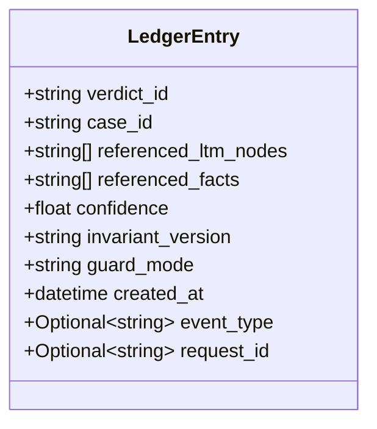
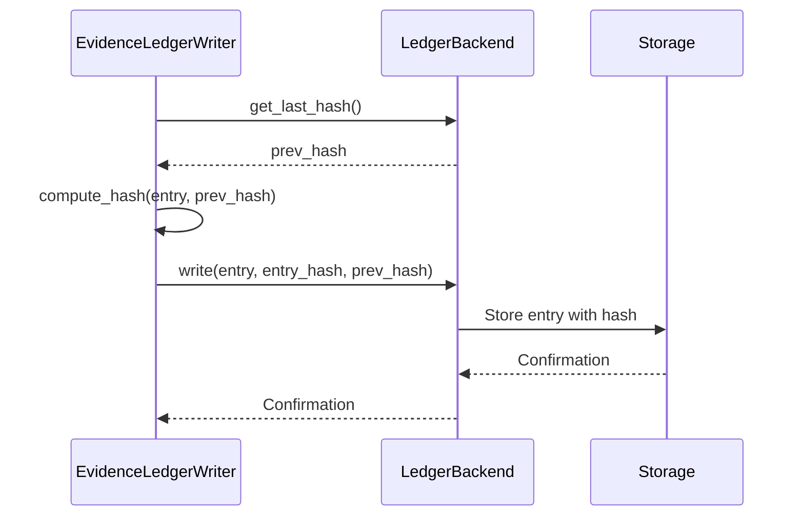
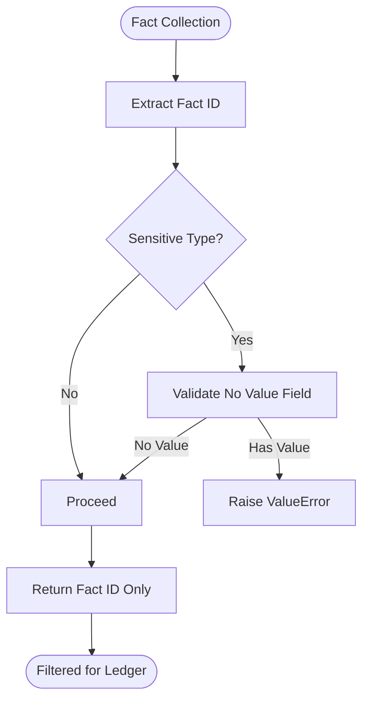

# Ledger Data Models

<cite>
**Referenced Files in This Document**   
- [models.py](file://mahoun/ledger/models.py)
- [storage.py](file://mahoun/ledger/storage.py)
- [writer.py](file://mahoun/ledger/writer.py)
- [privacy.py](file://mahoun/ledger/privacy.py)
- [guards.py](file://mahoun/ledger/guards.py)
- [ledger_invariants.py](file://mahoun/invariants/ledger_invariants.py)
- [evidence_linked_verdict.py](file://mahoun/reasoning/evidence_linked_verdict.py)
- [FAILURE_MODES.md](file://mahoun/ledger/FAILURE_MODES.md)
</cite>

## Table of Contents
1. [Introduction](#introduction)
2. [Core Data Model](#core-data-model)
3. [Hash Chain Integrity](#hash-chain-integrity)
4. [Privacy-Preserving Mechanisms](#privacy-preserving-mechanisms)
5. [Data Lifecycle Management](#data-lifecycle-management)
6. [Performance Considerations](#performance-considerations)
7. [Auditing and Verification](#auditing-and-verification)
8. [Failure Modes and Recovery](#failure-modes-and-recovery)

## Introduction

The immutable ledger system serves as the foundation for auditability and accountability in the MAHOUN platform. It records evidence references for every legal verdict, creating a tamper-evident trail that ensures decisions can be verified and invalidated when necessary. The ledger is designed around strict invariants that guarantee data integrity, privacy, and immutability.

This documentation details the data models, storage mechanisms, and enforcement rules that make the ledger system trustworthy for legal decision-making. The system is built on cryptographic hash chains, privacy-preserving filters, and invariant-based validation to prevent both accidental and malicious corruption of the audit trail.

**Section sources**
- [models.py](file://mahoun/ledger/models.py#L1-L21)
- [ledger_invariants.py](file://mahoun/invariants/ledger_invariants.py#L1-L103)

## Core Data Model

The ledger's core data model centers around the `LedgerEntry` dataclass, which captures essential metadata about each legal verdict and its evidentiary basis. The model is designed to be minimal yet sufficient for auditability, storing only references to evidence rather than the evidence itself.



**Diagram sources**
- [models.py](file://mahoun/ledger/models.py#L6-L21)

### Field Definitions

**verdict_id**: A unique identifier for the legal verdict, typically a UUID. This serves as the primary key for the verdict in the system.

**case_id**: A deterministic identifier for the case, generated as an MD5 hash of the question or case details. This enables consistent identification of related verdicts.

**referenced_ltm_nodes**: List of identifiers for Long-Term Memory nodes that supported the verdict, including rules, statutes, and precedents. These references enable validation of the legal reasoning.

**referenced_facts**: List of identifiers for factual assertions that contributed to the verdict. Only opaque identifiers are stored, not the actual fact values, to preserve privacy.

**confidence**: A floating-point value between 0.0 and 1.0 representing the system's confidence in the verdict. This is derived from the confidence scores of supporting evidence.

**invariant_version**: The version of the ledger invariants that were enforced when creating this entry. This enables backward compatibility when invariants evolve.

**guard_mode**: The operational mode of the guardrails system at the time of verdict generation, which can be "OFF", "WARN", "STRICT", or "AUDIT".

**created_at**: Timestamp indicating when the verdict was generated, stored in UTC.

**event_type**: Optional field specifying the type of event that triggered the ledger entry, defaulting to "verdict".

**request_id**: Optional identifier for the API request that initiated the verdict generation process.

The `LedgerEntry` is implemented as a frozen dataclass, enforcing immutability once created. This design ensures that entries cannot be modified after writing, satisfying the EL-I4 (Immutability) invariant.

**Section sources**
- [models.py](file://mahoun/ledger/models.py#L6-L21)
- [writer.py](file://mahoun/ledger/writer.py#L21-L22)
- [guards.py](file://mahoun/ledger/guards.py#L8-L14)

## Hash Chain Integrity

The ledger ensures data integrity through a cryptographic hash chain mechanism. Each entry's hash is computed from both its own content and the hash of the previous entry, creating a dependency chain that makes tampering detectable.



**Diagram sources**
- [writer.py](file://mahoun/ledger/writer.py#L330-L350)
- [storage.py](file://mahoun/ledger/storage.py#L62-L71)

### Hash Computation

The hash computation follows a canonicalization process to ensure consistency:

1. The ledger entry is converted to a dictionary representation
2. The dictionary is serialized to JSON with sorted keys and consistent formatting
3. The hash is computed as SHA-256(prev_hash + ":" + canonical_json)

This approach ensures that identical entries written at different times will have different hashes due to their different predecessor hashes, preventing hash collisions in the chain.

The system provides multiple backend implementations that all maintain this hash chain integrity:

- **JSONLLedgerBackend**: Stores entries in JSONL format, with one entry per line
- **SQLiteLedgerBackend**: Uses a SQLite database with ACID properties for reliable storage
- **NoOpLedgerBackend**: A testing-only backend that does not persist data

All backends implement the same `LedgerBackend` interface, ensuring consistent behavior across storage implementations.

**Section sources**
- [writer.py](file://mahoun/ledger/writer.py#L330-L350)
- [storage.py](file://mahoun/ledger/storage.py#L13-L18)
- [test_ledger_hash_chain.py](file://tests/test_ledger_hash_chain.py#L7-L21)

## Privacy-Preserving Mechanisms

The ledger system implements strict privacy controls to prevent sensitive data from being stored in the audit trail. This is achieved through a combination of data filtering and invariant enforcement.



**Diagram sources**
- [privacy.py](file://mahoun/ledger/privacy.py#L21-L61)

### Sensitive Data Filtering

The `filter_facts_for_ledger` function in `privacy.py` enforces the EL-I7 (Privacy Preservation) invariant by ensuring that only fact identifiers are stored, never the actual values. The function:

1. Extracts the fact ID from input (supporting both object and dictionary formats)
2. Validates that the fact has an ID field
3. Checks if the fact type is in the sensitive categories
4. For sensitive facts, verifies that no value field is present
5. Returns only the list of fact IDs

The sensitive fact types that trigger additional validation are:
- PERSONAL_ID
- MEDICAL
- BIOMETRIC
- ADDRESS

This filtering occurs at the boundary between the reasoning system and the ledger, ensuring that sensitive values never enter the audit trail.

### Invariant Enforcement

Privacy is further protected by the EL-I7 invariant, which is enforced at multiple points in the system:

1. At the ledger entry creation point in `evidence_linked_verdict.py`
2. During the fact filtering process in `privacy.py`
3. Through automated testing that verifies no sensitive data leaks

The consequence of violating this invariant would be irreversible personal data leakage and significant legal liability, making it one of the most critical protections in the system.

**Section sources**
- [privacy.py](file://mahoun/ledger/privacy.py#L1-L61)
- [ledger_invariants.py](file://mahoun/invariants/ledger_invariants.py#L83-L89)
- [evidence_linked_verdict.py](file://mahoun/reasoning/evidence_linked_verdict.py#L258-L292)

## Data Lifecycle Management

The ledger system implements comprehensive data lifecycle management through retention policies, archival rules, and access controls. These mechanisms ensure that audit trails are preserved for appropriate durations while maintaining system performance.

### Retention Policies

The system follows a tiered retention approach:

- **Active ledger**: Entries from the current day are stored in daily JSONL files named by date (e.g., "2025-01-15.jsonl")
- **Historical archive**: Older entries are retained indefinitely in the primary storage backend
- **Backup copies**: Periodic backups are maintained according to organizational policy

The `FileLedgerWriter` class manages this lifecycle by organizing entries into daily files while maintaining the hash chain across file boundaries.

### Access Controls

Access to ledger data is controlled through multiple mechanisms:

1. **Guard modes**: The system operates in different modes (OFF, WARN, STRICT, AUDIT) that control how strictly invariants are enforced
2. **Environment restrictions**: The NoOpLedgerBackend is prohibited in staging and production environments
3. **Write validation**: All entries are validated before writing to ensure they meet integrity requirements

The `NoOpLedgerWriter` includes explicit checks that prevent its use in production environments, ensuring that audit trails are always maintained in operational systems.

### Archival Rules

When entries are archived, the following rules apply:

- Hash chain integrity must be preserved across archive boundaries
- Entries cannot be modified or deleted once written
- Metadata about the archival process is recorded in the ledger itself
- Access patterns to archived data are logged for security auditing

These rules ensure that the audit trail remains complete and trustworthy throughout the data lifecycle.

**Section sources**
- [storage.py](file://mahoun/ledger/storage.py#L20-L84)
- [writer.py](file://mahoun/ledger/writer.py#L272-L301)
- [guards.py](file://mahoun/ledger/guards.py#L8-L14)

## Performance Considerations

The ledger system is designed to handle high-volume writes while supporting efficient historical data queries. Performance optimizations are implemented at multiple levels of the architecture.

### High-Volume Write Optimization

The system employs several strategies to optimize write performance:

- **Batched I/O operations**: Writes are flushed to disk with appropriate frequency based on configuration
- **File-based partitioning**: Entries are organized by date to distribute I/O load
- **Minimal serialization**: The canonicalization process is optimized for speed
- **Configurable fsync**: The `fsync` parameter allows tuning of durability vs. performance

The `FileLedgerWriter` class accepts an `fsync` parameter that controls whether file operations are synchronized to disk, allowing administrators to balance data safety with write throughput.

### Query Performance

For historical data queries, the system provides:

- **SQLite backend**: Offers indexed access to ledger entries with support for complex queries
- **JSONL backend**: Provides sequential access optimized for integrity verification
- **Memory backend**: Enables fast testing and development workflows

The `SQLiteLedgerBackend` creates indexes on `verdict_id` and `case_id` fields to accelerate lookups, while the `JSONLLedgerBackend` is optimized for integrity verification across the entire chain.

### Scalability Characteristics

The system's performance scales as follows:

- **Write throughput**: Limited primarily by disk I/O and fsync operations
- **Read performance**: O(n) for full chain verification, O(log n) for indexed lookups in SQLite
- **Storage growth**: Linear with the number of verdicts generated
- **Memory usage**: Constant for streaming operations, proportional to query results

These characteristics make the system suitable for high-throughput legal processing while maintaining the integrity guarantees required for accountability.

**Section sources**
- [storage.py](file://mahoun/ledger/storage.py#L20-L84)
- [writer.py](file://mahoun/ledger/writer.py#L138-L270)
- [test_ledger_properties.py](file://tests/test_ledger_properties.py#L119-L163)

## Auditing and Verification

The ledger system provides comprehensive auditing capabilities that allow verification of both individual entries and the entire chain's integrity.

### Chain Integrity Verification

The `verify_chain` method in all backend implementations validates the entire hash chain:

1. Retrieve all entries in chronological order
2. Start with "genesis" as the initial previous hash
3. For each entry, compute the expected hash from its content and previous hash
4. Compare the computed hash with the stored hash
5. Return false if any entry fails verification

This process detects any tampering with the ledger contents, whether through direct modification of storage files or database records.

### Entry Validation

Individual entries can be verified through several mechanisms:

- **Hash validation**: Recompute the entry's hash and compare with stored value
- **Invariant checking**: Verify that all invariants (EL-I1 through EL-I7) are satisfied
- **Cross-system validation**: Compare ledger entries with other system logs

The `EvidenceLedgerWriter.verify_integrity()` method provides a simple interface for chain verification, returning a boolean indicating whether the entire chain is valid.

### Audit Tools

The system supports several audit scenarios:

- **Real-time monitoring**: The integrity can be verified after each write operation
- **Periodic audits**: Scheduled jobs can verify the chain at regular intervals
- **Event-driven verification**: Verification can be triggered by security events or access attempts
- **Forensic analysis**: The complete history can be examined after suspected tampering

These capabilities ensure that the ledger remains trustworthy throughout its lifecycle and that any integrity violations are detected promptly.

**Section sources**
- [writer.py](file://mahoun/ledger/writer.py#L102-L116)
- [writer.py](file://mahoun/ledger/writer.py#L254-L269)
- [test_ledger_properties.py](file://tests/test_ledger_properties.py#L165-L195)

## Failure Modes and Recovery

The ledger system defines specific failure modes and recovery procedures for invariant violations. These are documented to ensure appropriate responses to integrity breaches.

```mermaid
stateDiagram-v2
[*] --> Operational
Operational --> EL-I1_VIOLATION : Empty references
Operational --> EL-I3_VIOLATION : Write failure ignored
Operational --> EL-I4_VIOLATION : Entry modification
Operational --> COMPLETE_REMOVAL : Ledger disabled
EL-I1_VIOLATION --> Recovery : Delete affected verdicts
EL-I3_VIOLATION --> Recovery : Shutdown and invalidate
EL-I4_VIOLATION --> Recovery : Audit and reimplement
COMPLETE_REMOVAL --> Recovery : Restore and invalidate
Recovery --> Operational : After remediation
```

**Diagram sources**
- [FAILURE_MODES.md](file://mahoun/ledger/FAILURE_MODES.md#L1-L87)

### Key Failure Modes

**EL-I1 Violation (Verdicts Without Evidence References)**: Occurs when entries are created with empty reference lists. Recovery requires deleting affected verdicts and re-running cases with proper evidence collection.

**EL-I3 Violation (Ledger Write Does Not Block Verdict)**: Happens when verdicts are published despite ledger write failures. Recovery requires immediate system shutdown and invalidation of all recent verdicts.

**EL-I4 Violation (Mutable Ledger Entries)**: When entries can be modified after writing. Recovery involves auditing all entries and reimplementing with immutable storage.

**Complete Ledger Removal**: If the ledger is disabled entirely, all verdicts since removal are invalid and the system cannot be used for accountable decision-making.

The system is designed so that violating these invariants turns MAHOUN into an unaccountable system that cannot be trusted for legal purposes. The documentation serves as a warning to future engineers that these protections are essential, not optional complexity.

**Section sources**
- [FAILURE_MODES.md](file://mahoun/ledger/FAILURE_MODES.md#L1-L87)
- [ledger_invariants.py](file://mahoun/invariants/ledger_invariants.py#L34-L90)
- [evidence_linked_verdict.py](file://mahoun/reasoning/evidence_linked_verdict.py#L242-L293)