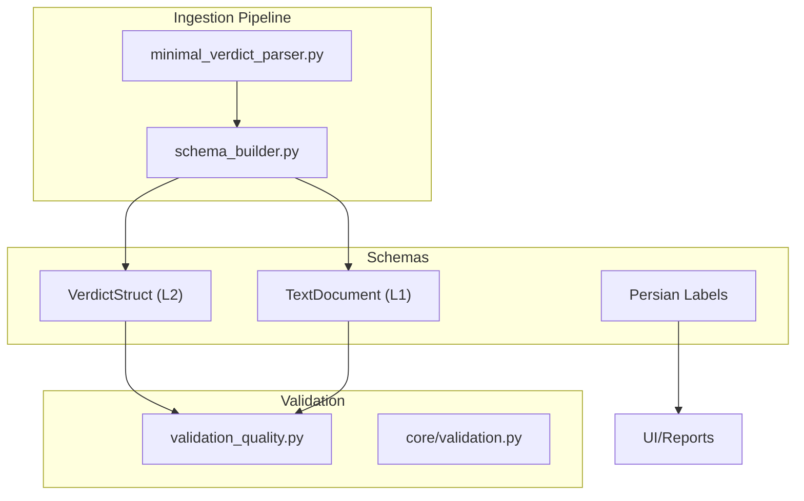
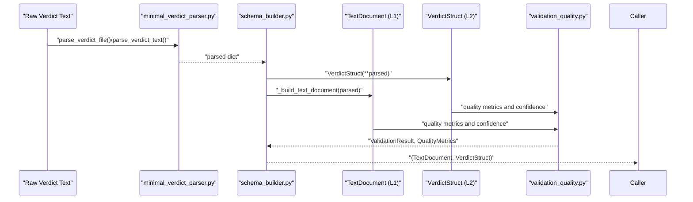
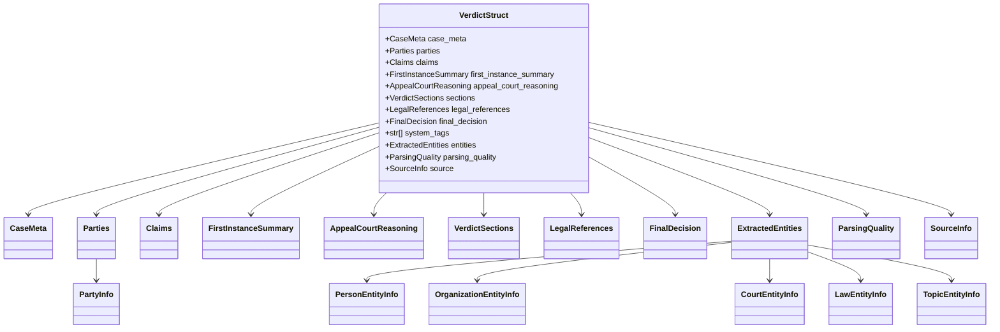
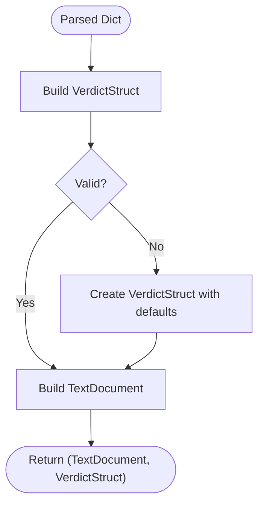
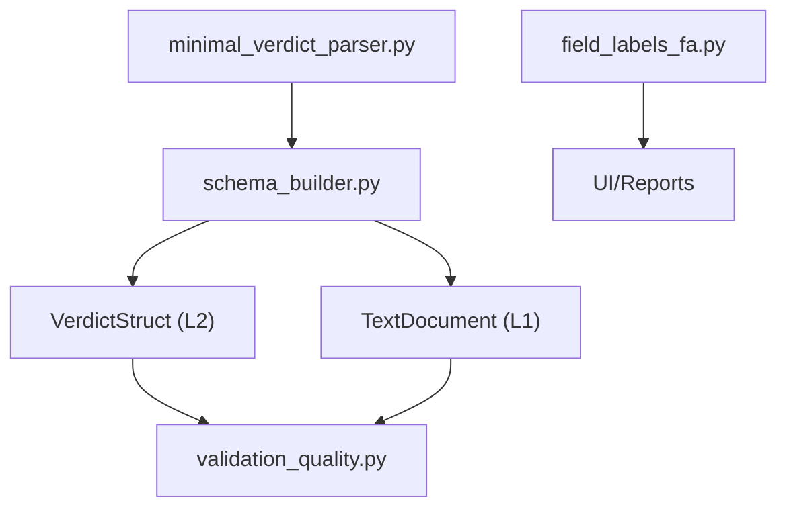

# Schema Definitions

<cite>
**Referenced Files in This Document**
- [legal_struct_schema.py](file://mahoun/schemas/legal_struct_schema.py)
- [text_schema.py](file://mahoun/schemas/text_schema.py)
- [field_labels_fa.py](file://mahoun/schemas/field_labels_fa.py)
- [schema_builder.py](file://mahoun/pipelines/ingestion/schema_builder.py)
- [minimal_verdict_parser.py](file://mahoun/pipelines/ingestion/minimal_verdict_parser.py)
- [validation_quality.py](file://mahoun/pipelines/ingestion/validation_quality.py)
- [validation.py](file://mahoun/core/validation.py)
</cite>

## Table of Contents
1. [Introduction](#introduction)
2. [Project Structure](#project-structure)
3. [Core Components](#core-components)
4. [Architecture Overview](#architecture-overview)
5. [Detailed Component Analysis](#detailed-component-analysis)
6. [Dependency Analysis](#dependency-analysis)
7. [Performance Considerations](#performance-considerations)
8. [Troubleshooting Guide](#troubleshooting-guide)
9. [Conclusion](#conclusion)
10. [Appendices](#appendices)

## Introduction
This document explains the structured schema definitions used in legal document processing. It focuses on:
- Legal structure schema (L2) for representing contractual elements and verdict information
- Text schema (L1) for organizing document text for indexing and retrieval
- Persian internationalization labels for field paths
- How these schemas enable consistent data representation across ingestion, analysis, and retrieval
- Examples of schema usage in document parsing and entity extraction
- Extensibility mechanisms and validation/error handling strategies

## Project Structure
The schemas reside under the schemas package and are consumed by ingestion pipelines and downstream systems:
- L1 schema: TextDocument for text-level representation
- L2 schema: VerdictStruct for structured legal information
- Internationalization: Persian labels for UI/reporting
- Ingestion bridge: SchemaBuilder converts raw parser output into canonical schemas
- Validation: Quality checks and confidence scoring for ingestion

**Diagram sources**
- [text_schema.py](file://mahoun/schemas/text_schema.py#L1-L69)
- [legal_struct_schema.py](file://mahoun/schemas/legal_struct_schema.py#L1-L310)
- [field_labels_fa.py](file://mahoun/schemas/field_labels_fa.py#L1-L224)
- [schema_builder.py](file://mahoun/pipelines/ingestion/schema_builder.py#L1-L249)
- [minimal_verdict_parser.py](file://mahoun/pipelines/ingestion/minimal_verdict_parser.py#L1-L200)
- [validation_quality.py](file://mahoun/pipelines/ingestion/validation_quality.py#L1-L449)
- [validation.py](file://mahoun/core/validation.py#L1-L451)

**Section sources**
- [text_schema.py](file://mahoun/schemas/text_schema.py#L1-L69)
- [legal_struct_schema.py](file://mahoun/schemas/legal_struct_schema.py#L1-L310)
- [field_labels_fa.py](file://mahoun/schemas/field_labels_fa.py#L1-L224)
- [schema_builder.py](file://mahoun/pipelines/ingestion/schema_builder.py#L1-L249)
- [minimal_verdict_parser.py](file://mahoun/pipelines/ingestion/minimal_verdict_parser.py#L1-L200)
- [validation_quality.py](file://mahoun/pipelines/ingestion/validation_quality.py#L1-L449)
- [validation.py](file://mahoun/core/validation.py#L1-L451)

## Core Components
- L1 TextDocument: Minimal text-level representation with identifiers, types, and timestamps for indexing and retrieval.
- L2 VerdictStruct: Canonical structured representation of legal verdicts, including metadata, parties, claims, court decisions, legal references, entities, and quality/source metadata.
- Persian field labels: Programmatic mapping of schema field paths to Persian labels for UI/reporting.

Key responsibilities:
- L1: Provides normalized text and metadata for vector indexing and full-text search.
- L2: Encapsulates all extracted legal information with strong typing and optional fields for robustness.
- Labels: Enables localized display and reporting across the platform.

**Section sources**
- [text_schema.py](file://mahoun/schemas/text_schema.py#L1-L69)
- [legal_struct_schema.py](file://mahoun/schemas/legal_struct_schema.py#L1-L310)
- [field_labels_fa.py](file://mahoun/schemas/field_labels_fa.py#L1-L224)

## Architecture Overview
The ingestion pipeline transforms raw verdict text into canonical schemas and performs quality checks. The L1 schema powers retrieval and RAG; the L2 schema enables reasoning and graph construction.

**Diagram sources**
- [minimal_verdict_parser.py](file://mahoun/pipelines/ingestion/minimal_verdict_parser.py#L1124-L1186)
- [schema_builder.py](file://mahoun/pipelines/ingestion/schema_builder.py#L49-L137)
- [validation_quality.py](file://mahoun/pipelines/ingestion/validation_quality.py#L66-L116)

## Detailed Component Analysis

### L2 Legal Structure Schema (VerdictStruct)
Purpose:
- Canonical representation of structured legal information extracted from Persian court verdicts.
- Matches the output of the parser to ensure zero-friction integration.

Structure highlights:
- Case metadata: court level, procedure stage, case type, finality, branch, city, province, decision date.
- Parties: respondents and third-party objector with personal details.
- Claims: main claims and execution file references.
- Court decisions: first instance summary and appeal reasoning.
- Sections: summary and verdict text segments.
- Legal references: substantive law, procedural law, and fiqh principles.
- Entities: persons, organizations, courts, laws, topics with confidence and offsets.
- Final decision: appeal result, third-party objection status, and finality.
- Quality and source: parsing quality metrics and source metadata.

**Diagram sources**
- [legal_struct_schema.py](file://mahoun/schemas/legal_struct_schema.py#L1-L310)

**Section sources**
- [legal_struct_schema.py](file://mahoun/schemas/legal_struct_schema.py#L1-L310)

### L1 Text Schema (TextDocument)
Purpose:
- Minimal text-level representation for indexing, search, and retrieval.
- Aligns with the ingestion pipeline’s needs for RAG and vector store operations.

Fields:
- document_id, document_type, title
- full_text, clean_text
- date_issued, court
- source_file_path, ingestion_timestamp

Usage:
- Constructed from parsed verdict dictionaries during ingestion.
- Cleaned/normalized text is produced by the ingestion pipeline.

**Section sources**
- [text_schema.py](file://mahoun/schemas/text_schema.py#L1-L69)
- [schema_builder.py](file://mahoun/pipelines/ingestion/schema_builder.py#L79-L137)

### Persian Field Labels (Internationalization)
Purpose:
- Provide Persian translations for all schema field paths to support localized UI and reporting.

Highlights:
- Dictionary mapping dot-separated field paths to Persian labels.
- Helper functions to retrieve labels, list all labels, and check existence.

Usage:
- Used by UI/reporting components to render human-readable labels.

**Section sources**
- [field_labels_fa.py](file://mahoun/schemas/field_labels_fa.py#L1-L224)

### Ingestion Pipeline Integration
Bridge:
- SchemaBuilder transforms raw parser output into TextDocument and VerdictStruct.
- Robust handling of missing or malformed fields with graceful fallbacks.
- Extracts document_id, title, full_text, clean_text, court, date_issued, and source_file_path.

**Diagram sources**
- [schema_builder.py](file://mahoun/pipelines/ingestion/schema_builder.py#L49-L77)

**Section sources**
- [schema_builder.py](file://mahoun/pipelines/ingestion/schema_builder.py#L1-L249)

### Document Parsing and Entity Extraction
- Parser extracts structured information from raw verdict text using regex and heuristics.
- Entities are integrated via the Enterprise NER subsystem and mapped into L2 entities.
- Quality metrics and confidence scores are computed and attached to the L2 schema.

Examples of usage:
- Building schemas from parsed verdicts using convenience functions.
- Adding source metadata and computing quality reports.

**Section sources**
- [minimal_verdict_parser.py](file://mahoun/pipelines/ingestion/minimal_verdict_parser.py#L1124-L1186)
- [schema_builder.py](file://mahoun/pipelines/ingestion/schema_builder.py#L232-L249)

## Dependency Analysis
Relationships:
- L2 VerdictStruct depends on multiple nested models for metadata, parties, claims, decisions, sections, references, entities, and quality/source metadata.
- L1 TextDocument depends on ingestion pipeline utilities for normalization and metadata extraction.
- Persian labels depend on the schema field paths to provide localized labels.
- Validation pipeline consumes L1/L2 structures to compute quality metrics and confidence.

**Diagram sources**
- [legal_struct_schema.py](file://mahoun/schemas/legal_struct_schema.py#L1-L310)
- [text_schema.py](file://mahoun/schemas/text_schema.py#L1-L69)
- [field_labels_fa.py](file://mahoun/schemas/field_labels_fa.py#L1-L224)
- [schema_builder.py](file://mahoun/pipelines/ingestion/schema_builder.py#L1-L249)
- [minimal_verdict_parser.py](file://mahoun/pipelines/ingestion/minimal_verdict_parser.py#L1-L200)
- [validation_quality.py](file://mahoun/pipelines/ingestion/validation_quality.py#L1-L449)

**Section sources**
- [legal_struct_schema.py](file://mahoun/schemas/legal_struct_schema.py#L1-L310)
- [text_schema.py](file://mahoun/schemas/text_schema.py#L1-L69)
- [field_labels_fa.py](file://mahoun/schemas/field_labels_fa.py#L1-L224)
- [schema_builder.py](file://mahoun/pipelines/ingestion/schema_builder.py#L1-L249)
- [minimal_verdict_parser.py](file://mahoun/pipelines/ingestion/minimal_verdict_parser.py#L1-L200)
- [validation_quality.py](file://mahoun/pipelines/ingestion/validation_quality.py#L1-L449)

## Performance Considerations
- Strong typing via Pydantic ensures efficient validation and serialization.
- Optional fields and extra="allow" in models reduce friction while preserving unknown data.
- Normalization and quality checks occur during ingestion to minimize downstream processing overhead.
- Confidence scoring and quality metrics help prioritize high-quality documents for retrieval and reasoning.

[No sources needed since this section provides general guidance]

## Troubleshooting Guide
Common issues and strategies:
- Schema validation failures:
  - Use SchemaBuilder’s graceful fallback to create a minimal VerdictStruct when parsing fails.
  - Inspect missing fields and invalid formats via validation quality checks.
- Low-confidence documents:
  - Review quality metrics and adjust parsing thresholds or refinement steps.
- Internationalization labels:
  - Verify field paths exist in the Persian labels dictionary; use helper functions to check and retrieve labels.
- Input sanitization:
  - Apply platform-wide sanitization rules for user inputs and metadata to prevent injection and ensure safe processing.

**Section sources**
- [schema_builder.py](file://mahoun/pipelines/ingestion/schema_builder.py#L62-L77)
- [validation_quality.py](file://mahoun/pipelines/ingestion/validation_quality.py#L66-L116)
- [field_labels_fa.py](file://mahoun/schemas/field_labels_fa.py#L179-L224)
- [validation.py](file://mahoun/core/validation.py#L1-L451)

## Conclusion
The schema definitions provide a consistent, strongly-typed foundation for legal document processing:
- L1 TextDocument enables efficient indexing and retrieval
- L2 VerdictStruct captures rich legal semantics and entities
- Persian labels support internationalized UI/reporting
- Ingestion and validation pipelines ensure robust, high-quality data handling

Extensibility:
- Add new fields by extending the relevant Pydantic models and updating the ingestion pipeline and validators accordingly.
- Maintain backward compatibility by keeping optional fields and extra="allow".
- Update Persian labels and validation rules to reflect new schema elements.

[No sources needed since this section summarizes without analyzing specific files]

## Appendices

### Appendix A: Schema Usage Examples
- Building schemas from parsed verdicts:
  - Use the convenience function to convert raw dictionaries into TextDocument and VerdictStruct.
- Entity extraction:
  - Entities are integrated into the L2 schema and can be used for graph construction and reasoning.

**Section sources**
- [schema_builder.py](file://mahoun/pipelines/ingestion/schema_builder.py#L232-L249)
- [minimal_verdict_parser.py](file://mahoun/pipelines/ingestion/minimal_verdict_parser.py#L1124-L1186)

### Appendix B: Validation Rules and Error Handling
- Structural validation:
  - Pydantic model validation enforces field types and constraints.
- Completeness and format checks:
  - DocumentValidator verifies required fields, formats, and cross-references.
- Confidence scoring:
  - Quality metrics combine completeness, format validation, and cross-reference consistency.
- Sanitization:
  - Core validation utilities sanitize strings and reject unsafe inputs.

**Section sources**
- [legal_struct_schema.py](file://mahoun/schemas/legal_struct_schema.py#L1-L310)
- [validation_quality.py](file://mahoun/pipelines/ingestion/validation_quality.py#L66-L116)
- [validation.py](file://mahoun/core/validation.py#L1-L451)