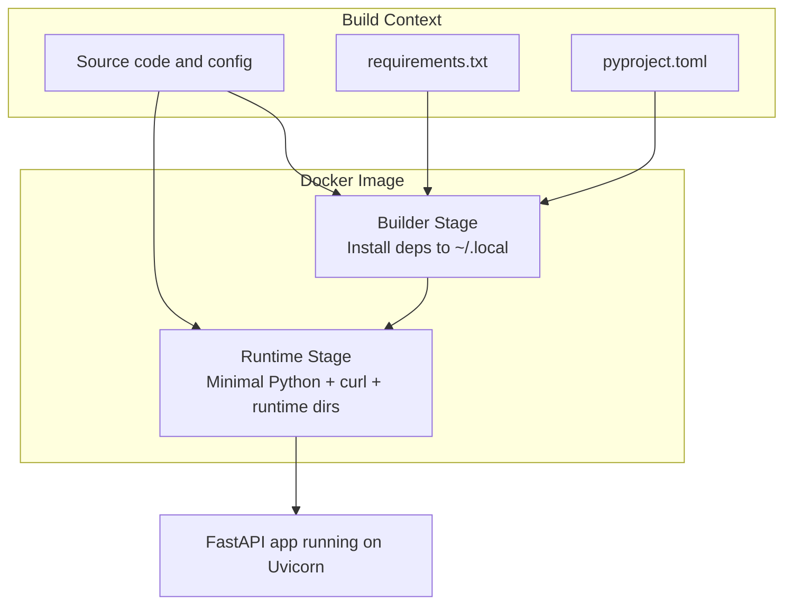
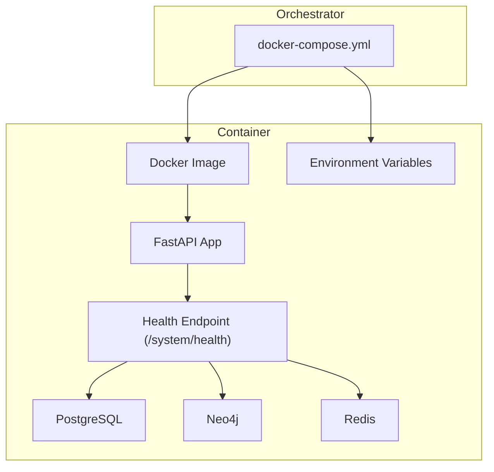
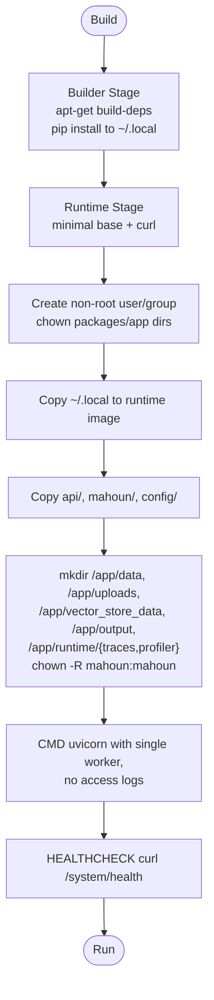
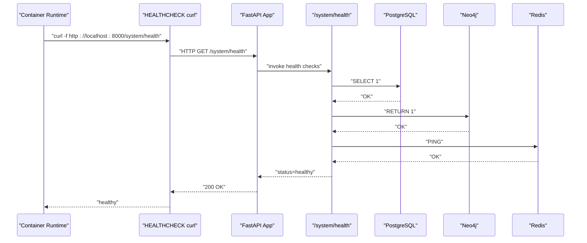
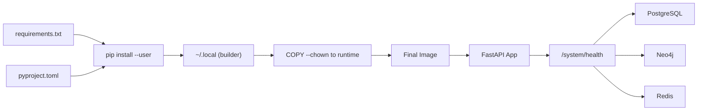

# Backend Containerization

<cite>
**Referenced Files in This Document**
- [Dockerfile.backend](file://Dockerfile.backend)
- [.dockerignore](file://.dockerignore)
- [docker-compose.yml](file://docker-compose.yml)
- [api/main.py](file://api/main.py)
- [api/routers/system.py](file://api/routers/system.py)
- [mahoun/core/health_checker.py](file://mahoun/core/health_checker.py)
- [requirements.txt](file://requirements.txt)
- [pyproject.toml](file://pyproject.toml)
</cite>

## Table of Contents
1. [Introduction](#introduction)
2. [Project Structure](#project-structure)
3. [Core Components](#core-components)
4. [Architecture Overview](#architecture-overview)
5. [Detailed Component Analysis](#detailed-component-analysis)
6. [Dependency Analysis](#dependency-analysis)
7. [Performance Considerations](#performance-considerations)
8. [Troubleshooting Guide](#troubleshooting-guide)
9. [Conclusion](#conclusion)

## Introduction
This document explains the production-grade containerization of the FastAPI backend service using a multi-stage Docker build. It covers the builder stage for dependency compilation, the minimal runtime stage with security hardening, Python package installation to a user-local directory and copying into the runtime image, non-root user enforcement, persistent directories for data and traces, the production-ready Uvicorn command, health checks against the real system health endpoint, environment variable injection for configuration, and the role of .dockerignore in optimizing the build context.

## Project Structure
The backend containerization centers around a dedicated Dockerfile.backend that defines two stages: a builder stage installing dependencies and a runtime stage that runs the FastAPI application with hardened defaults. The docker-compose.yml file orchestrates the backend service and injects environment variables for configuration. The .dockerignore file excludes unnecessary files from the build context.

**Diagram sources**
- [Dockerfile.backend](file://Dockerfile.backend#L1-L99)
- [requirements.txt](file://requirements.txt#L1-L131)
- [pyproject.toml](file://pyproject.toml#L1-L104)

**Section sources**
- [Dockerfile.backend](file://Dockerfile.backend#L1-L99)
- [.dockerignore](file://.dockerignore#L1-L178)
- [docker-compose.yml](file://docker-compose.yml#L1-L120)

## Core Components
- Multi-stage Docker build:
  - Builder stage installs Python dependencies into a user-local directory and compiles native extensions when needed.
  - Runtime stage copies installed packages and application code into a minimal Python base image, sets non-root user, creates persistent directories, and exposes the API port.
- Security hardening:
  - Non-root user with explicit UID/GID.
  - Ownership changes for copied packages and application directories.
  - Read-only mount strategy for static assets via compose volumes.
- Production-grade Uvicorn command:
  - Single worker for predictable resource usage in containers.
  - Access logs disabled to reduce I/O overhead.
- Health checks:
  - Container-level health check using curl against the real system health endpoint.
  - Compose-level health check mirroring the same endpoint and policy.
- Environment injection:
  - docker-compose.yml passes environment variables for database URIs, credentials, JWT secrets, Redis, and feature flags.
- Build context optimization:
  - .dockerignore excludes caches, logs, test artifacts, documentation, and other non-essential files.

**Section sources**
- [Dockerfile.backend](file://Dockerfile.backend#L1-L99)
- [docker-compose.yml](file://docker-compose.yml#L1-L120)
- [.dockerignore](file://.dockerignore#L1-L178)

## Architecture Overview
The backend container runs the FastAPI application served by Uvicorn. Health checks are performed against the system health endpoint, which validates connectivity to PostgreSQL, Neo4j, and Redis. docker-compose orchestrates the backend service and mounts persistent volumes for data, uploads, vector stores, and runtime traces.

**Diagram sources**
- [Dockerfile.backend](file://Dockerfile.backend#L84-L99)
- [api/routers/system.py](file://api/routers/system.py#L22-L208)
- [docker-compose.yml](file://docker-compose.yml#L1-L120)

**Section sources**
- [Dockerfile.backend](file://Dockerfile.backend#L84-L99)
- [api/routers/system.py](file://api/routers/system.py#L22-L208)
- [docker-compose.yml](file://docker-compose.yml#L1-L120)

## Detailed Component Analysis

### Multi-Stage Build: Builder and Runtime
- Builder stage:
  - Installs build dependencies for compiling native packages.
  - Copies dependency manifests and installs Python packages into a user-local directory to optimize layer caching and avoid system-wide installs.
- Runtime stage:
  - Minimal Python base image with only runtime dependencies (curl, shared libraries).
  - Creates a non-root user and group with a fixed UID/GID for consistency.
  - Copies installed packages from the builder stage into the user’s home directory and updates PATH.
  - Copies application code with correct ownership.
  - Creates persistent directories for data, uploads, vector store data, and runtime traces under /app and sets ownership to the non-root user.
  - Switches to non-root user before starting the application.
  - Exposes port 8000 and defines a health check using curl against the system health endpoint.
  - Starts Uvicorn with a single worker and disables access logs.

**Diagram sources**
- [Dockerfile.backend](file://Dockerfile.backend#L11-L99)

**Section sources**
- [Dockerfile.backend](file://Dockerfile.backend#L11-L99)

### Python Package Installation and Layer Optimization
- The builder installs dependencies from requirements.txt and pyproject.toml into a user-local directory to avoid system-wide writes.
- These packages are then copied into the runtime image, reducing attack surface and keeping the runtime minimal.
- This approach leverages pip’s cache-free and user-install behavior to improve determinism and layer caching.

**Section sources**
- [Dockerfile.backend](file://Dockerfile.backend#L25-L32)
- [requirements.txt](file://requirements.txt#L1-L131)
- [pyproject.toml](file://pyproject.toml#L1-L104)

### Security Hardening: Non-Root User and Directory Ownership
- A non-root user and group are created with a fixed UID/GID early in the runtime stage.
- All copied packages and application directories are chowned to this user.
- Persistent directories under /app are created and owned by the non-root user to prevent permission issues during runtime.
- The container switches to this user before starting the application.

**Section sources**
- [Dockerfile.backend](file://Dockerfile.backend#L55-L83)

### Persistent Directories and Mount Strategy
- The runtime stage creates directories for data, uploads, vector store data, output, and runtime traces.
- docker-compose.yml mounts host directories to /app/data, /app/uploads, /app/vector_store_data, /app/output, and /app/runtime to persist state across container restarts.
- Static proof pack content is mounted read-only to avoid accidental writes.

**Section sources**
- [Dockerfile.backend](file://Dockerfile.backend#L71-L79)
- [docker-compose.yml](file://docker-compose.yml#L57-L67)

### Production-Grade Uvicorn Command
- The container starts Uvicorn with a single worker to simplify resource management and avoid multi-process contention in containers.
- Access logs are disabled to reduce I/O overhead.
- Host and port are configured to bind to 0.0.0.0:8000.

**Section sources**
- [Dockerfile.backend](file://Dockerfile.backend#L91-L98)

### Health Checks: Real Connectivity Tests
- Container-level health check uses curl against the system health endpoint to validate real connectivity to downstream services.
- docker-compose.yml mirrors the same health check policy with identical intervals, timeouts, retries, and start period.
- The system health endpoint performs actual database queries and Redis ping commands to determine overall status.

**Diagram sources**
- [Dockerfile.backend](file://Dockerfile.backend#L87-L90)
- [docker-compose.yml](file://docker-compose.yml#L71-L77)
- [api/routers/system.py](file://api/routers/system.py#L22-L208)

**Section sources**
- [Dockerfile.backend](file://Dockerfile.backend#L87-L90)
- [docker-compose.yml](file://docker-compose.yml#L71-L77)
- [api/routers/system.py](file://api/routers/system.py#L22-L208)

### Environment Variable Injection and Configuration
- docker-compose.yml injects environment variables for:
  - Application environment and logging.
  - Database URIs, usernames, passwords, and ports.
  - Redis URL and optional password.
  - JWT secret key and optional API key.
  - Feature flags controlling service enablement.
- These variables are consumed by the application configuration and middleware layers to configure behavior at runtime.

**Section sources**
- [docker-compose.yml](file://docker-compose.yml#L24-L57)

### Build Context Optimization with .dockerignore
- .dockerignore excludes Python bytecode, virtual environments, distribution artifacts, IDE/editor files, logs, database files, runtime directories, documentation, CI/CD artifacts, tests, demos, Docker files, frontend assets, and secrets.
- This reduces build time, image size, and improves reproducibility by preventing accidental inclusion of non-essential files.

**Section sources**
- [.dockerignore](file://.dockerignore#L1-L178)

## Dependency Analysis
- Python dependencies are declared in requirements.txt and pyproject.toml. The builder stage installs these into a user-local directory, and the runtime stage copies them into the final image.
- FastAPI and Uvicorn are included as part of the runtime dependencies and application startup.
- The health endpoint depends on database connectivity and Redis; the health checker aggregates component statuses.

**Diagram sources**
- [Dockerfile.backend](file://Dockerfile.backend#L25-L32)
- [requirements.txt](file://requirements.txt#L1-L131)
- [pyproject.toml](file://pyproject.toml#L1-L104)
- [api/routers/system.py](file://api/routers/system.py#L22-L208)

**Section sources**
- [requirements.txt](file://requirements.txt#L1-L131)
- [pyproject.toml](file://pyproject.toml#L1-L104)
- [Dockerfile.backend](file://Dockerfile.backend#L25-L32)
- [api/routers/system.py](file://api/routers/system.py#L22-L208)

## Performance Considerations
- Single worker Uvicorn reduces memory footprint and avoids inter-process communication overhead in containers.
- Disabling access logs minimizes I/O and improves throughput.
- Using a non-root user and read-only mounts helps prevent accidental writes and improves stability.
- Health checks are lightweight and rely on real connectivity tests to avoid false positives.

[No sources needed since this section provides general guidance]

## Troubleshooting Guide
- Health check failures:
  - Verify environment variables for database URIs and credentials are set correctly in docker-compose.
  - Confirm that downstream services (PostgreSQL, Neo4j, Redis) are reachable from the container network.
  - Inspect the system health endpoint for detailed component statuses and error messages.
- Permission errors:
  - Ensure persistent directories are created and owned by the non-root user in the runtime stage.
  - Confirm docker-compose volume mounts align with the runtime directories.
- Port conflicts:
  - Check BACKEND_PORT mapping in docker-compose to avoid conflicts with the exposed 8000 inside the container.

**Section sources**
- [docker-compose.yml](file://docker-compose.yml#L24-L67)
- [Dockerfile.backend](file://Dockerfile.backend#L71-L83)
- [api/routers/system.py](file://api/routers/system.py#L22-L208)

## Conclusion
The backend containerization employs a robust multi-stage Docker build, strict security hardening, and production-grade runtime configuration. Health checks validate real connectivity to downstream systems, while environment injection enables flexible configuration across deployments. The .dockerignore file ensures efficient and secure builds by excluding non-essential files from the image.