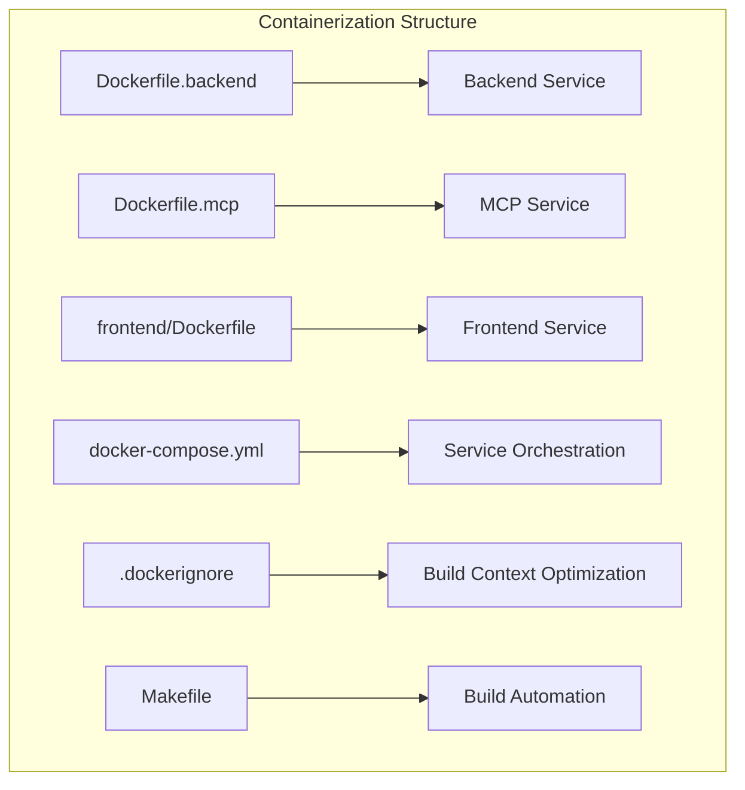
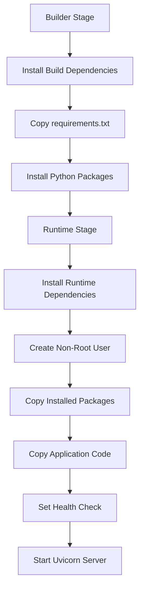
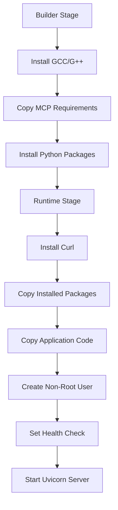
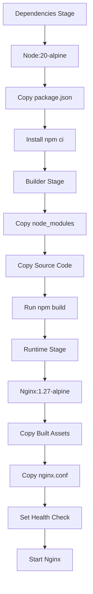
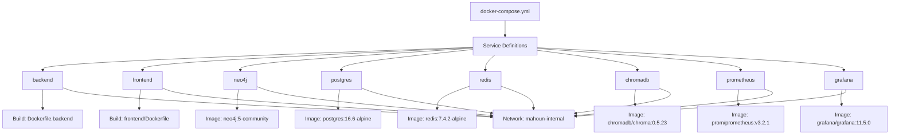
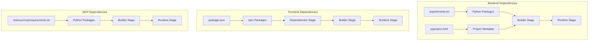

# Containerization Setup

<cite>
**Referenced Files in This Document**   
- [Dockerfile.backend](file://Dockerfile.backend)
- [Dockerfile.mcp](file://Dockerfile.mcp)
- [frontend/Dockerfile](file://frontend/Dockerfile)
- [docker-compose.yml](file://docker-compose.yml)
- [.dockerignore](file://.dockerignore)
- [frontend/.dockerignore](file://frontend/.dockerignore)
- [requirements.txt](file://requirements.txt)
- [mahoun/mcp/requirements.txt](file://mahoun/mcp/requirements.txt)
- [frontend/package.json](file://frontend/package.json)
- [frontend/nginx.conf](file://frontend/nginx.conf)
- [scripts/docker/generate_env_example.sh](file://scripts/docker/generate_env_example.sh)
- [Makefile](file://Makefile)
- [pyproject.toml](file://pyproject.toml)
</cite>

## Table of Contents
1. [Introduction](#introduction)
2. [Project Structure](#project-structure)
3. [Core Components](#core-components)
4. [Architecture Overview](#architecture-overview)
5. [Detailed Component Analysis](#detailed-component-analysis)
6. [Dependency Analysis](#dependency-analysis)
7. [Performance Considerations](#performance-considerations)
8. [Troubleshooting Guide](#troubleshooting-guide)
9. [Conclusion](#conclusion)

## Introduction
The MAHOUN platform employs a comprehensive containerization strategy using Docker and Docker Compose to manage its backend, MCP (Model Control Plane), and frontend services. This documentation provides an in-depth analysis of the containerization setup, focusing on multi-stage builds, security hardening, environment configuration, and orchestration through docker-compose.yml. The system is designed for production-grade deployments with resource limits, health checks, and deployment profiles.

## Project Structure
The containerization setup spans multiple services with dedicated Dockerfiles and shared configuration. The backend service uses a Python-based FastAPI application, the MCP service provides model management capabilities, and the frontend is a React application served via Nginx. Each service has its own Dockerfile with multi-stage builds for optimization, while shared configuration is managed through docker-compose.yml and environment variables.



**Diagram sources**
- [Dockerfile.backend](file://Dockerfile.backend#L1-L99)
- [Dockerfile.mcp](file://Dockerfile.mcp#L1-L50)
- [frontend/Dockerfile](file://frontend/Dockerfile#L1-L76)
- [docker-compose.yml](file://docker-compose.yml#L1-L434)

**Section sources**
- [Dockerfile.backend](file://Dockerfile.backend#L1-L99)
- [Dockerfile.mcp](file://Dockerfile.mcp#L1-L50)
- [frontend/Dockerfile](file://frontend/Dockerfile#L1-L76)
- [docker-compose.yml](file://docker-compose.yml#L1-L434)

## Core Components
The containerization setup consists of three main services: backend, MCP, and frontend. Each service uses multi-stage Docker builds to optimize image size and security. The backend service is built from Python 3.12, the MCP service from Python 3.11, and the frontend uses a Node.js build stage with Nginx runtime. All services implement security best practices including non-root users, read-only filesystems where appropriate, and minimal base images.

**Section sources**
- [Dockerfile.backend](file://Dockerfile.backend#L1-L99)
- [Dockerfile.mcp](file://Dockerfile.mcp#L1-L50)
- [frontend/Dockerfile](file://frontend/Dockerfile#L1-L76)

## Architecture Overview
The containerization architecture follows a microservices pattern orchestrated by Docker Compose. Services are isolated on an internal bridge network with controlled port exposure. The system supports multiple deployment profiles (default, full, monitoring) allowing flexible deployment scenarios from development to production. Resource limits and health checks ensure stable operation, while environment variable injection provides configuration flexibility.

```mermaid
graph TD
subgraph "Deployment Profiles"
A[Default Profile] --> B[Backend + Frontend]
C[Full Profile] --> D[Backend + Frontend + Neo4j + Postgres + Redis + ChromaDB]
E[Monitoring Profile] --> F[Prometheus + Grafana]
end
subgraph "Network Architecture"
G[External Access] --> H[Frontend:80]
I[Internal Network] < --> J[Backend:8000]
I < --> K[Neo4j:7687]
I < --> L[Postgres:5432]
I < --> M[Redis:6379]
I < --> N[ChromaDB:8000]
end
```

**Diagram sources**
- [docker-compose.yml](file://docker-compose.yml#L1-L434)

**Section sources**
- [docker-compose.yml](file://docker-compose.yml#L1-L434)

## Detailed Component Analysis

### Backend Service Analysis
The backend service uses a multi-stage build process with a builder stage for dependency compilation and a runtime stage for production execution. The builder stage installs build dependencies and Python packages, while the runtime stage creates a minimal image with only necessary runtime dependencies. Security is enhanced by creating a non-root user (mahoun) with UID 1000 and running the application with reduced privileges.



**Diagram sources**
- [Dockerfile.backend](file://Dockerfile.backend#L1-L99)

**Section sources**
- [Dockerfile.backend](file://Dockerfile.backend#L1-L99)
- [requirements.txt](file://requirements.txt#L1-L131)
- [pyproject.toml](file://pyproject.toml#L1-L104)

### MCP Service Analysis
The MCP service follows a similar multi-stage pattern to the backend but with a simpler dependency structure. It uses Python 3.11-slim as both builder and runtime base images. The service exposes port 8000 and implements health checking via a dedicated endpoint. The container runs as a non-root user for security hardening.



**Diagram sources**
- [Dockerfile.mcp](file://Dockerfile.mcp#L1-L50)

**Section sources**
- [Dockerfile.mcp](file://Dockerfile.mcp#L1-L50)
- [mahoun/mcp/requirements.txt](file://mahoun/mcp/requirements.txt#L1-L16)

### Frontend Service Analysis
The frontend service implements a three-stage build process optimized for production deployment. The first stage installs dependencies, the second stage builds the application, and the third stage serves static files via Nginx. This approach separates build tools from the runtime environment, resulting in a smaller, more secure production image. The Nginx configuration includes SPA routing, API proxying, and security headers.



**Diagram sources**
- [frontend/Dockerfile](file://frontend/Dockerfile#L1-L76)

**Section sources**
- [frontend/Dockerfile](file://frontend/Dockerfile#L1-L76)
- [frontend/package.json](file://frontend/package.json#L1-L39)
- [frontend/nginx.conf](file://frontend/nginx.conf#L1-L68)

### Docker Compose Orchestration
The docker-compose.yml file defines the complete service orchestration with support for multiple deployment profiles. Services are connected via an internal bridge network with controlled port exposure. The configuration includes resource limits, health checks, and volume mounts for persistent data. Environment variables are injected from the host environment with sensible defaults.



**Diagram sources**
- [docker-compose.yml](file://docker-compose.yml#L1-L434)

**Section sources**
- [docker-compose.yml](file://docker-compose.yml#L1-L434)
- [scripts/docker/generate_env_example.sh](file://scripts/docker/generate_env_example.sh#L1-L153)

## Dependency Analysis
The containerization setup manages dependencies through multiple mechanisms. Python dependencies are defined in requirements.txt and pyproject.toml, while frontend dependencies are managed via package.json. The multi-stage builds optimize dependency installation by separating build-time and runtime dependencies. Docker layer caching is leveraged by copying dependency files before application code.



**Diagram sources**
- [requirements.txt](file://requirements.txt#L1-L131)
- [pyproject.toml](file://pyproject.toml#L1-L104)
- [mahoun/mcp/requirements.txt](file://mahoun/mcp/requirements.txt#L1-L16)
- [frontend/package.json](file://frontend/package.json#L1-L39)

**Section sources**
- [requirements.txt](file://requirements.txt#L1-L131)
- [pyproject.toml](file://pyproject.toml#L1-L104)
- [mahoun/mcp/requirements.txt](file://mahoun/mcp/requirements.txt#L1-L16)
- [frontend/package.json](file://frontend/package.json#L1-L39)

## Performance Considerations
The containerization setup includes several performance optimizations. Multi-stage builds reduce image size by excluding build tools from runtime images. Resource limits are defined in docker-compose.yml to prevent resource exhaustion. BuildKit features like parallel builds and inline caching are enabled through the BUILDKIT_INLINE_CACHE argument. The .dockerignore files exclude unnecessary files from the build context, improving build performance.

**Section sources**
- [docker-compose.yml](file://docker-compose.yml#L1-L434)
- [.dockerignore](file://.dockerignore#L1-L178)
- [frontend/.dockerignore](file://frontend/.dockerignore#L1-L87)
- [Makefile](file://Makefile#L1-L217)

## Troubleshooting Guide
Common containerization issues include missing environment variables, port conflicts, and build cache problems. The Makefile provides convenient targets for building, starting, and cleaning containers. The generate_env_example.sh script helps create proper environment configuration. Health checks in docker-compose.yml can help identify service startup issues. The docker-test target runs a comprehensive smoke test suite to verify deployment integrity.

**Section sources**
- [Makefile](file://Makefile#L1-L217)
- [scripts/docker/generate_env_example.sh](file://scripts/docker/generate_env_example.sh#L1-L153)
- [docker-compose.yml](file://docker-compose.yml#L1-L434)

## Conclusion
The MAHOUN platform's containerization setup demonstrates production-grade practices for microservices deployment. The multi-stage builds optimize image size and security, while docker-compose.yml enables flexible orchestration across different deployment profiles. Security is prioritized through non-root users and minimal base images. The comprehensive configuration supports both development and production environments with appropriate resource management and health monitoring.