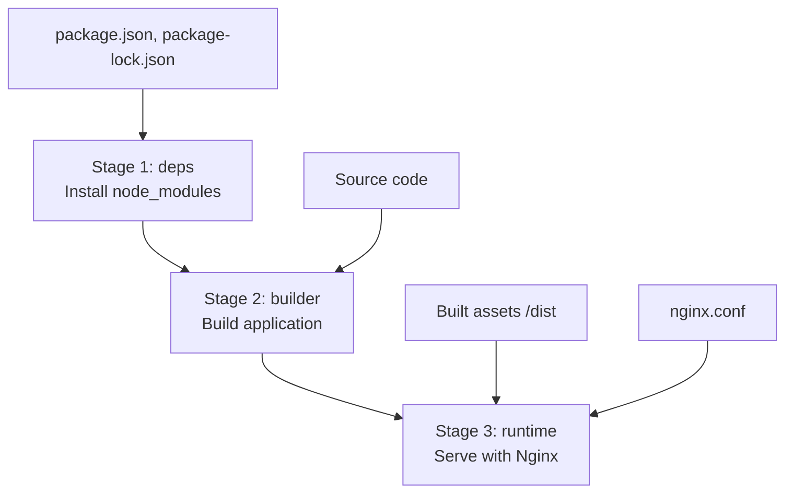

# Frontend Containerization

<cite>
**Referenced Files in This Document**   
- [Dockerfile](file://frontend/Dockerfile)
- [nginx.conf](file://frontend/nginx.conf)
- [docker-compose.yml](file://docker-compose.yml)
- [package.json](file://frontend/package.json)
- [vite.config.ts](file://frontend/vite.config.ts)
- [.env.example](file://frontend/.env.example)
</cite>

## Table of Contents
1. [Introduction](#introduction)
2. [Three-Stage Docker Build Process](#three-stage-docker-build-process)
3. [Stage 1: Dependencies Installation](#stage-1-dependencies-installation)
4. [Stage 2: Application Build](#stage-2-application-build)
5. [Stage 3: Runtime with Nginx](#stage-3-runtime-with-nginx)
6. [Environment Variable Injection](#environment-variable-injection)
7. [Nginx Configuration for SPA and Proxy](#nginx-configuration-for-spa-and-proxy)
8. [Health Check Implementation](#health-check-implementation)
9. [Docker Compose Integration](#docker-compose-integration)
10. [Security Considerations](#security-considerations)

## Introduction
This document details the containerization strategy for the React frontend in the MAHOUN platform, focusing on the multi-stage Docker build process. The implementation leverages Vite for building the frontend assets and Nginx as a lightweight production server. The design emphasizes deterministic builds, minimal image size, security hardening, and seamless integration with the backend services through reverse proxy configuration.

**Section sources**
- [Dockerfile](file://frontend/Dockerfile#L1-L76)
- [nginx.conf](file://frontend/nginx.conf#L1-L68)

## Three-Stage Docker Build Process
The frontend containerization follows a three-stage Docker build pattern to optimize build efficiency, reduce final image size, and enhance security. Each stage has a specific responsibility: dependency resolution, application compilation, and runtime serving.



**Diagram sources**
- [Dockerfile](file://frontend/Dockerfile#L9-L74)

**Section sources**
- [Dockerfile](file://frontend/Dockerfile#L1-L76)

## Stage 1: Dependencies Installation
The first stage, named `deps`, is responsible for installing Node.js dependencies using `npm ci` to ensure deterministic builds. This stage copies only the package manifest files (`package.json` and `package-lock.json`) to leverage Docker layer caching. By isolating dependency installation, subsequent builds can reuse cached layers when source code changes but dependencies remain the same.

```dockerfile
FROM node:20.12.2-alpine3.19 AS deps

WORKDIR /build

COPY package.json package-lock.json ./
RUN npm ci --prefer-offline --no-audit
```

This approach guarantees that every build uses the exact versions specified in the lockfile, preventing unexpected behavior due to dependency drift.

**Section sources**
- [Dockerfile](file://frontend/Dockerfile#L9-L20)

## Stage 2: Application Build
The second stage, named `builder`, performs the actual application build using Vite. It begins by copying the pre-installed `node_modules` from the `deps` stage, avoiding redundant package installation. The complete source code is then copied into the container, and the `npm run build` command is executed, which invokes Vite to compile, minify, and tree-shake the code for production.

```dockerfile
FROM node:20.12.2-alpine3.19 AS builder

WORKDIR /build

COPY --from=deps /build/node_modules ./node_modules
COPY . .
RUN npm run build
```

The build output is placed in the `/build/dist` directory, ready for deployment in the final stage.

**Section sources**
- [Dockerfile](file://frontend/Dockerfile#L23-L37)
- [package.json](file://frontend/package.json#L8)
- [vite.config.ts](file://frontend/vite.config.ts#L4-L23)

## Stage 3: Runtime with Nginx
The final stage uses the official `nginx:alpine` image to serve static assets efficiently. It installs `curl` for health checks, configures file ownership for the non-root `nginx` user, and copies the built assets from the `builder` stage using `COPY --from` with `--chown=nginx:nginx` to ensure proper permissions.

```dockerfile
FROM nginx:1.27.3-alpine AS runtime

RUN apk add --no-cache curl

RUN chown -R nginx:nginx /var/cache/nginx && \
    chown -R nginx:nginx /var/log/nginx && \
    touch /var/run/nginx.pid && \
    chown -R nginx:nginx /var/run/nginx.pid

COPY --from=builder --chown=nginx:nginx /build/dist /usr/share/nginx/html
COPY --chown=nginx:nginx nginx.conf /etc/nginx/conf.d/default.conf

USER nginx
EXPOSE 80
CMD ["nginx", "-g", "daemon off;"]
```

Switching to the non-root `nginx` user enhances security by reducing the attack surface in case of a compromise.

**Section sources**
- [Dockerfile](file://frontend/Dockerfile#L40-L74)

## Environment Variable Injection
Environment variables are injected into the frontend application using Vite's built-in environment variable support. Variables prefixed with `VITE_` are exposed to the client-side code. The `VITE_API_URL` variable specifies the backend endpoint and is configured in the `.env` file or passed through Docker Compose.

```env
VITE_API_URL=http://localhost:8000
```

During the build process, Vite replaces references to `import.meta.env.VITE_API_URL` with the actual value, enabling the frontend to communicate with the correct backend environment.

**Section sources**
- [.env.example](file://frontend/.env.example#L10)
- [vite.config.ts](file://frontend/vite.config.ts#L13-L20)
- [src/vite-env.d.ts](file://frontend/src/vite-env.d.ts#L4)

## Nginx Configuration for SPA and Proxy
The `nginx.conf` file is configured to support Single Page Application (SPA) routing and reverse proxy functionality. It uses `try_files $uri $uri/ /index.html` to ensure client-side routing works correctly by serving `index.html` for any unknown paths.

Additionally, it sets up proxy pass rules for `/api/` and `/v1/` endpoints to forward requests to the backend service at `http://backend:8000`, enabling API communication in production. The configuration also includes security headers, Gzip compression, and long-term caching for static assets.

```nginx
location / {
    try_files $uri $uri/ /index.html;
}

location /api/ {
    proxy_pass http://backend:8000;
    proxy_set_header Host $host;
    proxy_set_header X-Real-IP $remote_addr;
    proxy_set_header X-Forwarded-For $proxy_add_x_forwarded_for;
    proxy_set_header X-Forwarded-Proto $scheme;
}

location ~* \.(js|css|png|jpg|jpeg|gif|ico|svg|woff|woff2|ttf|eot)$ {
    expires 1y;
    add_header Cache-Control "public, immutable";
}
```

**Section sources**
- [nginx.conf](file://frontend/nginx.conf#L7-L66)

## Health Check Implementation
The container includes a health check using `curl` to verify that the frontend server is responsive. The check queries the root endpoint (`http://localhost/`) and is configured with appropriate intervals, timeouts, and retry policies to ensure reliable health detection.

```dockerfile
HEALTHCHECK --interval=30s --timeout=3s --start-period=10s --retries=3 \
    CMD curl -f http://localhost/ || exit 1
```

This health check is mirrored in the `docker-compose.yml` file to ensure Docker orchestrators can monitor the service's availability.

**Section sources**
- [Dockerfile](file://frontend/Dockerfile#L69-L71)
- [docker-compose.yml](file://docker-compose.yml#L112-L117)

## Docker Compose Integration
The `docker-compose.yml` file defines the frontend service with proper port mapping, environment variables, and health checks. It maps port 80 to the configured `FRONTEND_PORT`, injects the `VITE_API_URL` environment variable, and ensures the frontend starts only after the backend service is healthy.

```yaml
frontend:
  build:
    context: ./frontend
    dockerfile: Dockerfile
  ports:
    - "${FRONTEND_PORT:-80}:80"
  environment:
    - VITE_API_URL=${VITE_API_URL:-http://localhost:8000}
  depends_on:
    backend:
      condition: service_healthy
  healthcheck:
    test: [ "CMD", "curl", "-f", "http://localhost/" ]
    interval: 30s
    timeout: 3s
    retries: 3
    start_period: 10s
```

This configuration enables seamless local development and production deployment with consistent behavior across environments.

**Section sources**
- [docker-compose.yml](file://docker-compose.yml#L88-L118)

## Security Considerations
The containerization strategy incorporates several security best practices:
- **Non-root user**: The application runs as the `nginx` user (UID 101) to minimize privileges.
- **Minimal base image**: Alpine Linux reduces the attack surface.
- **Pinned versions**: Node.js and Nginx versions are explicitly pinned for reproducibility.
- **Health checks**: Ensure service integrity and enable automatic recovery.
- **Reverse proxy hardening**: Security headers (X-Frame-Options, X-Content-Type-Options) protect against common web vulnerabilities.

These measures collectively enhance the security posture of the frontend deployment in production environments.

**Section sources**
- [Dockerfile](file://frontend/Dockerfile#L47-L64)
- [nginx.conf](file://frontend/nginx.conf#L20-L23)