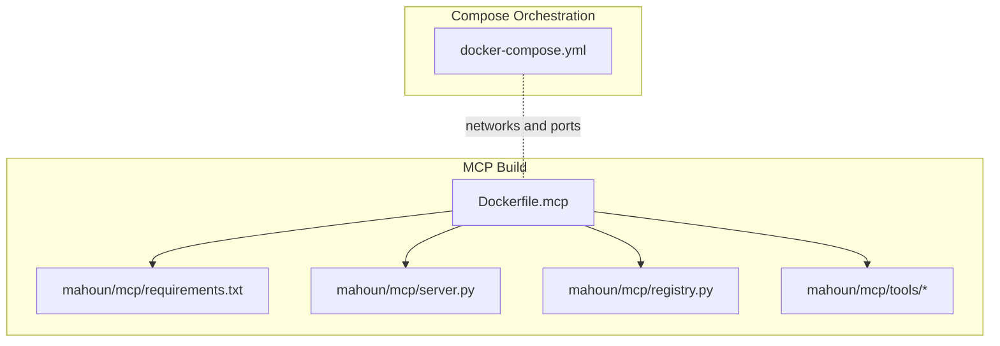
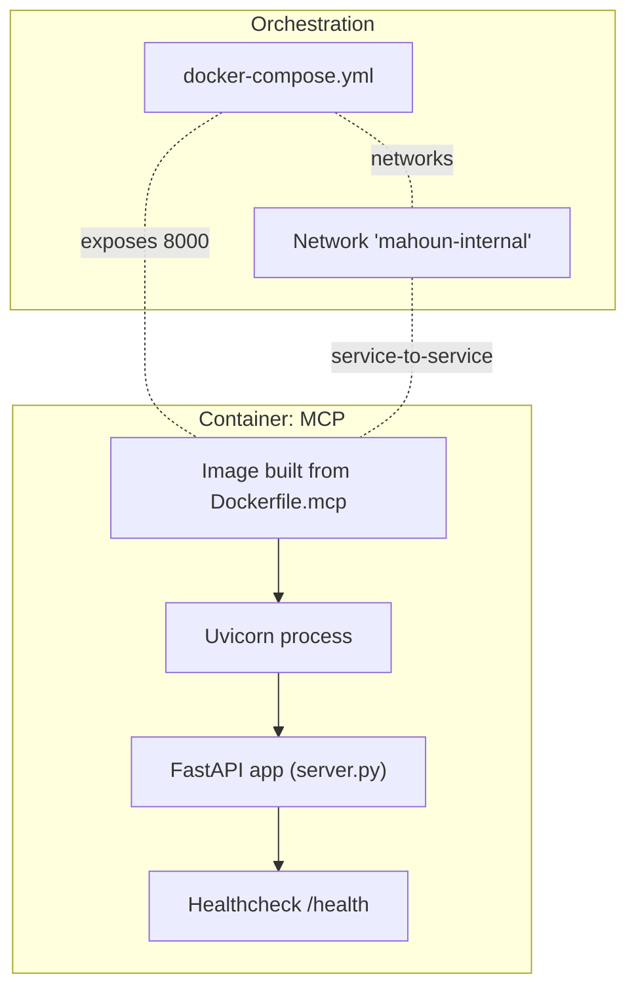
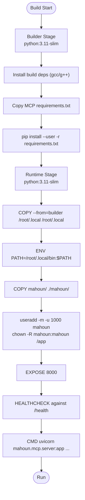
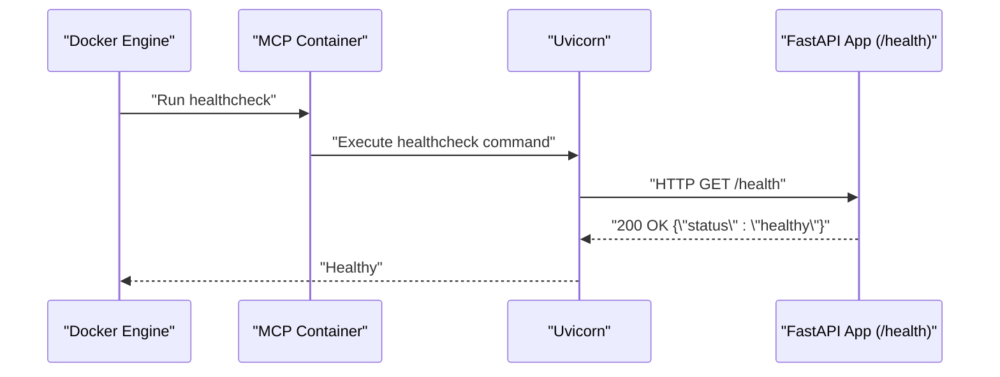
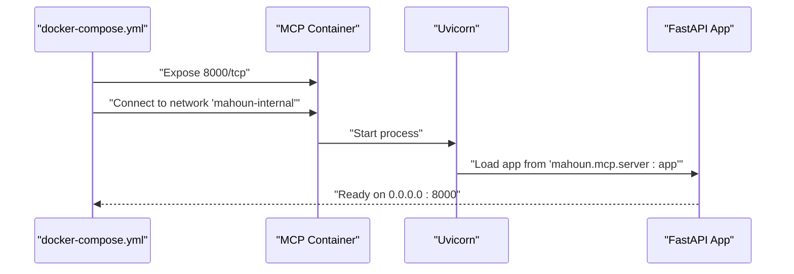
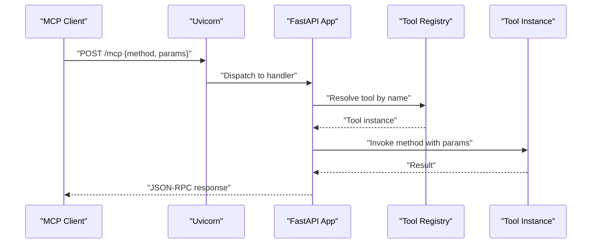
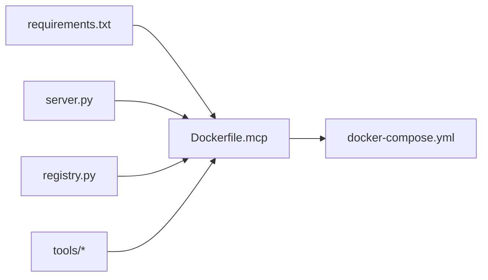

# MCP Service Containerization

<cite>
**Referenced Files in This Document**
- [Dockerfile.mcp](file://Dockerfile.mcp)
- [docker-compose.yml](file://docker-compose.yml)
- [mahoun/mcp/server.py](file://mahoun/mcp/server.py)
- [mahoun/mcp/requirements.txt](file://mahoun/mcp/requirements.txt)
- [mahoun/mcp/registry.py](file://mahoun/mcp/registry.py)
- [mahoun/mcp/tools/graph.py](file://mahoun/mcp/tools/graph.py)
- [Dockerfile.backend](file://Dockerfile.backend)
</cite>

## Table of Contents
1. [Introduction](#introduction)
2. [Project Structure](#project-structure)
3. [Core Components](#core-components)
4. [Architecture Overview](#architecture-overview)
5. [Detailed Component Analysis](#detailed-component-analysis)
6. [Dependency Analysis](#dependency-analysis)
7. [Performance Considerations](#performance-considerations)
8. [Troubleshooting Guide](#troubleshooting-guide)
9. [Conclusion](#conclusion)

## Introduction
This document explains the specialized containerization of the Model Context Protocol (MCP) server using a two-stage Docker build process. It focuses on how the builder stage installs Python dependencies and how the runtime stage creates a minimal, secure image. It also details the COPY --from mechanism for transferring installed packages, PATH configuration for user-local binaries, non-root user creation with UID 1000, chown operations on application directories, healthcheck using the /health endpoint, and the CMD instruction launching the uvicorn server. Finally, it connects the Dockerfile.mcp to the docker-compose.yml networking configuration and the MCP server implementation.

## Project Structure
The MCP service containerization centers around:
- A dedicated Dockerfile.mcp for building and running the MCP server
- The MCP server implementation under mahoun/mcp/server.py
- A tool registry and tool implementations under mahoun/mcp/tools/*
- A requirements file listing MCP server dependencies
- docker-compose.yml defining the platform’s network and service orchestration

**Diagram sources**
- [Dockerfile.mcp](file://Dockerfile.mcp#L1-L50)
- [mahoun/mcp/requirements.txt](file://mahoun/mcp/requirements.txt#L1-L16)
- [mahoun/mcp/server.py](file://mahoun/mcp/server.py#L1-L331)
- [mahoun/mcp/registry.py](file://mahoun/mcp/registry.py#L1-L23)
- [mahoun/mcp/tools/graph.py](file://mahoun/mcp/tools/graph.py#L1-L200)
- [docker-compose.yml](file://docker-compose.yml#L1-L434)

**Section sources**
- [Dockerfile.mcp](file://Dockerfile.mcp#L1-L50)
- [mahoun/mcp/server.py](file://mahoun/mcp/server.py#L1-L331)
- [mahoun/mcp/registry.py](file://mahoun/mcp/registry.py#L1-L23)
- [mahoun/mcp/tools/graph.py](file://mahoun/mcp/tools/graph.py#L1-L200)
- [docker-compose.yml](file://docker-compose.yml#L1-L434)

## Core Components
- Two-stage Docker build using python:3.11-slim
  - Builder stage installs build dependencies and Python packages into a user-local directory
  - Runtime stage copies only the installed packages and application code into a minimal image
- COPY --from mechanism transfers Python packages from the builder stage to the runtime stage
- PATH configured to include user-local binaries so uvicorn and other tools resolve correctly
- Non-root user created with UID 1000 and chown operations applied to application directories
- Healthcheck configured to probe the /health endpoint with sensible intervals and retries
- CMD launches the uvicorn server bound to 0.0.0.0:8000, pointing to the MCP application factory

**Section sources**
- [Dockerfile.mcp](file://Dockerfile.mcp#L1-L50)
- [mahoun/mcp/server.py](file://mahoun/mcp/server.py#L1-L331)

## Architecture Overview
The MCP server runs inside a container built from Dockerfile.mcp. docker-compose.yml defines the internal network and exposes ports. The MCP server listens on port 8000 and provides:
- A JSON-RPC 2.0 endpoint for tool execution
- A tool listing endpoint
- A health endpoint used by the container’s healthcheck

**Diagram sources**
- [Dockerfile.mcp](file://Dockerfile.mcp#L41-L50)
- [mahoun/mcp/server.py](file://mahoun/mcp/server.py#L327-L331)
- [docker-compose.yml](file://docker-compose.yml#L427-L434)

## Detailed Component Analysis

### Two-Stage Build and Package Transfer
- Builder stage
  - Uses python:3.11-slim
  - Installs build tools (gcc/g++) to support compilation of Python packages
  - Copies the MCP requirements file and installs dependencies into a user-local directory
- Runtime stage
  - Uses python:3.11-slim
  - Installs minimal runtime dependencies (e.g., curl)
  - Copies installed packages from the builder stage into a user-local directory
  - Updates PATH to include user-local binaries so executables resolve
  - Copies application code and sets ownership to a non-root user with UID 1000
  - Exposes port 8000 and defines a healthcheck probing /health

**Diagram sources**
- [Dockerfile.mcp](file://Dockerfile.mcp#L1-L50)
- [mahoun/mcp/requirements.txt](file://mahoun/mcp/requirements.txt#L1-L16)

**Section sources**
- [Dockerfile.mcp](file://Dockerfile.mcp#L1-L50)
- [mahoun/mcp/requirements.txt](file://mahoun/mcp/requirements.txt#L1-L16)

### Healthcheck Implementation
- The container healthcheck probes the MCP server’s /health endpoint
- It uses curl with a reasonable interval, timeout, start period, and retry count
- This ensures the container lifecycle management can detect unhealthy states

**Diagram sources**
- [Dockerfile.mcp](file://Dockerfile.mcp#L44-L47)
- [mahoun/mcp/server.py](file://mahoun/mcp/server.py#L327-L331)

**Section sources**
- [Dockerfile.mcp](file://Dockerfile.mcp#L44-L47)
- [mahoun/mcp/server.py](file://mahoun/mcp/server.py#L327-L331)

### CMD and Networking Integration
- The CMD launches uvicorn bound to 0.0.0.0:8000 and points to the MCP application factory
- docker-compose.yml defines an internal network named mahoun-internal and exposes port 8000
- The MCP service can communicate internally via the network and is reachable on the host if mapped

**Diagram sources**
- [Dockerfile.mcp](file://Dockerfile.mcp#L48-L50)
- [docker-compose.yml](file://docker-compose.yml#L427-L434)

**Section sources**
- [Dockerfile.mcp](file://Dockerfile.mcp#L48-L50)
- [docker-compose.yml](file://docker-compose.yml#L427-L434)

### MCP Server Endpoints and Tool Integration
- The MCP server exposes:
  - POST /mcp for JSON-RPC 2.0 requests
  - GET /mcp/tools to list available tools
  - GET /health for health checks
- The tool registry aggregates tool instances and is used by the server to dispatch requests
- Example tool implementations demonstrate real integrations (e.g., Neo4j-backed graph operations)

**Diagram sources**
- [mahoun/mcp/server.py](file://mahoun/mcp/server.py#L169-L306)
- [mahoun/mcp/registry.py](file://mahoun/mcp/registry.py#L1-L23)
- [mahoun/mcp/tools/graph.py](file://mahoun/mcp/tools/graph.py#L1-L200)

**Section sources**
- [mahoun/mcp/server.py](file://mahoun/mcp/server.py#L169-L306)
- [mahoun/mcp/registry.py](file://mahoun/mcp/registry.py#L1-L23)
- [mahoun/mcp/tools/graph.py](file://mahoun/mcp/tools/graph.py#L1-L200)

## Dependency Analysis
- Dockerfile.mcp depends on:
  - mahoun/mcp/requirements.txt for dependency versions
  - mahoun/mcp/server.py for the application factory referenced by CMD
  - mahoun/mcp/registry.py and tools for runtime tool availability
- docker-compose.yml orchestrates the MCP service within the internal network and exposes port 8000

**Diagram sources**
- [Dockerfile.mcp](file://Dockerfile.mcp#L1-L50)
- [mahoun/mcp/requirements.txt](file://mahoun/mcp/requirements.txt#L1-L16)
- [mahoun/mcp/server.py](file://mahoun/mcp/server.py#L1-L331)
- [mahoun/mcp/registry.py](file://mahoun/mcp/registry.py#L1-L23)
- [docker-compose.yml](file://docker-compose.yml#L1-L434)

**Section sources**
- [Dockerfile.mcp](file://Dockerfile.mcp#L1-L50)
- [mahoun/mcp/requirements.txt](file://mahoun/mcp/requirements.txt#L1-L16)
- [mahoun/mcp/server.py](file://mahoun/mcp/server.py#L1-L331)
- [mahoun/mcp/registry.py](file://mahoun/mcp/registry.py#L1-L23)
- [docker-compose.yml](file://docker-compose.yml#L1-L434)

## Performance Considerations
- Two-stage build minimizes runtime image size by copying only installed packages and application code
- Using python:3.11-slim reduces attack surface and download time
- Installing packages with --user and copying to /root/.local avoids system-level installations and simplifies PATH resolution
- Healthcheck intervals and timeouts are tuned to balance responsiveness and resource usage
- Binding uvicorn to 0.0.0.0 enables external access when port 8000 is exposed

[No sources needed since this section provides general guidance]

## Troubleshooting Guide
- Healthcheck failures
  - Verify the /health endpoint responds with a healthy status
  - Confirm the container is listening on port 8000 and that the port is exposed
- API key and rate limiting
  - Ensure the MCP API key is set and passed in the X-API-Key header
  - Review rate limiting behavior and adjust client-side request pacing if encountering rate limit errors
- Tool invocation errors
  - Confirm the tool name and method exist in the registry
  - Check tool-specific dependencies (e.g., Neo4j connectivity) when invoking graph-related tools

**Section sources**
- [Dockerfile.mcp](file://Dockerfile.mcp#L44-L47)
- [mahoun/mcp/server.py](file://mahoun/mcp/server.py#L132-L151)
- [mahoun/mcp/server.py](file://mahoun/mcp/server.py#L169-L306)
- [mahoun/mcp/registry.py](file://mahoun/mcp/registry.py#L1-L23)
- [mahoun/mcp/tools/graph.py](file://mahoun/mcp/tools/graph.py#L1-L200)

## Conclusion
The MCP service containerization leverages a two-stage Docker build to produce a minimal, secure runtime image. The builder stage compiles and installs dependencies into a user-local directory, while the runtime stage copies only the necessary artifacts and sets up a non-root user with proper ownership. The healthcheck targets the /health endpoint, and the CMD starts uvicorn bound to 0.0.0.0:8000. docker-compose.yml integrates the MCP service into the internal network and exposes port 8000 for access. Together, these components deliver a production-ready, observable, and secure MCP server deployment.