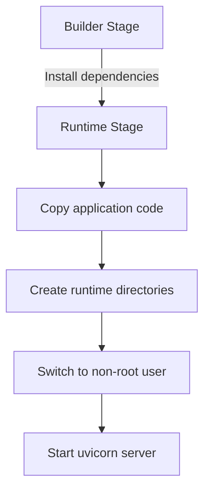
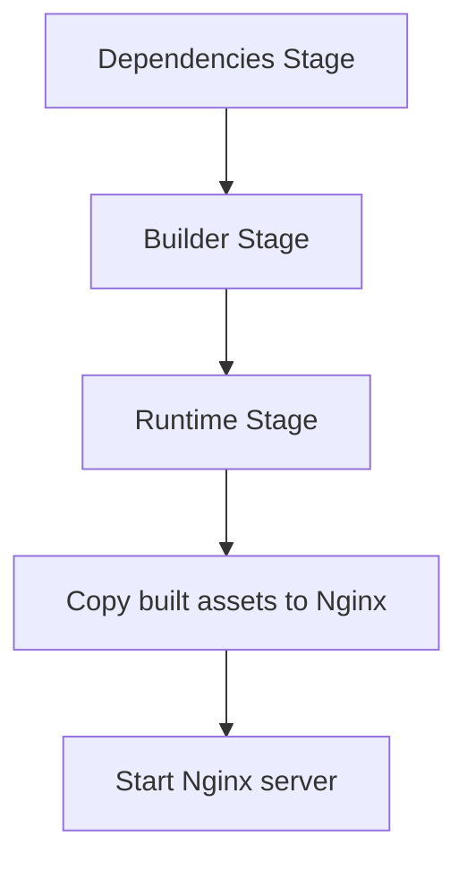
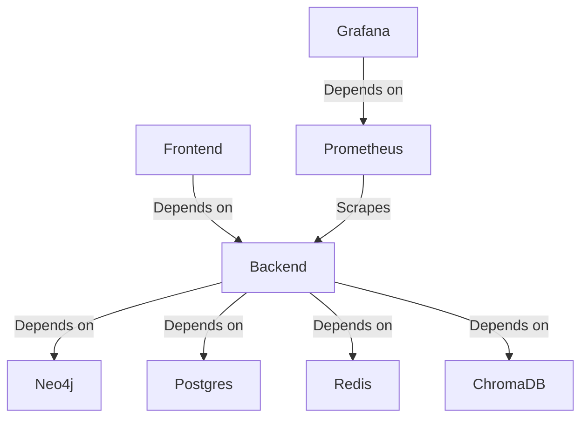
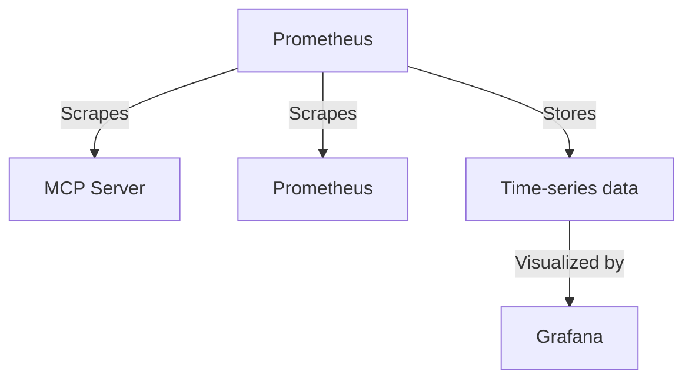
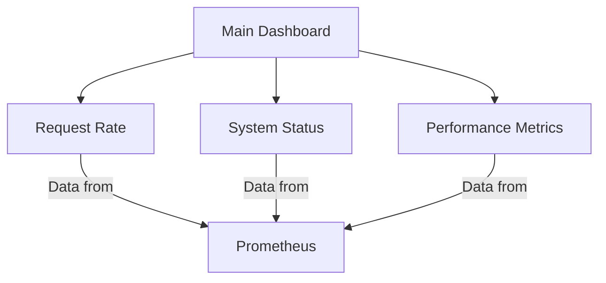

# Deployment and Operations

<cite>
**Referenced Files in This Document**   
- [docker-compose.yml](file://docker-compose.yml)
- [Dockerfile.backend](file://Dockerfile.backend)
- [Dockerfile.mcp](file://Dockerfile.mcp)
- [frontend/Dockerfile](file://frontend/Dockerfile)
- [config/runtime.json](file://config/runtime.json)
- [monitoring/prometheus/prometheus.yml](file://monitoring/prometheus/prometheus.yml)
- [monitoring/grafana/dashboards/main.json](file://monitoring/grafana/dashboards/main.json)
- [monitoring/grafana/datasources/prometheus.yml](file://monitoring/grafana/datasources/prometheus.yml)
- [mahoun/mcp/server.py](file://mahoun/mcp/server.py)
- [.env.example](file://.env.example)
</cite>

## Table of Contents
1. [Containerization Strategy](#containerization-strategy)
2. [Docker Setup and Configuration](#docker-setup-and-configuration)
3. [Service Orchestration with docker-compose](#service-orchestration-with-docker-compose)
4. [Monitoring Stack](#monitoring-stack)
5. [Logging Strategy](#logging-strategy)
6. [Production Configuration](#production-configuration)
7. [Scaling and High Availability](#scaling-and-high-availability)
8. [Disaster Recovery](#disaster-recovery)
9. [Troubleshooting Guide](#troubleshooting-guide)

## Containerization Strategy

The MAHOUN platform employs a comprehensive containerization strategy using Docker to ensure consistent deployment across development, staging, and production environments. The architecture consists of three primary services: backend, MCP (Model Context Protocol), and frontend, each containerized with optimized Dockerfiles following security and performance best practices.

The containerization approach follows a multi-stage build pattern to minimize image size and attack surface. Each service runs as a non-root user for enhanced security, with resource limits defined to prevent resource exhaustion. The backend and MCP services expose port 8000, while the frontend service uses port 80 for HTTP traffic.

**Section sources**
- [Dockerfile.backend](file://Dockerfile.backend)
- [Dockerfile.mcp](file://Dockerfile.mcp)
- [frontend/Dockerfile](file://frontend/Dockerfile)

## Docker Setup and Configuration

### Backend Service Configuration

The backend service is built from `Dockerfile.backend` using Python 3.12.7-slim-bookworm as the base image. The multi-stage build process separates dependency installation from the runtime environment, ensuring a minimal production image. The build process installs only essential runtime dependencies (curl, libpq5, ca-certificates) while compiling dependencies in a separate builder stage.



**Diagram sources**
- [Dockerfile.backend](file://Dockerfile.backend)

### MCP Service Configuration

The MCP service uses Python 3.11-slim as its base image, optimized for the Model Context Protocol interface. The Dockerfile implements a similar multi-stage build pattern, with dependencies installed in a builder stage and copied to the final runtime image. The MCP server runs as a non-root user (mahoun) with UID 1000 for consistency across environments.

**Section sources**
- [Dockerfile.mcp](file://Dockerfile.mcp)
- [mahoun/mcp/server.py](file://mahoun/mcp/server.py)

### Frontend Service Configuration

The frontend service employs a three-stage Docker build process:
1. **Dependencies stage**: Installs npm packages using npm ci for deterministic builds
2. **Builder stage**: Builds the React application with Vite
3. **Runtime stage**: Serves static files using Nginx

This approach ensures that the final image contains only the compiled frontend assets, resulting in a small, secure production image. The Nginx configuration is copied to the container, and the service runs as the nginx user for security.



**Diagram sources**
- [frontend/Dockerfile](file://frontend/Dockerfile)

### Environment Variable Configuration

Environment variables are managed through the `.env` file, with `.env.example` providing a template for required configuration. Key environment variables include:

- **Database credentials**: `DB_POSTGRES_PASSWORD`, `DB_NEO4J_PASSWORD`
- **Security secrets**: `SECURITY_JWT_SECRET`
- **Feature flags**: `ENABLE_NEO4J`, `ENABLE_POSTGRES`, `ENABLE_REDIS`
- **Port configurations**: `BACKEND_PORT`, `FRONTEND_PORT`, `PROMETHEUS_PORT`, `GRAFANA_PORT`

The system uses safe default values for development environments while requiring strong, unique values for staging and production deployments.

**Section sources**
- [.env.example](file://.env.example)

### Volume Mounting

Persistent data is managed through Docker volumes and bind mounts. The following directories are mounted to ensure data persistence:

- `/app/data`: Application data storage
- `/app/uploads`: User uploads
- `/app/vector_store_data`: Vector database storage
- `/app/output`: Generated outputs
- `/app/runtime`: Runtime traces and profiler data

Named volumes are used for database storage (neo4j_data, postgres_data, redis_data, chromadb_data) to ensure data persistence across container restarts.

**Section sources**
- [docker-compose.yml](file://docker-compose.yml)

## Service Orchestration with docker-compose

The `docker-compose.yml` file orchestrates the complete MAHOUN platform with support for different deployment profiles. The configuration defines multiple services with appropriate dependencies, resource limits, and health checks.

### Service Profiles

The deployment supports two primary profiles:
- **default**: Minimal setup with backend and frontend services (laptop-safe)
- **full**: Complete setup including Neo4j, Postgres, Redis, ChromaDB, Prometheus, and Grafana



**Diagram sources**
- [docker-compose.yml](file://docker-compose.yml)

### Service Dependencies

Service dependencies are explicitly defined to ensure proper startup order:
- The frontend service depends on the backend service being healthy
- The Grafana service depends on the Prometheus service
- Database services (Neo4j, Postgres, Redis, ChromaDB) are optional and can be enabled via feature flags

Health checks are implemented for all services to ensure they are fully operational before dependent services start. The backend service uses a health check endpoint at `/system/health`, while the frontend checks the root path.

**Section sources**
- [docker-compose.yml](file://docker-compose.yml)

### Resource Configuration

Resource limits are defined for each service to prevent resource exhaustion and ensure stable operation:

- **Backend**: 2.0 CPUs, 2GB memory (limits); 0.5 CPUs, 512MB memory (reservations)
- **Frontend**: 0.5 CPUs, 256MB memory (limits); 0.1 CPUs, 64MB memory (reservations)
- **Neo4j**: 2.0 CPUs, 4GB memory (limits); 0.5 CPUs, 2GB memory (reservations)
- **Prometheus**: 1.0 CPUs, 1GB memory (limits); 0.1 CPUs, 256MB memory (reservations)
- **Grafana**: 0.5 CPUs, 512MB memory (limits); 0.1 CPUs, 128MB memory (reservations)

These values are laptop-safe defaults that can be adjusted for production environments based on workload requirements.

**Section sources**
- [docker-compose.yml](file://docker-compose.yml)

## Monitoring Stack

The monitoring stack consists of Prometheus for metrics collection and Grafana for visualization, providing comprehensive observability for the MAHOUN platform.

### Prometheus Configuration

Prometheus is configured to scrape metrics from multiple endpoints:
- **MCP Server**: Scrapes metrics from `mcp-server:8000/metrics` every 10 seconds
- **Prometheus itself**: Self-monitoring at `localhost:9090`

The configuration includes global settings with a 15-second scrape interval and 30-day retention period for time-series data. Alerting rules can be defined in `/etc/prometheus/alerts/*.yml`.



**Diagram sources**
- [monitoring/prometheus/prometheus.yml](file://monitoring/prometheus/prometheus.yml)

### Grafana Configuration

Grafana is pre-configured with:
- **Data source**: Prometheus at `http://prometheus:9090`
- **Dashboards**: Provisioned from `/etc/grafana/provisioning/dashboards`
- **Authentication**: Admin user with configurable password

The Grafana instance is set up for automatic provisioning of dashboards and data sources, eliminating manual configuration. User sign-up is disabled for security.

**Section sources**
- [monitoring/grafana/datasources/prometheus.yml](file://monitoring/grafana/datasources/prometheus.yml)
- [monitoring/grafana/dashboards/provider.yml](file://monitoring/grafana/dashboards/provider.yml)

### Provided Dashboards

The main dashboard (`main.json`) provides key metrics for monitoring platform health:
- **Request Rate**: Shows requests per minute over time
- **System Status**: Gauge indicating the current system status (healthy/unhealthy)
- **Performance metrics**: Latency, error rates, and throughput

The dashboard is configured with a dark theme and auto-refresh capabilities, providing real-time visibility into system performance.



**Diagram sources**
- [monitoring/grafana/dashboards/main.json](file://monitoring/grafana/dashboards/main.json)

### Metrics Collection

The MAHOUN platform exposes custom metrics through its metrics collector, which provides Prometheus-compatible endpoints. Key metrics include:
- **System metrics**: CPU usage, memory usage, uptime
- **Application metrics**: Request rates, latency histograms, error counts
- **Business metrics**: Feedback loop statistics, training steps, experiment results

The metrics collector is implemented as a singleton pattern with thread-safe operations, ensuring reliable metrics collection in multi-threaded environments.

**Section sources**
- [mahoun/metrics/metrics.py](file://mahoun/metrics/metrics.py)

## Logging Strategy

The logging strategy is configured through the `runtime.json` file, which defines logging parameters for the entire platform. Key logging configuration options include:

- **Log level**: Configurable via `MAHOUN_LOG_LEVEL` (default: INFO)
- **Log format**: Configurable via `MAHOUN_LOG_FORMAT` (default: json)
- **Log directories**: Configurable data, output, and cache directories

The platform uses structured JSON logging for machine readability, facilitating log aggregation and analysis. Logs are written to the appropriate directories based on the configured paths, with rotation and retention handled by the container runtime.

**Section sources**
- [config/runtime.json](file://config/runtime.json)

## Production Configuration

### Runtime Configuration

The `config/runtime.json` file provides the primary configuration for the MAHOUN platform, using environment variable substitution for runtime customization. Key configuration sections include:

- **Environment**: Mode (dev/staging/prod), debug settings, guard mode
- **Features**: Feature flags for graph, RAG, and self-improvement capabilities
- **LLM**: Provider, model directory, timeout, and GPU settings
- **Storage**: Data, output, and cache directory paths
- **API**: Host, port, workers, CORS origins, and rate limiting
- **Observability**: Log level, format, tracing, and metrics

```json
{
  "environment": {
    "mode": "${MAHOUN_ENV:-dev}",
    "debug": "${MAHOUN_DEBUG:-false}"
  },
  "features": {
    "graph_enabled": "${MAHOUN_ENABLE_GRAPH:-true}",
    "rag_enabled": "${MAHOUN_ENABLE_RAG:-true}"
  },
  "api": {
    "port": "${MAHOUN_API_PORT:-8000}",
    "rate_limit_per_minute": "${MAHOUN_RATE_LIMIT:-100}"
  }
}
```

**Section sources**
- [config/runtime.json](file://config/runtime.json)

### Security Configuration

Production deployments require strict security configuration:
- **Database passwords**: Must be strong, unique values (not the development defaults)
- **JWT secret**: Must be a cryptographically strong secret of at least 32 characters
- **API keys**: Required for MCP server authentication
- **CORS policies**: Restricted to trusted origins

The system provides guidance for generating strong secrets using OpenSSL commands:
- `openssl rand -base64 32` for database passwords
- `openssl rand -hex 32` for JWT secrets

**Section sources**
- [.env.example](file://.env.example)

## Scaling and High Availability

For high-availability deployments, consider the following scaling strategies:

### Horizontal Scaling

The backend service can be scaled horizontally by increasing the number of replicas. Each instance should share the same database and cache backends (Postgres, Neo4j, Redis) to maintain consistency. Load balancing should be implemented in front of the backend services.

### Database Optimization

For production deployments, adjust database resource allocations:
- **Neo4j**: Increase heap size and page cache based on dataset size
- **Postgres**: Tune connection pooling and indexing strategies
- **Redis**: Configure appropriate maxmemory policy and persistence options

### Resource Allocation

Adjust resource limits based on workload requirements:
- Increase CPU and memory limits for high-traffic periods
- Monitor resource utilization and scale accordingly
- Consider dedicated nodes for database services in large deployments

### Network Configuration

Ensure proper network configuration for high availability:
- Use internal Docker network (mahoun-internal) for service communication
- Configure appropriate port mappings for external access
- Implement network policies to restrict unnecessary traffic

**Section sources**
- [docker-compose.yml](file://docker-compose.yml)

## Disaster Recovery

### Backup Strategy

Implement regular backups of critical data:
- **Database backups**: Regular snapshots of Neo4j, Postgres, and Redis data
- **Vector store**: Backups of ChromaDB data
- **Configuration**: Version-controlled configuration files
- **Models**: Backups of LLM models in the model directory

### Recovery Procedures

In case of system failure:
1. Restore database volumes from backups
2. Redeploy services using docker-compose
3. Verify service health through monitoring dashboards
4. Validate data integrity through automated checks

### High Availability Considerations

For mission-critical deployments:
- Deploy across multiple availability zones
- Implement automated failover mechanisms
- Maintain standby instances for critical services
- Regularly test disaster recovery procedures

**Section sources**
- [docker-compose.yml](file://docker-compose.yml)

## Troubleshooting Guide

### Container Crashes

Common causes and solutions:
- **Insufficient resources**: Increase CPU/memory limits in docker-compose.yml
- **Missing dependencies**: Verify all required services are running
- **Configuration errors**: Check environment variables and configuration files
- **Health check failures**: Verify health check endpoints are accessible

Use `docker logs` to examine container output and identify specific error messages.

### Network Connectivity Problems

Troubleshooting steps:
1. Verify services are on the same Docker network (mahoun-internal)
2. Check port mappings and firewall rules
3. Test connectivity between containers using `docker exec`
4. Verify DNS resolution within the Docker network

Common issues include incorrect service names in connection strings and port conflicts.

### Resource Constraints

Symptoms and solutions:
- **High CPU usage**: Optimize queries, add caching, scale horizontally
- **Memory exhaustion**: Increase memory limits, optimize data structures
- **Disk space issues**: Clean up old logs, implement log rotation, expand volumes

Monitor resource usage through the Grafana dashboards and adjust configurations accordingly.

### Monitoring Issues

If metrics are not appearing in Grafana:
1. Verify Prometheus is scraping the MCP server endpoint
2. Check Prometheus targets status at `http://localhost:9090/targets`
3. Verify the MCP server `/metrics` endpoint is accessible
4. Check network connectivity between Prometheus and target services

**Section sources**
- [docker-compose.yml](file://docker-compose.yml)
- [monitoring/prometheus/prometheus.yml](file://monitoring/prometheus/prometheus.yml)