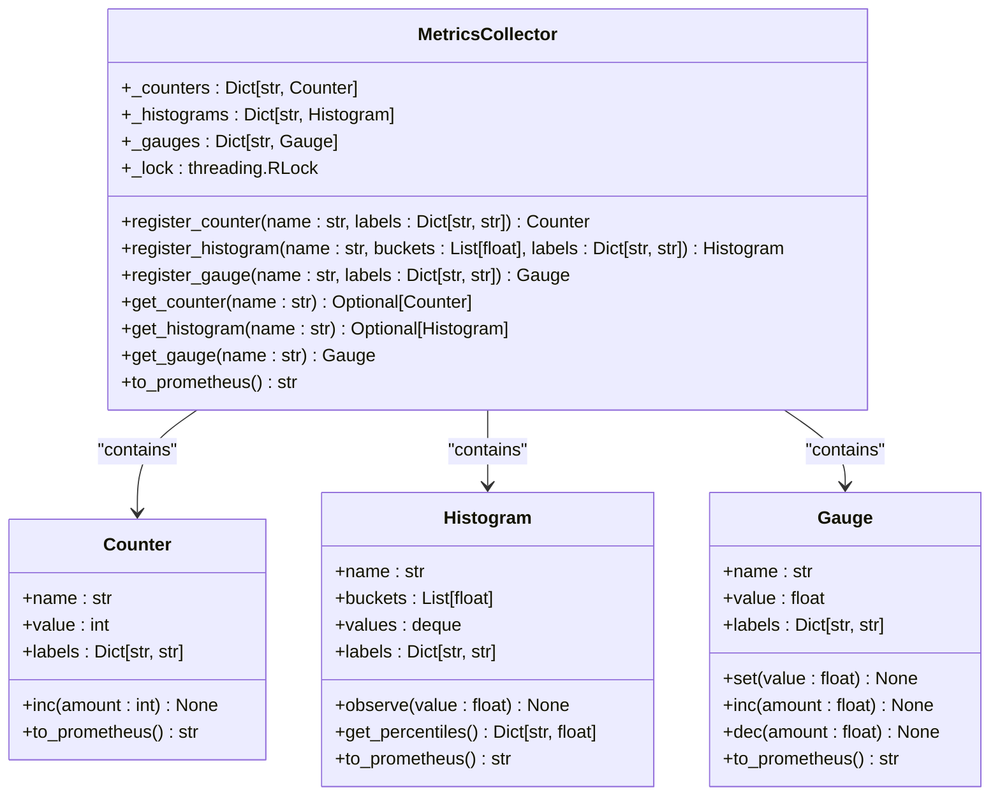
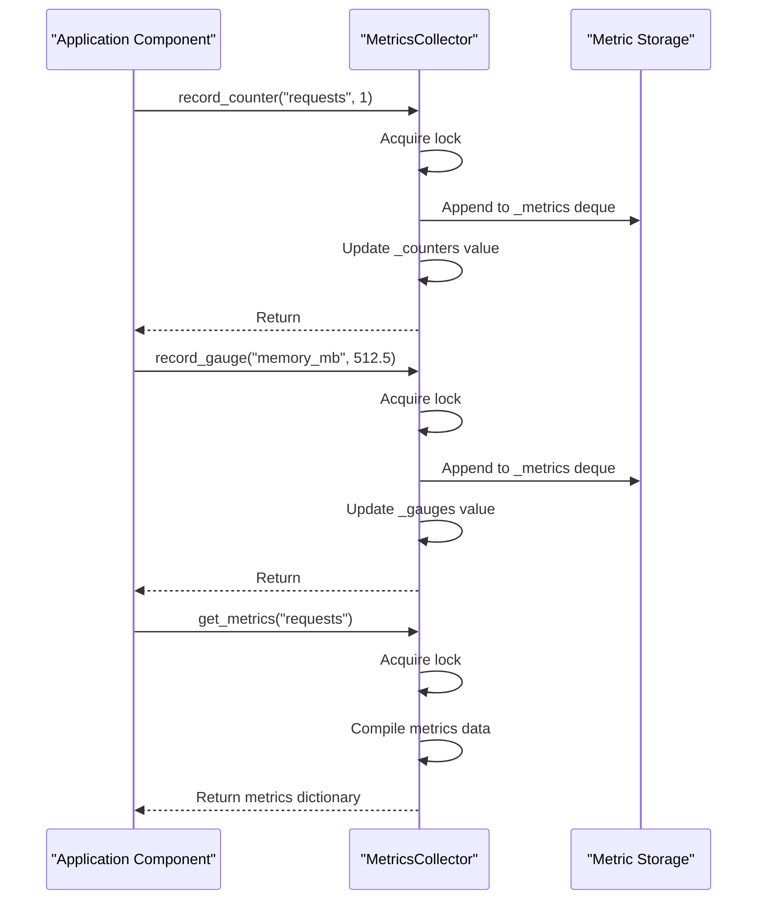
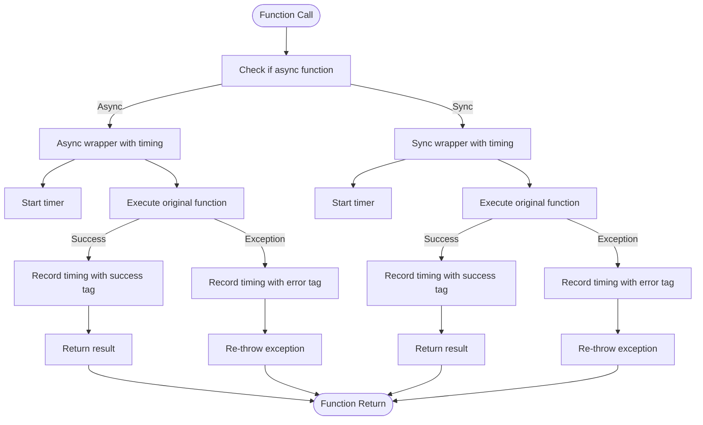
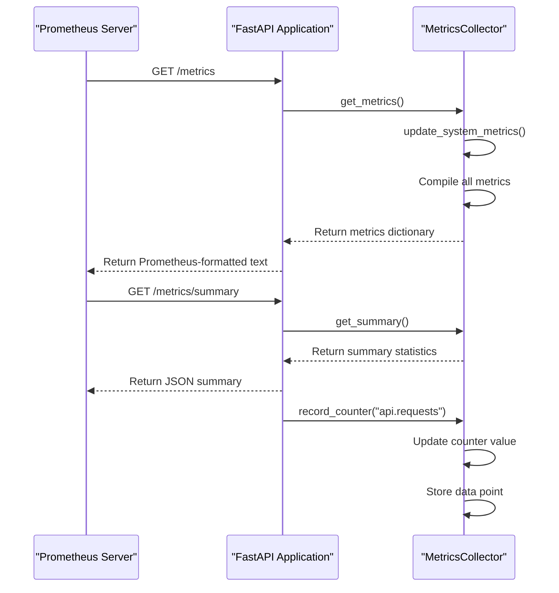

# Application Metrics Integration

<cite>
**Referenced Files in This Document**   
- [metrics.py](file://mahoun/metrics/metrics.py)
- [collector.py](file://mahoun/core/metrics/collector.py)
- [decorators.py](file://mahoun/core/metrics/decorators.py)
- [metrics.py](file://api/routers/metrics.py)
- [config.py](file://mahoun/config.py)
- [pipeline.py](file://mahoun/pipelines/ingestion/pipeline.py)
- [reasoning_chain.py](file://mahoun/reasoning/reasoning_chain.py)
</cite>

## Table of Contents
1. [Introduction](#introduction)
2. [Metrics Definition and Registration](#metrics-definition-and-registration)
3. [Metrics Collection Mechanism](#metrics-collection-mechanism)
4. [Automatic Instrumentation with Decorators](#automatic-instrumentation-with-decorators)
5. [FastAPI Integration for Metrics Exposure](#fastapi-integration-for-metrics-exposure)
6. [Custom Metric Types and Usage Examples](#custom-metric-types-and-usage-examples)
7. [Business-Critical Metrics Capture](#business-critical-metrics-capture)
8. [Troubleshooting Common Issues](#troubleshooting-common-issues)
9. [Performance Implications and Best Practices](#performance-implications-and-best-practices)
10. [Configuration and Environment Variables](#configuration-and-environment-variables)

## Introduction

The Application Metrics Integration system in MAHOUN provides comprehensive monitoring capabilities through Prometheus-compatible metrics exposure. This documentation details the architecture and implementation of the metrics collection system, focusing on how internal application metrics are defined, collected, and exposed for monitoring and optimization purposes. The system enables tracking of critical performance indicators, business metrics, and system health across various components including API endpoints, agent workflows, fine-tuning jobs, and document ingestion processes. The metrics infrastructure is designed to support observability requirements while maintaining minimal performance overhead.

## Metrics Definition and Registration

The metrics system in MAHOUN is built around a centralized metrics collector that manages the definition and registration of various metric types. The core implementation resides in `mahoun/metrics/metrics.py`, which defines the primary metric classes and the central collector.

The system supports three fundamental metric types:
- **Counter**: Monotonically increasing values for tracking events and occurrences
- **Gauge**: Values that can increase or decrease, representing current states
- **Histogram**: Distribution of values, particularly useful for latency measurements

Metric registration is handled through the `MetricsCollector` class, which provides thread-safe methods for registering metrics with optional labels for categorization. The collector maintains separate dictionaries for counters, histograms, and gauges, ensuring efficient access and updates. When metrics are registered, they are stored with their configuration including name, labels, and (for histograms) bucket boundaries.

The system implements a singleton pattern through the `get_metrics_collector()` function, ensuring that all components interact with the same metrics collector instance. This centralized approach enables consistent metric collection across the application while preventing duplication and ensuring thread safety through the use of `threading.RLock()`.

**Diagram sources**
- [metrics.py](file://mahoun/metrics/metrics.py#L24-L357)

**Section sources**
- [metrics.py](file://mahoun/metrics/metrics.py#L1-L357)

## Metrics Collection Mechanism

The metrics collection system is implemented through a layered architecture that separates metric definition from collection and exposure. The core collection functionality is provided by `mahoun/core/metrics/collector.py`, which defines the `MetricsCollector` class responsible for recording and storing metric data.

The collection mechanism operates on a time-series basis, storing historical data points for each metric in a `deque` with a configurable maximum history size. This approach enables the system to maintain recent metric values for analysis while automatically discarding older data to prevent unbounded memory growth. The collector uses thread-safe operations with `threading.Lock()` to ensure data consistency in concurrent environments.

For each metric type, the collector provides specific recording methods:
- `record_counter()`: Increments counter metrics and stores the increment as a data point
- `record_gauge()`: Sets gauge metrics to specific values and stores the current state
- `record_timing()`: Records duration metrics, automatically creating gauge metrics with `.duration_ms` suffix

The collector maintains three primary data structures:
1. `_metrics`: A dictionary of deques storing historical data points for all metrics
2. `_counters`: A dictionary of current counter values
3. `_gauges`: A dictionary of current gauge values

This separation allows for efficient retrieval of both current values and historical trends. The system also provides summary statistics through the `get_summary()` method, which returns aggregated information about the total number of metrics, data points, and top counters by value.

**Diagram sources**
- [collector.py](file://mahoun/core/metrics/collector.py#L1-L213)

**Section sources**
- [collector.py](file://mahoun/core/metrics/collector.py#L1-L213)

## Automatic Instrumentation with Decorators

The metrics system provides automatic instrumentation capabilities through decorators defined in `mahoun/core/metrics/decorators.py`. These decorators enable transparent metrics collection for functions and methods without requiring explicit instrumentation code within the business logic.

Three primary decorators are available:
- `@track_timing`: Measures execution time of functions
- `@track_calls`: Tracks function invocation counts and success/error rates
- `@track_all`: Combines both timing and call tracking functionality

The decorators are designed to work with both synchronous and asynchronous functions, automatically detecting the function type using `asyncio.iscoroutinefunction()`. For asynchronous functions, the decorators use `async_wrapper`, while synchronous functions use `sync_wrapper`. This dual implementation ensures consistent behavior across different function types.

The `@track_timing` decorator records execution duration in milliseconds and automatically tags metrics with status ("success" or "error") and error type when exceptions occur. Similarly, `@track_calls` records separate counters for total calls, successful executions, and errors, with error types captured as tags. This comprehensive tracking enables detailed performance analysis and error rate monitoring.

The decorators integrate with the global metrics collector obtained via `get_metrics_collector()`, ensuring that all instrumented functions contribute to the centralized metrics system. The implementation uses `functools.wraps` to preserve the original function's metadata, maintaining compatibility with other decorators and tools.

**Diagram sources**
- [decorators.py](file://mahoun/core/metrics/decorators.py#L1-L170)

**Section sources**
- [decorators.py](file://mahoun/core/metrics/decorators.py#L1-L170)

## FastAPI Integration for Metrics Exposure

The metrics system integrates with FastAPI through the router defined in `api/routers/metrics.py`, which exposes several endpoints for accessing collected metrics in a Prometheus-compatible format. The integration follows RESTful principles and provides multiple endpoints for different use cases.

The primary endpoints include:
- `GET /metrics`: Returns all collected metrics in Prometheus text format
- `GET /metrics/summary`: Provides summary statistics of all metrics
- `GET /metrics/{metric_name}`: Retrieves data for a specific metric
- `GET /metrics/agents/summary`: Returns a summary of agent-related metrics
- `POST /metrics/reset`: Resets metrics (all or specific)

The integration uses FastAPI's dependency injection system to obtain the metrics collector instance and implements proper error handling with HTTP exception responses. Each endpoint includes comprehensive documentation through FastAPI's `summary` and `description` parameters, enabling automatic API documentation generation.

The `/metrics` endpoint is specifically designed to be scraped by Prometheus, returning metrics in the standard Prometheus exposition format. This enables seamless integration with Prometheus monitoring infrastructure. The endpoint automatically updates system metrics (CPU, memory, uptime) before exporting, ensuring that the most current data is available.

The router also implements filtering capabilities, such as the agent metrics summary endpoint which filters metrics by name prefix ("agent."), enabling focused monitoring of specific subsystems. All endpoints include proper logging of errors and exceptions, facilitating troubleshooting and monitoring of the metrics system itself.

**Diagram sources**
- [metrics.py](file://api/routers/metrics.py#L1-L181)

**Section sources**
- [metrics.py](file://api/routers/metrics.py#L1-L181)

## Custom Metric Types and Usage Examples

The metrics system supports various custom metric types that are used throughout the application to track specific operational and business metrics. These metrics are defined and registered using the core metric classes (Counter, Gauge, Histogram) with appropriate naming conventions and labeling strategies.

For fine-tuning jobs, the system tracks metrics such as:
- `finetuning_jobs_started_total`: Counter for total fine-tuning jobs started
- `finetuning_job_duration_seconds`: Histogram for job completion times
- `finetuning_job_success_rate`: Gauge for success percentage
- `finetuning_gpu_utilization`: Gauge for GPU usage during training

Document ingestion rates are monitored using metrics like:
- `documents_ingested_total`: Counter for total documents processed
- `document_ingestion_rate_per_minute`: Gauge for current ingestion rate
- `document_processing_duration_seconds`: Histogram for processing times
- `chunks_created_total`: Counter for text chunks generated

Reasoning chain latencies are captured with metrics including:
- `reasoning_chain_duration_seconds`: Histogram for end-to-end reasoning time
- `reasoning_step_duration_seconds`: Histogram for individual step durations
- `reasoning_chain_success_rate`: Gauge for successful reasoning chains
- `reasoning_chain_confidence_score`: Gauge for average confidence scores

These metrics are typically registered with labels that provide additional context, such as document type, model name, or reasoning mode. For example, a document ingestion metric might include labels for `doc_type` (e.g., "verdict", "contract") and `source` (e.g., "upload", "api"), enabling detailed analysis and filtering in monitoring dashboards.

The system also implements automatic metric registration for common patterns, such as API endpoint latencies and error rates, using the decorator system. This reduces the need for manual metric definition while ensuring consistent instrumentation across similar components.

**Section sources**
- [metrics.py](file://mahoun/metrics/metrics.py#L1-L357)
- [pipeline.py](file://mahoun/pipelines/ingestion/pipeline.py#L1-L276)
- [reasoning_chain.py](file://mahoun/reasoning/reasoning_chain.py#L1-L480)

## Business-Critical Metrics Capture

The metrics system captures several business-critical metrics that are essential for monitoring the quality and reliability of the MAHOUN platform. These metrics focus on key aspects of the system's output quality, particularly citation accuracy and provenance confidence.

Citation accuracy is tracked through multiple metrics:
- `citation_audit_total`: Counter for total citation audits performed
- `citation_audit_valid_total`: Counter for valid citations
- `citation_audit_invalid_total`: Counter for invalid citations
- `citation_accuracy_score`: Gauge for average accuracy score (0.0 to 1.0)
- `citation_completeness_score`: Gauge for citation completeness

These metrics are captured by the `UltraCitationAuditor` component, which analyzes the relationship between generated answers and their source documents. The auditor records detailed statistics about citation validity, including the number of valid and invalid citations, accuracy scores, and processing times. This data is then exposed through the metrics system for monitoring and alerting.

Provenance confidence metrics include:
- `reasoning_chain_confidence`: Gauge for overall confidence in reasoning results
- `nli_entailment_score`: Gauge for Natural Language Inference scores
- `uncertainty_score`: Gauge for overall uncertainty (1.0 - confidence)
- `epistemic_uncertainty`: Gauge for model uncertainty
- `aleatoric_uncertainty`: Gauge for data uncertainty

These metrics are captured during the reasoning process and provide insights into the reliability of the system's outputs. The confidence metrics are particularly important for high-stakes applications where the trustworthiness of results is critical. The system combines multiple signals (NLI verification, citation accuracy, retrieval scores) to estimate overall confidence and uncertainty.

The metrics are designed to support business requirements for transparency and accountability, enabling monitoring of output quality over time and detection of potential degradation in performance. They also support compliance requirements by providing auditable records of the system's decision-making processes and confidence levels.

**Section sources**
- [reasoning_chain.py](file://mahoun/reasoning/reasoning_chain.py#L278-L480)
- [ultra_citation_auditor.py](file://mahoun/guardrails/ultra_citation_auditor.py#L452-L486)
- [demo_mvp.py](file://mahoun/orchestrator/demo_mvp.py#L314-L337)

## Troubleshooting Common Issues

When working with the metrics system, several common issues may arise that require troubleshooting. This section provides guidance for identifying and resolving these issues.

### Missing Metrics

If expected metrics are not appearing in the output, consider the following:

1. **Check metrics configuration**: Verify that metrics are enabled in the configuration. The `MAHOUN_METRICS_ENABLED` environment variable or the `metrics_enabled` setting in `ObservabilityConfig` must be set to `true`.

2. **Verify metric registration**: Ensure that metrics are properly registered before use. Metrics should be registered during component initialization rather than on each use to avoid performance overhead.

3. **Check decorator application**: For automatically instrumented functions, verify that the decorators are correctly applied and that the function names match the expected patterns.

4. **Review logging**: Check application logs for any errors related to metrics collection. The system logs warnings and errors through the standard logging mechanism.

### Incorrect Labeling

Issues with metric labels can lead to high cardinality or incorrect data aggregation:

1. **Validate label values**: Ensure that label values are not highly variable (e.g., user IDs, timestamps) as this can lead to high cardinality. Use categorical values instead of continuous ones.

2. **Check label consistency**: Verify that the same metric name uses consistent label keys across the application. Inconsistent labeling can prevent proper aggregation.

3. **Review label naming**: Use descriptive but concise label names following a consistent convention (e.g., `doc_type`, `model_name`).

### High Cardinality Warnings

High cardinality metrics can impact Prometheus performance:

1. **Identify high-cardinality labels**: Use the metrics summary endpoint to identify metrics with excessive label combinations.

2. **Reduce label dimensions**: Remove or aggregate labels that create too many time series. For example, combine similar document types into broader categories.

3. **Use histograms for distributions**: Instead of creating separate metrics for different value ranges, use histograms with appropriate buckets.

4. **Implement sampling**: For high-frequency events, consider sampling rather than recording every occurrence.

### Performance Issues

If metrics collection impacts application performance:

1. **Review collection frequency**: Ensure that metrics are not being collected more frequently than necessary for monitoring requirements.

2. **Check expensive operations**: Avoid performing expensive computations within metric recording code paths.

3. **Verify lock contention**: Monitor for potential thread contention around the metrics collector's lock, especially in high-concurrency scenarios.

4. **Consider asynchronous collection**: For non-critical metrics, consider using asynchronous collection to minimize impact on main execution paths.

**Section sources**
- [metrics.py](file://mahoun/metrics/metrics.py#L1-L357)
- [collector.py](file://mahoun/core/metrics/collector.py#L1-L213)
- [config.py](file://mahoun/config.py#L47-L78)

## Performance Implications and Best Practices

The metrics collection system is designed to balance comprehensive monitoring with minimal performance impact. However, certain practices should be followed to ensure optimal performance.

### Performance Implications

1. **Memory Usage**: The system stores historical metric data in memory, with each metric maintaining a deque of recent values. The default maximum history is 10,000 data points per metric, which can consume significant memory when many metrics are collected.

2. **CPU Overhead**: Metric recording operations are generally lightweight, but the use of locks for thread safety can introduce contention in high-concurrency scenarios. The overhead is typically minimal for occasional metric updates but can become noticeable with very frequent updates.

3. **Garbage Collection**: The creation of metric data points and temporary objects during collection can increase garbage collection pressure, particularly in languages with automatic memory management.

4. **I/O Impact**: While the core metrics system is in-memory, exporting large numbers of metrics can generate significant network traffic when scraped by Prometheus.

### Best Practices for Sampling High-Frequency Events

1. **Implement probabilistic sampling**: For events that occur very frequently (e.g., individual API requests in high-traffic systems), use sampling to record only a percentage of occurrences. The system's `sample_rate` configuration parameter can be used to control this.

2. **Use counters with batch increments**: Instead of incrementing counters for each individual event, batch multiple events together and increment by the batch size. This reduces the number of lock acquisitions and memory allocations.

3. **Aggregate at source**: Perform aggregation (e.g., counting, averaging) within the application before recording metrics, rather than relying on Prometheus to aggregate large numbers of individual events.

4. **Use histograms for latency**: For high-frequency operations, use histograms with appropriate buckets rather than recording individual timing metrics. This reduces cardinality while still providing distribution information.

5. **Limit metric cardinality**: Be cautious with labels that can have many unique values, as each unique combination creates a separate time series. Use general categories rather than specific values when possible.

6. **Schedule expensive metric collection**: For metrics that require significant computation, collect them on a schedule rather than on every operation, or use approximate algorithms that provide good estimates with lower overhead.

7. **Monitor metrics system performance**: Use the metrics system to monitor itself, tracking metrics like collection duration and memory usage to detect performance issues.

**Section sources**
- [metrics.py](file://mahoun/metrics/metrics.py#L1-L357)
- [collector.py](file://mahoun/core/metrics/collector.py#L1-L213)
- [config.py](file://mahoun/config.py#L47-L78)

## Configuration and Environment Variables

The metrics system is configured through both code-level configuration and environment variables, providing flexibility for different deployment environments. The primary configuration is managed through the `ObservabilityConfig` class in `mahoun/config.py` and the `MonitoringSettings` class in `api/config.py`.

Key configuration options include:

- `MAHOUN_METRICS_ENABLED`: Enables or disables metrics collection (default: true)
- `MAHOUN_OBSERVABILITY_ENABLED`: Global toggle for all observability features
- `prometheus_enabled`: FastAPI-specific setting to enable Prometheus endpoint
- `metrics_port`: Port number for metrics exposure (default: 9090)
- `metrics_path`: URL path for metrics endpoint (default: /metrics)
- `MAHOUN_SAMPLE_RATE`: Sampling rate for metrics collection (0.0 to 1.0)

The system follows a hierarchy of configuration sources, with environment variables taking precedence over defaults. This allows for easy configuration adjustment in different environments without code changes. The configuration is loaded at application startup and affects all components that use the metrics system.

The `get_observability_config()` function serves as the central point for configuration retrieval, implementing lazy initialization and caching to avoid repeated configuration parsing. The function reads environment variables with the `MAHOUN_` prefix and converts them to the appropriate types and defaults.

For production deployments, it's recommended to set these environment variables in the deployment configuration rather than relying on defaults. This ensures consistent behavior across different instances and environments while allowing for easy adjustment based on monitoring requirements and performance considerations.

**Section sources**
- [config.py](file://mahoun/config.py#L47-L78)
- [config.py](file://api/config.py#L233-L262)