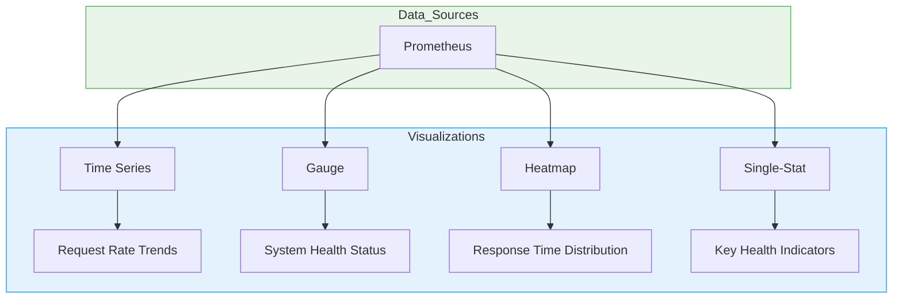
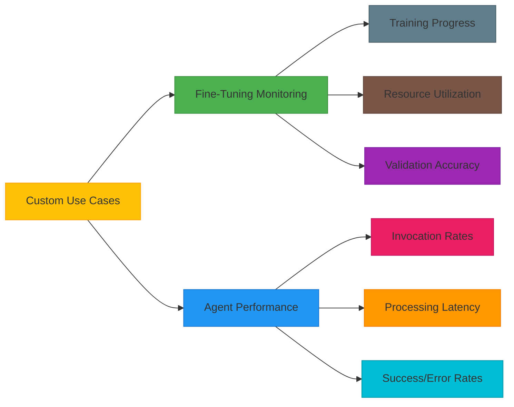
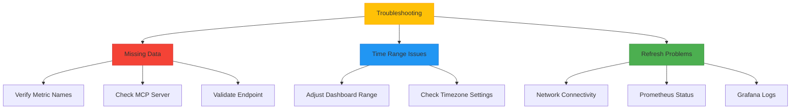
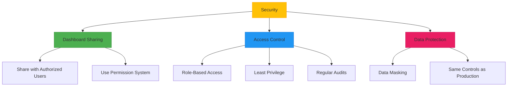

# Grafana Dashboards

<cite>
**Referenced Files in This Document**   
- [main.json](file://monitoring/grafana/dashboards/main.json)
- [prometheus.yml](file://monitoring/prometheus/prometheus.yml)
- [prometheus.yml](file://monitoring/grafana/datasources/prometheus.yml)
- [provider.yml](file://monitoring/grafana/dashboards/provider.yml)
- [metrics.py](file://api/routers/metrics.py)
- [system.py](file://api/routers/system.py)
- [collector.py](file://mahoun/core/metrics/collector.py)
- [decorators.py](file://mahoun/core/metrics/decorators.py)
- [metrics.py](file://mahoun/metrics/metrics.py)
- [server.py](file://mahoun/mcp/server.py)
</cite>

## Table of Contents
1. [Introduction](#introduction)
2. [Main Dashboard Structure](#main-dashboard-structure)
3. [Datasource Configuration](#datasource-configuration)
4. [Dashboard Provisioning](#dashboard-provisioning)
5. [Key Visualizations](#key-visualizations)
6. [Customization for Specific Use Cases](#customization-for-specific-use-cases)
7. [Troubleshooting Common Issues](#troubleshooting-common-issues)
8. [Security Considerations](#security-considerations)

## Introduction
The Grafana dashboard system in the Mahoun Platform provides comprehensive monitoring capabilities for system health, API performance, and LLM operations. The main dashboard (main.json) visualizes critical metrics collected from the MCP server and other components, with data sourced from Prometheus. This documentation details the structure of the main dashboard, datasource configuration, provisioning methods, key visualizations, customization options, troubleshooting guidance, and security considerations.

## Main Dashboard Structure
The main.json dashboard provides a comprehensive view of system metrics with panels for request rates, system status, and performance monitoring. The dashboard is configured with a dark theme and includes time series and gauge visualizations.

The dashboard structure includes:
- **Request Rate Panel**: Displays API request rates per minute using a time series visualization
- **System Status Panel**: Shows system health status using a gauge visualization
- **Time Range**: Configured to show data from the last hour by default
- **Annotations**: Includes dashboard-level annotations for alerts and events

The dashboard collects metrics from the MCP server, including request duration and system health indicators. The metrics are exposed through the /metrics endpoint and scraped by Prometheus at regular intervals.

**Section sources**
- [main.json](file://monitoring/grafana/dashboards/main.json#L1-L166)
- [metrics.py](file://api/routers/metrics.py#L1-L181)
- [system.py](file://api/routers/system.py#L1-L227)

## Datasource Configuration
The Grafana datasource is configured through the prometheus.yml file, which defines the connection to the Prometheus server. The configuration specifies the datasource name, type, access method, URL, and default status.

The datasource configuration includes:
- **Name**: "Prometheus" - the identifier for the datasource
- **Type**: "prometheus" - specifies the datasource type
- **Access**: "proxy" - Grafana acts as a proxy to the datasource
- **URL**: "http://prometheus:9090" - the endpoint for the Prometheus server
- **Default**: Set as the default datasource for the Grafana instance
- **Editable**: Marked as non-editable to prevent modifications

Prometheus itself is configured to scrape metrics from the MCP server at the /metrics endpoint on port 8000. The scrape interval is set to 10 seconds for the MCP server and 15 seconds for Prometheus self-monitoring.

```mermaid
graph TD
Grafana --> |Query| Prometheus
Prometheus --> |Scrape| MCP_Server
MCP_Server --> |Expose| Metrics_Endpoint[/metrics]
style Grafana fill:#4CAF50,stroke:#388E3C
style Prometheus fill:#E91E63,stroke:#C2185B
style MCP_Server fill:#2196F3,stroke:#1976D2
style Metrics_Endpoint fill:#FF9800,stroke:#F57C00
```

**Diagram sources **
- [prometheus.yml](file://monitoring/grafana/datasources/prometheus.yml#L1-L10)
- [prometheus.yml](file://monitoring/prometheus/prometheus.yml#L1-L24)
- [server.py](file://mahoun/mcp/server.py#L1-L331)

**Section sources**
- [prometheus.yml](file://monitoring/grafana/datasources/prometheus.yml#L1-L10)
- [prometheus.yml](file://monitoring/prometheus/prometheus.yml#L1-L24)

## Dashboard Provisioning
Dashboards are provisioned through Grafana's filesystem provisioning mechanism using the provider.yml configuration file. This automated approach ensures consistent dashboard deployment across environments.

The provisioning configuration includes:
- **Provider Name**: "Default" - identifies the dashboard provider
- **Organization ID**: 1 - specifies the Grafana organization
- **Type**: "file" - indicates filesystem-based provisioning
- **Path**: "/etc/grafana/provisioning/dashboards" - the directory containing dashboard JSON files
- **Editable**: Enabled to allow modifications through the Grafana UI
- **Disable Deletion**: Disabled to allow dashboard removal

The provisioning system automatically loads the main.json dashboard from the specified directory, eliminating the need for manual import through the Grafana interface. This approach supports version control and consistent deployment across development, staging, and production environments.

```mermaid
flowchart TD
A[Dashboard JSON Files] --> B[/etc/grafana/provisioning/dashboards]
B --> C[Grafana Server]
C --> D[Automatically Loaded Dashboards]
E[Version Control] --> A
F[CI/CD Pipeline] --> A
style A fill:#FFC107,stroke:#FFA000
style B fill:#2196F3,stroke:#1976D2
style C fill:#4CAF50,stroke:#388E3C
style D fill:#9C27B0,stroke:#7B1FA2
style E fill:#607D8B,stroke:#455A64
style F fill:#795548,stroke:#5D4037
```

**Diagram sources **
- [provider.yml](file://monitoring/grafana/dashboards/provider.yml#L1-L12)
- [main.json](file://monitoring/grafana/dashboards/main.json#L1-L166)

**Section sources**
- [provider.yml](file://monitoring/grafana/dashboards/provider.yml#L1-L12)

## Key Visualizations
The main dashboard includes several key visualizations for monitoring system performance and health. These visualizations are designed to provide immediate insights into system behavior and potential issues.

### Request Rate Time Series
The request rate panel displays the number of API requests per minute using a time series chart. This visualization helps identify traffic patterns, spikes, and potential denial-of-service attacks. The data is sourced from the mcp_request_duration_seconds_count metric, which tracks the number of requests processed by the MCP server.

### System Status Gauge
The system status panel uses a gauge visualization to display the current health of the system. The gauge shows a binary status (up/down) based on the mcp_server_up metric. This provides an at-a-glance view of system availability and helps quickly identify outages.

### Heatmap for Response Times
Although not currently implemented in the main.json dashboard, heatmaps are recommended for visualizing response time distributions over time. Heatmaps can reveal patterns in latency that might be missed in time series charts, such as periodic slowdowns or gradual performance degradation.

### Single-Stat Panels for Health Status
Single-stat panels are ideal for displaying key health indicators such as system uptime, memory usage, and CPU utilization. These panels provide a clear, focused view of critical metrics and can be configured with thresholds to highlight abnormal values.



**Diagram sources **
- [main.json](file://monitoring/grafana/dashboards/main.json#L1-L166)
- [metrics.py](file://api/routers/metrics.py#L1-L181)
- [collector.py](file://mahoun/core/metrics/collector.py#L1-L213)

**Section sources**
- [main.json](file://monitoring/grafana/dashboards/main.json#L1-L166)

## Customization for Specific Use Cases
The dashboard can be customized for specific monitoring requirements such as fine-tuning job monitoring and agent performance analysis. These customizations leverage the existing metrics collection framework and can be implemented through additional panels or dedicated dashboards.

### Fine-Tuning Job Monitoring
For monitoring fine-tuning jobs, additional panels can be added to track:
- Training progress (epochs completed, loss values)
- Resource utilization during training
- Validation accuracy over time
- Job completion status

These metrics can be sourced from the finetuning module, which already includes metrics tracking for training jobs.

### Agent Performance Analysis
Agent performance can be monitored by tracking:
- Agent invocation rates
- Processing latency for different agent types
- Success and error rates
- Resource consumption per agent

The metrics system already supports agent-specific metrics through the agent.* namespace, which can be leveraged for these visualizations.



**Diagram sources **
- [metrics.py](file://api/routers/metrics.py#L1-L181)
- [collector.py](file://mahoun/core/metrics/collector.py#L1-L213)
- [decorators.py](file://mahoun/core/metrics/decorators.py#L1-L170)

**Section sources**
- [metrics.py](file://api/routers/metrics.py#L1-L181)
- [collector.py](file://mahoun/core/metrics/collector.py#L1-L213)

## Troubleshooting Common Issues
Several common issues can affect dashboard functionality, including missing data, incorrect time ranges, and panel refresh problems. Understanding these issues and their solutions is essential for maintaining effective monitoring.

### Missing Data Due to Query Mismatches
Missing data often occurs when Prometheus queries don't match available metrics. This can happen after code changes that modify metric names or when the MCP server is not exposing metrics correctly. Solutions include:
- Verifying metric names in the Prometheus browser
- Checking that the MCP server is running and accessible
- Validating the metrics endpoint returns data
- Ensuring the scrape configuration matches the target

### Incorrect Time Ranges
Incorrect time ranges can make it difficult to analyze recent data or historical trends. Users should verify the dashboard's time range settings and adjust them as needed. The default range is set to the last hour, but this can be modified in the dashboard settings.

### Panel Refresh Problems
Panel refresh issues can result from network connectivity problems, high server load, or configuration errors. Troubleshooting steps include:
- Checking network connectivity between Grafana and Prometheus
- Verifying Prometheus is responsive
- Reviewing Grafana server logs for errors
- Adjusting refresh intervals for performance



**Diagram sources **
- [main.json](file://monitoring/grafana/dashboards/main.json#L1-L166)
- [prometheus.yml](file://monitoring/prometheus/prometheus.yml#L1-L24)
- [system.py](file://api/routers/system.py#L1-L227)

**Section sources**
- [main.json](file://monitoring/grafana/dashboards/main.json#L1-L166)
- [prometheus.yml](file://monitoring/prometheus/prometheus.yml#L1-L24)

## Security Considerations
Security is a critical aspect of dashboard deployment and access. The system implements several security measures to protect monitoring data and prevent unauthorized access.

### Dashboard Sharing
When sharing dashboards, consider the sensitivity of the data they contain. System performance metrics can reveal information about infrastructure capacity and usage patterns. Share dashboards only with authorized personnel and use Grafana's permission system to control access levels.

### Access Control
Grafana provides role-based access control (RBAC) to manage user permissions. Implement the principle of least privilege by assigning users the minimum permissions necessary for their roles. Regularly review and audit access permissions to ensure they remain appropriate.

### Data Protection
Monitoring data may contain sensitive information, especially in error messages or logs. Implement data masking for sensitive fields and ensure monitoring data is protected with the same security controls as production data.



**Diagram sources **
- [server.py](file://mahoun/mcp/server.py#L1-L331)
- [main.json](file://monitoring/grafana/dashboards/main.json#L1-L166)

**Section sources**
- [server.py](file://mahoun/mcp/server.py#L1-L331)