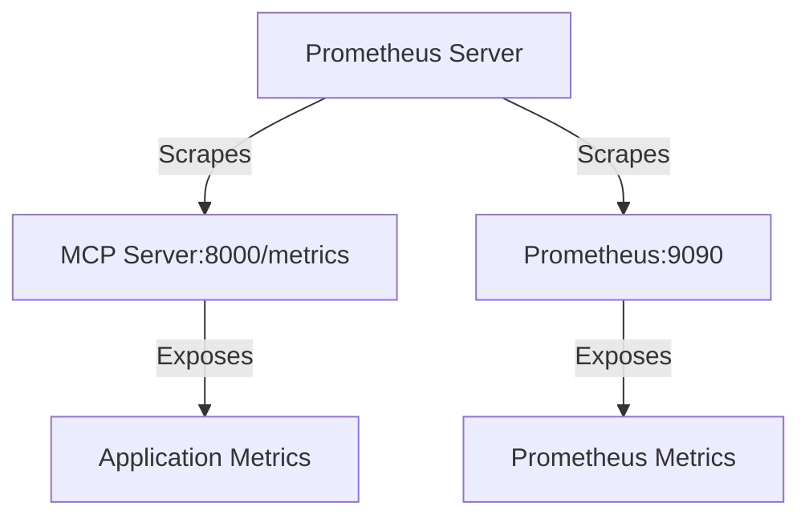
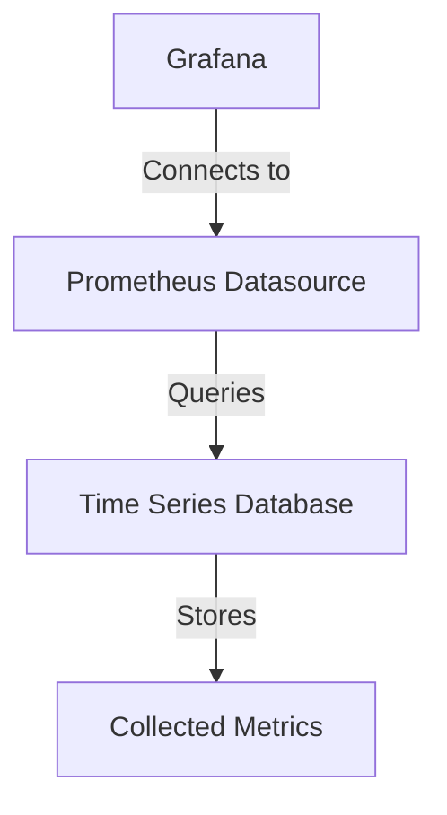
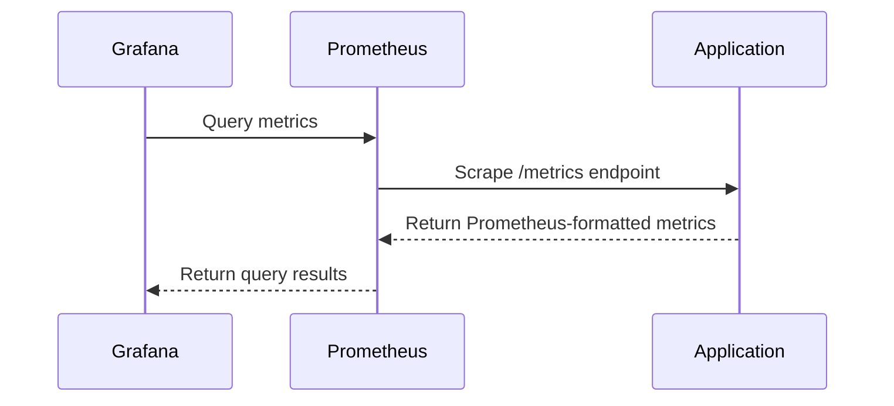

# Monitoring and Observability

<cite>
**Referenced Files in This Document**   
- [prometheus.yml](file://monitoring/prometheus/prometheus.yml)
- [prometheus.yml](file://docker-compose.yml#L306-L343)
- [prometheus.yml](file://monitoring/prometheus/prometheus.yml)
- [prometheus.yml](file://monitoring/grafana/datasources/prometheus.yml)
- [main.json](file://monitoring/grafana/dashboards/main.json)
- [api_router.py](file://mahoun/api_router.py#L55-L82)
- [metrics.py](file://api/routers/metrics.py)
- [health_checker.py](file://mahoun/core/health_checker.py)
- [docker-compose.yml](file://docker-compose.yml#L71-L77)
- [docker-compose.yml](file://docker-compose.yml#L348-L388)
</cite>

## Table of Contents
1. [Introduction](#introduction)
2. [Prometheus Configuration](#prometheus-configuration)
3. [Grafana Provisioning](#grafana-provisioning)
4. [Application Metrics Integration](#application-metrics-integration)
5. [Monitoring Profile Setup](#monitoring-profile-setup)
6. [Security Configuration](#security-configuration)
7. [Troubleshooting Guide](#troubleshooting-guide)
8. [Health Checks and Monitoring Relationship](#health-checks-and-monitoring-relationship)

## Introduction
The Mahoun Platform implements a comprehensive monitoring and observability stack using Prometheus and Grafana to ensure system reliability, performance, and operational visibility. This documentation details the configuration and integration of monitoring components across the platform, focusing on metrics collection, visualization, and health monitoring. The system is designed to provide real-time insights into application performance, service health, and infrastructure metrics, enabling proactive issue detection and resolution.

## Prometheus Configuration

### Scrape Targets and Job Configuration
Prometheus is configured to collect metrics from key services within the Mahoun Platform. The configuration defines specific scrape jobs for different components:

- **MCP Server**: Scrapes metrics from the MCP server at `mcp-server:8000` with a 10-second interval on the `/metrics` endpoint
- **Prometheus Self-Monitoring**: Collects metrics from the Prometheus server itself at `localhost:9090`

The global configuration sets a 15-second scrape interval and evaluation interval, with external labels identifying the cluster as 'mahoun-platform' in a 'production' environment.



**Diagram sources**
- [prometheus.yml](file://monitoring/prometheus/prometheus.yml#L1-L23)

**Section sources**
- [prometheus.yml](file://monitoring/prometheus/prometheus.yml#L1-L23)

### Retention Policies and Storage Configuration
Prometheus is configured with a 30-day retention policy for time-series data, ensuring historical metrics are available for trend analysis and troubleshooting. The storage configuration specifies:

- Storage path: `/prometheus` (persisted via Docker volume)
- Retention time: 30 days
- Web lifecycle management enabled for remote configuration reloads

The retention policy balances storage requirements with the need for historical data analysis, allowing for long-term performance monitoring and capacity planning.

**Section sources**
- [docker-compose.yml](file://docker-compose.yml#L318)

## Grafana Provisioning

### Datasource Configuration
Grafana is provisioned with a default Prometheus datasource configured through YAML provisioning. The datasource configuration includes:

- Name: "Prometheus"
- Type: "prometheus"
- Access mode: "proxy"
- URL: "http://prometheus:9090"
- Set as default datasource
- Non-editable to prevent accidental modifications

This automated provisioning ensures consistent datasource configuration across deployments and eliminates manual setup steps.



**Diagram sources**
- [prometheus.yml](file://monitoring/grafana/datasources/prometheus.yml#L1-L10)

**Section sources**
- [prometheus.yml](file://monitoring/grafana/datasources/prometheus.yml#L1-L10)

### Dashboard Structure and Visualization Components
The main Grafana dashboard (`main.json`) provides a comprehensive view of platform metrics with the following components:

- **Request Rate Panel**: Timeseries visualization showing the rate of requests per minute using the `rate(mcp_request_duration_seconds_count[1m])` query
- **System Status Panel**: Gauge visualization displaying the `mcp_server_up` metric to indicate service availability
- **Dashboard Configuration**: Dark theme with 30-second refresh interval, auto-orientation for visualizations, and single-tooltip mode

The dashboard is provisioned automatically through Grafana's dashboard provisioning system, ensuring consistent deployment across environments.

```mermaid
graph TD
Dashboard[Main Dashboard] --> RequestRate[Request Rate Panel]
Dashboard --> SystemStatus[System Status Panel]
RequestRate --> |Query| PrometheusQuery1[rate(mcp_request_duration_seconds_count[1m])]
SystemStatus --> |Query| PrometheusQuery2[mcp_server_up]
```

**Diagram sources**
- [main.json](file://monitoring/grafana/dashboards/main.json#L1-L166)

**Section sources**
- [main.json](file://monitoring/grafana/dashboards/main.json#L1-L166)

## Application Metrics Integration

### Metrics Exposure and Collection
Application metrics are exposed through dedicated endpoints in the Mahoun Platform. The metrics collection system provides:

- **Prometheus Format**: `/metrics` endpoint returns metrics in Prometheus text format
- **JSON Format**: `/metrics/json` endpoint returns metrics as structured JSON
- **Component Filtering**: Support for filtering metrics by component name
- **Historical Data**: Collection of metrics history for trend analysis

The metrics system collects various types of metrics:
- Counters: Monotonic increasing values (e.g., request counts)
- Gauges: Point-in-time values (e.g., current queue size)
- Histograms: Distribution of values (e.g., request durations)



**Section sources**
- [api_router.py](file://mahoun/api_router.py#L55-L82)
- [metrics.py](file://api/routers/metrics.py)

## Monitoring Profile Setup

### Docker Compose Configuration
The monitoring stack is enabled through Docker Compose profiles, allowing selective activation of monitoring services. The configuration includes:

- **Prometheus Service**: Configured with the 'monitoring' profile, exposing port 9090 and mounting the configuration file
- **Grafana Service**: Configured with the 'monitoring' profile, exposing port 3000 and mounting provisioning configurations

To enable the monitoring profile, use the following command:
```bash
docker compose --profile monitoring up
```

This profile-based approach allows developers to run the core application without monitoring overhead while enabling full observability in production and testing environments.

**Section sources**
- [docker-compose.yml](file://docker-compose.yml#L306-L343)
- [docker-compose.yml](file://docker-compose.yml#L348-L388)

## Security Configuration

### Grafana Access Security
Grafana access is secured through environment variable configuration:

- **Admin User**: Configurable via `GRAFANA_USER` environment variable (defaults to 'admin')
- **Admin Password**: Configurable via `GRAFANA_ADMIN_PASSWORD` environment variable
- **User Registration**: Disabled (`GF_USERS_ALLOW_SIGN_UP=false`) to prevent unauthorized account creation
- **Plugin Installation**: Pre-configured plugins for enhanced visualization capabilities

The configuration ensures that Grafana instances are not deployed with default credentials, reducing the risk of unauthorized access.

**Section sources**
- [docker-compose.yml](file://docker-compose.yml#L358-L362)

## Troubleshooting Guide

### Common Monitoring Issues and Solutions
This section addresses common issues encountered with the monitoring stack and provides resolution steps.

#### Failed Scrapes
**Symptoms**: Prometheus targets showing as down in the Targets page
**Causes and Solutions**:
- Target service not running: Verify the target service is healthy and accessible
- Network connectivity issues: Check Docker network configuration and service dependencies
- Incorrect scrape configuration: Validate the job configuration in `prometheus.yml`
- Authentication requirements: Ensure the target endpoint doesn't require authentication

#### Missing Metrics
**Symptoms**: Expected metrics not appearing in Prometheus or Grafana
**Causes and Solutions**:
- Metrics endpoint not exposed: Verify the application exposes metrics at the configured path
- Scraping configuration error: Check the `metrics_path` in the scrape job configuration
- Application metrics disabled: Verify metrics are enabled in the application configuration
- Label filtering: Check if dashboard variables or filters are hiding the metrics

#### Dashboard Rendering Problems
**Symptoms**: Grafana dashboards not displaying data or showing errors
**Causes and Solutions**:
- Datasource issues: Verify the Prometheus datasource is properly configured and accessible
- Query syntax errors: Check the PromQL queries in dashboard panels
- Time range mismatches: Adjust the dashboard time range to match available data
- Panel configuration issues: Verify panel settings and variable configurations

**Section sources**
- [docker-compose.yml](file://docker-compose.yml#L330-L334)
- [docker-compose.yml](file://docker-compose.yml#L375-L380)

## Health Checks and Monitoring Relationship

### Integration of Health Checks and Monitoring
The platform's health checks are tightly integrated with the monitoring system, providing a comprehensive view of service health. Key relationships include:

- **Docker Health Checks**: Each service has Docker health checks that determine container health
- **Prometheus Scraping**: Prometheus scrapes metrics endpoints, with scrape success indicating service availability
- **Health Check Endpoint**: The `/health` endpoint provides detailed component health information
- **Grafana Visualization**: Health status is visualized in Grafana dashboards for operational visibility

The health check system in `health_checker.py` performs comprehensive checks on all platform components, including:
- Ollama LLM service
- VectorStore/ChromaDB
- Neo4j/Graph system
- Registered agents
- Database connections

These health checks are exposed through the `/health` endpoint and are used by both Docker health checks and Prometheus monitoring.

```mermaid
graph TD
Docker[Docker Health Check] --> |Checks| HTTP[HTTP /health endpoint]
Prometheus[Prometheus] --> |Scrapes| Metrics[/metrics endpoint]
HTTP --> |Returns| HealthStatus[Health Status]
Metrics --> |Returns| ApplicationMetrics[Application Metrics]
HealthStatus --> |Influences| Container[Container Health]
ApplicationMetrics --> |Stored in| TSDB[Time Series Database]
TSDB --> |Queried by| Grafana[Grafana Dashboards]
```

**Diagram sources**
- [health_checker.py](file://mahoun/core/health_checker.py#L1-L661)
- [docker-compose.yml](file://docker-compose.yml#L71-L77)

**Section sources**
- [health_checker.py](file://mahoun/core/health_checker.py#L1-L661)
- [docker-compose.yml](file://docker-compose.yml#L71-L77)