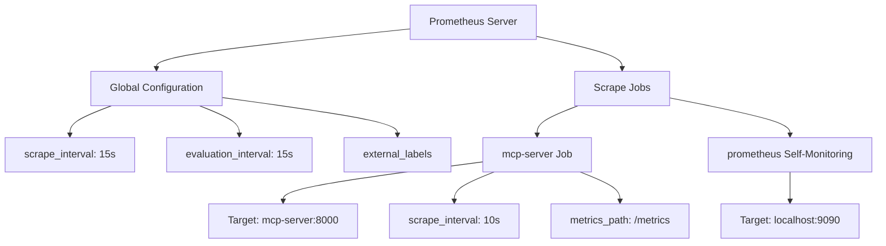
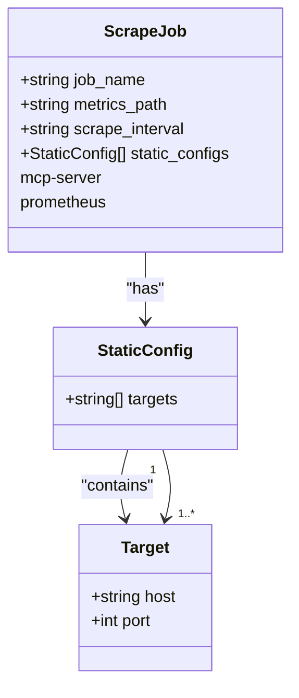
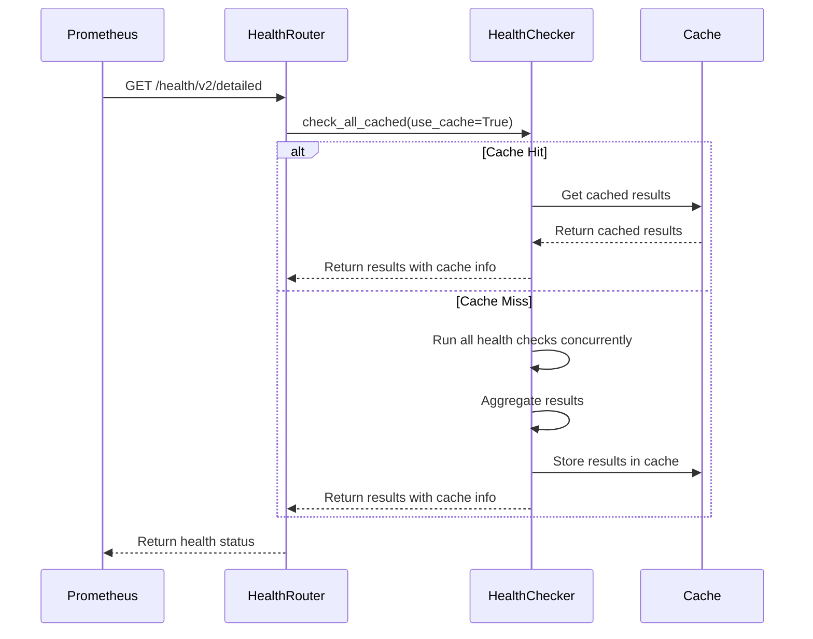
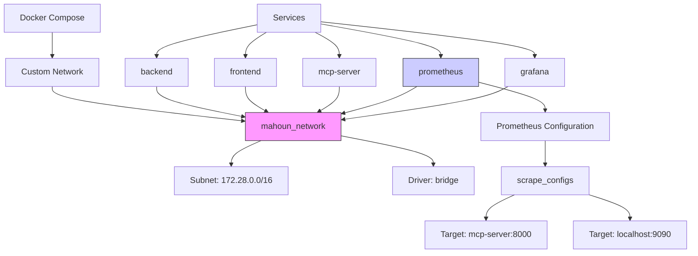
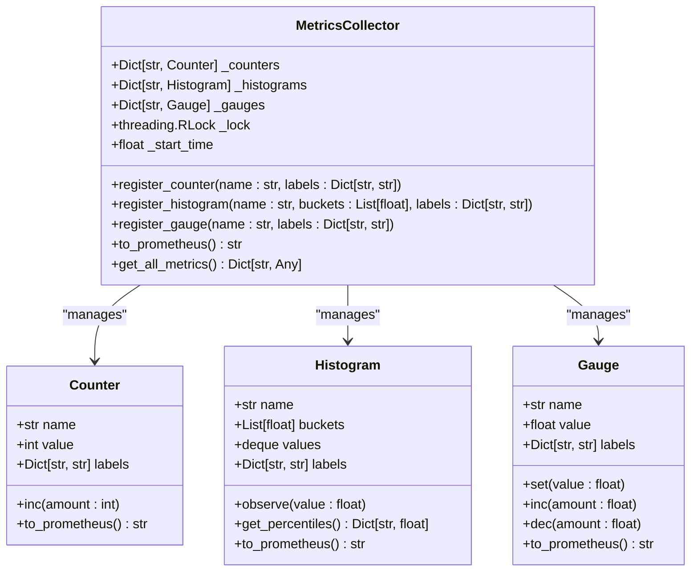
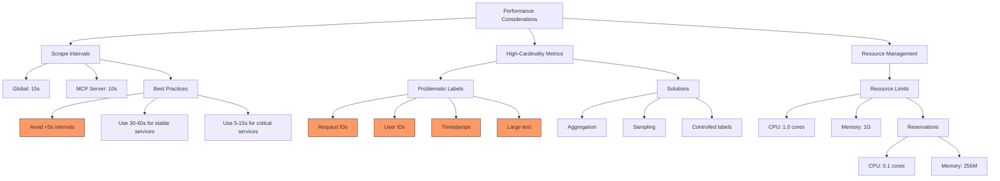

# Prometheus Configuration

<cite>
**Referenced Files in This Document**   
- [prometheus.yml](file://monitoring/prometheus/prometheus.yml)
- [docker-compose.yml](file://docker-compose.yml)
- [health_v2.py](file://api/routers/health_v2.py)
- [health_checker.py](file://mahoun/core/health_checker.py)
- [metrics.py](file://mahoun/metrics/metrics.py)
- [collector.py](file://mahoun/core/metrics/collector.py)
- [decorators.py](file://mahoun/core/metrics/decorators.py)
- [api_router.py](file://mahoun/api_router.py)
</cite>

## Table of Contents
1. [Introduction](#introduction)
2. [Prometheus Configuration Overview](#prometheus-configuration-overview)
3. [Scrape Configuration for Microservices](#scrape-configuration-for-microservices)
4. [Health Check Endpoint Integration](#health-check-endpoint-integration)
5. [Service Discovery in Docker Compose](#service-discovery-in-docker-compose)
6. [Metric Retention and Alerting](#metric-retention-and-alerting)
7. [Custom Job Configuration Examples](#custom-job-configuration-examples)
8. [Common Issues and Troubleshooting](#common-issues-and-troubleshooting)
9. [Performance Considerations](#performance-considerations)
10. [Conclusion](#conclusion)

## Introduction

This document provides comprehensive documentation for the Prometheus monitoring configuration in the MAHOUN Platform. It details the prometheus.yml configuration file and its integration with platform services, focusing on scrape configurations, health check endpoints, service discovery mechanisms, and best practices for monitoring the microservices architecture. The documentation covers how Prometheus collects metrics from various components of the system, including backend services, MCP server, and self-monitoring capabilities.

The MAHOUN Platform utilizes Prometheus as its primary monitoring solution, integrated with Grafana for visualization. The monitoring stack is designed to provide comprehensive observability into the health and performance of all system components, enabling proactive issue detection and resolution.

**Section sources**
- [prometheus.yml](file://monitoring/prometheus/prometheus.yml#L1-L24)
- [docker-compose.yml](file://docker-compose.yml#L306-L344)

## Prometheus Configuration Overview

The Prometheus configuration in the MAHOUN Platform is defined in the prometheus.yml file located in the monitoring/prometheus directory. The configuration establishes global settings and defines scrape jobs for collecting metrics from various services.

The global configuration sets fundamental parameters for Prometheus operation:
- **scrape_interval**: 15 seconds, determining how frequently Prometheus scrapes metrics from targets
- **evaluation_interval**: 15 seconds, defining how often alerting rules are evaluated
- **external_labels**: Cluster and environment identifiers for multi-cluster setups

The configuration includes two primary scrape jobs:
1. **mcp-server**: Scrapes metrics from the MCP server at mcp-server:8000 with a 10-second interval
2. **prometheus**: Self-monitoring job that scrapes Prometheus metrics from localhost:9090

Alerting rules are configured to load from /etc/prometheus/alerts/*.yml, allowing for dynamic alert management. The configuration is designed to be minimal and focused, relying on Docker Compose service discovery for automatic target detection rather than complex service discovery mechanisms.



**Diagram sources**
- [prometheus.yml](file://monitoring/prometheus/prometheus.yml#L1-L24)

**Section sources**
- [prometheus.yml](file://monitoring/prometheus/prometheus.yml#L1-L24)

## Scrape Configuration for Microservices

The scrape configuration in prometheus.yml defines how Prometheus collects metrics from microservices in the MAHOUN Platform. Currently, the configuration includes two scrape jobs: one for the MCP server and one for Prometheus self-monitoring.

The MCP server job is configured with specific parameters:
- **job_name**: 'mcp-server' - Identifies the service being monitored
- **static_configs**: Defines the target as mcp-server:8000 using Docker service name resolution
- **metrics_path**: '/metrics' - Specifies the endpoint where metrics are exposed
- **scrape_interval**: 10 seconds - Overrides the global interval for more frequent monitoring of this critical service

The self-monitoring job for Prometheus allows the system to monitor its own health and performance, which is essential for ensuring the reliability of the monitoring infrastructure itself. This job uses the default global scrape interval of 15 seconds.

While the current configuration only explicitly defines the MCP server, other services in the platform expose metrics that could be scraped. The architecture supports adding additional scrape jobs for services such as the backend API, Neo4j, PostgreSQL, Redis, and ChromaDB by following the same pattern used for the MCP server job.



**Diagram sources**
- [prometheus.yml](file://monitoring/prometheus/prometheus.yml#L8-L20)

**Section sources**
- [prometheus.yml](file://monitoring/prometheus/prometheus.yml#L8-L20)
- [docker-compose.yml](file://docker-compose.yml#L306-L344)

## Health Check Endpoint Integration

The MAHOUN Platform exposes comprehensive health check endpoints through the health_v2.py router, which are critical for monitoring service health and availability. These endpoints provide both basic and detailed health information that can be used for service monitoring and alerting.

The health check system exposes three primary endpoints:
- **GET /health/v2**: Basic health check that returns a simple status response
- **GET /health/v2/detailed**: Comprehensive health check for all system components
- **GET /health/v2/component/{component}**: Component-specific health check

The detailed health check evaluates multiple system components including Ollama LLM Service, ChromaDB/VectorStore, Neo4j/Graph (if enabled), UltraReasoningService, and all registered agents. The health checker implements caching with a configurable TTL (default: 30 seconds) to reduce load on the system while providing timely health information.

Each service in the Docker Compose configuration includes a healthcheck definition that uses curl to verify service availability. For example, the backend service checks http://localhost:8000/system/health, while the frontend checks http://localhost/. These health checks are used by Docker to determine service readiness and can be integrated with Prometheus for monitoring.



**Diagram sources**
- [health_v2.py](file://api/routers/health_v2.py#L1-L158)
- [health_checker.py](file://mahoun/core/health_checker.py#L1-L661)

**Section sources**
- [health_v2.py](file://api/routers/health_v2.py#L1-L158)
- [health_checker.py](file://mahoun/core/health_checker.py#L1-L661)
- [docker-compose.yml](file://docker-compose.yml#L71-L77)

## Service Discovery in Docker Compose

The MAHOUN Platform leverages Docker Compose's built-in service discovery mechanism to enable automatic target detection for Prometheus monitoring. This approach simplifies configuration and ensures that services can be discovered and monitored as they are added or removed from the system.

The Docker Compose configuration defines a custom bridge network named "mahoun_network" with the subnet 172.28.0.0/16. All services are connected to this network, enabling them to communicate using service names as hostnames. This network configuration is essential for Prometheus to discover and scrape metrics from services using their service names (e.g., mcp-server:8000).

Service discovery is implemented through several key mechanisms:
1. **Service Names as Hostnames**: Services can be addressed using their Docker Compose service names
2. **Static Configuration in Prometheus**: The prometheus.yml file uses service names in the static_configs targets
3. **Container Networking**: The custom bridge network enables seamless communication between containers

The prometheus service in docker-compose.yml is configured with specific parameters:
- **image**: prom/prometheus:v3.2.1 - Uses the official Prometheus image
- **ports**: Maps container port 9090 to the host (configurable via PROMETHEUS_PORT)
- **command**: Specifies configuration file, storage path, and retention time
- **volumes**: Mounts the prometheus.yml configuration file as read-only
- **networks**: Connects to the mahoun-internal network for service discovery

This service discovery approach eliminates the need for complex service discovery configurations in Prometheus, relying instead on Docker's built-in DNS-based service discovery.



**Diagram sources**
- [docker-compose.yml](file://docker-compose.yml#L306-L344)
- [prometheus.yml](file://monitoring/prometheus/prometheus.yml#L8-L20)

**Section sources**
- [docker-compose.yml](file://docker-compose.yml#L306-L344)
- [prometheus.yml](file://monitoring/prometheus/prometheus.yml#L8-L20)

## Metric Retention and Alerting

The Prometheus configuration in the MAHOUN Platform includes settings for metric retention and alerting to ensure effective monitoring and historical data analysis. These configurations balance storage requirements with the need for historical data for troubleshooting and analysis.

Metric retention is configured through the command-line arguments in the docker-compose.yml file:
- **--storage.tsdb.retention.time=30d**: Sets the data retention period to 30 days
- **--storage.tsdb.path=/prometheus**: Specifies the storage directory for time-series data

The 30-day retention period provides sufficient historical data for trend analysis, capacity planning, and incident investigation while managing storage requirements. The data is stored in the prometheus_data named volume, which persists across container restarts.

Alerting is configured through the rule_files directive in prometheus.yml:
- **rule_files**: Points to /etc/prometheus/alerts/*.yml, allowing for dynamic loading of alerting rules
- This configuration enables the platform to define and manage alerting rules separately from the main configuration

The alerting system can be extended by adding YAML files in the alerts directory that define alerting rules based on metric thresholds, service health, or other conditions. These alerts can be integrated with notification systems to provide timely alerts for operational issues.

```mermaid
flowchart TD
A[Metrics Collection] --> B[Time-Series Database]
B --> C[Data Storage]
C --> D[Retention Policy]
D --> E[30-Day Retention]
E --> F[Data Expiration]
F --> G[Storage Optimization]
H[Alerting Rules] --> I[Rule Evaluation]
I --> J[Condition Check]
J --> K{Threshold Exceeded?}
K --> |Yes| L[Trigger Alert]
K --> |No| M[Continue Monitoring]
L --> N[Notification System]
N --> O[Ops Team]
P[Prometheus Configuration] --> Q[rule_files]
Q --> R[/etc/prometheus/alerts/*.yml]
R --> H
style E fill:#f96,stroke:#333
style L fill:#f66,stroke:#333
```

**Diagram sources**
- [docker-compose.yml](file://docker-compose.yml#L318)
- [prometheus.yml](file://monitoring/prometheus/prometheus.yml#L22-L23)

**Section sources**
- [docker-compose.yml](file://docker-compose.yml#L318)
- [prometheus.yml](file://monitoring/prometheus/prometheus.yml#L22-L23)

## Custom Job Configuration Examples

The MAHOUN Platform's Prometheus configuration can be extended with custom job configurations to monitor additional backend services. While the current configuration only includes the MCP server, the architecture supports adding scrape jobs for other services such as the backend API, database services, and specialized components.

Example configuration for monitoring the backend API service:
```yaml
- job_name: 'backend-api'
  static_configs:
    - targets: ['backend:8000']
  metrics_path: '/metrics'
  scrape_interval: 15s
  relabel_configs:
    - source_labels: [__address__]
      target_label: instance
      replacement: 'backend-api'
```

Example configuration for monitoring database services:
```yaml
- job_name: 'database-services'
  static_configs:
    - targets: ['postgres:5432', 'redis:6379', 'neo4j:7687']
  metrics_path: '/metrics'
  scrape_interval: 30s
  relabel_configs:
    - source_labels: [__address__]
      target_label: service
      regex: '(.*):.*'
      replacement: '$1'
```

To add a new scrape target, follow these steps:
1. Ensure the target service exposes metrics on a HTTP endpoint (typically /metrics)
2. Verify the service is on the same Docker network as Prometheus
3. Add a new job to the scrape_configs section of prometheus.yml
4. Specify the job_name, targets, metrics_path, and scrape_interval
5. Optionally add relabeling rules to modify labels
6. Restart the Prometheus service to apply the configuration

The metrics endpoint is implemented in the platform using the MetricsCollector class, which exports metrics in Prometheus format. Services register counters, histograms, and gauges that are then exposed through the /metrics endpoint.



**Diagram sources**
- [metrics.py](file://mahoun/metrics/metrics.py#L1-L357)
- [collector.py](file://mahoun/core/metrics/collector.py#L1-L213)

**Section sources**
- [metrics.py](file://mahoun/metrics/metrics.py#L1-L357)
- [collector.py](file://mahoun/core/metrics/collector.py#L1-L213)
- [api_router.py](file://mahoun/api_router.py#L55-L67)

## Common Issues and Troubleshooting

When configuring Prometheus monitoring for the MAHOUN Platform, several common issues may arise that affect the reliability and effectiveness of the monitoring system. Understanding these issues and their solutions is critical for maintaining observability.

**Failed Scrapes Due to Network Isolation**:
One of the most common issues is failed scrapes due to services not being on the same Docker network. Ensure that both Prometheus and the target service are connected to the mahoun-internal network as defined in docker-compose.yml. Verify network connectivity by checking that service names can be resolved within containers.

**Incorrect Port Mappings**:
Ensure that the port specified in the scrape target matches the actual port exposed by the service. For example, the MCP server is configured to run on port 8000, so the target should be mcp-server:8000. Verify port mappings in the docker-compose.yml file and ensure that services are actually listening on the expected ports.

**Missing Metrics Endpoints**:
Some services may not expose metrics on the expected endpoint. Verify that services have implemented a /metrics endpoint that returns Prometheus-formatted metrics. The platform's metrics system uses the MetricsCollector class to expose metrics in the correct format.

**TLS/mTLS Issues**:
While the current configuration does not use TLS for internal service communication, if TLS were to be implemented, Prometheus would need to be configured with appropriate certificates and settings to scrape HTTPS endpoints. This would require adding tls_config to the scrape job configuration.

**Scrape Interval Conflicts**:
Avoid setting scrape intervals that are too aggressive, as this can overload services. The global scrape_interval is 15s, which is appropriate for most services. Only critical services should use shorter intervals, and even then, 10s is typically sufficient.

```mermaid
flowchart TD
A[Scrape Failure] --> B{Check Network}
B --> |Same Network?| C{Check Port}
B --> |No| D[Connect to mahoun-internal Network]
C --> |Correct?| E{Check Endpoint}
C --> |No| F[Update Target Port]
E --> |Exists?| G{Check Metrics Format]
E --> |No| H[Implement /metrics Endpoint]
G --> |Prometheus?| I[Successful Scrape]
G --> |No| J[Use MetricsCollector]
style D fill:#f96,stroke:#333
style F fill:#f96,stroke:#333
style H fill:#f96,stroke:#333
style J fill:#f96,stroke:#333
style I fill:#6f9,stroke:#333
```

**Diagram sources**
- [docker-compose.yml](file://docker-compose.yml#L328)
- [prometheus.yml](file://monitoring/prometheus/prometheus.yml#L12)

**Section sources**
- [docker-compose.yml](file://docker-compose.yml#L328)
- [prometheus.yml](file://monitoring/prometheus/prometheus.yml#L12)

## Performance Considerations

Effective Prometheus configuration requires careful consideration of performance implications, particularly regarding scrape intervals, high-cardinality metrics, and resource utilization. These factors directly impact the stability and efficiency of both the monitoring system and the monitored services.

**Scrape Interval Tuning**:
The scrape interval should be carefully tuned to balance monitoring granularity with system load. The current configuration uses:
- Global scrape_interval: 15 seconds (appropriate for most services)
- MCP server scrape_interval: 10 seconds (for critical service monitoring)

Best practices for scrape interval tuning:
- Use longer intervals (30-60s) for stable, low-priority services
- Use shorter intervals (5-15s) for critical, high-traffic services
- Avoid intervals shorter than 5s to prevent excessive load
- Consider the number of targets when setting intervals

**High-Cardinality Metrics**:
High-cardinality metrics can significantly impact Prometheus performance and storage requirements. In the MAHOUN Platform, avoid creating metrics with labels that have high cardinality, such as:
- Request IDs or session IDs
- User IDs in multi-tenant environments
- Timestamps or dates as labels
- Large text fields

Instead, use appropriate aggregation and sampling strategies. The platform's MetricsCollector class helps manage cardinality by providing structured counter, histogram, and gauge types with controlled label usage.

**Resource Management**:
The Prometheus container is configured with resource limits to prevent excessive resource consumption:
- CPU limit: 1.0 cores
- Memory limit: 1G
- CPU reservation: 0.1 cores
- Memory reservation: 256M

These limits ensure that Prometheus does not consume excessive resources while maintaining sufficient capacity for its operations.



**Diagram sources**
- [prometheus.yml](file://monitoring/prometheus/prometheus.yml#L2-L3)
- [docker-compose.yml](file://docker-compose.yml#L337-L343)

**Section sources**
- [prometheus.yml](file://monitoring/prometheus/prometheus.yml#L2-L3)
- [docker-compose.yml](file://docker-compose.yml#L337-L343)

## Conclusion

The Prometheus configuration in the MAHOUN Platform provides a robust foundation for monitoring the health and performance of microservices. The current setup effectively monitors the MCP server and includes self-monitoring capabilities, with the potential to expand to other services in the ecosystem.

Key strengths of the current configuration include:
- Simple, maintainable configuration using static service discovery
- Appropriate scrape intervals that balance monitoring granularity with system load
- Integration with Docker Compose networking for reliable service discovery
- Configurable metric retention (30 days) that balances historical data needs with storage requirements
- Support for alerting rules to enable proactive issue detection

To enhance the monitoring capabilities, consider the following recommendations:
1. Add scrape jobs for additional critical services such as the backend API, database services, and specialized components
2. Implement more sophisticated alerting rules based on service health and performance metrics
3. Consider adding service discovery mechanisms for dynamic environments
4. Monitor high-cardinality metrics to prevent performance issues
5. Regularly review and optimize scrape intervals based on actual service requirements

The health check system, particularly the enhanced health_v2 endpoints, provides comprehensive visibility into system health and can be leveraged for both monitoring and automated recovery scenarios. By following the patterns established in the current configuration, the monitoring system can be extended to cover the entire platform while maintaining reliability and performance.

**Section sources**
- [prometheus.yml](file://monitoring/prometheus/prometheus.yml#L1-L24)
- [docker-compose.yml](file://docker-compose.yml#L306-L344)
- [health_v2.py](file://api/routers/health_v2.py#L1-L158)