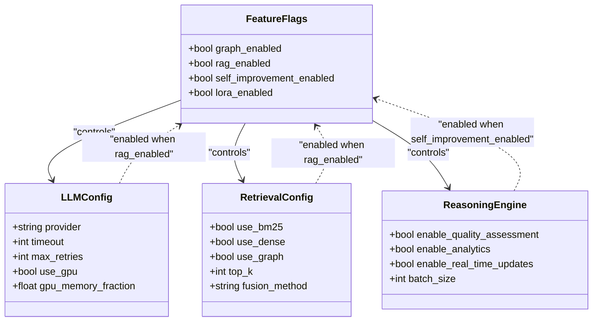
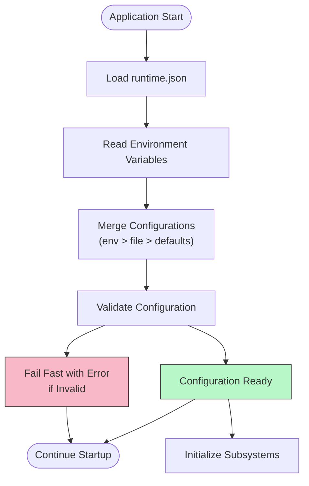
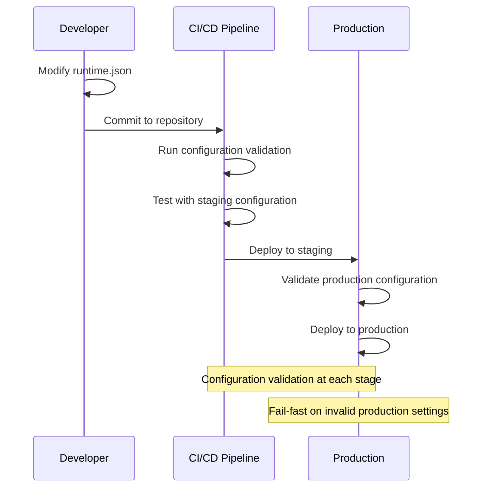

# Configuration Management

<cite>
**Referenced Files in This Document**   
- [runtime.json](file://config/runtime.json)
- [runtime.py](file://config/runtime.py)
- [runtime_config.py](file://mahoun/core/runtime_config.py)
- [config.py](file://mahoun/core/config.py)
- [settings.py](file://mahoun/core/settings.py)
- [main.py](file://api/main.py)
</cite>

## Table of Contents
1. [Introduction](#introduction)
2. [Runtime Configuration Architecture](#runtime-configuration-architecture)
3. [Feature Flag Management](#feature-flag-management)
4. [Environment Variable Integration](#environment-variable-integration)
5. [Production Configuration Examples](#production-configuration-examples)
6. [Environment-Specific Configuration](#environment-specific-configuration)
7. [Configuration Best Practices](#configuration-best-practices)

## Introduction
The Mahoun Platform employs a sophisticated configuration management system that combines runtime.json configuration files with environment variables to control system behavior across different deployment environments. This document provides comprehensive guidance on managing runtime configuration, focusing on feature flags, environment variable integration, and production-ready configurations. The system is designed with enterprise-grade principles including fail-fast validation, hierarchical configuration, and strict separation of configuration from code.

## Runtime Configuration Architecture

The Mahoun Platform's configuration system follows a hierarchical approach with multiple layers of configuration sources. The primary configuration file, runtime.json, serves as the foundation for system settings, while environment variables provide runtime overrides. The system implements a fail-fast validation mechanism that ensures configuration integrity, particularly in production environments.

The configuration architecture follows these key principles:
- **Immutable configuration**: Settings are immutable after loading to prevent runtime modifications
- **Hierarchical precedence**: Environment variables override file configuration, which overrides defaults
- **Fail-fast validation**: Invalid configurations are rejected at startup with clear error messages
- **Thread-safe access**: Configuration is accessed through a thread-safe singleton pattern
- **Audit logging**: Configuration changes and loading events are logged for audit purposes

The system uses Pydantic Settings V2 for strict validation and type safety, ensuring that all configuration values meet specified requirements before the application starts. This approach prevents runtime errors caused by invalid configuration and provides clear feedback during deployment.

**Section sources**
- [config.py](file://mahoun/core/config.py#L1-L857)
- [runtime.json](file://config/runtime.json#L1-L89)
- [runtime.py](file://config/runtime.py#L1-L43)

## Feature Flag Management

Feature flags in the Mahoun Platform provide granular control over system capabilities, allowing teams to enable or disable specific features without code changes. The primary feature flags are defined in the runtime.json file and can be overridden by environment variables.

### Core Feature Flags

The following feature flags control major system capabilities:



**Diagram sources**
- [runtime.json](file://config/runtime.json#L11-L16)
- [runtime_config.py](file://mahoun/core/runtime_config.py#L41-L44)

### Feature Flag Behavior

The three primary feature flags—graph_enabled, rag_enabled, and self_improvement_enabled—control fundamental system behaviors:

- **graph_enabled**: When enabled, activates the knowledge graph subsystem, including Neo4j integration, graph-based retrieval, and GAT (Graph Attention Network) processing. This flag controls whether graph operations are performed during document ingestion and query processing.

- **rag_enabled**: Enables Retrieval-Augmented Generation capabilities, activating vector storage, hybrid search (BM25 + dense retrieval), and citation generation. When disabled, the system operates in a simpler mode without document retrieval augmentation.

- **self_improvement_enabled**: Controls the self-improvement system, including feedback collection, active learning, and policy deployment. When enabled, the system can adapt its behavior based on user feedback and performance metrics.

These flags follow a consistent pattern: they are defined in runtime.json with default values, but can be overridden by corresponding environment variables (MAHOUN_ENABLE_GRAPH, MAHOUN_ENABLE_RAG, MAHOUN_ENABLE_SELF_IMPROVEMENT). The system evaluates these flags at startup and configures the appropriate subsystems accordingly.

**Section sources**
- [runtime.json](file://config/runtime.json#L11-L16)
- [runtime_config.py](file://mahoun/core/runtime_config.py#L41-L44)
- [config.py](file://mahoun/core/config.py#L409-L423)

## Environment Variable Integration

The Mahoun Platform uses environment variables as the primary mechanism for runtime configuration, allowing for flexible deployment across different environments without modifying configuration files. Environment variables follow a consistent naming convention with the MAHOUN_ prefix and provide the highest precedence in the configuration hierarchy.

### Environment Variable Processing

The configuration system processes environment variables through a well-defined pipeline:



**Diagram sources**
- [runtime_config.py](file://mahoun/core/runtime_config.py#L129-L238)
- [config.py](file://mahoun/core/config.py#L428-L434)

### Key Environment Variables

The following environment variables are critical for controlling system behavior:

| Environment Variable | Purpose | Default | Production Requirement |
|----------------------|-------|---------|----------------------|
| MAHOUN_ENV | Deployment environment (dev, staging, prod) | dev | Required |
| MAHOUN_DEBUG | Enable debug mode | false | Must be false in production |
| MAHOUN_GUARD_MODE | Security mode (OFF, WARN, STRICT, AUDIT) | STRICT | Cannot be OFF in production |
| MAHOUN_LLM_PROVIDER | LLM provider (local, openai, anthropic, azure) | local | Required |
| MAHOUN_ENABLE_GRAPH | Enable knowledge graph features | true | Configurable |
| MAHOUN_ENABLE_RAG | Enable RAG features | true | Configurable |
| MAHOUN_ENABLE_SELF_IMPROVEMENT | Enable self-improvement system | false | Configurable |
| MAHOUN_USE_GPU | Enable GPU acceleration | false | Configurable |
| MAHOUN_LLM_TIMEOUT | LLM request timeout in seconds | 30 | Configurable |
| MAHOUN_API_PORT | API server port | 8000 | Configurable |

The system implements strict validation for production environments, rejecting configurations that violate security policies. For example, debug mode must be disabled, guard mode cannot be OFF, and appropriate API keys must be provided when using cloud LLM providers.

**Section sources**
- [runtime.json](file://config/runtime.json#L5-L27)
- [config.py](file://mahoun/core/config.py#L200-L395)
- [settings.py](file://mahoun/core/settings.py#L20-L50)

## Production Configuration Examples

This section provides production-ready configuration examples for high-availability deployments with optimized settings for performance and reliability.

### High-Availability Production Configuration

```json
{
  "environment": {
    "mode": "prod",
    "debug": false,
    "guard_mode": "STRICT"
  },
  "features": {
    "graph_enabled": true,
    "rag_enabled": true,
    "self_improvement_enabled": true,
    "lora_enabled": false
  },
  "llm": {
    "provider": "azure",
    "model_dir": "/opt/mahoun/models",
    "default_model": "gpt-4-turbo",
    "timeout": 45,
    "max_retries": 3,
    "max_tokens": 4096,
    "temperature": 0.3,
    "use_gpu": true,
    "gpu_memory_fraction": 0.9
  },
  "retrieval": {
    "use_bm25": true,
    "use_dense": true,
    "use_graph": true,
    "top_k": 15,
    "fusion_method": "rrf"
  },
  "reasoning": {
    "enable_quality_assessment": true,
    "enable_analytics": true,
    "enable_real_time_updates": true,
    "batch_size": 2000
  },
  "storage": {
    "data_dir": "/data/mahoun",
    "output_dir": "/output/mahoun",
    "cache_dir": "/cache/mahoun"
  },
  "database": {
    "neo4j": {
      "uri": "bolt://neo4j-cluster.prod.internal:7687",
      "user": "mahoun"
    },
    "redis": {
      "url": "redis://redis-cluster.prod.internal:6379"
    },
    "postgres": {
      "url": "postgresql://postgres-cluster.prod.internal:5432"
    }
  },
  "api": {
    "host": "0.0.0.0",
    "port": 8000,
    "workers": 8,
    "cors_origins": "https://app.mahoun.com,https://admin.mahoun.com",
    "rate_limit_per_minute": 1000
  },
  "observability": {
    "log_level": "INFO",
    "log_format": "json",
    "enable_tracing": true,
    "enable_metrics": true,
    "trace_sample_rate": 0.3
  }
}
```

### GPU-Optimized Configuration

For deployments with GPU acceleration, the following settings optimize GPU utilization:

```json
{
  "llm": {
    "use_gpu": true,
    "gpu_memory_fraction": 0.9,
    "max_tokens": 4096
  },
  "retrieval": {
    "top_k": 20
  },
  "api": {
    "workers": 4
  }
}
```

Key GPU optimization parameters:
- **gpu_memory_fraction**: Set to 0.9 to maximize GPU memory utilization while leaving room for system operations
- **max_tokens**: Increased to 4096 to leverage GPU parallelism for longer sequences
- **workers**: Reduced to 4 to prevent GPU memory contention between processes
- **batch_size**: Set to 2000 in reasoning engine to maximize GPU throughput

### Batch Processing Configuration

For high-throughput batch processing workloads:

```json
{
  "llm": {
    "timeout": 60,
    "max_retries": 5
  },
  "reasoning": {
    "batch_size": 5000
  },
  "api": {
    "rate_limit_per_minute": 5000
  }
}
```

Batch processing parameters:
- **timeout**: Extended to 60 seconds to accommodate longer processing times
- **max_retries**: Increased to 5 to handle transient failures in batch operations
- **batch_size**: Set to 5000 to maximize throughput for batch reasoning tasks
- **rate_limit_per_minute**: Increased to 5000 to support high-volume batch processing

**Section sources**
- [runtime.json](file://config/runtime.json#L1-L89)
- [config.py](file://mahoun/core/config.py#L277-L320)
- [main.py](file://api/main.py#L80-L84)

## Environment-Specific Configuration

The Mahoun Platform supports different configuration profiles for development, staging, and production environments, with appropriate safeguards to prevent configuration drift and ensure consistency.

### Environment Configuration Flow



**Diagram sources**
- [test_config_production.py](file://tests/test_config_production.py#L67-L200)
- [config.py](file://mahoun/core/config.py#L500-L530)

### Environment-Specific Behavior

The system exhibits different behavior based on the MAHOUN_ENV setting:

- **Development (dev)**: Debug mode enabled, guard mode can be OFF, ledger backend can be noop, no API keys required. This permissive configuration allows developers to work without requiring all production dependencies.

- **Staging (staging)**: Must have debug=false, guard_mode=STRICT or AUDIT, valid ledger backend, and required API keys. This environment mirrors production requirements to catch configuration issues before production deployment.

- **Production (prod)**: Same strict requirements as staging, with additional monitoring and alerting enabled. The system fails fast if any production requirements are not met.

The configuration system includes validation rules that enforce these environment-specific requirements, preventing invalid configurations from being loaded. For example, attempting to run with debug=true in production will cause the application to fail at startup with a clear error message.

**Section sources**
- [config.py](file://mahoun/core/config.py#L500-L530)
- [settings.py](file://mahoun/core/settings.py#L20-L50)
- [test_config_production.py](file://tests/test_config_production.py#L67-L200)

## Configuration Best Practices

This section outlines best practices for managing configuration in the Mahoun Platform to ensure reliability, security, and maintainability.

### Configuration Drift Management

To prevent configuration drift between environments:

1. **Version control all configuration files**: Store runtime.json and related configuration files in version control
2. **Use environment variables for secrets**: Never store secrets in configuration files; use environment variables instead
3. **Implement configuration validation**: Use automated validation to ensure configuration integrity
4. **Regular configuration audits**: Periodically review and audit configuration settings across environments
5. **Automated configuration testing**: Include configuration validation in CI/CD pipelines

### Configuration Versioning

The platform supports configuration versioning through several mechanisms:

- **Configuration hashing**: Each configuration is hashed to detect changes
- **Immutable configuration objects**: Once loaded, configuration cannot be modified
- **Configuration change detection**: The system can detect when configuration has changed and respond appropriately
- **Audit logging**: All configuration loading events are logged with a hash of the configuration

### Security Best Practices

Critical security practices for configuration management:

- **Never commit secrets to version control**: Use environment variables or secret management systems
- **Validate production configurations**: Implement strict validation for production settings
- **Use least privilege principle**: Configure database and API credentials with minimal required permissions
- **Regular security reviews**: Conduct periodic security reviews of configuration settings
- **Automated secret scanning**: Implement automated scanning for accidental secret commits

The system's design follows security-first principles, with features like fail-fast validation in production environments and mandatory API keys for cloud services. This approach ensures that security misconfigurations are caught early in the deployment process.

**Section sources**
- [config.py](file://mahoun/core/config.py#L641-L668)
- [settings.py](file://mahoun/core/settings.py#L20-L50)
- [runtime_config.py](file://mahoun/core/runtime_config.py#L129-L238)