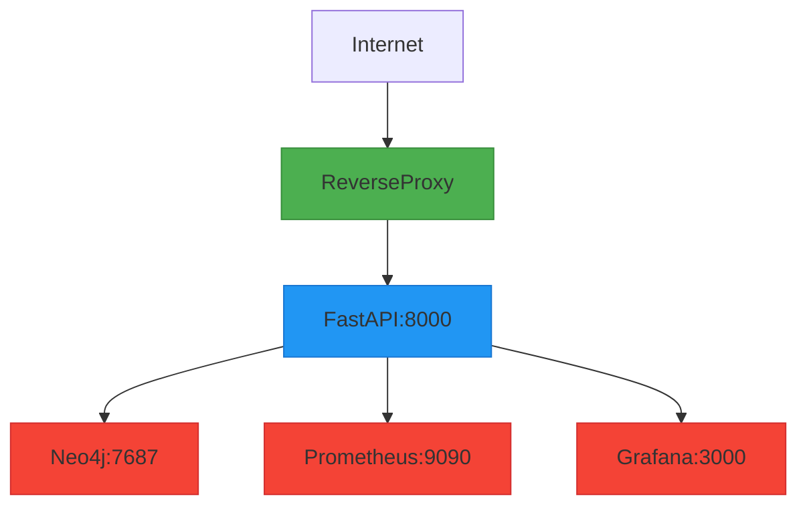
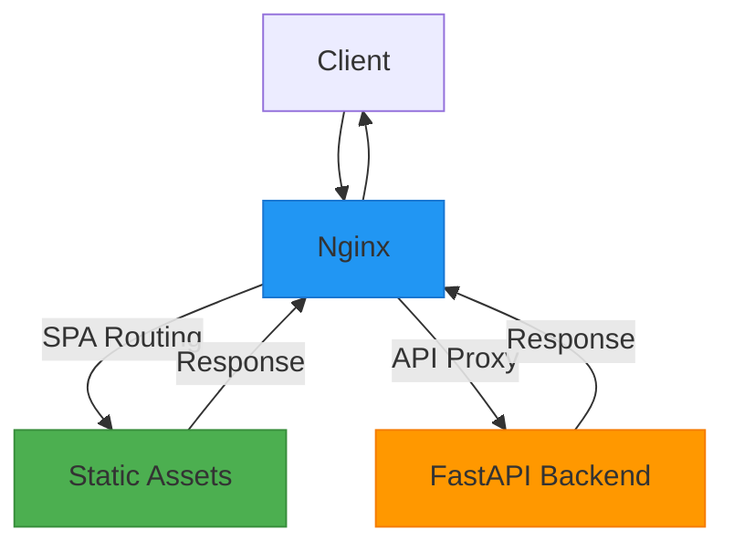
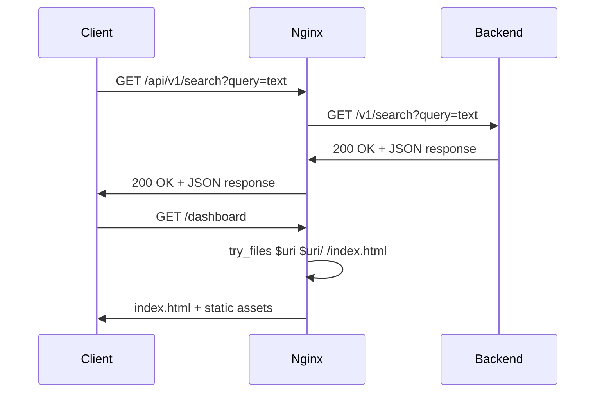
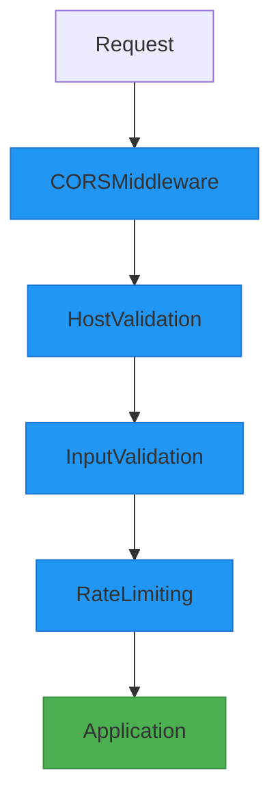
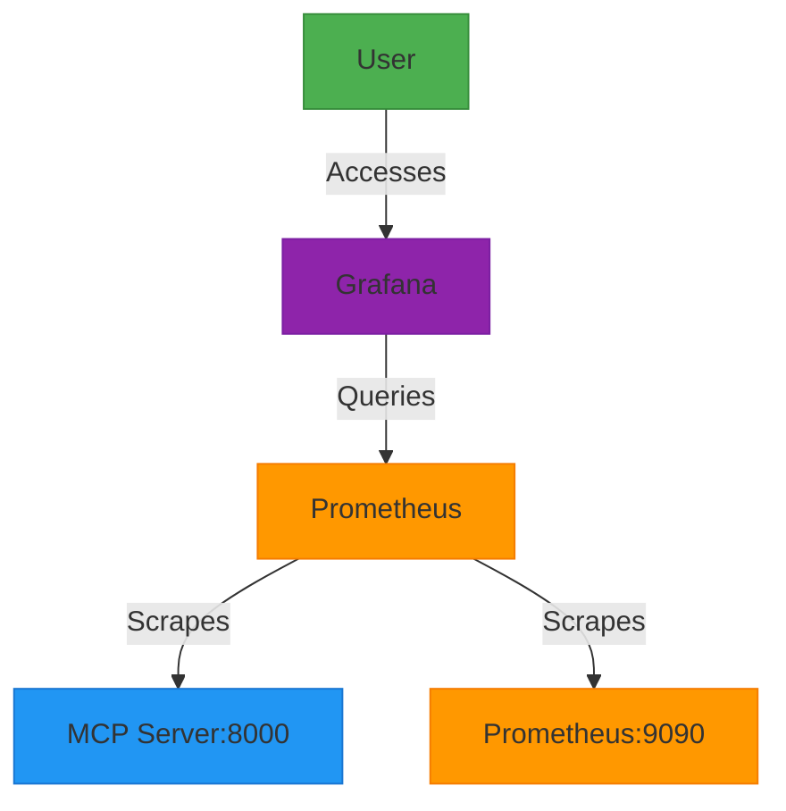
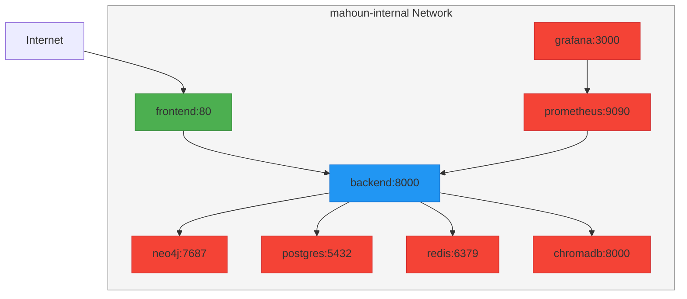

# Network Security and Reverse Proxy

<cite>
**Referenced Files in This Document**   
- [docker-compose.yml](file://docker-compose.yml)
- [frontend/nginx.conf](file://frontend/nginx.conf)
- [docs/DEPLOYMENT.md](file://docs/DEPLOYMENT.md)
- [docs/DOCKER.md](file://docs/DOCKER.md)
- [api/main.py](file://api/main.py)
- [api/middleware/validation.py](file://api/middleware/validation.py)
- [mahoun/core/settings.py](file://mahoun/core/settings.py)
- [monitoring/prometheus/prometheus.yml](file://monitoring/prometheus/prometheus.yml)
- [monitoring/grafana/datasources/prometheus.yml](file://monitoring/grafana/datasources/prometheus.yml)
- [monitoring/grafana/dashboards/provider.yml](file://monitoring/grafana/dashboards/provider.yml)
</cite>

## Table of Contents
1. [Introduction](#introduction)
2. [Port Exposure Strategy](#port-exposure-strategy)
3. [Reverse Proxy Configuration](#reverse-proxy-configuration)
4. [Security Configuration](#security-configuration)
5. [Monitoring Services Access](#monitoring-services-access)
6. [Internal Docker Network Configuration](#internal-docker-network-configuration)
7. [Conclusion](#conclusion)

## Introduction

This document provides comprehensive guidance on network security and reverse proxy setup for production deployments of the MAHOUN platform. It covers port exposure strategies, reverse proxy configuration with Nginx, security measures, access to monitoring services, and internal Docker network configuration. The information is based on the analysis of the platform's configuration files and documentation.

## Port Exposure Strategy

The MAHOUN platform follows a strict port exposure strategy to ensure security in production environments. Only essential ports are exposed to the public internet, while internal services remain protected.

### Exposed Ports

The following port should be exposed to the public internet through a reverse proxy:

- **8000**: FastAPI backend application - This is the main API endpoint that should be exposed via a reverse proxy (Nginx/Traefik) for TLS termination and request routing.

### Internal-Only Ports

The following ports should NOT be exposed to the public internet:

- **7687**: Neo4j Bolt protocol - Used for database communication between services within the internal network.
- **9090**: Prometheus - Metrics collection service for monitoring.
- **3000**: Grafana - Monitoring dashboard interface.

**Diagram sources**
- [docker-compose.yml](file://docker-compose.yml#L22-L24)
- [docs/DEPLOYMENT.md](file://docs/DEPLOYMENT.md#L33-L36)

**Section sources**
- [docker-compose.yml](file://docker-compose.yml#L22-L24)
- [docs/DEPLOYMENT.md](file://docs/DEPLOYMENT.md#L33-L38)

## Reverse Proxy Configuration

The MAHOUN platform uses Nginx as a reverse proxy for the frontend service, providing TLS termination, request routing, and additional security features.

### Nginx Configuration

The Nginx configuration in the frontend container handles both static asset serving and API proxying:

**Diagram sources**
- [frontend/nginx.conf](file://frontend/nginx.conf#L7-L66)
- [docker-compose.yml](file://docker-compose.yml#L100-L102)

The Nginx configuration includes:

- **SPA Routing**: Handles React Router by serving index.html for all routes
- **API Proxy**: Forwards requests to /api/ and /v1/ endpoints to the backend service
- **Security Headers**: Implements X-Frame-Options, X-Content-Type-Options, and X-XSS-Protection
- **Gzip Compression**: Enables compression for improved performance
- **Static Asset Caching**: Configures long-term caching for static assets

### API Request Flow

The sequence of API requests through the reverse proxy:

**Diagram sources**
- [frontend/nginx.conf](file://frontend/nginx.conf#L30-L57)
- [api/main.py](file://api/main.py#L119-L120)

**Section sources**
- [frontend/nginx.conf](file://frontend/nginx.conf#L7-L66)
- [docker-compose.yml](file://docker-compose.yml#L91-L127)

## Security Configuration

The MAHOUN platform implements multiple layers of security through configuration files and middleware.

### Built-in Security Features

The platform includes several security features at the application level:

- **CORS Configuration**: Controlled through environment variables with different settings for development and production
- **Host Validation**: Trusted host middleware prevents host header attacks
- **Input Validation**: Middleware validates and sanitizes all incoming requests
- **Rate Limiting**: Protects against DDoS attacks by limiting requests per IP

**Diagram sources**
- [api/main.py](file://api/main.py#L53-L85)
- [api/middleware/validation.py](file://api/middleware/validation.py#L26-L337)

### Security Middleware Configuration

The security settings are configured through environment variables:

- **MAHOUN_ENV**: Environment type (dev, staging, prod)
- **MAHOUN_API_KEY**: Required in staging and production
- **MAHOUN_ALLOWED_ORIGINS**: CORS allowed origins
- **MAHOUN_ALLOWED_HOSTS**: Trusted hosts

In production, the API key is mandatory, and both allowed origins and hosts must be explicitly configured.

**Section sources**
- [api/main.py](file://api/main.py#L51-L85)
- [mahoun/core/settings.py](file://mahoun/core/settings.py#L1-L51)
- [api/middleware/validation.py](file://api/middleware/validation.py#L26-L337)

## Monitoring Services Access

The monitoring services (Prometheus and Grafana) should be accessed securely through protected methods.

### Monitoring Stack Configuration

The monitoring stack consists of:

- **Prometheus**: Scrapes metrics from the MCP server and itself
- **Grafana**: Visualizes metrics with pre-configured dashboards and data sources

**Diagram sources**
- [monitoring/prometheus/prometheus.yml](file://monitoring/prometheus/prometheus.yml#L1-L24)
- [monitoring/grafana/datasources/prometheus.yml](file://monitoring/grafana/datasources/prometheus.yml#L1-L10)
- [monitoring/grafana/dashboards/provider.yml](file://monitoring/grafana/dashboards/provider.yml#L1-L12)

### Secure Access Methods

To access monitoring services securely:

1. **VPN Access**: Connect to the corporate VPN before accessing monitoring services
2. **SSH Tunneling**: Create SSH tunnels to forward local ports to the monitoring services
3. **Reverse Proxy with Authentication**: Configure the reverse proxy to require authentication for monitoring endpoints

The Grafana dashboard is pre-configured with:
- Prometheus as the default data source
- Automatic dashboard provisioning
- Admin user credentials from environment variables

**Section sources**
- [docker-compose.yml](file://docker-compose.yml#L306-L388)
- [monitoring/prometheus/prometheus.yml](file://monitoring/prometheus/prometheus.yml#L1-L24)
- [monitoring/grafana/datasources/prometheus.yml](file://monitoring/grafana/datasources/prometheus.yml#L1-L10)

## Internal Docker Network Configuration

The MAHOUN platform uses a dedicated internal Docker network for service communication.

### Network Configuration

The internal Docker network is configured in the docker-compose.yml file:

**Diagram sources**
- [docker-compose.yml](file://docker-compose.yml#L427-L434)

The network configuration includes:

- **Network Name**: mahoun_network
- **Driver**: bridge
- **Subnet**: 172.28.0.0/16
- **Services**: All platform services are connected to this network

### IPAM Settings

The IP Address Management (IPAM) settings for the internal network:

- **Subnet**: 172.28.0.0/16
- **Gateway**: Automatically assigned by Docker
- **IP Range**: 172.28.0.0-172.28.255.255

Services communicate with each other using their container names as hostnames (e.g., backend can reach Neo4j at neo4j:7687).

**Section sources**
- [docker-compose.yml](file://docker-compose.yml#L427-L434)

## Conclusion

The MAHOUN platform implements a robust network security strategy for production deployments. Key recommendations include:

1. Expose only port 8000 through a reverse proxy (Nginx/Traefik)
2. Keep internal services (Neo4j, Prometheus, Grafana) on internal-only ports
3. Use the provided Nginx configuration for TLS termination and request routing
4. Implement additional DDoS protection at the reverse proxy level
5. Access monitoring services through VPN or SSH tunnels
6. Utilize the dedicated mahoun-internal Docker network for secure service communication

The platform's security model combines network-level protection with application-level middleware for comprehensive defense against common web vulnerabilities.