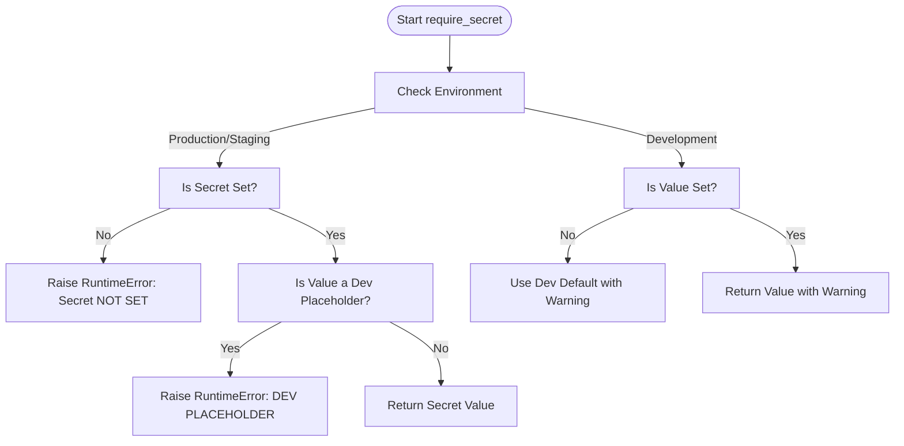
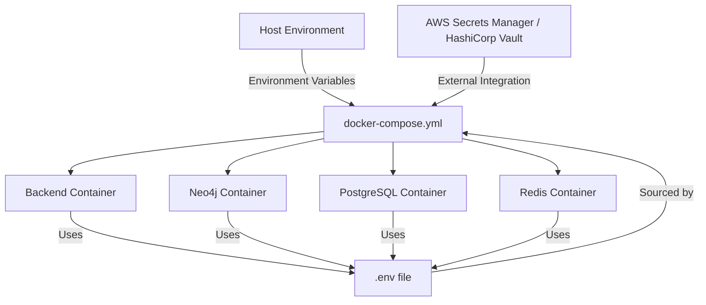

# Secrets Management

<cite>
**Referenced Files in This Document**   
- [mahoun/core/secrets.py](file://mahoun/core/secrets.py)
- [api/config.py](file://api/config.py)
- [docker-compose.yml](file://docker-compose.yml)
- [.env.example](file://.env.example)
- [scripts/docker/generate_env_example.sh](file://scripts/docker/generate_env_example.sh)
- [docs/DEPLOYMENT.md](file://docs/DEPLOYMENT.md)
- [docs/DOCKER.md](file://docs/DOCKER.md)
- [api/database.py](file://api/database.py)
- [tests/test_secrets_hardening.py](file://tests/test_secrets_hardening.py)
</cite>

## Table of Contents
1. [Introduction](#introduction)
2. [Core Secrets Management Principles](#core-secrets-management-principles)
3. [Required Secrets and Environment Configuration](#required-secrets-and-environment-configuration)
4. [Secrets Validation and Security Enforcement](#secrets-validation-and-security-enforcement)
5. [Implementation in Docker Compose](#implementation-in-docker-compose)
6. [Security Hardening and Best Practices](#security-hardening-and-best-practices)
7. [Secrets Usage in Database Connections](#secrets-usage-in-database-connections)
8. [Conclusion](#conclusion)

## Introduction

This document provides a comprehensive guide to secrets management within the MAHOUN platform, focusing on securing sensitive credentials such as database passwords, API keys, and Redis credentials in production environments. The system enforces strict security policies to prevent the use of placeholder or weak secrets in non-development environments. It leverages environment variables for secret injection and integrates with external secret managers like AWS Secrets Manager or HashiCorp Vault for enhanced security. The documentation outlines best practices, implementation examples using Docker Compose, and security hardening techniques including the generation of strong passwords and access restriction to secret storage.

## Core Secrets Management Principles

The MAHOUN platform implements a robust secrets management system designed to prevent accidental exposure of sensitive credentials, particularly in production and staging environments. The core principle is that no default or placeholder passwords are allowed in any environment outside of development. The system differentiates behavior based on the current environment, defined by the `MAHOUN_ENV` environment variable, which can be set to `dev`, `staging`, or `prod`.

In development mode (`MAHOUN_ENV=dev`), the system allows the use of safe, predefined placeholder values for convenience during local development. These placeholders, such as `dev_password_change_me`, are explicitly defined and trigger warnings to remind developers that they are not suitable for production. This approach enables a smooth developer experience without compromising the security model.

Conversely, in staging and production environments (`MAHOUN_ENV=staging` or `MAHOUN_ENV=prod`), the system enforces strict validation. All required secrets must be explicitly set via environment variables, and their values must not match any known development placeholders. If a required secret is missing or contains a placeholder value, the application will fail to start, preventing insecure deployments. This fail-fast mechanism ensures that configuration errors are caught early, before the application becomes operational.

The system provides two primary functions for retrieving secrets: `get_secret()` for optional values and `require_secret()` for mandatory credentials. The latter performs the full validation logic, making it the preferred method for critical secrets like database passwords and JWT keys. This layered approach allows for flexible secret management while maintaining a high security bar for production systems.

**Section sources**
- [mahoun/core/secrets.py](file://mahoun/core/secrets.py#L1-L207)
- [tests/test_secrets_hardening.py](file://tests/test_secrets_hardening.py#L1-L164)

## Required Secrets and Environment Configuration

The MAHOUN platform defines a canonical set of required secrets that must be configured for the system to operate securely. These secrets are standardized across the codebase and deployment configurations to ensure consistency. The primary required secrets are:

- `DB_NEO4J_PASSWORD`: The password for the Neo4j graph database.
- `DB_POSTGRES_PASSWORD`: The password for the PostgreSQL relational database.
- `SECURITY_JWT_SECRET`: The secret key used for signing and verifying JSON Web Tokens (JWTs).

These secrets are declared in the `REQUIRED_SECRETS` frozenset within the `mahoun.core.secrets` module. The use of a centralized definition ensures that all components of the system reference the same secret names, reducing the risk of configuration drift.

The environment is configured using a `.env` file, which is git-ignored to prevent accidental commits of sensitive data. A template file, `.env.example`, is provided to guide developers on the necessary variables. This file contains placeholder values and clear instructions for setting production-grade secrets. For example, the `.env.example` file includes entries like `DB_POSTGRES_PASSWORD=dev_password_change_me`, which must be replaced with strong, randomly generated values in production.

The `MAHOUN_ENV` variable controls the application's behavior regarding secrets. When set to `dev`, the system can fall back to default placeholder values if a secret is not explicitly set. However, in `staging` or `prod` environments, all required secrets must be present and must not be placeholders. This configuration model ensures that the same codebase can be used across different environments with appropriate security settings.

**Section sources**
- [mahoun/core/secrets.py](file://mahoun/core/secrets.py#L27-L52)
- [.env.example](file://.env.example#L1-L29)
- [scripts/docker/generate_env_example.sh](file://scripts/docker/generate_env_example.sh#L1-L153)

## Secrets Validation and Security Enforcement

The MAHOUN platform employs a multi-layered validation system to enforce secrets security at runtime. The cornerstone of this system is the `require_secret()` function, which performs strict checks before returning a secret value. When called, this function first retrieves the secret from the environment using `os.getenv()`. It then applies different validation logic based on the current environment.

In production and staging environments, the function performs two critical checks. First, it verifies that the secret is not missing or empty. If the secret is not set, it raises a `RuntimeError` with a clear message indicating that the secret is mandatory and must be set. Second, it checks if the secret value matches any of the known development placeholders defined in the `DEV_PLACEHOLDERS` frozenset. This set includes values like `dev_password_change_me`, `CHANGE_ME`, `password`, and empty strings. If a match is found, the function raises a `RuntimeError` warning that dev placeholders are forbidden in production and provides guidance on generating a strong secret using `openssl rand -base64 32`.

The validation process is further reinforced by the `validate_all_required_secrets()` function, which is typically called at application startup. This function iterates over all secrets listed in `REQUIRED_SECRETS` and calls `require_secret()` for each one. It collects the results and returns a dictionary mapping each secret name to its validation status. If any required secret fails validation and the environment is production or staging, the function raises a `RuntimeError`, causing the application to fail to start. This comprehensive validation ensures that the system cannot operate with insecure or missing credentials.

The use of `SecretStr` from Pydantic in the configuration models adds an additional layer of security by automatically masking secret values when they are logged or serialized. This prevents accidental exposure of sensitive data in logs or error messages.

**Diagram sources **
- [mahoun/core/secrets.py](file://mahoun/core/secrets.py#L101-L207)

**Section sources**
- [mahoun/core/secrets.py](file://mahoun/core/secrets.py#L101-L207)
- [tests/test_secrets_hardening.py](file://tests/test_secrets_hardening.py#L61-L152)

## Implementation in Docker Compose

The MAHOUN platform uses Docker Compose for container orchestration, and secrets are injected into containers via environment variables. The `docker-compose.yml` file defines the services and their configurations, including how secrets are passed from the host environment to the containers. This approach ensures that secrets are not hardcoded in the configuration files and can be managed externally.

In the `docker-compose.yml` file, environment variables for secrets are defined using the `${VARIABLE_NAME:?error_message}` syntax. This syntax not only substitutes the value from the host environment but also includes a mandatory check. If the environment variable is not set, Docker Compose will fail to start the service and display the specified error message. For example, the backend service configuration includes `NEO4J_PASSWORD=${DB_NEO4J_PASSWORD:?DB_NEO4J_PASSWORD_required}`, which ensures that the `DB_NEO4J_PASSWORD` environment variable must be set on the host.

The system also supports the use of `.env` files to set these environment variables. Docker Compose automatically reads the `.env` file in the project root if it exists, allowing developers to define all necessary secrets in one place. However, this file is git-ignored, ensuring that real secrets are not committed to version control. For production deployments, it is recommended to use external secret managers like AWS Secrets Manager or HashiCorp Vault, which can be integrated with Docker to provide secrets at runtime.

The `generate_env_example.sh` script automates the creation of the `.env.example` template file. This script outputs a well-documented template with all required variables and instructions for generating strong secrets. It also includes a section with commands for generating secure passwords using OpenSSL, such as `export POSTGRES_PASSWORD="$(openssl rand -base64 32)"`. This script ensures that all developers and operators have access to a consistent and secure configuration template.

**Diagram sources **
- [docker-compose.yml](file://docker-compose.yml#L1-L434)
- [scripts/docker/generate_env_example.sh](file://scripts/docker/generate_env_example.sh#L1-L153)

**Section sources**
- [docker-compose.yml](file://docker-compose.yml#L1-L434)
- [scripts/docker/generate_env_example.sh](file://scripts/docker/generate_env_example.sh#L1-L153)
- [docs/DOCKER.md](file://docs/DOCKER.md#L1-L558)

## Security Hardening and Best Practices

To ensure the highest level of security for sensitive credentials, the MAHOUN platform adheres to several best practices and hardening techniques. The most critical practice is the prohibition of `.env` files in production environments. While `.env` files are convenient for development, they pose a significant security risk if mismanaged. In production, secrets should be injected via environment variables from a secure source, such as AWS Secrets Manager, HashiCorp Vault, or Kubernetes Secrets. This approach centralizes secret management, enables audit logging, and facilitates secret rotation.

Generating strong, cryptographically secure passwords is another cornerstone of the security model. The platform recommends using the `openssl rand -base64 32` command to generate 32-byte base64-encoded passwords for database credentials and `openssl rand -base64 64` for JWT secrets, which require longer keys. These commands produce high-entropy values that are resistant to brute-force attacks. The generated secrets should be stored in a secure location and never shared via insecure channels.

Access to secret storage must be strictly controlled through the principle of least privilege. Only authorized personnel and services should have read or write access to secrets. This is typically enforced through IAM policies in cloud environments or access control lists in on-premises systems. Regular audit logging of secret access is essential for detecting unauthorized attempts and ensuring compliance with security policies.

Secret rotation is a critical security practice that mitigates the impact of a potential secret compromise. The platform should implement a regular rotation schedule for all secrets, particularly database passwords and API keys. Automated rotation tools can be integrated with the secret manager to rotate secrets without downtime. The application must be designed to reload secrets at runtime or be restarted as part of the rotation process to ensure the new secrets are used.

The CI/CD pipeline includes security gates that scan for hardcoded secrets and placeholder values. Scripts like `ci_scan_secrets.py` and `gate_0_integrity.sh` are run during the build process to detect and prevent the accidental inclusion of secrets in the codebase. If a secret is detected, the build fails, preventing the deployment of potentially compromised code. This automated scanning acts as a safety net, complementing manual security practices.

**Section sources**
- [docs/DEPLOYMENT.md](file://docs/DEPLOYMENT.md#L1-L77)
- [docs/DOCKER.md](file://docs/DOCKER.md#L1-L558)
- [scripts/ci_scan_secrets.py](file://scripts/ci_scan_secrets.py#L255-L285)
- [ci/first_step/gate_0_integrity.sh](file://ci/first_step/gate_0_integrity.sh#L190-L206)

## Secrets Usage in Database Connections

The secrets managed by the MAHOUN platform are directly used to establish secure connections to various database systems, including PostgreSQL, Neo4j, and Redis. The connection logic is centralized in the `api/database.py` module, which uses the validated secrets to create connection pools and clients. This module retrieves the necessary credentials from the configuration, which in turn sources them from the environment variables managed by the secrets system.

For PostgreSQL, the `init_postgres()` function creates a connection pool using the `asyncpg` library. It constructs the connection URL using the `postgres_url` computed field from the `DatabaseSettings` model, which incorporates the `postgres_password` secret. The password is accessed via the `get_secret_value()` method of the `SecretStr` type, ensuring that the raw value is only exposed when necessary for the connection.

Similarly, for Neo4j, the `init_neo4j()` function initializes the Neo4j driver using the `neo4j_uri`, `neo4j_user`, and `neo4j_password` from the configuration. The password is again retrieved using `get_secret_value()` and passed to the driver's authentication mechanism. The same pattern is followed for Redis, where the `init_redis()` function uses the `redis_url` and `redis_password` to establish a connection.

This centralized connection management ensures that secrets are handled consistently and securely across all database integrations. The use of connection pools and asynchronous clients also improves performance and resource utilization. The connection initialization functions include error handling and logging to aid in troubleshooting, with sensitive information masked to prevent exposure in logs.

**Section sources**
- [api/database.py](file://api/database.py#L1-L174)
- [api/config.py](file://api/config.py#L34-L84)

## Conclusion

The MAHOUN platform's secrets management system provides a secure and reliable framework for handling sensitive credentials in production environments. By enforcing strict validation, prohibiting placeholder values in non-development environments, and integrating with external secret managers, the system ensures that credentials are protected from accidental exposure and misuse. The use of environment variables and Docker Compose for secret injection provides a flexible and portable deployment model, while the comprehensive validation and fail-fast mechanisms prevent insecure configurations from reaching production. Adhering to best practices such as generating strong passwords, restricting access, and implementing secret rotation further strengthens the overall security posture. This holistic approach to secrets management is essential for maintaining the integrity and confidentiality of the platform's data and services.