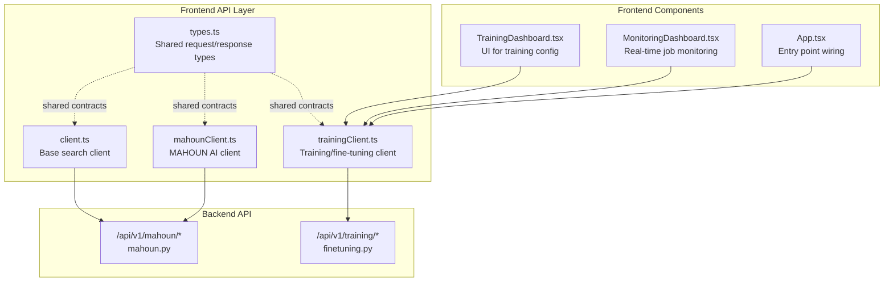
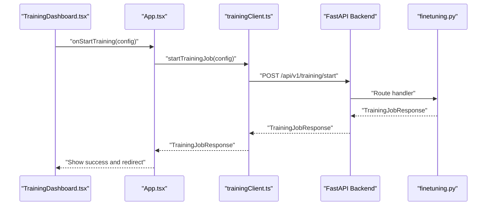
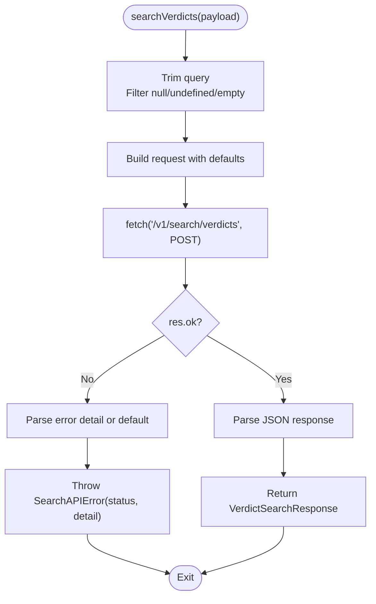
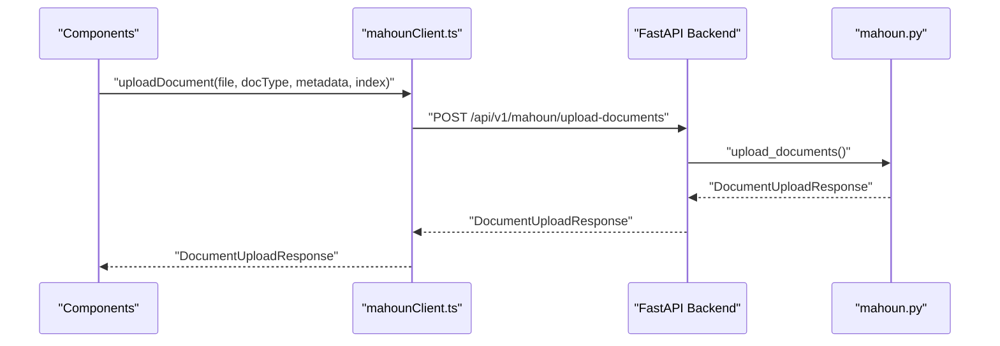
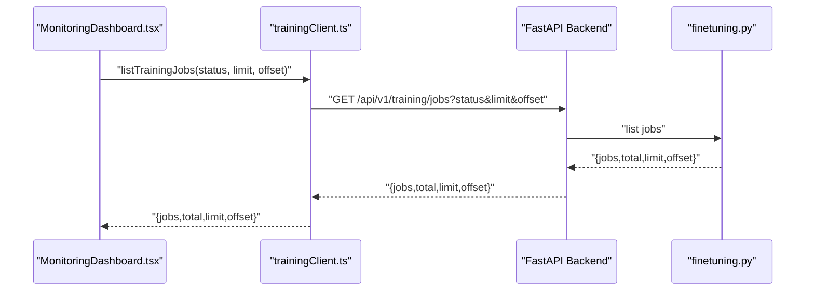
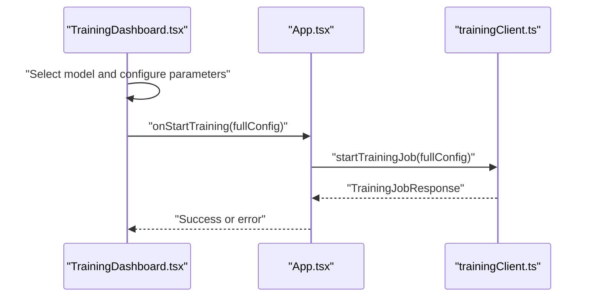
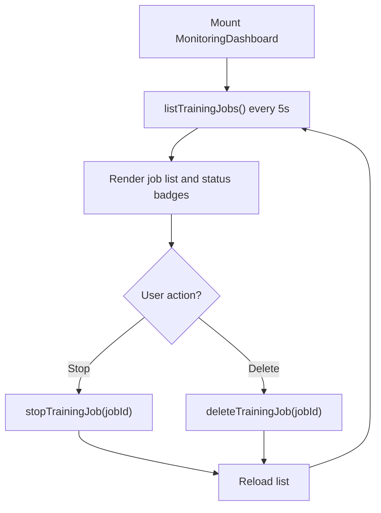
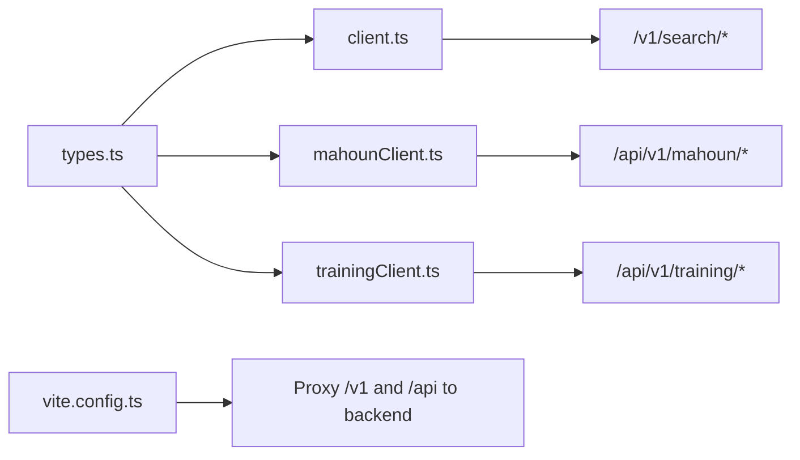

# API Clients

<cite>
**Referenced Files in This Document**
- [client.ts](file://frontend/src/api/client.ts)
- [mahounClient.ts](file://frontend/src/api/mahounClient.ts)
- [trainingClient.ts](file://frontend/src/api/trainingClient.ts)
- [types.ts](file://frontend/src/api/types.ts)
- [TrainingDashboard.tsx](file://frontend/src/components/TrainingDashboard.tsx)
- [MonitoringDashboard.tsx](file://frontend/src/components/MonitoringDashboard.tsx)
- [App.tsx](file://frontend/src/App.tsx)
- [vite.config.ts](file://frontend/vite.config.ts)
- [vite-env.d.ts](file://frontend/src/vite-env.d.ts)
- [finetuning.py](file://api/routers/finetuning.py)
- [mahoun.py](file://api/routers/mahoun.py)
</cite>

## Table of Contents
1. [Introduction](#introduction)
2. [Project Structure](#project-structure)
3. [Core Components](#core-components)
4. [Architecture Overview](#architecture-overview)
5. [Detailed Component Analysis](#detailed-component-analysis)
6. [Dependency Analysis](#dependency-analysis)
7. [Performance Considerations](#performance-considerations)
8. [Troubleshooting Guide](#troubleshooting-guide)
9. [Conclusion](#conclusion)
10. [Appendices](#appendices)

## Introduction
This document provides comprehensive API client documentation for the frontend application. It focuses on:
- The base API client used for legal search
- The MAHOUN AI service client for document processing, delay analysis, claims, contract Q&A, and report generation
- The training/fine-tuning client for managing training jobs and models
- Request/response types defined in shared TypeScript interfaces
- Error handling, authentication patterns, and retry mechanisms
- Usage examples integrating components like TrainingDashboard with trainingClient
- Guidelines for adding new endpoints and maintaining type safety

## Project Structure
The frontend API layer is organized around three primary clients and a shared types module:
- Base search client for legal verdict search
- MAHOUN client for AI service endpoints
- Training client for fine-tuning operations
- Shared types for request/response contracts

**Diagram sources**
- [client.ts](file://frontend/src/api/client.ts#L1-L153)
- [mahounClient.ts](file://frontend/src/api/mahounClient.ts#L1-L276)
- [trainingClient.ts](file://frontend/src/api/trainingClient.ts#L1-L275)
- [types.ts](file://frontend/src/api/types.ts#L1-L182)
- [TrainingDashboard.tsx](file://frontend/src/components/TrainingDashboard.tsx#L1-L410)
- [MonitoringDashboard.tsx](file://frontend/src/components/MonitoringDashboard.tsx#L1-L128)
- [App.tsx](file://frontend/src/App.tsx#L32-L58)
- [mahoun.py](file://api/routers/mahoun.py#L1-L200)
- [finetuning.py](file://api/routers/finetuning.py#L1-L200)

**Section sources**
- [client.ts](file://frontend/src/api/client.ts#L1-L153)
- [mahounClient.ts](file://frontend/src/api/mahounClient.ts#L1-L276)
- [trainingClient.ts](file://frontend/src/api/trainingClient.ts#L1-L275)
- [types.ts](file://frontend/src/api/types.ts#L1-L182)
- [vite.config.ts](file://frontend/vite.config.ts#L1-L23)
- [vite-env.d.ts](file://frontend/src/vite-env.d.ts#L1-L10)

## Core Components
- Base search client: Implements a clean request builder, robust error handling, and health checks for the search service.
- MAHOUN client: Encapsulates document upload, delay analysis, claim generation, contract Q&A, and report generation endpoints.
- Training client: Manages training job lifecycle (start, status, list, stop, delete), model discovery, and presets.
- Shared types: Define request/response contracts used across clients and components.

Key responsibilities:
- Type-safe request/response contracts
- Centralized error handling and user-friendly messages
- Environment-driven base URL configuration
- Minimal payload normalization (trimming, filtering nulls)

**Section sources**
- [client.ts](file://frontend/src/api/client.ts#L1-L153)
- [mahounClient.ts](file://frontend/src/api/mahounClient.ts#L1-L276)
- [trainingClient.ts](file://frontend/src/api/trainingClient.ts#L1-L275)
- [types.ts](file://frontend/src/api/types.ts#L1-L182)

## Architecture Overview
The frontend communicates with backend endpoints via fetch. The Vite dev server proxies API paths to the backend for seamless development. Clients encapsulate endpoint logic and return strongly typed results.

**Diagram sources**
- [TrainingDashboard.tsx](file://frontend/src/components/TrainingDashboard.tsx#L1-L410)
- [App.tsx](file://frontend/src/App.tsx#L32-L58)
- [trainingClient.ts](file://frontend/src/api/trainingClient.ts#L1-L120)
- [finetuning.py](file://api/routers/finetuning.py#L1-L200)

## Detailed Component Analysis

### Base Search Client (client.ts)
Responsibilities:
- Build and send search requests with trimmed query, filtered null/empty filters, and defaults
- Parse and surface backend errors with structured detail
- Provide a health check endpoint for the search service

Implementation highlights:
- Payload cleaning removes null, undefined, empty strings, and empty arrays from filters
- Uses a custom error class for API errors with status code and detail
- Health check endpoint returns structured status and backend health indicators

**Diagram sources**
- [client.ts](file://frontend/src/api/client.ts#L32-L132)

**Section sources**
- [client.ts](file://frontend/src/api/client.ts#L1-L153)
- [types.ts](file://frontend/src/api/types.ts#L70-L110)

### MAHOUN AI Client (mahounClient.ts)
Responsibilities:
- Document upload (multipart/form-data)
- Delay analysis
- Claim generation
- Contract Q&A
- Report generation and listing

Implementation highlights:
- Uses a base URL derived from environment variables
- Each endpoint returns a strongly typed response
- On non-OK responses, parses the error detail and throws a generic error

**Diagram sources**
- [mahounClient.ts](file://frontend/src/api/mahounClient.ts#L112-L135)
- [mahoun.py](file://api/routers/mahoun.py#L160-L200)

**Section sources**
- [mahounClient.ts](file://frontend/src/api/mahounClient.ts#L1-L276)
- [mahoun.py](file://api/routers/mahoun.py#L1-L200)

### Training Client (trainingClient.ts)
Responsibilities:
- Start training jobs
- Retrieve job status
- List jobs with pagination and filtering
- Stop/delete jobs
- Discover available models (with fallback)
- Provide training presets

Implementation highlights:
- Centralized base URL from environment
- Strongly typed TrainingConfig, TrainingJob, and responses
- Fallback behavior for model discovery when endpoint is unavailable
- Presets returned statically for convenience

**Diagram sources**
- [trainingClient.ts](file://frontend/src/api/trainingClient.ts#L97-L128)
- [finetuning.py](file://api/routers/finetuning.py#L1-L200)

**Section sources**
- [trainingClient.ts](file://frontend/src/api/trainingClient.ts#L1-L275)
- [finetuning.py](file://api/routers/finetuning.py#L1-L200)

### Shared Types (types.ts)
Responsibilities:
- Define request/response contracts for search, training, and model selection
- Provide enums and interfaces aligned with backend Pydantic models

Highlights:
- Legal search filters and hits
- Verdict search request/response
- Training configuration and job status
- Model option and preset structures

**Section sources**
- [types.ts](file://frontend/src/api/types.ts#L1-L182)

### Component Integration Examples

#### TrainingDashboard Integration
- Collects user-selected model and training parameters
- Calls the parent’s start handler with a fully formed TrainingConfig
- Displays loading states and alerts on failure

**Diagram sources**
- [TrainingDashboard.tsx](file://frontend/src/components/TrainingDashboard.tsx#L1-L200)
- [App.tsx](file://frontend/src/App.tsx#L32-L58)
- [trainingClient.ts](file://frontend/src/api/trainingClient.ts#L58-L76)

**Section sources**
- [TrainingDashboard.tsx](file://frontend/src/components/TrainingDashboard.tsx#L1-L410)
- [App.tsx](file://frontend/src/App.tsx#L32-L58)

#### MonitoringDashboard Integration
- Periodically lists training jobs and displays status and metrics
- Uses trainingClient to stop/delete jobs and to fetch metrics placeholders

**Diagram sources**
- [MonitoringDashboard.tsx](file://frontend/src/components/MonitoringDashboard.tsx#L1-L128)
- [trainingClient.ts](file://frontend/src/api/trainingClient.ts#L129-L167)

**Section sources**
- [MonitoringDashboard.tsx](file://frontend/src/components/MonitoringDashboard.tsx#L1-L128)
- [trainingClient.ts](file://frontend/src/api/trainingClient.ts#L129-L167)

## Dependency Analysis
- Clients depend on shared types for type safety
- Components depend on clients for data fetching
- Backend routers define the actual endpoints consumed by clients
- Vite proxy configuration enables development-time routing to the backend

**Diagram sources**
- [types.ts](file://frontend/src/api/types.ts#L1-L182)
- [client.ts](file://frontend/src/api/client.ts#L1-L153)
- [mahounClient.ts](file://frontend/src/api/mahounClient.ts#L1-L276)
- [trainingClient.ts](file://frontend/src/api/trainingClient.ts#L1-L275)
- [vite.config.ts](file://frontend/vite.config.ts#L1-L23)

**Section sources**
- [vite.config.ts](file://frontend/vite.config.ts#L1-L23)
- [vite-env.d.ts](file://frontend/src/vite-env.d.ts#L1-L10)

## Performance Considerations
- Prefer minimal payloads: the base client trims query strings and filters out null/undefined values to reduce unnecessary load.
- Use pagination and filtering when listing jobs to avoid large payloads.
- Avoid frequent polling intervals; the monitoring dashboard uses a 5-second interval as a reasonable balance between responsiveness and load.
- Consider caching model lists locally if the models endpoint is slow or frequently accessed.

## Troubleshooting Guide
Common issues and resolutions:
- Network connectivity: The base client surfaces network errors with a user-friendly message when fetch fails.
- Backend errors: Non-OK responses are parsed for a detail field; if absent, a default message is shown.
- Proxy misconfiguration: Ensure Vite proxy is configured to forward /v1 and /api to the backend address.
- Environment variables: Confirm VITE_API_URL is set appropriately for development or production.

Operational tips:
- Use the health check endpoints to verify backend availability.
- Inspect browser network tab to confirm request URLs and response codes.
- Validate that the backend CORS settings allow the frontend origin.

**Section sources**
- [client.ts](file://frontend/src/api/client.ts#L92-L131)
- [mahounClient.ts](file://frontend/src/api/mahounClient.ts#L129-L155)
- [trainingClient.ts](file://frontend/src/api/trainingClient.ts#L69-L95)
- [vite.config.ts](file://frontend/vite.config.ts#L1-L23)

## Conclusion
The frontend API layer is structured around three focused clients with strong TypeScript contracts. The base search client emphasizes robust error handling and payload normalization, the MAHOUN client encapsulates AI service endpoints, and the training client manages fine-tuning lifecycles. Components integrate seamlessly with these clients, enabling a clean separation of concerns and maintainable type safety.

## Appendices

### Authentication Patterns
- The MAHOUN API reference documents an X-API-Key header requirement for MCP server endpoints.
- The frontend clients currently do not attach authentication headers; ensure backend endpoints support the intended security model.
- For environments requiring API keys, consider extending clients to accept and inject headers via environment variables.

**Section sources**
- [docs/API.md](file://docs/API.md#L1-L82)

### Retry Mechanisms
- The frontend clients do not implement automatic retry logic for transient failures.
- The backend agents demonstrate retry and fallback patterns; these are not mirrored in the frontend clients.

**Section sources**
- [mahoun/agents/base_agent.py](file://mahoun/agents/base_agent.py#L408-L441)

### Adding New Endpoints
Guidelines:
- Define request/response types in types.ts with precise shapes aligned to backend models.
- Add a new function in the appropriate client file with clear parameter names and return types.
- Implement error handling consistent with existing clients (non-OK responses parsed for detail).
- Wire the new function into components via props or hooks.
- Update tests to cover happy paths and error scenarios.

**Section sources**
- [types.ts](file://frontend/src/api/types.ts#L1-L182)
- [client.ts](file://frontend/src/api/client.ts#L92-L131)
- [mahounClient.ts](file://frontend/src/api/mahounClient.ts#L129-L155)
- [trainingClient.ts](file://frontend/src/api/trainingClient.ts#L69-L95)