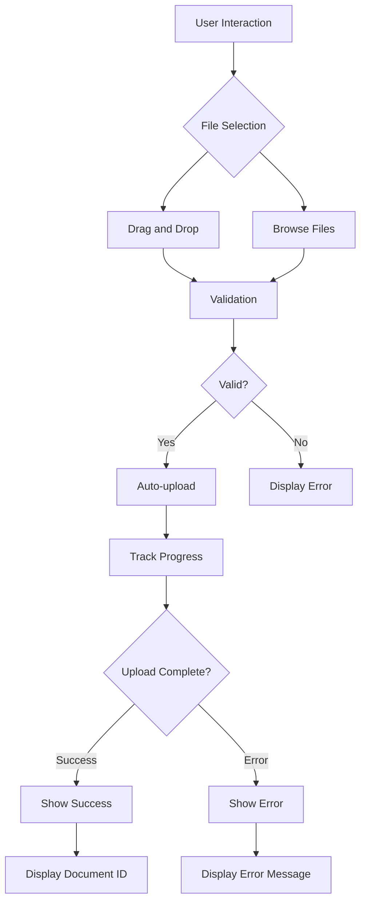
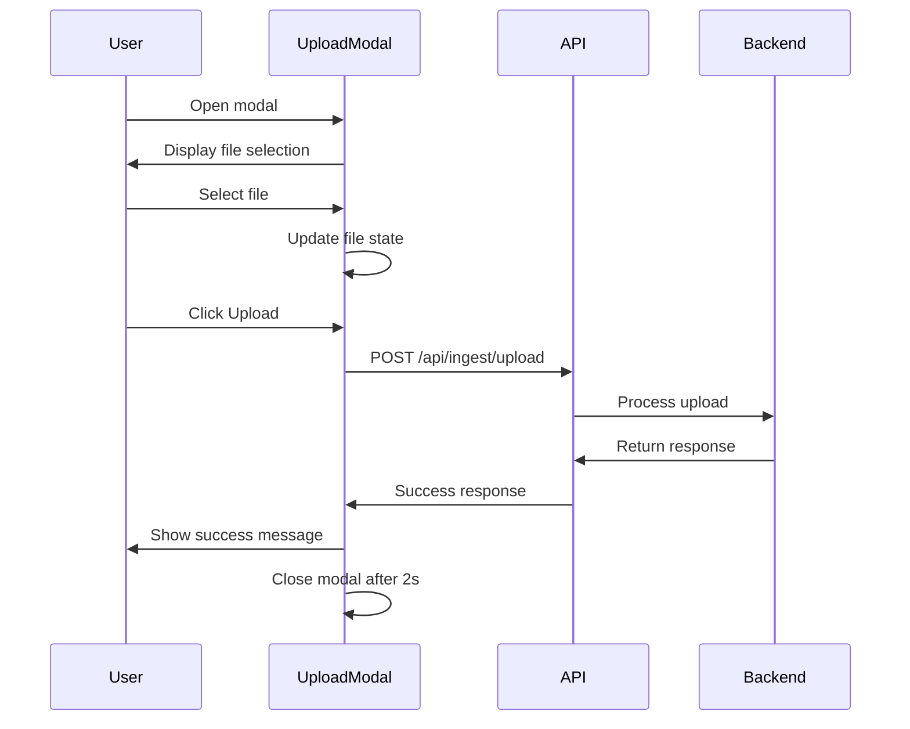
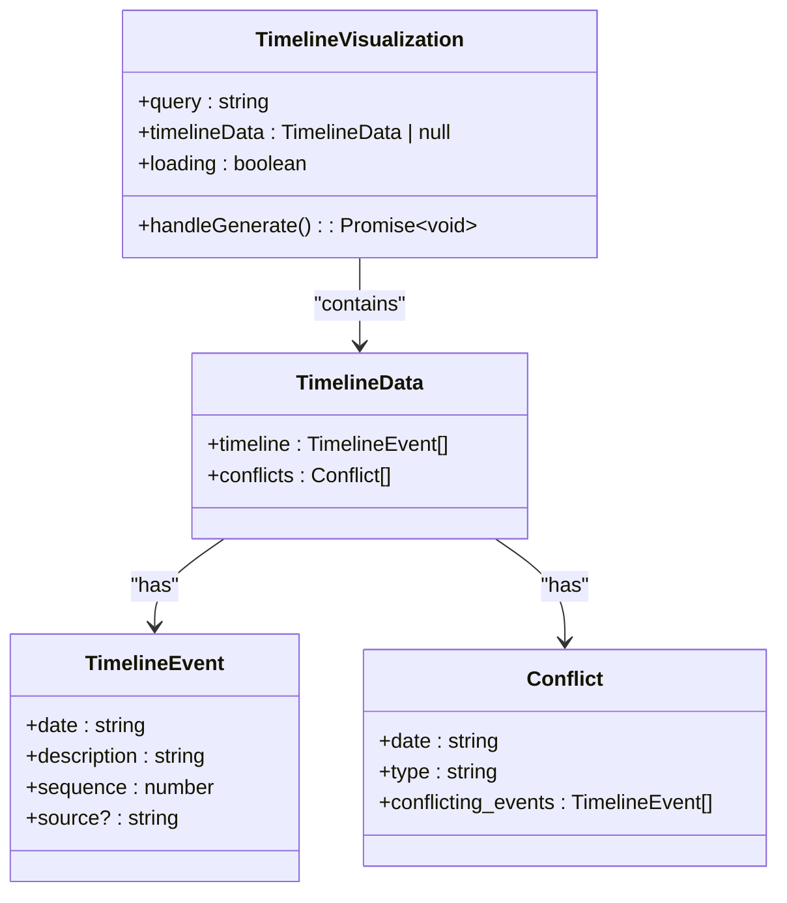
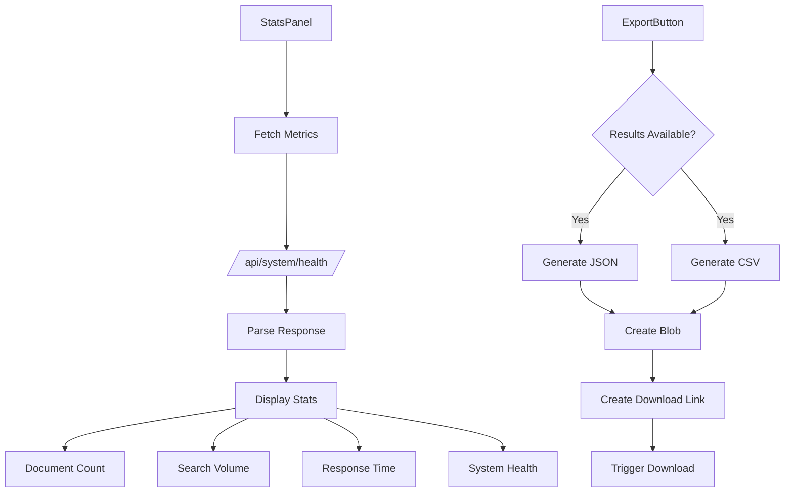
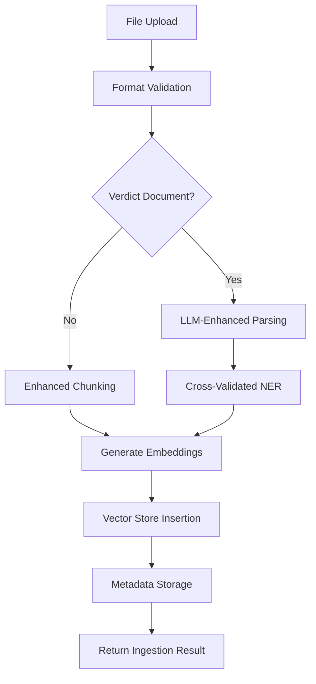
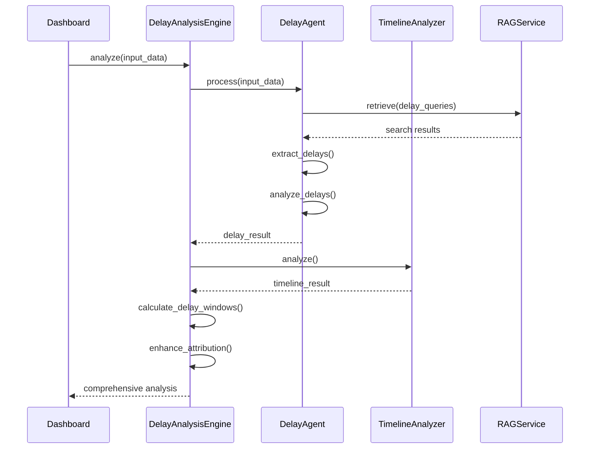

# Document Upload and Data Visualization

<cite>
**Referenced Files in This Document**   
- [AdvancedDocumentUpload.tsx](file://frontend/src/components/AdvancedDocumentUpload.tsx)
- [UploadModal.tsx](file://frontend/src/components/UploadModal.tsx)
- [TimelineVisualization.tsx](file://frontend/src/components/TimelineVisualization.tsx)
- [StatsPanel.tsx](file://frontend/src/components/StatsPanel.tsx)
- [ExportButton.tsx](file://frontend/src/components/ExportButton.tsx)
- [ingest.py](file://api/routers/ingest.py)
- [mahounClient.ts](file://frontend/src/api/mahounClient.ts)
- [delay_analyzer.py](file://mahoun/domain/delay_analyzer.py)
- [timeline_analyzer.py](file://mahoun/domain/timeline_analyzer.py)
- [enhanced_pipeline.py](file://mahoun/pipelines/ingestion/enhanced_pipeline.py)
- [delay_agent.py](file://mahoun/agents/delay_agent.py)
- [models.py](file://api/models.py)
</cite>

## Table of Contents
1. [Introduction](#introduction)
2. [Document Upload Components](#document-upload-components)
3. [Data Visualization Components](#data-visualization-components)
4. [File Processing Pipeline](#file-processing-pipeline)
5. [Accessibility and Usability](#accessibility-and-usability)
6. [Customization and Domain Adaptation](#customization-and-domain-adaptation)
7. [Conclusion](#conclusion)

## Introduction

This document provides comprehensive documentation for the document upload and data visualization components of the MAHOUN legal analytics platform. The system enables users to ingest legal documents through intuitive interfaces and visualize complex analysis results through interactive dashboards. The platform supports advanced document processing with validation, progress tracking, and metadata extraction, while providing sophisticated visualization tools for delay analysis, contractual timelines, and system metrics.

The core functionality revolves around two main areas: document ingestion and data visualization. The document upload components handle the secure intake of legal documents with comprehensive validation and progress tracking, while the visualization components transform complex legal analysis into accessible, interactive representations. These components work together to provide a seamless experience from document upload to insight generation.

**Section sources**
- [AdvancedDocumentUpload.tsx](file://frontend/src/components/AdvancedDocumentUpload.tsx#L1-L271)
- [TimelineVisualization.tsx](file://frontend/src/components/TimelineVisualization.tsx#L1-L153)

## Document Upload Components

### AdvancedDocumentUpload Component

The AdvancedDocumentUpload component provides a comprehensive interface for uploading legal documents with drag-and-drop functionality, multiple file support, progress tracking, and metadata editing. This component implements a robust validation system that enforces file size limits (50MB maximum) and restricts file types to PDF, DOC, DOCX, TXT, JPEG, and PNG formats. The upload process is automated, with files being immediately processed upon selection.

The component maintains state for each uploaded file, tracking its status (pending, uploading, success, or error) and progress percentage. Users can remove files from the upload queue before they are processed. The interface includes a document type selector that allows users to specify whether the uploaded document is a contract, letter, report, or general contract conditions, which helps route the document to the appropriate processing pipeline.

**Diagram sources **
- [AdvancedDocumentUpload.tsx](file://frontend/src/components/AdvancedDocumentUpload.tsx#L1-L271)

**Section sources**
- [AdvancedDocumentUpload.tsx](file://frontend/src/components/AdvancedDocumentUpload.tsx#L1-L271)

### UploadModal Component

The UploadModal component provides a focused, modal interface for uploading individual legal documents. This component is designed for scenarios where a single document upload is required, offering a clean interface with minimal distractions. The modal includes a file selection area with visual feedback, upload status indicators, and action buttons for initiating the upload or canceling the operation.

The component manages the upload state through several key variables: file (the selected file), isUploading (a boolean indicating upload progress), uploadStatus (tracking idle, success, or error states), and errorMessage (containing error details when applicable). When the upload is initiated, the component constructs a FormData object containing the file and sends it to the backend API endpoint `/api/ingest/upload` using the fetch API.

**Diagram sources **
- [UploadModal.tsx](file://frontend/src/components/UploadModal.tsx#L1-L129)
- [ingest.py](file://api/routers/ingest.py#L262-L335)

**Section sources**
- [UploadModal.tsx](file://frontend/src/components/UploadModal.tsx#L1-L129)

## Data Visualization Components

### TimelineVisualization Component

The TimelineVisualization component provides an interactive interface for displaying contractual timelines and delay analysis results. This component enables users to generate timeline reports by entering a query or topic, which is then processed by the backend to extract chronological events and identify potential conflicts. The visualization displays events in chronological order along a vertical timeline, with each event marked by a dot and accompanied by its date, sequence number, description, and source.

The component includes conflict detection functionality that highlights inconsistencies or contradictions in the timeline. When conflicts are identified, they are displayed in a separate section with details about the conflicting events and their types. The interface supports dynamic generation of timelines based on user queries, with loading states and empty states appropriately handled to provide feedback during processing.

**Diagram sources **
- [TimelineVisualization.tsx](file://frontend/src/components/TimelineVisualization.tsx#L1-L153)
- [timeline_analyzer.py](file://mahoun/domain/timeline_analyzer.py#L1-L170)

**Section sources**
- [TimelineVisualization.tsx](file://frontend/src/components/TimelineVisualization.tsx#L1-L153)

### StatsPanel and ExportButton Components

The StatsPanel component provides a compact interface for displaying system metrics and health status. This component appears as a dropdown panel that can be toggled open and closed, showing key statistics such as document count, search volume, average response time, and system health status. The component fetches this data from the `/api/system/health` endpoint when opened, ensuring the information is current.

The ExportButton component enables users to export search results in multiple formats, including JSON and CSV. This component accepts search results and query information as props, then provides functionality to generate properly formatted export files. The JSON export includes comprehensive metadata and structured results, while the CSV export is optimized for spreadsheet applications with UTF-8 encoding and proper escaping of special characters.

**Diagram sources **
- [StatsPanel.tsx](file://frontend/src/components/StatsPanel.tsx#L1-L90)
- [ExportButton.tsx](file://frontend/src/components/ExportButton.tsx#L1-L84)
- [metrics.py](file://api/routers/metrics.py#L1-L181)

**Section sources**
- [StatsPanel.tsx](file://frontend/src/components/StatsPanel.tsx#L1-L90)
- [ExportButton.tsx](file://frontend/src/components/ExportButton.tsx#L1-L84)

## File Processing Pipeline

### Backend Ingestion Architecture

The document ingestion system follows a multi-stage pipeline that processes uploaded files through validation, parsing, chunking, embedding, and storage. When a file is uploaded through either the AdvancedDocumentUpload or UploadModal components, it is received by the backend API endpoint in `ingest.py`. The upload_file function handles the initial reception, performing format validation and temporary file storage before extracting text content.

For full document ingestion, the system uses the EnhancedIngestionPipeline which incorporates LLM-enhanced parsing, cross-validated named entity recognition, semantic chunking, and quality assessment. This pipeline first determines if the document is a verdict (based on metadata or content analysis), and if so, applies specialized parsing and refinement processes. For non-verdict documents, it uses enhanced chunking to divide the text into manageable segments for processing.

**Diagram sources **
- [ingest.py](file://api/routers/ingest.py#L1-L335)
- [enhanced_pipeline.py](file://mahoun/pipelines/ingestion/enhanced_pipeline.py#L1-L376)

**Section sources**
- [ingest.py](file://api/routers/ingest.py#L1-L335)
- [enhanced_pipeline.py](file://mahoun/pipelines/ingestion/enhanced_pipeline.py#L1-L376)

### Delay Analysis Workflow

The delay analysis functionality follows a sophisticated workflow that combines multiple AI agents and domain-specific engines to analyze project delays and generate comprehensive reports. When a user initiates delay analysis through the DelayAnalysisDashboard, the request is processed by the DelayAgent, which coordinates with the HybridRAGService for document retrieval, the TimelineAgent for timeline extraction, and the UltraReasoningService for comprehensive analysis.

The DelayAnalysisEngine orchestrates this process, first initializing the required components and then coordinating their execution. It uses the DelayAgent to identify delays and their causes, the TimelineAnalyzer to establish chronological context, and then combines these results to calculate delay windows and enhance attribution. The final output includes detailed information about delays, their analysis, baseline versus actual comparisons, critical path identification, and responsibility attribution.

**Diagram sources **
- [delay_analyzer.py](file://mahoun/domain/delay_analyzer.py#L1-L169)
- [delay_agent.py](file://mahoun/agents/delay_agent.py#L1-L220)

**Section sources**
- [delay_analyzer.py](file://mahoun/domain/delay_analyzer.py#L1-L169)
- [delay_agent.py](file://mahoun/agents/delay_agent.py#L1-L220)

## Accessibility and Usability

### Multi-Step Upload Workflows

The document upload components implement user-friendly patterns for multi-step workflows that guide users through the document ingestion process. The AdvancedDocumentUpload component uses a progressive disclosure approach, initially showing only the drag-and-drop zone and document type selector, then revealing the file list and progress indicators as files are added. This reduces cognitive load and prevents users from being overwhelmed by too many options at once.

Both upload components provide clear feedback at each stage of the process, using visual indicators, status messages, and toast notifications to communicate the current state. Error messages are specific and actionable, helping users understand what went wrong and how to fix it. The components also support keyboard navigation and screen reader accessibility, with appropriate ARIA labels and semantic HTML elements.

**Section sources**
- [AdvancedDocumentUpload.tsx](file://frontend/src/components/AdvancedDocumentUpload.tsx#L1-L271)
- [UploadModal.tsx](file://frontend/src/components/UploadModal.tsx#L1-L129)

### Data Chart Accessibility

The data visualization components incorporate several accessibility features to ensure that information is available to all users, including those with visual impairments. The TimelineVisualization component uses high-contrast colors and provides text alternatives for visual elements, ensuring that the chronological information is accessible even without visual interpretation of the timeline.

The charts and tables in the DelayAnalysisDashboard use semantic HTML and ARIA attributes to provide structure and meaning to assistive technologies. Data tables include proper headers and row/column associations, while charts provide textual summaries of the key insights they convey. The components also support keyboard navigation, allowing users to interact with all functionality without requiring a mouse.

**Section sources**
- [TimelineVisualization.tsx](file://frontend/src/components/TimelineVisualization.tsx#L1-L153)
- [DelayAnalysisDashboard.tsx](file://frontend/src/components/DelayAnalysisDashboard.tsx#L1-L256)

## Customization and Domain Adaptation

### Visualization Customization

The visualization components are designed to be adaptable to different analysis domains through configurable parameters and extensible architectures. The TimelineVisualization component can be customized to display different types of events and conflicts by modifying the query parameters sent to the backend. Similarly, the DelayAnalysisDashboard can be configured to focus on specific aspects of delay analysis by adjusting the input parameters.

The underlying domain engines and agents are designed with extensibility in mind, allowing new analysis types to be added without modifying the core visualization components. For example, a new domain engine for contract compliance analysis could be integrated with the existing TimelineVisualization component by implementing the appropriate API interface and response format.

**Section sources**
- [TimelineVisualization.tsx](file://frontend/src/components/TimelineVisualization.tsx#L1-L153)
- [delay_analyzer.py](file://mahoun/domain/delay_analyzer.py#L1-L169)

### Domain-Specific Analysis

The system architecture supports domain-specific analysis through specialized agents and engines that can be tailored to different legal domains. The DelayAnalysisEngine and TimelineAnalyzer are examples of domain-specific components that incorporate legal knowledge and analysis patterns. These components can be extended or replaced to support other domains such as contract compliance, legal precedent analysis, or risk assessment.

The agent-based architecture allows for modular development of domain-specific functionality. New agents can be created to handle specific types of legal analysis, and these agents can be composed together to create more complex analysis workflows. This approach enables the system to evolve and adapt to new legal domains without requiring extensive modifications to the core platform.

**Section sources**
- [delay_analyzer.py](file://mahoun/domain/delay_analyzer.py#L1-L169)
- [timeline_analyzer.py](file://mahoun/domain/timeline_analyzer.py#L1-L170)
- [delay_agent.py](file://mahoun/agents/delay_agent.py#L1-L220)

## Conclusion

The document upload and data visualization components of the MAHOUN platform provide a comprehensive solution for legal document ingestion and analysis. The upload components offer user-friendly interfaces with robust validation and progress tracking, while the visualization components transform complex legal analysis into accessible, interactive representations.

The system's architecture, combining frontend components with backend agents and domain engines, enables sophisticated analysis of legal documents and project timelines. The modular design allows for customization and adaptation to different legal domains, while accessibility features ensure that the information is available to all users.

By following the patterns and practices documented here, developers can extend and customize the platform to meet specific legal analysis requirements, leveraging the robust foundation provided by the MAHOUN system.