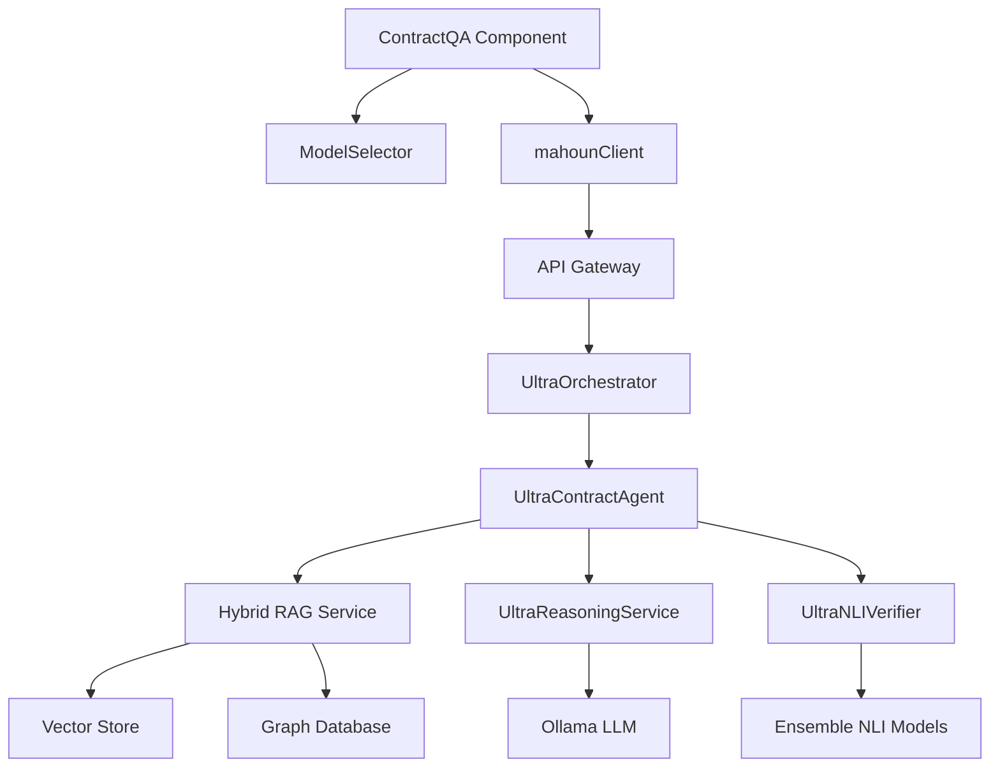
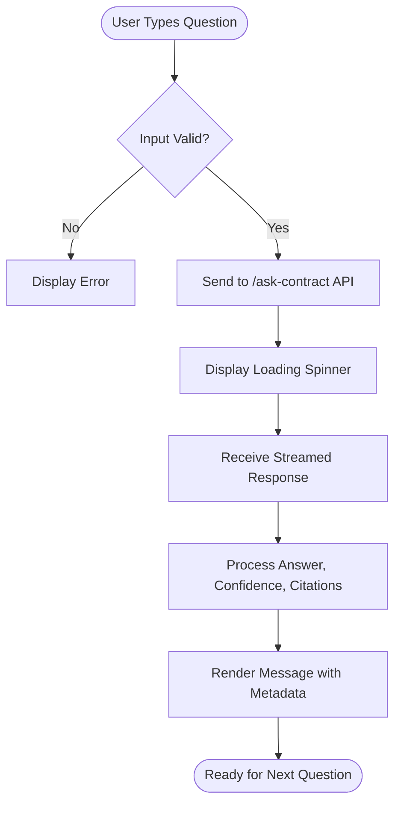
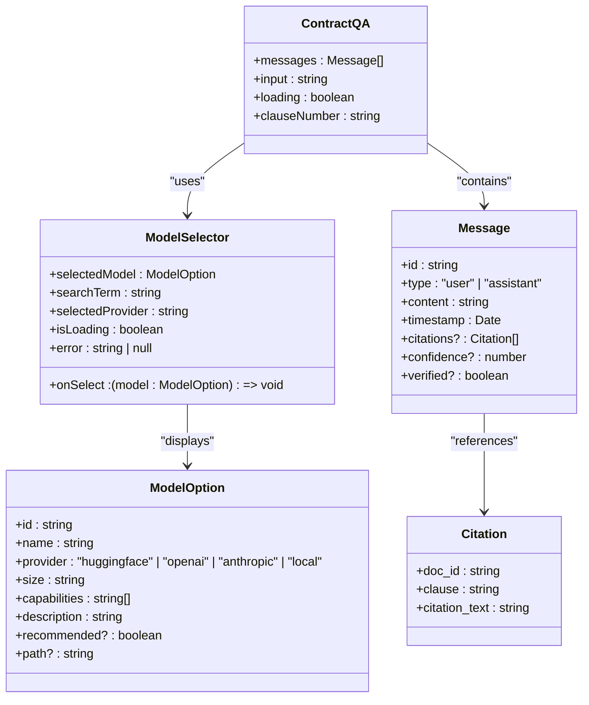
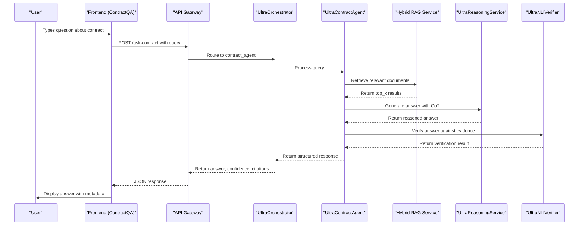
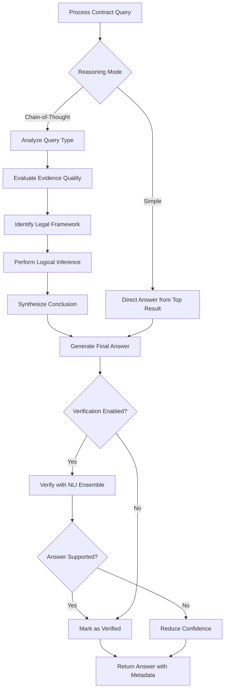
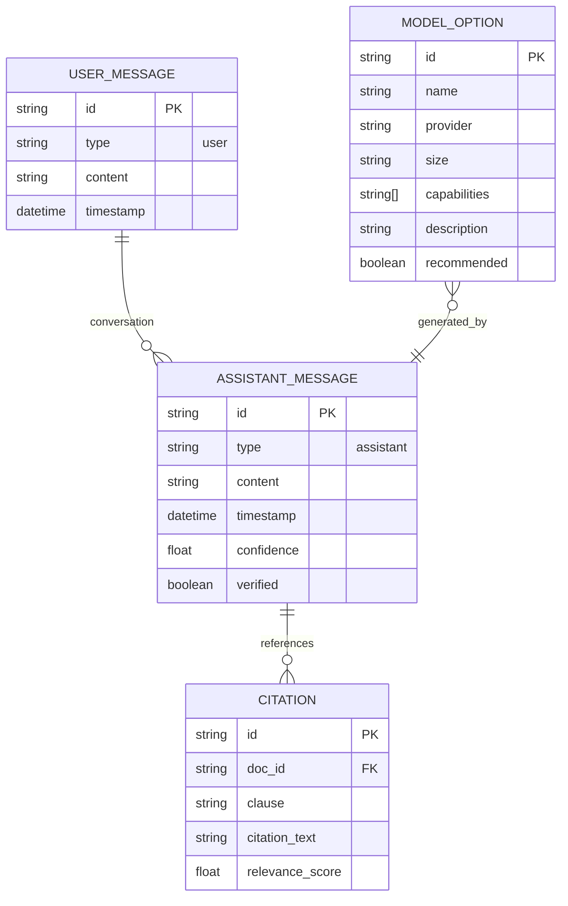
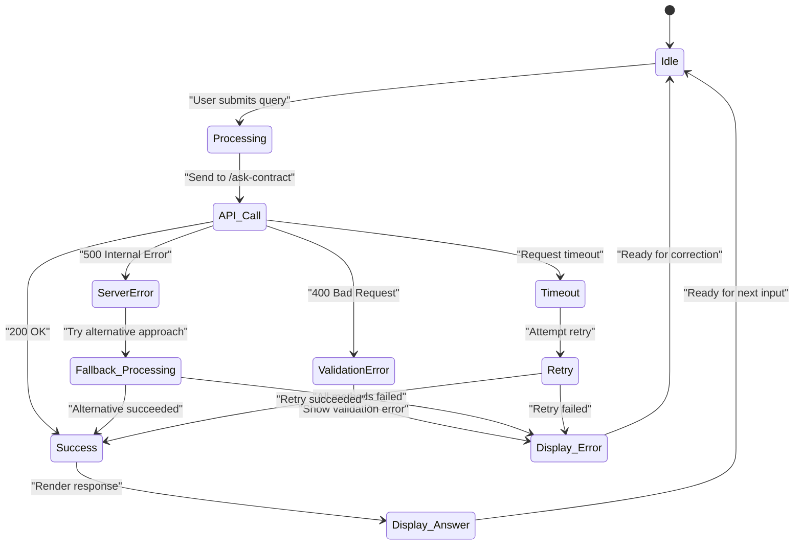

# Contract Q&A Components

<cite>
**Referenced Files in This Document**   
- [ContractQA.tsx](file://frontend/src/components/ContractQA.tsx)
- [ModelSelector.tsx](file://frontend/src/components/ModelSelector.tsx)
- [mahoun.py](file://api/routers/mahoun.py)
- [mahounClient.ts](file://frontend/src/api/mahounClient.ts)
- [contract_agent.py](file://mahoun/agents/contract_agent.py)
- [ultra_reasoning_service.py](file://mahoun/reasoning/ultra_reasoning_service.py)
- [ultra_nli_verifier.py](file://mahoun/guardrails/ultra_nli_verifier.py)
</cite>

## Table of Contents
1. [Introduction](#introduction)
2. [Core Architecture](#core-architecture)
3. [Contract Q&A Component](#contract-qa-component)
4. [Model Selection Integration](#model-selection-integration)
5. [Backend API and Processing](#backend-api-and-processing)
6. [Reasoning and Verification](#reasoning-and-verification)
7. [UI/UX Patterns](#uiux-patterns)
8. [Error Handling and Rate Limiting](#error-handling-and-rate-limiting)
9. [Implementation Guidance](#implementation-guidance)
10. [Conclusion](#conclusion)

## Introduction
The Contract Q&A functionality enables users to ask natural language questions about legal contracts and receive evidence-backed answers with provenance. This system combines retrieval-augmented generation (RAG), chain-of-thought reasoning, and natural language inference (NLI) verification to deliver accurate, citable responses. The ContractQA component provides a chat-like interface where users can query contract details, with results including confidence scores, verification status, and citation references. The system integrates with ModelSelector to allow switching between different reasoning models, supporting both local and cloud-based LLMs. This documentation details the architecture, implementation, and extension points for this sophisticated legal AI system.

## Core Architecture
The Contract Q&A system follows a multi-layered architecture that separates concerns between user interface, API gateway, orchestration, and specialized AI services. The frontend components handle user interaction and real-time response rendering, while the backend orchestrates document retrieval, reasoning, and answer verification through specialized agents. The system employs a microservices-inspired pattern where different capabilities (retrieval, reasoning, verification) are implemented as independent but composable components.

**Diagram sources**
- [ContractQA.tsx](file://frontend/src/components/ContractQA.tsx)
- [ModelSelector.tsx](file://frontend/src/components/ModelSelector.tsx)
- [mahoun.py](file://api/routers/mahoun.py)
- [contract_agent.py](file://mahoun/agents/contract_agent.py)

## Contract Q&A Component
The ContractQA component provides a conversational interface for users to query legal contracts. It implements a chat-style UI with message history, real-time response streaming, and rich citation display. The component manages user input, form state (including optional clause filtering), and communication with the backend API.

The UI displays assistant responses with confidence scores, verification status, and citation references. When a response is verified, a checkmark icon appears alongside the message. Confidence is displayed as a percentage, and citations are shown as highlighted text excerpts from relevant contract clauses.

**Section sources**
- [ContractQA.tsx](file://frontend/src/components/ContractQA.tsx#L1-L192)

## Model Selection Integration
The Contract Q&A system integrates with ModelSelector to allow users to switch between different reasoning models. This component provides a premium UI for selecting AI models from various providers (local, HuggingFace, OpenAI, Anthropic), with visual indicators for model capabilities, size, and recommendations.

Model selection affects the reasoning backend used for contract analysis. The selected model configuration is passed through the orchestration layer to the UltraContractAgent, which uses it to initialize the appropriate LLM driver. This allows the system to leverage different reasoning capabilities based on user requirements, balancing factors like accuracy, speed, cost, and data privacy.

**Diagram sources**
- [ModelSelector.tsx](file://frontend/src/components/ModelSelector.tsx#L1-L379)
- [ContractQA.tsx](file://frontend/src/components/ContractQA.tsx#L1-L192)

## Backend API and Processing
The backend API exposes the `/ask-contract` endpoint that handles contract queries. This endpoint processes requests through the UltraOrchestrator, which routes them to the UltraContractAgent for processing. The agent implements a sophisticated workflow that includes document retrieval, reasoning, and answer verification.

The API accepts parameters including the query text, optional clause number filter, contract ID, and top_k results to retrieve. It returns structured responses with the answer, confidence score, verification status, citations, and processing metadata. The endpoint implements proper error handling and HTTP status codes for various failure scenarios.

**Section sources**
- [mahoun.py](file://api/routers/mahoun.py#L341-L396)
- [mahounClient.ts](file://frontend/src/api/mahounClient.ts#L180-L192)

## Reasoning and Verification
The UltraContractAgent implements advanced reasoning capabilities through integration with the UltraReasoningService and UltraNLIVerifier. The reasoning process follows a chain-of-thought approach, breaking down complex queries into sequential reasoning steps that include query analysis, evidence evaluation, legal framework identification, logical inference, and conclusion synthesis.

The system employs self-consistency checking by generating multiple reasoning paths and selecting the most consistent answer. Uncertainty quantification is performed by analyzing confidence across reasoning steps and evidence quality. Answer verification uses an ensemble of NLI models to determine whether the generated answer is entailed by, contradicted by, or neutral with respect to the supporting evidence.

**Section sources**
- [contract_agent.py](file://mahoun/agents/contract_agent.py#L396-L424)
- [ultra_reasoning_service.py](file://mahoun/reasoning/ultra_reasoning_service.py#L96-L232)
- [ultra_nli_verifier.py](file://mahoun/guardrails/ultra_nli_verifier.py#L478-L641)

## UI/UX Patterns
The Contract Q&A interface implements several user experience patterns to enhance usability and trust in AI-generated responses. Assistant messages are visually distinguished from user messages with different background colors and right-alignment for user messages.

Key information is displayed through multiple channels:
- **Confidence scores** are shown as percentages, providing users with an estimate of answer reliability
- **Verification status** is indicated with a checkmark icon when NLI verification confirms the answer is supported by evidence
- **Citations** are displayed as quoted text excerpts from relevant contract clauses, with the ability to show multiple citations
- **Loading states** include animated spinners during processing to provide feedback on system activity

The interface supports optional filtering by clause number, allowing users to focus queries on specific contract sections. Error messages are displayed inline when API requests fail, maintaining context within the conversation flow.

**Section sources**
- [ContractQA.tsx](file://frontend/src/components/ContractQA.tsx#L100-L150)
- [ModelSelector.tsx](file://frontend/src/components/ModelSelector.tsx#L247-L338)

## Error Handling and Rate Limiting
The system implements comprehensive error handling at multiple levels to ensure graceful degradation when components fail. The UltraContractAgent includes circuit breaker patterns for its dependencies (RAG service, reasoning service, verifier), allowing it to fall back to simpler response strategies when advanced capabilities are unavailable.

Client-side error handling in the ContractQA component catches API failures and displays user-friendly error messages without breaking the conversation flow. The backend API returns appropriate HTTP status codes (400 for bad requests, 500 for server errors) with descriptive error messages in the response body.

Rate limiting considerations are addressed through backend middleware that limits request frequency per user/session. The system also implements queuing for resource-intensive operations to prevent overload during peak usage. Client-side loading indicators provide feedback during processing, improving perceived performance.

**Section sources**
- [contract_agent.py](file://mahoun/agents/contract_agent.py#L451-L497)
- [ContractQA.tsx](file://frontend/src/components/ContractQA.tsx#L67-L75)

## Implementation Guidance
To extend the supported question types, developers can enhance the query analysis logic in the UltraReasoningService to recognize additional query patterns and map them to appropriate reasoning strategies. New question types (e.g., comparative analysis, temporal reasoning) can be added by extending the query type detection and creating corresponding reasoning templates.

Integrating additional knowledge sources involves extending the Hybrid RAG Service to index and retrieve from new data repositories. This requires implementing appropriate document parsers and embedding strategies for the new source types, then registering them with the RAG service's retrieval router.

For real-time response streaming, the backend can be modified to use server-sent events (SSE) or WebSockets to stream reasoning steps and partial answers to the frontend. The ContractQA component would need to be updated to handle streamed responses and progressively render content as it arrives.

Confidence score calibration can be improved by implementing temperature scaling or Platt scaling on the NLI model outputs, using a validation dataset of human-verified question-answer pairs to learn the calibration parameters.

**Section sources**
- [ultra_reasoning_service.py](file://mahoun/reasoning/ultra_reasoning_service.py#L300-L358)
- [contract_agent.py](file://mahoun/agents/contract_agent.py#L502-L535)
- [ultra_nli_verifier.py](file://mahoun/guardrails/ultra_nli_verifier.py#L258-L287)

## Conclusion
The Contract Q&A system represents a sophisticated integration of retrieval-augmented generation, chain-of-thought reasoning, and natural language inference verification to provide reliable, evidence-backed answers to legal contract questions. The modular architecture separates concerns between user interface, API gateway, orchestration, and specialized AI services, enabling independent development and scaling of components.

Key strengths include the transparent presentation of confidence scores and verification status, which helps users assess answer reliability. The integration with ModelSelector allows flexibility in reasoning backend selection, accommodating different performance, cost, and privacy requirements. The system's error handling and fallback mechanisms ensure robust operation even when individual components experience issues.

Future enhancements could include real-time response streaming, expanded knowledge source integration, and improved confidence calibration through machine learning techniques. The architecture provides a solid foundation for extending the system's capabilities while maintaining reliability and user trust.