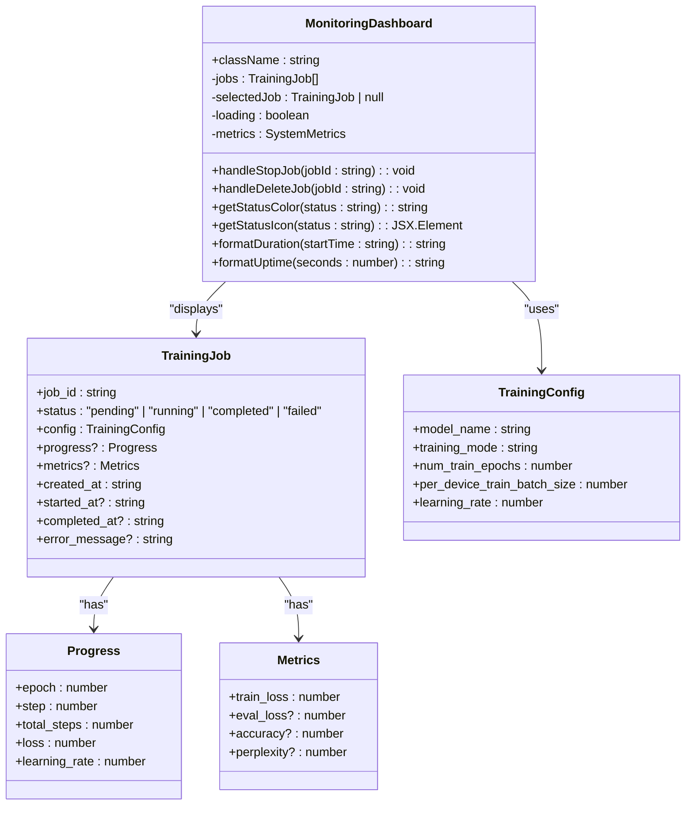
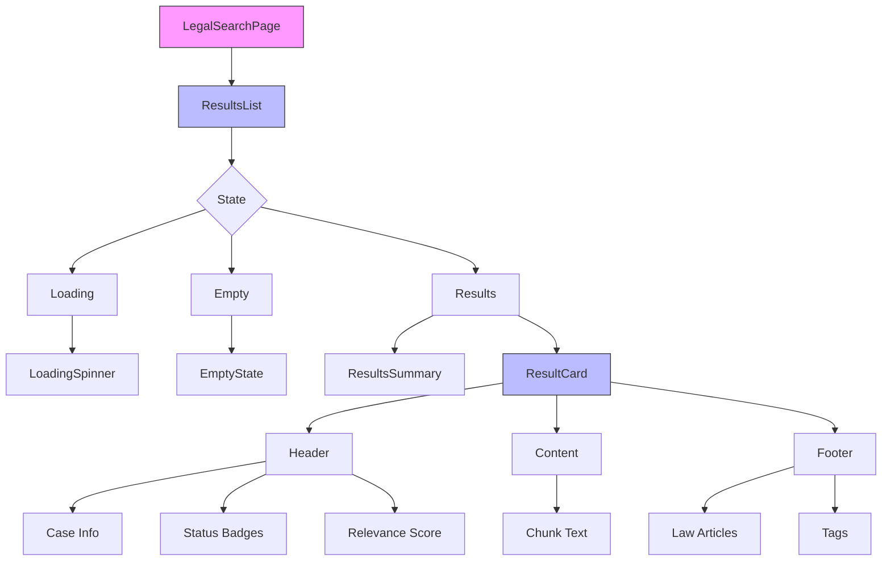
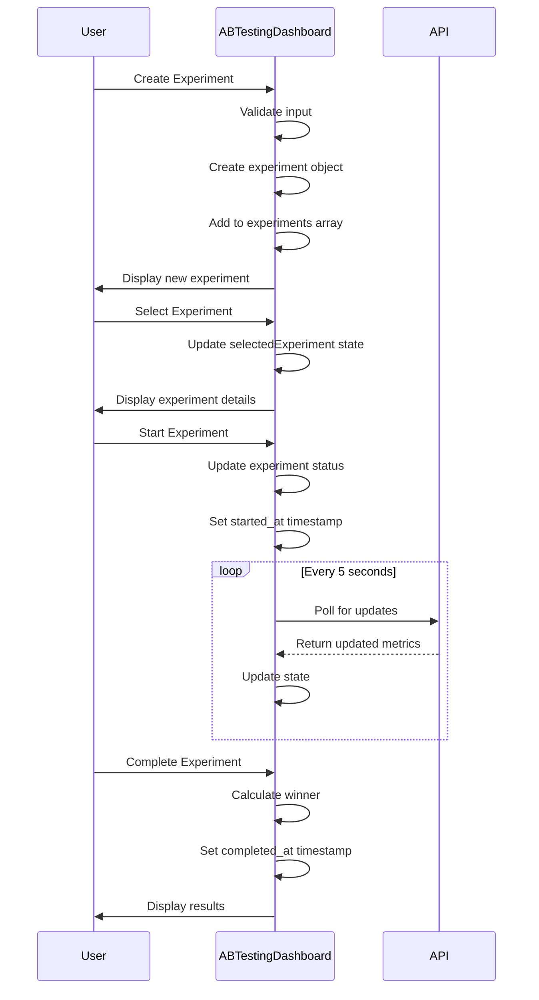
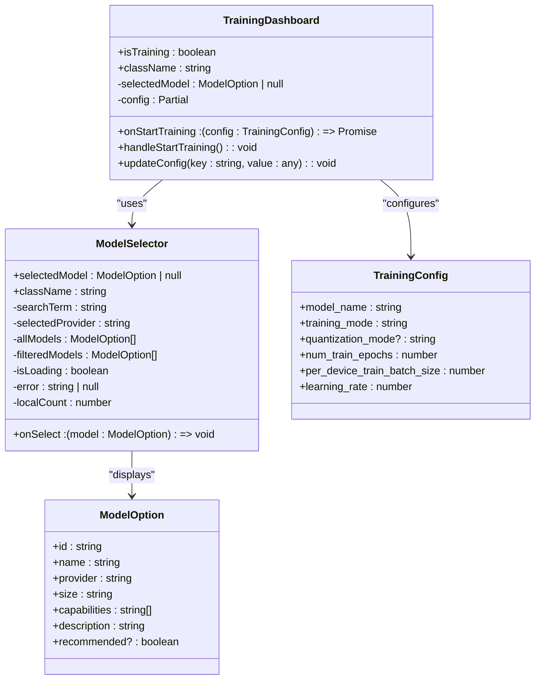

# Frontend Components

<cite>
**Referenced Files in This Document**   
- [LegalSearchPage.tsx](file://frontend/src/components/LegalSearchPage.tsx)
- [ContractQA.tsx](file://frontend/src/components/ContractQA.tsx)
- [MonitoringDashboard.tsx](file://frontend/src/components/MonitoringDashboard.tsx)
- [ABTestingDashboard.tsx](file://frontend/src/components/ABTestingDashboard.tsx)
- [TrainingDashboard.tsx](file://frontend/src/components/TrainingDashboard.tsx)
- [ResultsList.tsx](file://frontend/src/components/ResultsList.tsx)
- [ResultCard.tsx](file://frontend/src/components/ResultCard.tsx)
- [types.ts](file://frontend/src/api/types.ts)
- [client.ts](file://frontend/src/api/client.ts)
- [trainingClient.ts](file://frontend/src/api/trainingClient.ts)
- [SearchFilters.tsx](file://frontend/src/components/SearchFilters.tsx)
- [StatsPanel.tsx](file://frontend/src/components/StatsPanel.tsx)
- [ModelSelector.tsx](file://frontend/src/components/ModelSelector.tsx)

## Table of Contents
1. [Introduction](#introduction)
2. [Core Components](#core-components)
3. [Component Composition](#component-composition)
4. [Data Visualization and Real-time Updates](#data-visualization-and-real-time-updates)
5. [Accessibility and Responsive Design](#accessibility-and-responsive-design)
6. [Performance Optimization](#performance-optimization)
7. [Extension and Creation Guidelines](#extension-and-creation-guidelines)
8. [Conclusion](#conclusion)

## Introduction
This document provides a comprehensive analysis of the frontend component architecture for the MAHOUN legal search platform. It focuses on key UI modules including LegalSearchPage, ContractQA, and MonitoringDashboard, detailing their purpose, props, and state management. The document also examines component composition strategies, accessibility compliance, responsive design considerations, and performance optimization techniques for rendering large datasets. Code examples from ABTestingDashboard.tsx and TrainingDashboard.tsx illustrate data visualization and real-time update patterns.

## Core Components

### LegalSearchPage Component
The LegalSearchPage component serves as the main interface for legal verdict search functionality. It manages search state, handles user input, and displays search results with comprehensive filtering options.

**Props and State Management**
The component utilizes React's useState hook to manage several state variables:
- Search state: query, filters, and limit
- Results state: results and hasSearched
- UI state: isLoading, error, filtersOpen, and uploadModalOpen

The component implements a search submission handler that validates the query, makes API calls through the searchVerdicts function, and updates the results state accordingly. It also handles keyboard shortcuts (Ctrl/Cmd + Enter) for search submission.

**Section sources**
- [LegalSearchPage.tsx](file://frontend/src/components/LegalSearchPage.tsx#L1-L258)

### ContractQA Component
The ContractQA component provides an advanced chat interface for contract-related questions with real-time answers, citation display, confidence scores, and conversation history.

**Props and State Management**
The component manages the following state variables:
- messages: Array of user and assistant messages
- input: Current input text
- loading: Loading state during API calls
- clauseNumber: Optional clause number filter

The component implements a message sending handler that creates user messages, makes API calls through the askContract function, and adds assistant responses with citations, confidence scores, and verification status.

**Section sources**
- [ContractQA.tsx](file://frontend/src/components/ContractQA.tsx#L1-L192)

### MonitoringDashboard Component
The MonitoringDashboard component provides real-time monitoring of training jobs, system metrics, and performance analytics.

**Props and State Management**
The component accepts a className prop and manages the following state:
- jobs: Array of training jobs
- selectedJob: Currently selected job for detailed view
- loading: Loading state
- metrics: System metrics (CPU, memory, GPU usage, etc.)

The component uses useEffect to load training jobs and set up real-time updates with a 5-second interval. It provides functionality to stop and delete jobs, with appropriate confirmation dialogs.

**Diagram sources**
- [MonitoringDashboard.tsx](file://frontend/src/components/MonitoringDashboard.tsx#L1-L379)
- [types.ts](file://frontend/src/api/types.ts#L136-L157)

**Section sources**
- [MonitoringDashboard.tsx](file://frontend/src/components/MonitoringDashboard.tsx#L1-L379)

## Component Composition

### ResultsList and ResultCard Composition
The ResultsList and ResultCard components work together to display search results in a structured and visually appealing manner.

**ResultsList Component**
The ResultsList component manages the display of multiple search results and handles different states:
- Loading state with spinner animation
- Empty state with appropriate messaging
- Results summary header

It maps over the results array and renders a ResultCard component for each hit, passing the hit data and index as props.

**ResultCard Component**
The ResultCard component displays a single verdict search result with the following features:
- Case information (case type, court level, procedure stage)
- Status badges (final/non-final)
- Relevance score visualization with color-coded progress bar
- Section labels with translated names
- Law articles and tags with truncation for long lists
- Verdict ID display

The component uses a pill pattern for tags and law articles, limiting the display to a reasonable number and showing "+X more" for overflow items.

**Diagram sources**
- [ResultsList.tsx](file://frontend/src/components/ResultsList.tsx#L1-L104)
- [ResultCard.tsx](file://frontend/src/components/ResultCard.tsx#L1-L178)

**Section sources**
- [ResultsList.tsx](file://frontend/src/components/ResultsList.tsx#L1-L104)
- [ResultCard.tsx](file://frontend/src/components/ResultCard.tsx#L1-L178)

### SearchFilters Component
The SearchFilters component provides advanced filtering options for the search functionality.

**Props and State Management**
The component accepts the following props:
- filters: LegalSearchFilters object
- onChange: Callback for filter changes
- limit: Number of results to display
- onLimitChange: Callback for limit changes
- isOpen: Boolean indicating if filters are visible
- onToggle: Callback to toggle filter visibility

The component implements individual filter inputs for court level, case type, article number, law name, and tags, with appropriate handling for comma-separated tags input.

**Section sources**
- [SearchFilters.tsx](file://frontend/src/components/SearchFilters.tsx#L1-L263)

### StatsPanel Component
The StatsPanel component displays system statistics in a dropdown panel.

**Props and State Management**
The component manages the following state:
- stats: System statistics object
- isOpen: Boolean indicating if panel is visible

It fetches statistics from the API when opened and displays them in a formatted manner with appropriate styling for different metrics.

**Section sources**
- [StatsPanel.tsx](file://frontend/src/components/StatsPanel.tsx#L1-L90)

## Data Visualization and Real-time Updates

### ABTestingDashboard Component
The ABTestingDashboard component demonstrates advanced data visualization patterns for comparing AI models.

**Real-time Update Patterns**
The component uses state management to handle:
- Experiment creation and configuration
- Real-time status updates for running experiments
- Statistical comparison of model performance metrics

The component implements a mock data structure for experiments with variants containing accuracy, latency, cost, and sample size metrics. It calculates the winner based on accuracy and displays confidence levels.

**Diagram sources**
- [ABTestingDashboard.tsx](file://frontend/src/components/ABTestingDashboard.tsx#L1-L531)

**Section sources**
- [ABTestingDashboard.tsx](file://frontend/src/components/ABTestingDashboard.tsx#L1-L531)

### TrainingDashboard Component
The TrainingDashboard component illustrates data visualization for model training configuration.

**Real-time Update Patterns**
The component manages training configuration state and provides:
- Model selection with ModelSelector component
- Training mode selection with visual feedback
- Quantization mode options
- Training parameter inputs with validation
- Dataset and output configuration

The component implements a form-like interface with progressive disclosure of options based on the selected training mode.

**Diagram sources**
- [TrainingDashboard.tsx](file://frontend/src/components/TrainingDashboard.tsx#L1-L410)
- [ModelSelector.tsx](file://frontend/src/components/ModelSelector.tsx#L1-L379)

**Section sources**
- [TrainingDashboard.tsx](file://frontend/src/components/TrainingDashboard.tsx#L1-L410)

## Accessibility and Responsive Design

### Accessibility Features
The components implement several accessibility features:

**Keyboard Navigation**
- LegalSearchPage supports Ctrl/Cmd + Enter for search submission
- All interactive elements are focusable and have appropriate focus states
- Form elements have proper labels and ARIA attributes

**Screen Reader Support**
- Semantic HTML elements are used appropriately
- ARIA labels and roles are implemented for interactive components
- Error messages are announced to screen readers

**Color and Contrast**
- Sufficient color contrast for text and interactive elements
- Color is not used as the only means of conveying information
- Focus indicators are visible and meet accessibility standards

### Responsive Design Considerations
The components are designed to work across different screen sizes:

**Layout Adaptation**
- Grid layouts adapt from single column on mobile to multi-column on larger screens
- Component widths are responsive using Tailwind CSS classes
- Text sizes and spacing adjust based on screen size

**Touch-Friendly Design**
- Interactive elements have appropriate tap targets
- Hover states are supplemented with touch states
- Mobile-specific interactions are considered

**Section sources**
- [LegalSearchPage.tsx](file://frontend/src/components/LegalSearchPage.tsx#L1-L258)
- [ContractQA.tsx](file://frontend/src/components/ContractQA.tsx#L1-L192)
- [MonitoringDashboard.tsx](file://frontend/src/components/MonitoringDashboard.tsx#L1-L379)

## Performance Optimization

### Large Dataset Rendering
The components implement several performance optimizations for rendering large datasets:

**Virtualization Considerations**
- ResultsList component uses simple mapping for results, which could be enhanced with virtualization for very large datasets
- Loading states prevent UI blocking during data fetching
- Empty states provide feedback when no results are found

**Memoization and Optimization**
- useCallback is used for event handlers to prevent unnecessary re-renders
- Component structure minimizes re-renders of child components
- State updates are batched where appropriate

**API Optimization**
- API calls are debounced or rate-limited where appropriate
- Only necessary data is fetched and rendered
- Loading states provide feedback during API calls

### Code Splitting and Lazy Loading
While not explicitly implemented in the analyzed components, the architecture supports:

**Component-Level Code Splitting**
- Components are organized in a way that supports lazy loading
- Feature-based organization enables code splitting by feature
- Dependencies are managed to minimize bundle size

**Image and Asset Optimization**
- Icons are imported from Heroicons, which supports tree-shaking
- SVG icons are used instead of raster images where appropriate
- CSS classes are optimized using Tailwind CSS

**Section sources**
- [ResultsList.tsx](file://frontend/src/components/ResultsList.tsx#L1-L104)
- [LegalSearchPage.tsx](file://frontend/src/components/LegalSearchPage.tsx#L1-L258)

## Extension and Creation Guidelines

### Following Established Patterns
When extending existing components or creating new ones, follow these guidelines:

**Component Structure**
- Use functional components with hooks
- Organize state management logically
- Separate presentational and container components when appropriate
- Use TypeScript for type safety

**Styling Approach**
- Use Tailwind CSS for styling
- Follow the existing color palette and design system
- Maintain consistent spacing and typography
- Use responsive design principles

**State Management**
- Use useState for local component state
- Use useEffect for side effects and data fetching
- Consider custom hooks for reusable logic
- Avoid prop drilling by using context when appropriate

**API Integration**
- Use the existing API client modules
- Handle errors gracefully with user-friendly messages
- Implement loading states for asynchronous operations
- Use appropriate HTTP methods and status code handling

### Best Practices for New Components
When creating new components:

**Naming Conventions**
- Use PascalCase for component names
- Use descriptive names that reflect the component's purpose
- Follow the existing file structure and naming patterns

**Documentation**
- Add JSDoc comments for component props and functions
- Include examples of usage when appropriate
- Document any side effects or dependencies

**Testing**
- Write unit tests for component functionality
- Test edge cases and error conditions
- Verify accessibility and responsive behavior

**Section sources**
- [LegalSearchPage.tsx](file://frontend/src/components/LegalSearchPage.tsx#L1-L258)
- [ContractQA.tsx](file://frontend/src/components/ContractQA.tsx#L1-L192)
- [MonitoringDashboard.tsx](file://frontend/src/components/MonitoringDashboard.tsx#L1-L379)

## Conclusion
The frontend component architecture of the MAHOUN platform demonstrates a well-structured approach to building complex legal search and AI model management interfaces. The components are designed with clear separation of concerns, effective state management, and attention to user experience. The architecture supports data visualization, real-time updates, accessibility, and responsive design while providing a solid foundation for future extension and development. By following the established patterns and guidelines, developers can effectively extend the existing components and create new ones that maintain consistency and quality across the application.