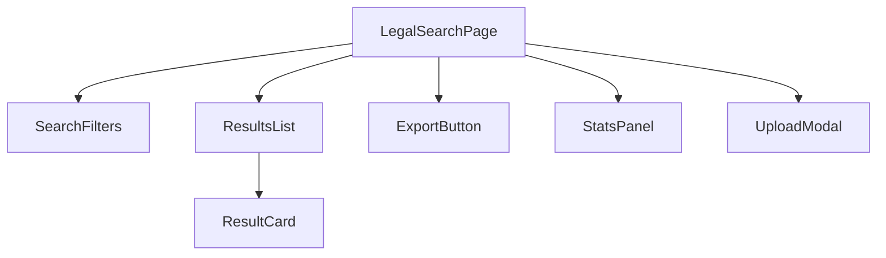
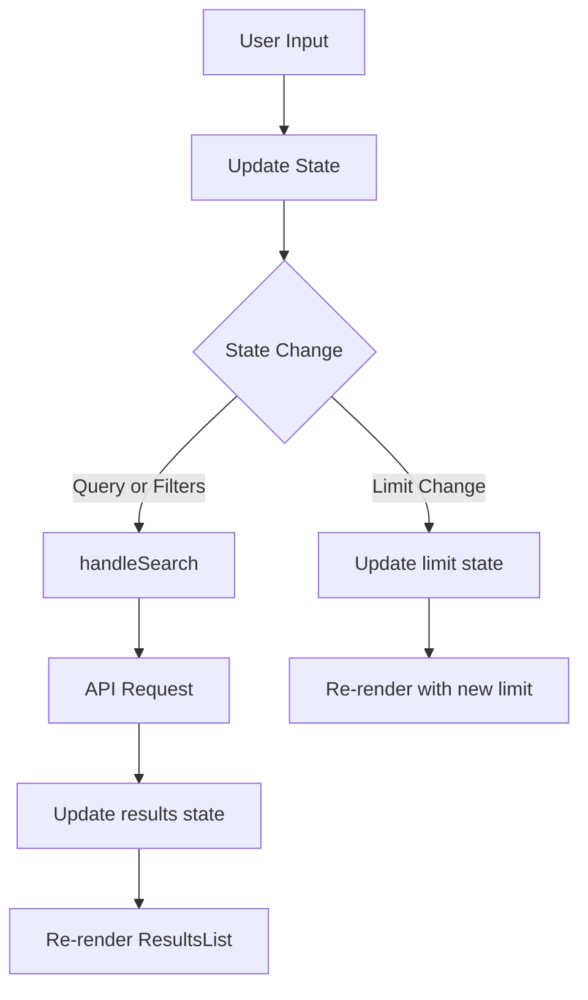
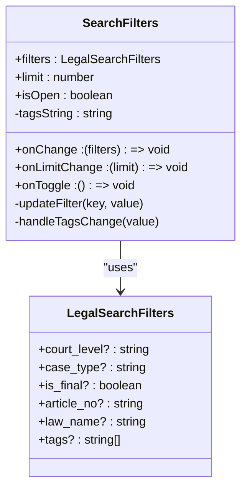
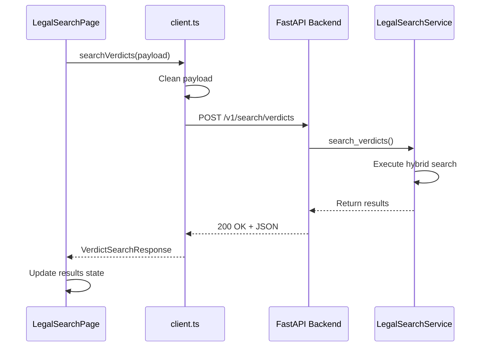
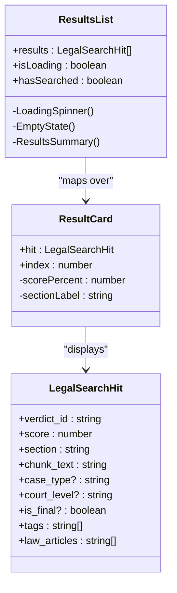

# Legal Search Components

<cite>
**Referenced Files in This Document**   
- [LegalSearchPage.tsx](file://frontend/src/components/LegalSearchPage.tsx)
- [ResultsList.tsx](file://frontend/src/components/ResultsList.tsx)
- [ResultCard.tsx](file://frontend/src/components/ResultCard.tsx)
- [SearchFilters.tsx](file://frontend/src/components/SearchFilters.tsx)
- [client.ts](file://frontend/src/api/client.ts)
- [types.ts](file://frontend/src/api/types.ts)
- [search.py](file://api/routers/search.py)
- [mahounClient.ts](file://frontend/src/api/mahounClient.ts)
- [ExportButton.tsx](file://frontend/src/components/ExportButton.tsx)
- [StatsPanel.tsx](file://frontend/src/components/StatsPanel.tsx)
</cite>

## Table of Contents
1. [Introduction](#introduction)
2. [Component Hierarchy](#component-hierarchy)
3. [State Management](#state-management)
4. [Search Filters and Faceted Search](#search-filters-and-faceted-search)
5. [Backend Integration](#backend-integration)
6. [Result Rendering and Provenance Tracking](#result-rendering-and-provenance-tracking)
7. [Accessibility and Responsive Design](#accessibility-and-responsive-design)
8. [Performance Optimization](#performance-optimization)
9. [Customization and Extension](#customization-and-extension)
10. [Conclusion](#conclusion)

## Introduction

The Legal Search interface components provide a comprehensive solution for retrieving and analyzing legal verdicts through a sophisticated search system. The main entry point, LegalSearchPage, orchestrates a suite of components to deliver a powerful search experience with provenance tracking, faceted filtering, and hybrid search capabilities. This documentation details the architecture, implementation, and integration of these components, focusing on their role in enabling efficient legal document retrieval and analysis.

The system is designed to handle complex legal queries in both Persian and English, leveraging semantic search, graph-based enrichment, and multiple retrieval strategies to deliver relevant results. The interface components work in concert with backend services to provide a seamless user experience for legal professionals and researchers.

**Section sources**
- [LegalSearchPage.tsx](file://frontend/src/components/LegalSearchPage.tsx#L1-L258)

## Component Hierarchy

The legal search interface follows a hierarchical component structure with LegalSearchPage serving as the main orchestrator. This component manages the overall search state and coordinates the interaction between various subcomponents responsible for different aspects of the search experience.

LegalSearchPage integrates several key components:
- SearchFilters for query refinement and faceted search
- ResultsList for displaying search results
- ResultCard for rendering individual verdict cards
- ExportButton for exporting search results
- StatsPanel for system monitoring

The component hierarchy follows a parent-child relationship where LegalSearchPage passes state and callback functions to its child components, enabling coordinated behavior while maintaining separation of concerns. This architecture allows for modular development and easier maintenance of individual components.

**Diagram sources **
- [LegalSearchPage.tsx](file://frontend/src/components/LegalSearchPage.tsx#L1-L258)
- [ResultsList.tsx](file://frontend/src/components/ResultsList.tsx#L1-L104)
- [ResultCard.tsx](file://frontend/src/components/ResultCard.tsx#L1-L178)
- [SearchFilters.tsx](file://frontend/src/components/SearchFilters.tsx#L1-L263)

**Section sources**
- [LegalSearchPage.tsx](file://frontend/src/components/LegalSearchPage.tsx#L1-L258)
- [ResultsList.tsx](file://frontend/src/components/ResultsList.tsx#L1-L104)
- [ResultCard.tsx](file://frontend/src/components/ResultCard.tsx#L1-L178)
- [SearchFilters.tsx](file://frontend/src/components/SearchFilters.tsx#L1-L263)

## State Management

The legal search components implement a comprehensive state management system using React's useState and useCallback hooks to handle search queries, filters, and UI state. The main LegalSearchPage component maintains several state variables that control the search functionality and user interface behavior.

Key state variables include:
- query: Stores the current search query text
- filters: Maintains the active search filters
- limit: Controls the number of results to display
- results: Holds the search results from the backend
- isLoading: Tracks the loading state during search operations
- error: Stores any error messages from failed searches

The state management approach uses callback functions with useCallback to optimize performance by preventing unnecessary re-renders. The handleSearch function, for example, is memoized to ensure it only changes when its dependencies (query, filters, limit) change.

**Diagram sources **
- [LegalSearchPage.tsx](file://frontend/src/components/LegalSearchPage.tsx#L16-L27)
- [client.ts](file://frontend/src/api/client.ts#L71-L111)

**Section sources**
- [LegalSearchPage.tsx](file://frontend/src/components/LegalSearchPage.tsx#L16-L71)

## Search Filters and Faceted Search

The SearchFilters component provides a comprehensive faceted search capability that allows users to refine their queries based on multiple criteria. This component supports filtering by court level, case type, finality status, law article number, law name, and custom tags.

The implementation uses a collapsible panel design that can be toggled open or closed, providing a clean interface that doesn't overwhelm users when not in use. When expanded, the panel displays multiple filter inputs organized in a responsive grid layout that adapts to different screen sizes.

Key features of the faceted search implementation include:
- Support for multiple filter types (text, checkboxes, select dropdowns)
- Real-time filter application as users modify criteria
- Visual indication of active filters
- Ability to clear all filters with a single click
- Support for comma-separated tags input in both Persian and English

The component's design emphasizes usability by providing clear labels, appropriate placeholder text, and visual feedback for user interactions. The filter state is managed externally by the parent component, allowing for coordinated behavior across the search interface.

**Diagram sources **
- [SearchFilters.tsx](file://frontend/src/components/SearchFilters.tsx#L1-L263)
- [types.ts](file://frontend/src/api/types.ts#L12-L30)

**Section sources**
- [SearchFilters.tsx](file://frontend/src/components/SearchFilters.tsx#L1-L263)

## Backend Integration

The legal search components integrate with the backend search API through the mahounClient and client.ts modules, enabling communication with the FastAPI backend. The integration follows a clean separation of concerns, with API client functions handling the HTTP communication while the UI components focus on presentation and user interaction.

The searchVerdicts function in client.ts serves as the primary interface to the backend search endpoint, handling request construction, error handling, and response parsing. This function implements several important features:

- Request payload validation and cleaning
- Proper HTTP headers and JSON serialization
- Comprehensive error handling with user-friendly messages
- Network error detection and reporting
- Support for hybrid search with graph enrichment

The API integration uses the fetch API with async/await syntax for handling asynchronous operations. Error handling is robust, distinguishing between different types of errors (HTTP errors, network errors, parsing errors) and providing appropriate feedback to users.

**Diagram sources **
- [client.ts](file://frontend/src/api/client.ts#L71-L111)
- [search.py](file://api/routers/search.py#L194-L336)
- [types.ts](file://frontend/src/api/types.ts#L73-L102)

**Section sources**
- [client.ts](file://frontend/src/api/client.ts#L71-L132)
- [search.py](file://api/routers/search.py#L194-L336)

## Result Rendering and Provenance Tracking

The results display system consists of two main components: ResultsList and ResultCard, which work together to render search results with comprehensive provenance tracking. This system provides users with detailed information about each verdict, including relevance scores, metadata, and connections to legal references.

ResultsList serves as the container component that manages the display of multiple ResultCard components. It handles different states such as loading, empty results, and populated results, providing appropriate visual feedback in each case. The component implements a clean separation between the list management logic and the individual result rendering.

ResultCard displays detailed information about a single verdict, including:
- Case type and court level
- Finality status (قطعی/غیرقطعی)
- Relevance score visualization
- Section information and verdict ID
- Law articles and tags
- Text excerpt with line clamping

Provenance tracking is implemented through the display of law articles and tags, which provide context about the legal basis and categorization of each verdict. The relevance score is visualized as a progress bar with color coding based on the score value, providing immediate visual feedback about result quality.

**Diagram sources **
- [ResultsList.tsx](file://frontend/src/components/ResultsList.tsx#L1-L104)
- [ResultCard.tsx](file://frontend/src/components/ResultCard.tsx#L1-L178)
- [types.ts](file://frontend/src/api/types.ts#L35-L68)

**Section sources**
- [ResultsList.tsx](file://frontend/src/components/ResultsList.tsx#L1-L104)
- [ResultCard.tsx](file://frontend/src/components/ResultCard.tsx#L1-L178)

## Accessibility and Responsive Design

The legal search components implement comprehensive accessibility features and responsive design principles to ensure usability across different devices and for users with various needs. The interface is designed to be fully functional and visually coherent on desktop, tablet, and mobile devices.

Accessibility features include:
- Proper semantic HTML with appropriate ARIA attributes
- Keyboard navigation support, including the Ctrl+Enter shortcut for search
- Screen reader support with descriptive labels and landmarks
- High contrast color scheme for improved readability
- Focus management for interactive elements

The responsive design uses a mobile-first approach with Tailwind CSS utility classes to create a flexible layout that adapts to different screen sizes. Key responsive features include:
- Flexible grid layouts that reorganize based on screen width
- Appropriate font sizes and spacing for different devices
- Touch-friendly controls with adequate tap targets
- Collapsible panels to conserve screen space on smaller devices

The interface maintains a consistent visual hierarchy across all screen sizes, ensuring that the most important information is always prominently displayed. The use of relative units and flexible containers allows the layout to adapt gracefully to different viewport dimensions.

**Section sources**
- [LegalSearchPage.tsx](file://frontend/src/components/LegalSearchPage.tsx#L83-L258)
- [ResultsList.tsx](file://frontend/src/components/ResultsList.tsx#L1-L104)
- [ResultCard.tsx](file://frontend/src/components/ResultCard.tsx#L1-L178)

## Performance Optimization

The legal search components implement several performance optimization techniques to ensure a responsive user experience, particularly when dealing with large result sets. These optimizations address both frontend rendering performance and backend search efficiency.

Frontend optimizations include:
- Virtualized rendering considerations in the component design
- Memoization of callback functions with useCallback
- Efficient state management to minimize re-renders
- Lazy loading of non-critical components
- Optimized event handling to prevent memory leaks

The architecture supports virtualized rendering through the ResultsList component, which could be enhanced with libraries like react-window or react-virtualized to handle very large result sets efficiently. This would prevent performance degradation when displaying hundreds or thousands of results by only rendering visible items.

Backend performance is optimized through:
- Caching of search results to avoid redundant queries
- Hybrid search algorithms that balance speed and accuracy
- Efficient database queries with appropriate indexing
- Asynchronous processing to prevent blocking the main thread

The search API implements request validation and payload cleaning to prevent malformed requests from impacting performance. Error boundaries and graceful degradation ensure that partial failures don't completely disrupt the user experience.

**Section sources**
- [LegalSearchPage.tsx](file://frontend/src/components/LegalSearchPage.tsx#L1-L258)
- [ResultsList.tsx](file://frontend/src/components/ResultsList.tsx#L1-L104)
- [client.ts](file://frontend/src/api/client.ts#L71-L132)

## Customization and Extension

The legal search components are designed with extensibility in mind, allowing for customization of result display and extension of filter options. The modular architecture makes it relatively straightforward to add new features or modify existing behavior.

Customization options include:
- Configurable result display fields and layout
- Extensible filter system that can accommodate new filter types
- Theming support through CSS variables
- Configurable result limits and pagination options
- Customizable export formats

To extend the filter options, developers can modify the LegalSearchFilters interface in types.ts and update the SearchFilters component to include new input fields. The component's design with reusable FilterInput, FilterCheckbox, and FilterSelect subcomponents makes it easy to add new filter types without duplicating code.

The result display can be customized by modifying the ResultCard component to show additional metadata fields or by creating alternative result card variants for different use cases. The component's props-based design allows for flexible configuration without requiring changes to the core implementation.

Integration with additional backend services is facilitated by the mahounClient module, which provides a template for implementing new API endpoints. The consistent pattern of async functions with error handling makes it easy to add new functionality while maintaining code quality.

**Section sources**
- [SearchFilters.tsx](file://frontend/src/components/SearchFilters.tsx#L1-L263)
- [ResultCard.tsx](file://frontend/src/components/ResultCard.tsx#L1-L178)
- [types.ts](file://frontend/src/api/types.ts#L12-L30)
- [mahounClient.ts](file://frontend/src/api/mahounClient.ts#L1-L276)

## Conclusion

The legal search components provide a robust and extensible framework for document retrieval in the legal domain. The architecture centers around the LegalSearchPage component, which orchestrates a suite of specialized components to deliver a comprehensive search experience with provenance tracking.

Key strengths of the implementation include:
- Clear component hierarchy with well-defined responsibilities
- Comprehensive state management using React hooks
- Effective integration with backend search APIs
- Thoughtful design for accessibility and responsive layouts
- Performance optimizations for handling large result sets

The system effectively combines semantic search capabilities with faceted filtering to enable precise document retrieval. The provenance tracking features, including law article and tag display, provide valuable context for evaluating search results.

Future enhancements could include advanced features like query auto-completion, saved searches, result clustering, and more sophisticated visualization of search results. The modular design of the components makes such extensions feasible while maintaining the overall architecture integrity.