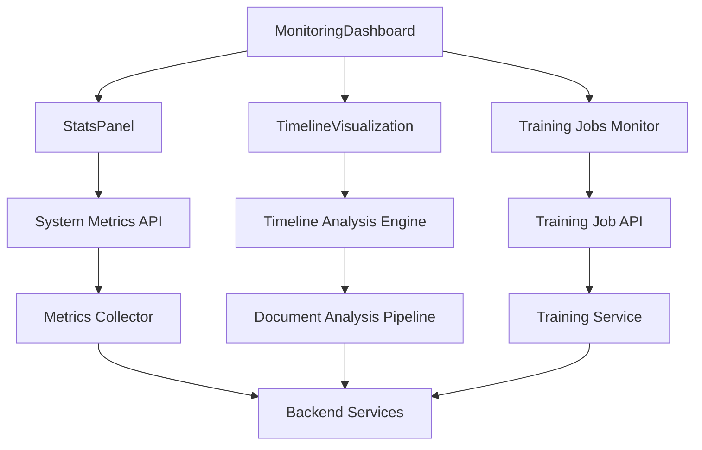
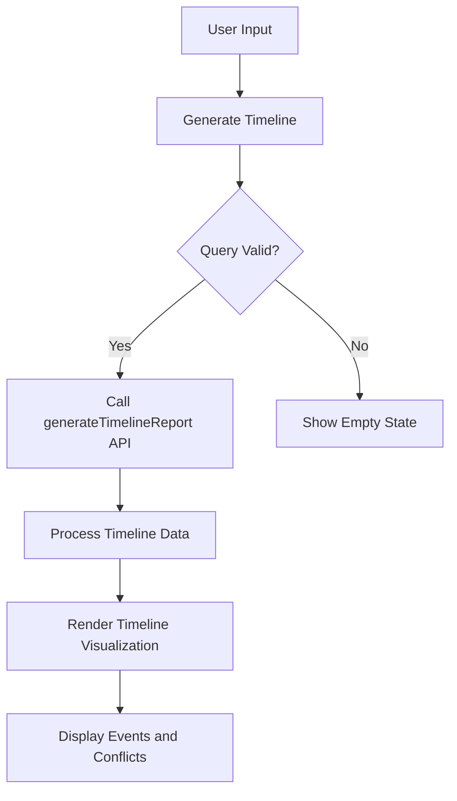
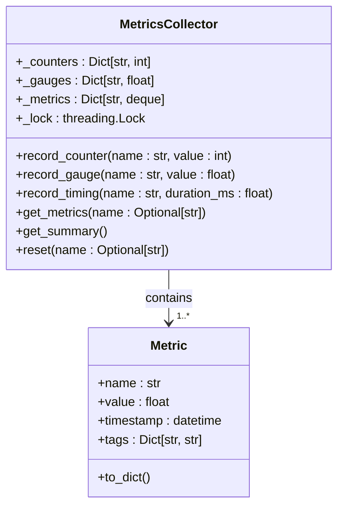
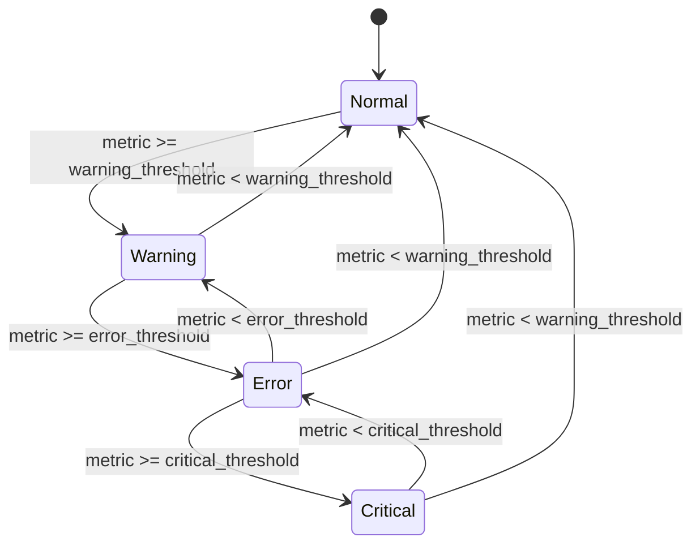

# Monitoring Dashboard Components

<cite>
**Referenced Files in This Document**   
- [MonitoringDashboard.tsx](file://frontend/src/components/MonitoringDashboard.tsx)
- [StatsPanel.tsx](file://frontend/src/components/StatsPanel.tsx)
- [TimelineVisualization.tsx](file://frontend/src/components/TimelineVisualization.tsx)
- [metrics.py](file://api/routers/metrics.py)
- [collector.py](file://mahoun/core/metrics/collector.py)
- [system.py](file://api/routers/system.py)
- [anomaly_detector.py](file://mahoun/core/monitoring/anomaly_detector.py)
- [dashboard.html](file://mahoun/dashboard/templates/dashboard.html)
- [router.py](file://mahoun/dashboard/router.py)
- [trainingClient.ts](file://frontend/src/api/trainingClient.ts)
</cite>

## Table of Contents
1. [Introduction](#introduction)
2. [Monitoring Dashboard Architecture](#monitoring-dashboard-architecture)
3. [StatsPanel Component](#statspanel-component)
4. [TimelineVisualization Component](#timelinevisualization-component)
5. [Metrics Collection System](#metrics-collection-system)
6. [WebSocket Integration and Real-time Updates](#websocket-integration-and-real-time-updates)
7. [Anomaly Detection and Alerting](#anomaly-detection-and-alerting)
8. [Data Aggregation and Performance Considerations](#data-aggregation-and-performance-considerations)
9. [Extension Points and Integration](#extension-points-and-integration)
10. [Conclusion](#conclusion)

## Introduction

The Monitoring Dashboard Components provide a comprehensive system for real-time monitoring of the MAHOUN platform, with the MonitoringDashboard serving as the central visualization hub. This documentation details the architecture, implementation, and functionality of the monitoring components that track system performance, model behavior, and operational metrics. The system enables stakeholders to monitor API latency, error rates, throughput, and other critical performance indicators through interactive visualizations and real-time updates. The dashboard components are designed to support both operational monitoring and analytical insights, with features for anomaly detection, drill-down capabilities, and temporal pattern analysis.

## Monitoring Dashboard Architecture

The monitoring dashboard architecture is built around a centralized metrics collection system that gathers data from various components across the platform. The MonitoringDashboard component serves as the primary interface, integrating multiple visualization components to provide a comprehensive view of system health and performance. The architecture follows a client-server model where the frontend components retrieve metrics data from backend endpoints and display them in real-time. The system is designed to be responsive across devices, with adaptive layouts that work on desktop and mobile interfaces. The dashboard supports drill-down capabilities, allowing users to examine specific metrics in greater detail. The architecture also includes mechanisms for alert threshold management and anomaly detection visualization, providing immediate feedback on system issues.

**Diagram sources**
- [MonitoringDashboard.tsx](file://frontend/src/components/MonitoringDashboard.tsx)
- [StatsPanel.tsx](file://frontend/src/components/StatsPanel.tsx)
- [TimelineVisualization.tsx](file://frontend/src/components/TimelineVisualization.tsx)

**Section sources**
- [MonitoringDashboard.tsx](file://frontend/src/components/MonitoringDashboard.tsx)

## StatsPanel Component

The StatsPanel component displays real-time metrics from the backend metrics endpoint, providing a compact visualization of system performance. It fetches system health data from the `/api/system/health` endpoint, which includes metrics such as total verdicts processed, search queries executed, average response time, and overall system health status. The component features a toggleable interface that reveals detailed statistics when activated. Metrics are displayed with appropriate visual indicators, such as color-coded system health status and formatted numerical values with locale-specific formatting. The StatsPanel implements on-demand data fetching, retrieving metrics only when the panel is expanded to optimize performance. The component also handles error states gracefully, displaying loading indicators during data retrieval and appropriate messages if the metrics endpoint is unreachable.

**Section sources**
- [StatsPanel.tsx](file://frontend/src/components/StatsPanel.tsx)

## TimelineVisualization Component

The TimelineVisualization component provides interactive visualization of temporal patterns in system behavior and model performance. It enables users to analyze chronological sequences of events, detect conflicts in timelines, and examine event details. The component features a user interface for inputting queries or topics to generate timeline reports, with a visualization that displays events along a vertical timeline with connecting lines. Each event is represented with its date, sequence number, description, and source information. The component includes conflict detection capabilities that highlight potential inconsistencies in the timeline data. Users can generate timeline reports based on specific queries, with the system processing the request and displaying the resulting timeline visualization. The component supports zoom and pan interactions, allowing users to explore different time periods and event densities.

**Diagram sources**
- [TimelineVisualization.tsx](file://frontend/src/components/TimelineVisualization.tsx)

**Section sources**
- [TimelineVisualization.tsx](file://frontend/src/components/TimelineVisualization.tsx)
- [mahounClient.ts](file://frontend/src/api/mahounClient.ts#L217-L237)

## Metrics Collection System

The metrics collection system is a centralized infrastructure for gathering and storing performance data across the platform. The system is built around the MetricsCollector class, which provides thread-safe methods for recording counters, gauges, and timing metrics. Counters track cumulative values such as request counts, while gauges represent current values like CPU usage. Timing metrics capture duration information for operations, enabling latency analysis. The collector stores metrics in memory with configurable history limits, allowing for time-series analysis. The system exposes metrics through API endpoints that return data in both JSON and Prometheus formats, facilitating integration with external monitoring tools. The metrics system is designed to be low-overhead, with efficient data structures and minimal impact on application performance. Metrics are organized hierarchically by component and function, enabling detailed analysis of specific subsystems.

**Diagram sources**
- [collector.py](file://mahoun/core/metrics/collector.py)
- [metrics.py](file://api/routers/metrics.py)

**Section sources**
- [collector.py](file://mahoun/core/metrics/collector.py)
- [metrics.py](file://api/routers/metrics.py)

## WebSocket Integration and Real-time Updates

The monitoring system implements real-time updates through periodic polling of backend endpoints, simulating the behavior of WebSocket integration for live data refresh. The MonitoringDashboard component uses React's useEffect hook to establish an interval that refreshes training job data every 5 seconds, providing near real-time updates without requiring a persistent WebSocket connection. This approach balances the need for current data with the simplicity of HTTP-based communication. The StatsPanel component implements on-demand loading, fetching metrics only when the user interacts with the panel, which reduces unnecessary network traffic. The system could be extended to use WebSockets for more efficient real-time updates by establishing a persistent connection to a WebSocket endpoint that pushes metric updates to connected clients. This would reduce latency and server load compared to polling, especially when monitoring high-frequency metrics.

**Section sources**
- [MonitoringDashboard.tsx](file://frontend/src/components/MonitoringDashboard.tsx#L50-L55)
- [StatsPanel.tsx](file://frontend/src/components/StatsPanel.tsx#L14-L18)

## Anomaly Detection and Alerting

The anomaly detection system provides proactive monitoring of system metrics with configurable alert thresholds and visualization of detected anomalies. The AnomalyDetectionSystem class implements threshold-based alerting for critical metrics such as latency, error rates, memory usage, and CPU utilization. The system supports multiple severity levels, including info, warning, error, and critical, allowing for graduated responses to different types of issues. When a metric exceeds its configured threshold, the system creates an Alert object with details about the condition and triggers appropriate notifications. The alert manager includes deduplication logic to prevent alert storms, ensuring that repeated alerts for the same condition are suppressed within a configurable time window. The system also supports SLA (Service Level Agreement) monitoring, checking compliance with performance targets and generating alerts for violations. Anomalies are visualized in the dashboard with appropriate color coding and severity indicators, making it easy for operators to identify and respond to issues.

**Diagram sources**
- [anomaly_detector.py](file://mahoun/core/monitoring/anomaly_detector.py)
- [ultra_performance_monitoring.py](file://mahoun/self_improve/ultra_performance_monitoring.py)

**Section sources**
- [anomaly_detector.py](file://mahoun/core/monitoring/anomaly_detector.py)
- [ultra_performance_monitoring.py](file://mahoun/self_improve/ultra_performance_monitoring.py)

## Data Aggregation and Performance Considerations

The monitoring system employs several data aggregation strategies to optimize performance and ensure responsive rendering of time-series data. The MetricsCollector uses efficient data structures such as deques with maximum lengths to limit memory usage while preserving historical data for analysis. For high-frequency metrics, the system implements sampling and aggregation at the collection level, reducing the volume of data that needs to be transmitted and rendered. The frontend components use virtualization techniques and selective rendering to handle large datasets without impacting user interface responsiveness. The StatsPanel implements lazy loading, fetching data only when needed, while the MonitoringDashboard uses periodic polling with configurable intervals to balance freshness and performance. For time-series visualization, the system could implement downsampling algorithms that reduce the number of data points based on the current zoom level, ensuring smooth rendering even with extensive historical data. The architecture also supports data retention policies that automatically expire old metrics data to prevent unbounded growth.

**Section sources**
- [collector.py](file://mahoun/core/metrics/collector.py)
- [MonitoringDashboard.tsx](file://frontend/src/components/MonitoringDashboard.tsx)
- [StatsPanel.tsx](file://frontend/src/components/StatsPanel.tsx)

## Extension Points and Integration

The monitoring system provides several extension points for adding custom metrics and integrating with external monitoring systems. The MetricsCollector exposes a public API for registering new metrics types and recording values, allowing components throughout the application to contribute telemetry data. Custom metrics can be added with specific names and tags, enabling dimensional analysis and filtering. The system supports multiple output formats, including JSON and Prometheus, facilitating integration with popular monitoring platforms like Grafana and Prometheus. The API endpoints for metrics data are designed to be extensible, allowing for the addition of new query parameters and filtering options. The dashboard components are implemented as reusable React components that can be embedded in other interfaces or extended with additional visualization types. The anomaly detection system supports custom threshold configurations and alert callbacks, enabling integration with external notification services. The architecture also supports pluggable storage backends for metrics data, allowing the system to be adapted to different deployment scenarios and scale requirements.

**Section sources**
- [collector.py](file://mahoun/core/metrics/collector.py)
- [metrics.py](file://api/routers/metrics.py)
- [router.py](file://mahoun/dashboard/router.py)

## Conclusion

The monitoring dashboard components provide a robust and extensible system for observing and analyzing the performance of the MAHOUN platform. By centralizing metrics collection and providing intuitive visualizations, the system enables both operational oversight and deep analytical insights. The architecture balances real-time responsiveness with performance efficiency, using strategic data aggregation and update mechanisms to deliver timely information without overwhelming system resources. The integration of anomaly detection and alerting capabilities enhances the system's value by proactively identifying potential issues before they impact users. With its modular design and extension points, the monitoring system can evolve to meet changing requirements and integrate with external tools, ensuring its continued relevance as the platform grows. The components demonstrate a thoughtful approach to user experience, providing actionable insights through clear visualizations and intuitive interactions.