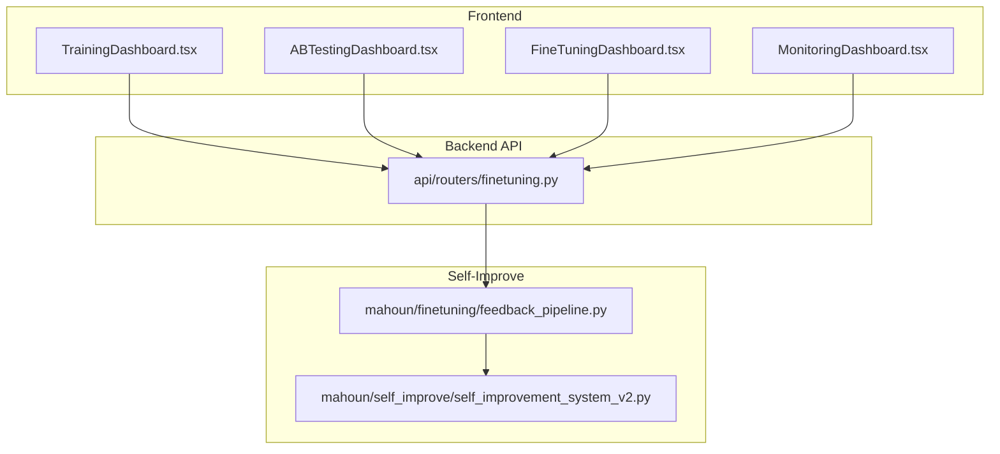
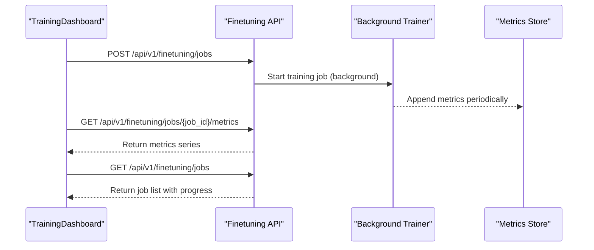
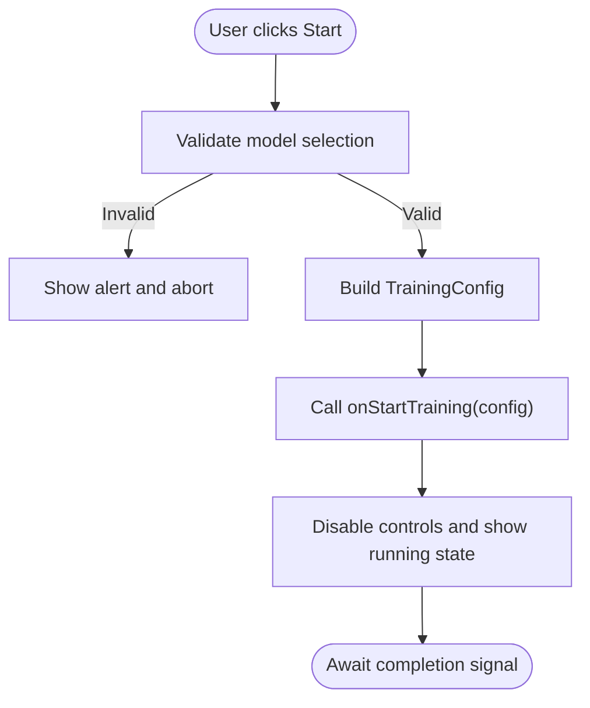
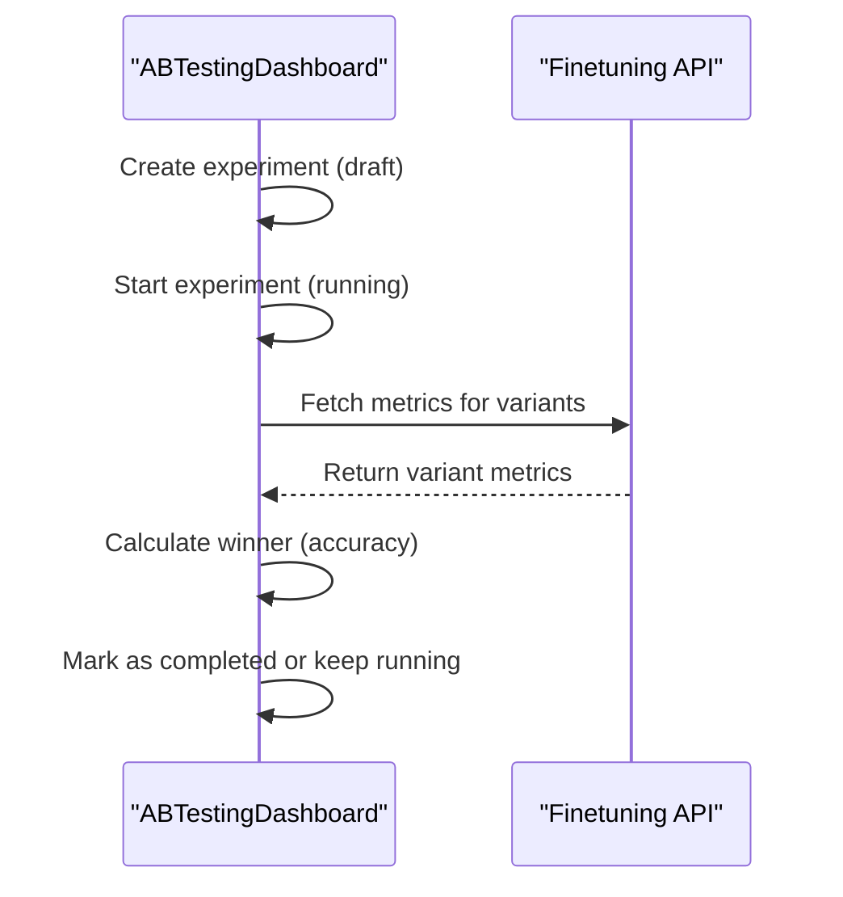
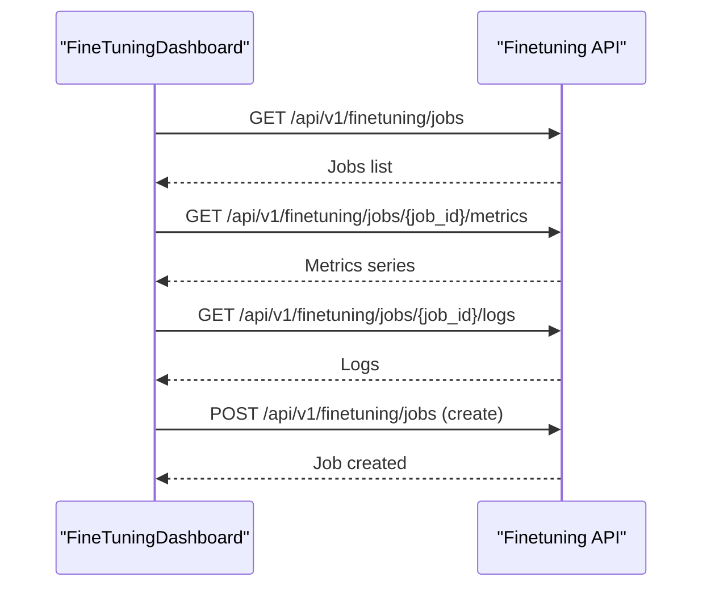
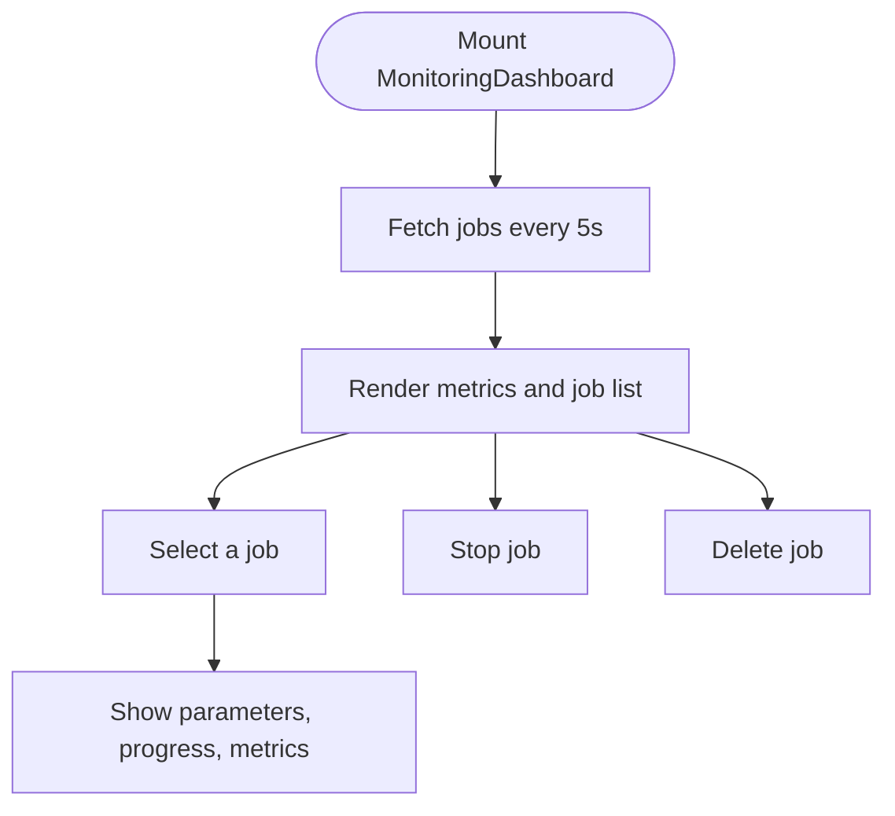
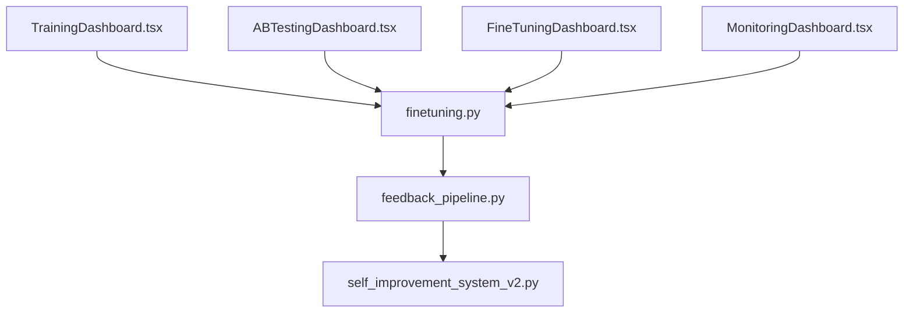

# Training Dashboard Components

<cite>
**Referenced Files in This Document**
- [TrainingDashboard.tsx](file://frontend/src/components/TrainingDashboard.tsx)
- [ABTestingDashboard.tsx](file://frontend/src/components/ABTestingDashboard.tsx)
- [FineTuningDashboard.tsx](file://frontend/src/pages/FineTuningDashboard.tsx)
- [MonitoringDashboard.tsx](file://frontend/src/components/MonitoringDashboard.tsx)
- [finetuning.py](file://api/routers/finetuning.py)
- [feedback_pipeline.py](file://mahoun/finetuning/feedback_pipeline.py)
- [self_improvement_system_v2.py](file://mahoun/self_improve/self_improvement_system_v2.py)
- [ultra_evaluation_system.py](file://mahoun/rag/ultra_evaluation_system.py)
</cite>

## Table of Contents
1. [Introduction](#introduction)
2. [Project Structure](#project-structure)
3. [Core Components](#core-components)
4. [Architecture Overview](#architecture-overview)
5. [Detailed Component Analysis](#detailed-component-analysis)
6. [Dependency Analysis](#dependency-analysis)
7. [Performance Considerations](#performance-considerations)
8. [Troubleshooting Guide](#troubleshooting-guide)
9. [Conclusion](#conclusion)
10. [Appendices](#appendices)

## Introduction
This document provides comprehensive guidance for two dashboard components:
- TrainingDashboard: a user-facing form to configure and start fine-tuning jobs, with real-time status updates and controls.
- ABTestingDashboard: a comparative analysis dashboard for A/B testing model variants, including statistical indicators and performance differentials.

It also explains how these dashboards integrate with the backend fine-tuning API, the self-improvement system, and the feedback pipeline. Privacy considerations for displaying training data samples are addressed, along with practical guidance for interpreting model performance metrics.

## Project Structure
The training and evaluation dashboards are implemented in the frontend under the React application, backed by a FastAPI backend. The self-improvement system and feedback pipeline reside in the backend Python modules.

**Diagram sources**
- [TrainingDashboard.tsx](file://frontend/src/components/TrainingDashboard.tsx#L1-L410)
- [ABTestingDashboard.tsx](file://frontend/src/components/ABTestingDashboard.tsx#L1-L531)
- [FineTuningDashboard.tsx](file://frontend/src/pages/FineTuningDashboard.tsx#L1-L519)
- [MonitoringDashboard.tsx](file://frontend/src/components/MonitoringDashboard.tsx#L1-L379)
- [finetuning.py](file://api/routers/finetuning.py#L1-L724)
- [feedback_pipeline.py](file://mahoun/finetuning/feedback_pipeline.py#L1-L598)
- [self_improvement_system_v2.py](file://mahoun/self_improve/self_improvement_system_v2.py#L1-L800)

**Section sources**
- [TrainingDashboard.tsx](file://frontend/src/components/TrainingDashboard.tsx#L1-L410)
- [ABTestingDashboard.tsx](file://frontend/src/components/ABTestingDashboard.tsx#L1-L531)
- [FineTuningDashboard.tsx](file://frontend/src/pages/FineTuningDashboard.tsx#L1-L519)
- [MonitoringDashboard.tsx](file://frontend/src/components/MonitoringDashboard.tsx#L1-L379)
- [finetuning.py](file://api/routers/finetuning.py#L1-L724)
- [feedback_pipeline.py](file://mahoun/finetuning/feedback_pipeline.py#L1-L598)
- [self_improvement_system_v2.py](file://mahoun/self_improve/self_improvement_system_v2.py#L1-L800)

## Core Components
- TrainingDashboard: Provides a form to select a model, choose training mode (LoRA, QLoRA, Full Fine-tune, DoRA, AdaLoRA), configure quantization, and set hyperparameters. It triggers training via a provided callback and disables actions when a model is not selected or training is ongoing.
- ABTestingDashboard: Manages A/B experiments between model variants, displays metrics (accuracy, latency, cost, sample size), and allows lifecycle actions (start, stop, complete). It includes a mock winner calculation based on accuracy and confidence level display.
- FineTuningDashboard: A page-level dashboard that lists jobs, shows progress and metrics, and displays logs. It periodically refreshes job status and metrics from the backend.
- MonitoringDashboard: A monitoring panel that lists training jobs, shows system metrics, and provides controls to stop/delete jobs. It simulates system metrics and updates job lists at intervals.

**Section sources**
- [TrainingDashboard.tsx](file://frontend/src/components/TrainingDashboard.tsx#L1-L410)
- [ABTestingDashboard.tsx](file://frontend/src/components/ABTestingDashboard.tsx#L1-L531)
- [FineTuningDashboard.tsx](file://frontend/src/pages/FineTuningDashboard.tsx#L1-L519)
- [MonitoringDashboard.tsx](file://frontend/src/components/MonitoringDashboard.tsx#L1-L379)

## Architecture Overview
The dashboards communicate with the backend via HTTP endpoints. The backend exposes fine-tuning job management, metrics retrieval, logs, and dataset creation from feedback. The feedback pipeline converts user feedback into training datasets, which can be used to start fine-tuning jobs. The self-improvement system can leverage evaluation results and metrics to drive adaptive improvements.

**Diagram sources**
- [TrainingDashboard.tsx](file://frontend/src/components/TrainingDashboard.tsx#L1-L410)
- [finetuning.py](file://api/routers/finetuning.py#L319-L724)

**Section sources**
- [finetuning.py](file://api/routers/finetuning.py#L319-L724)

## Detailed Component Analysis

### TrainingDashboard
- Purpose: Configure and start fine-tuning jobs with advanced options.
- Key features:
  - Model selection via a model selector component.
  - Training modes: LoRA, QLoRA, Full Fine-tune, DoRA, AdaLoRA.
  - Quantization options for LoRA/QLoRA modes.
  - Hyperparameters: epochs, batch sizes, learning rate, gradient accumulation, weight decay, seed.
  - Dataset and run naming fields.
  - Start button disabled until a model is selected and prevents double-clicking during training.
- Real-time updates: The component expects an external callback to trigger training and to reflect isTraining state externally.

**Diagram sources**
- [TrainingDashboard.tsx](file://frontend/src/components/TrainingDashboard.tsx#L78-L128)

**Section sources**
- [TrainingDashboard.tsx](file://frontend/src/components/TrainingDashboard.tsx#L1-L410)

### ABTestingDashboard
- Purpose: Compare model variants in A/B experiments with statistical indicators.
- Key features:
  - Create experiments with at least two variants.
  - Lifecycle: draft → running → completed or stopped.
  - Metrics per variant: accuracy, latency, cost, sample size.
  - Winner calculation based on accuracy; confidence level display.
  - Controls to start, stop, and complete experiments.
- Notes: The component currently uses a mock dataset and a simple winner selection. In production, integrate with a model comparison service and statistical significance tests.

**Diagram sources**
- [ABTestingDashboard.tsx](file://frontend/src/components/ABTestingDashboard.tsx#L1-L531)
- [finetuning.py](file://api/routers/finetuning.py#L525-L641)

**Section sources**
- [ABTestingDashboard.tsx](file://frontend/src/components/ABTestingDashboard.tsx#L1-L531)

### FineTuningDashboard
- Purpose: Complete UI for managing fine-tuning jobs, monitoring progress, and viewing metrics/logs.
- Key features:
  - Periodic polling of jobs every 5 seconds.
  - Metrics display for latest train/eval loss and accuracy.
  - Logs panel showing recent training logs.
  - Deploy action when job completes.
  - Create job dialog that posts to the backend to start a new job.
- Integration: Uses the backend endpoints for jobs, metrics, logs, and deployments.

**Diagram sources**
- [FineTuningDashboard.tsx](file://frontend/src/pages/FineTuningDashboard.tsx#L68-L118)
- [finetuning.py](file://api/routers/finetuning.py#L361-L523)

**Section sources**
- [FineTuningDashboard.tsx](file://frontend/src/pages/FineTuningDashboard.tsx#L1-L519)
- [finetuning.py](file://api/routers/finetuning.py#L361-L523)

### MonitoringDashboard
- Purpose: System-level monitoring of training jobs and resource usage.
- Key features:
  - System metrics cards (CPU, Memory, GPU, Active/Total Jobs, Uptime).
  - Jobs list with status badges and progress bars.
  - Actions to stop or delete jobs.
  - Job details panel showing parameters, progress, metrics, and timing.
- Integration: Polls training jobs and displays real-time updates.

**Diagram sources**
- [MonitoringDashboard.tsx](file://frontend/src/components/MonitoringDashboard.tsx#L43-L92)

**Section sources**
- [MonitoringDashboard.tsx](file://frontend/src/components/MonitoringDashboard.tsx#L1-L379)

## Dependency Analysis
- Frontend dashboards depend on the backend API for job lifecycle, metrics, and logs.
- The feedback pipeline transforms user feedback into training datasets and can be triggered via the API to create datasets from feedback.
- The self-improvement system can consume evaluation metrics and adapt strategies based on performance.

**Diagram sources**
- [TrainingDashboard.tsx](file://frontend/src/components/TrainingDashboard.tsx#L1-L410)
- [ABTestingDashboard.tsx](file://frontend/src/components/ABTestingDashboard.tsx#L1-L531)
- [FineTuningDashboard.tsx](file://frontend/src/pages/FineTuningDashboard.tsx#L1-L519)
- [MonitoringDashboard.tsx](file://frontend/src/components/MonitoringDashboard.tsx#L1-L379)
- [finetuning.py](file://api/routers/finetuning.py#L525-L641)
- [feedback_pipeline.py](file://mahoun/finetuning/feedback_pipeline.py#L1-L598)
- [self_improvement_system_v2.py](file://mahoun/self_improve/self_improvement_system_v2.py#L1-L800)

**Section sources**
- [finetuning.py](file://api/routers/finetuning.py#L525-L641)
- [feedback_pipeline.py](file://mahoun/finetuning/feedback_pipeline.py#L1-L598)
- [self_improvement_system_v2.py](file://mahoun/self_improve/self_improvement_system_v2.py#L1-L800)

## Performance Considerations
- Real-time updates: Frequent polling (every few seconds) is lightweight for small job counts but can increase load as the number of jobs grows. Consider server-sent events or WebSockets for scalable real-time updates.
- Metrics rendering: Rendering large time-series charts can be expensive. Use chart libraries with virtualization or downsampling for long histories.
- Background training: Ensure the backend trainer streams metrics and checkpoints efficiently to avoid large memory spikes.
- GPU utilization: Monitor GPU memory and throughput to prevent out-of-memory errors and to optimize batch sizes and gradient accumulation.

[No sources needed since this section provides general guidance]

## Troubleshooting Guide
- Training fails to start:
  - Verify model selection and required fields.
  - Check backend logs for validation errors or missing resources.
- Metrics not updating:
  - Confirm periodic polling is active and network connectivity is stable.
  - Ensure the backend is appending metrics to the in-memory store and that the job is in a training state.
- A/B experiment not progressing:
  - Ensure the experiment transitions from draft to running and that metrics are fetched for each variant.
  - Validate that the winner calculation aligns with intended KPIs (accuracy, latency, cost).
- Privacy concerns with training data samples:
  - Do not display raw user data. Use aggregated metrics and anonymized summaries.
  - Implement access controls and audit logs for any data access.
  - Comply with applicable data protection regulations (e.g., GDPR) when handling personal data.

**Section sources**
- [TrainingDashboard.tsx](file://frontend/src/components/TrainingDashboard.tsx#L122-L128)
- [FineTuningDashboard.tsx](file://frontend/src/pages/FineTuningDashboard.tsx#L90-L118)
- [ABTestingDashboard.tsx](file://frontend/src/components/ABTestingDashboard.tsx#L180-L239)

## Conclusion
The training and A/B testing dashboards provide a cohesive interface for managing fine-tuning jobs, monitoring progress, and comparing model variants. They integrate tightly with the backend API and can be extended to incorporate real-time metrics streaming, statistical significance testing, and privacy-compliant data handling. The self-improvement system and feedback pipeline enable continuous learning loops that can inform future training configurations and model selection.

[No sources needed since this section summarizes without analyzing specific files]

## Appendices

### Backend API Endpoints Used by Dashboards
- POST /api/v1/finetuning/jobs: Create and start a fine-tuning job.
- GET /api/v1/finetuning/jobs: List jobs with optional filtering and limits.
- GET /api/v1/finetuning/jobs/{job_id}: Retrieve a specific job.
- DELETE /api/v1/finetuning/jobs/{job_id}: Cancel a running job.
- GET /api/v1/finetuning/jobs/{job_id}/metrics: Retrieve training metrics time series.
- GET /api/v1/finetuning/jobs/{job_id}/logs: Retrieve recent training logs.
- POST /api/v1/finetuning/jobs/{job_id}/deploy: Deploy a completed model.
- GET /api/v1/finetuning/models: List available models (including local GGUF).
- GET /api/v1/finetuning/datasets: List available datasets.
- POST /api/v1/finetuning/datasets/from-feedback: Create dataset from feedback.

**Section sources**
- [finetuning.py](file://api/routers/finetuning.py#L319-L724)

### Feedback Pipeline Integration
- Collects user feedback, filters by quality, converts to training examples, creates dataset splits, and persists datasets.
- Can be invoked via API to generate datasets from feedback for training.

**Section sources**
- [feedback_pipeline.py](file://mahoun/finetuning/feedback_pipeline.py#L1-L598)

### Self-Improvement System Integration
- The self-improvement system maintains adaptation events, evolutionary optimization, causal discovery, anomaly detection, and checkpointing.
- Evaluation systems compute confidence intervals and recommendations, which can guide model selection and hyperparameter tuning.

**Section sources**
- [self_improvement_system_v2.py](file://mahoun/self_improve/self_improvement_system_v2.py#L1-L800)
- [ultra_evaluation_system.py](file://mahoun/rag/ultra_evaluation_system.py#L469-L505)

### Metric Interpretation Guidelines
- Train Loss: Lower is generally better; monitor for convergence and overfitting.
- Eval Loss: Indicates generalization; should track train loss trends.
- Eval Accuracy: Proportion of correct predictions; compare across variants.
- Perplexity: Lower is better for language modeling tasks.
- Latency: Lower is better; consider percentile latencies for SLA adherence.
- Cost: Track per request or per batch; optimize throughput and resource allocation.
- Confidence Level: For A/B tests, higher levels indicate stronger statistical significance.

**Section sources**
- [FineTuningDashboard.tsx](file://frontend/src/pages/FineTuningDashboard.tsx#L277-L306)
- [ultra_evaluation_system.py](file://mahoun/rag/ultra_evaluation_system.py#L469-L505)