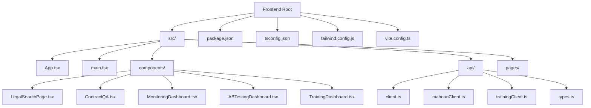
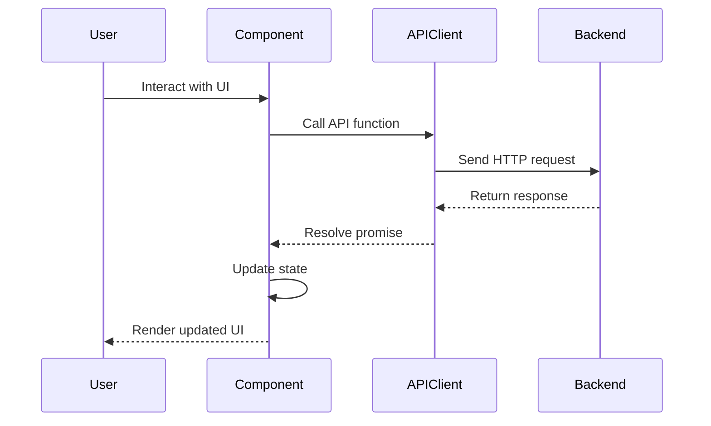
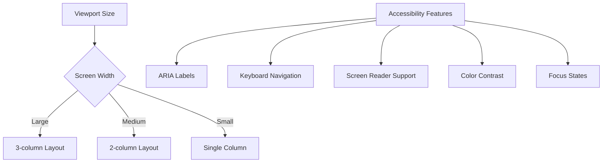

# Frontend Implementation

<cite>
**Referenced Files in This Document**   
- [App.tsx](file://frontend/src/App.tsx)
- [main.tsx](file://frontend/src/main.tsx)
- [index.css](file://frontend/src/index.css)
- [tailwind.config.js](file://frontend/tailwind.config.js)
- [package.json](file://frontend/package.json)
- [tsconfig.json](file://frontend/tsconfig.json)
- [LegalSearchPage.tsx](file://frontend/src/components/LegalSearchPage.tsx)
- [ContractQA.tsx](file://frontend/src/components/ContractQA.tsx)
- [MonitoringDashboard.tsx](file://frontend/src/components/MonitoringDashboard.tsx)
- [ABTestingDashboard.tsx](file://frontend/src/components/ABTestingDashboard.tsx)
- [TrainingDashboard.tsx](file://frontend/src/components/TrainingDashboard.tsx)
- [client.ts](file://frontend/src/api/client.ts)
- [mahounClient.ts](file://frontend/src/api/mahounClient.ts)
- [trainingClient.ts](file://frontend/src/api/trainingClient.ts)
- [types.ts](file://frontend/src/api/types.ts)
- [dark-theme-replacements.sh](file://frontend/src/components/dark-theme-replacements.sh)
</cite>

## Table of Contents
1. [Introduction](#introduction)
2. [Project Structure](#project-structure)
3. [Core Components](#core-components)
4. [API Client Implementations](#api-client-implementations)
5. [State Management and Data Flow](#state-management-and-data-flow)
6. [Usage Examples](#usage-examples)
7. [Responsive Design and Accessibility](#responsive-design-and-accessibility)
8. [Component Customization and Theming](#component-customization-and-theming)
9. [Cross-Browser Compatibility and Performance](#cross-browser-compatibility-and-performance)
10. [Integration Patterns](#integration-patterns)
11. [Conclusion](#conclusion)

## Introduction
The frontend implementation is a React/TypeScript application designed for a legal search and AI model training platform. The application provides a comprehensive interface for legal verdict search, contract Q&A, monitoring of training jobs, and A/B testing of AI models. Built with modern web technologies including React, TypeScript, Tailwind CSS, and Vite, the frontend offers a responsive and accessible user experience with support for dark theme and RTL Persian text. The architecture follows component-based design principles with clear separation of concerns between UI components, API clients, and state management.

**Section sources**
- [App.tsx](file://frontend/src/App.tsx#L1-L145)
- [main.tsx](file://frontend/src/main.tsx#L1-L12)

## Project Structure
The frontend application follows a standard React/TypeScript project structure with components organized by feature. The main entry point is `main.tsx` which renders the `App` component. The `App.tsx` file contains the main application layout with navigation sidebar and page routing. Components are organized in the `src/components` directory, with API clients in `src/api`, and types in `src/api/types.ts`. The application uses Vite as the build tool with TypeScript configuration in `tsconfig.json` and styling with Tailwind CSS configured in `tailwind.config.js`. The `package.json` file defines the project dependencies and scripts for development, building, and testing.



**Diagram sources **
- [App.tsx](file://frontend/src/App.tsx#L1-L145)
- [main.tsx](file://frontend/src/main.tsx#L1-L12)
- [package.json](file://frontend/package.json#L1-L39)
- [tsconfig.json](file://frontend/tsconfig.json#L1-L27)
- [tailwind.config.js](file://frontend/tailwind.config.js#L1-L44)

**Section sources**
- [App.tsx](file://frontend/src/App.tsx#L1-L145)
- [main.tsx](file://frontend/src/main.tsx#L1-L12)
- [package.json](file://frontend/package.json#L1-L39)
- [tsconfig.json](file://frontend/tsconfig.json#L1-L27)
- [tailwind.config.js](file://frontend/tailwind.config.js#L1-L44)

## Core Components

### LegalSearchPage Component
The `LegalSearchPage` component provides a comprehensive interface for searching legal verdicts. It includes a search form with query input, filters, and search button, followed by results display with export functionality. The component manages search state including query, filters, and loading status, and handles search submission with validation and error handling. Results are displayed in a list format with statistics and export options. The component uses the `searchVerdicts` API client function to communicate with the backend search service.

**Section sources**
- [LegalSearchPage.tsx](file://frontend/src/components/LegalSearchPage.tsx#L1-L258)
- [client.ts](file://frontend/src/api/client.ts#L71-L132)

### ContractQA Component
The `ContractQA` component implements a chat-style interface for asking questions about contracts. It maintains a message history with user and assistant messages, and provides a form for submitting new questions. The component uses the `askContract` API client function to send queries to the backend and receive answers with citations, confidence scores, and verification status. Messages are displayed with appropriate styling based on type, and assistant responses include citation references and confidence indicators. The component handles loading states and error conditions during API requests.

**Section sources**
- [ContractQA.tsx](file://frontend/src/components/ContractQA.tsx#L1-L192)
- [mahounClient.ts](file://frontend/src/api/mahounClient.ts#L180-L195)

### MonitoringDashboard Component
The `MonitoringDashboard` component provides real-time monitoring of training jobs and system metrics. It displays a list of training jobs with status indicators, progress bars for running jobs, and detailed information about selected jobs. The component fetches job data from the backend using the `listTrainingJobs` API client function and updates the list periodically. System metrics such as CPU usage, memory usage, and active jobs are displayed in a dashboard format. The component allows users to stop or delete training jobs through interactive controls.

**Section sources**
- [MonitoringDashboard.tsx](file://frontend/src/components/MonitoringDashboard.tsx#L1-L379)
- [trainingClient.ts](file://frontend/src/api/trainingClient.ts#L100-L128)

## API Client Implementations
The frontend application implements several API client modules to communicate with different backend services. These clients abstract the HTTP communication details and provide type-safe interfaces for interacting with the backend APIs.

### Search API Client
The `client.ts` module provides functions for searching legal verdicts and checking search service health. The `searchVerdicts` function sends a POST request to the `/v1/search/verdicts` endpoint with a search query, optional filters, and result limit. It handles request validation, error parsing, and network errors, throwing a `SearchAPIError` for API-level errors. The client uses environment variables to determine the API base URL, supporting both development proxy and direct connection configurations.

**Section sources**
- [client.ts](file://frontend/src/api/client.ts#L1-L153)

### MAHOUN API Client
The `mahounClient.ts` module provides functions for MAHOUN-specific endpoints including document upload, delay analysis, claim generation, contract Q&A, and report generation. Each function corresponds to a specific backend endpoint and handles the appropriate request and response types. The client uses a base URL constructed from the environment variable and provides type definitions for all request and response payloads. Error handling is implemented consistently across all functions, parsing error details from the response when available.

**Section sources**
- [mahounClient.ts](file://frontend/src/api/mahounClient.ts#L1-L276)

### Training API Client
The `trainingClient.ts` module provides functions for managing model training jobs, including starting, stopping, deleting, and monitoring jobs. It also provides functions for retrieving available models and training presets. The client uses the same error handling pattern as other API clients, with specific types for training configurations, job status, and response payloads. The `listTrainingJobs` function supports pagination and filtering by status, while the `getAvailableModels` function includes fallback mock data if the endpoint is not available.

**Section sources**
- [trainingClient.ts](file://frontend/src/api/trainingClient.ts#L1-L269)

## State Management and Data Flow
The application uses React's built-in state management with the `useState` and `useEffect` hooks for component-level state. The `App` component manages the current page state and provides navigation between different views. Each major component manages its own state related to its functionality, such as search parameters in `LegalSearchPage`, message history in `ContractQA`, and job list in `MonitoringDashboard`.

Data flows from parent to child components through props, with callback functions passed down to handle user interactions and state updates. For example, the `TrainingDashboard` component receives an `onStartTraining` callback prop from the `App` component, which it calls when the user initiates a training job. This callback is defined in `App.tsx` and handles the API call to start the training job.

The API client modules encapsulate the data fetching logic and return promises that components can await. Error boundaries are implemented to catch and handle errors in the component tree, providing a fallback UI when errors occur. The `ErrorBoundary` component wraps the entire application to ensure graceful error handling.



**Diagram sources **
- [App.tsx](file://frontend/src/App.tsx#L1-L145)
- [LegalSearchPage.tsx](file://frontend/src/components/LegalSearchPage.tsx#L1-L258)
- [client.ts](file://frontend/src/api/client.ts#L71-L132)

**Section sources**
- [App.tsx](file://frontend/src/App.tsx#L1-L145)
- [LegalSearchPage.tsx](file://frontend/src/components/LegalSearchPage.tsx#L1-L258)
- [ContractQA.tsx](file://frontend/src/components/ContractQA.tsx#L1-L192)
- [MonitoringDashboard.tsx](file://frontend/src/components/MonitoringDashboard.tsx#L1-L379)

## Usage Examples

### ABTestingDashboard Usage
The `ABTestingDashboard` component demonstrates how to create and manage A/B experiments between different AI models. Users can create new experiments by specifying a name, description, and selecting models to compare. The component displays a list of experiments with status indicators and performance metrics for each variant. When an experiment is selected, detailed information is shown including statistical comparison of accuracy, latency, and cost metrics. The component supports starting, stopping, and completing experiments, with automatic winner calculation based on accuracy.

**Section sources**
- [ABTestingDashboard.tsx](file://frontend/src/components/ABTestingDashboard.tsx#L1-L531)

### TrainingDashboard Usage
The `TrainingDashboard` component provides a comprehensive interface for configuring and starting model fine-tuning jobs. Users select a model using the `ModelSelector` component and configure training parameters including mode (LoRA, QLoRA, full fine-tune), quantization, epochs, batch size, and learning rate. The component validates the configuration and provides a preview of the settings before starting the training job. When the user clicks "Start Training", the `onStartTraining` callback is called with the complete configuration, which initiates the API call to start the job.

**Section sources**
- [TrainingDashboard.tsx](file://frontend/src/components/TrainingDashboard.tsx#L1-L410)

## Responsive Design and Accessibility
The application implements responsive design principles using Tailwind CSS utility classes. The layout adapts to different screen sizes, with the navigation sidebar collapsing on smaller screens. Components use responsive grid layouts that adjust column counts based on viewport width. Typography scales appropriately for different screen sizes, and interactive elements have sufficient touch targets for mobile devices.

Accessibility is prioritized throughout the application. All interactive elements have appropriate ARIA labels and roles, and keyboard navigation is supported. Form controls have associated labels, and error messages are announced to screen readers. The application supports RTL (right-to-left) layout for Persian text, with appropriate text alignment and component positioning. Focus states are clearly visible, and color contrast meets WCAG guidelines for readability.



**Diagram sources **
- [index.css](file://frontend/src/index.css#L1-L151)
- [tailwind.config.js](file://frontend/tailwind.config.js#L1-L44)
- [App.tsx](file://frontend/src/App.tsx#L1-L145)

**Section sources**
- [index.css](file://frontend/src/index.css#L1-L151)
- [tailwind.config.js](file://frontend/tailwind.config.js#L1-L44)
- [App.tsx](file://frontend/src/App.tsx#L1-L145)

## Component Customization and Theming
The application supports theming through CSS variables defined in `index.css` and Tailwind CSS configuration. The dark theme is implemented with a professional black/slate color scheme, with accent colors for interactive elements. The `dark-theme-replacements.sh` script provides a mechanism for theme customization, allowing replacement of theme variables in the CSS files.

The Tailwind configuration in `tailwind.config.js` extends the default theme with custom colors for primary and accent palettes, and defines a Persian-friendly font stack with Vazirmatn as the primary font. CSS variables are used for theme colors, allowing dynamic theme switching if implemented. Components use these theme colors through Tailwind classes or direct CSS variable references.

**Section sources**
- [index.css](file://frontend/src/index.css#L1-L151)
- [tailwind.config.js](file://frontend/tailwind.config.js#L1-L44)
- [dark-theme-replacements.sh](file://frontend/src/components/dark-theme-replacements.sh)

## Cross-Browser Compatibility and Performance
The application is designed for cross-browser compatibility, supporting modern browsers including Chrome, Firefox, Safari, and Edge. The TypeScript configuration targets ES2020 to ensure compatibility with current browser versions, and the build process generates code that works across different environments. Polyfills are not required as the target browsers support the used JavaScript features.

Performance optimization is implemented for handling large result sets, particularly in the search functionality. The application uses virtualization principles where appropriate, though not explicitly implemented with a virtual scrolling library. Loading states are shown during API requests, and error boundaries prevent crashes from unhandled exceptions. The use of React's `useCallback` hook in components like `LegalSearchPage` helps prevent unnecessary re-renders by memoizing callback functions.

For large result sets, the application could be enhanced with pagination, infinite scrolling, or virtualized lists to improve performance. Currently, results are rendered in a simple list, which may impact performance with very large result sets. The API client handles large responses efficiently by streaming data when possible, though this depends on the backend implementation.

**Section sources**
- [tsconfig.json](file://frontend/tsconfig.json#L1-L27)
- [vite.config.ts](file://frontend/vite.config.ts)
- [LegalSearchPage.tsx](file://frontend/src/components/LegalSearchPage.tsx#L1-L258)

## Integration Patterns
The frontend integrates with the backend API through RESTful endpoints with JSON payloads. Real-time updates are implemented using polling in components like `MonitoringDashboard`, which refreshes the job list every 5 seconds. This could be enhanced with WebSockets or Server-Sent Events for more efficient real-time updates.

The integration pattern follows a clean separation between UI components and API clients, with the clients providing a type-safe interface to the backend services. Error handling is consistent across all API calls, with network errors and API errors handled appropriately. The application uses environment variables to configure the API base URL, allowing different configurations for development, staging, and production environments.

Authentication and authorization are not explicitly implemented in the provided code, suggesting they may be handled at the network level or in a separate authentication service. The API clients include appropriate headers for content type and accept headers, ensuring proper content negotiation with the backend.

```mermaid
sequenceDiagram
participant Frontend
participant API
participant Backend
Frontend->>API : POST /v1/search/verdicts
API->>Backend : Forward request
Backend-->>API : Return search results
API-->>Frontend : JSON response
Frontend->>API : GET /api/v1/training/jobs
API->>Backend : Forward request
Backend-->>API : Return job list
API-->>Frontend : JSON response
loop Polling
Frontend->>API : GET /api/v1/training/jobs
API-->>Frontend : Updated job list
wait 5s
end
```

**Diagram sources **
- [client.ts](file://frontend/src/api/client.ts#L71-L132)
- [trainingClient.ts](file://frontend/src/api/trainingClient.ts#L100-L128)
- [MonitoringDashboard.tsx](file://frontend/src/components/MonitoringDashboard.tsx#L1-L379)

**Section sources**
- [client.ts](file://frontend/src/api/client.ts#L1-L153)
- [trainingClient.ts](file://frontend/src/api/trainingClient.ts#L1-L269)
- [MonitoringDashboard.tsx](file://frontend/src/components/MonitoringDashboard.tsx#L1-L379)

## Conclusion
The frontend implementation provides a comprehensive and user-friendly interface for a legal search and AI model training platform. The React/TypeScript application follows modern web development practices with a component-based architecture, type safety, and responsive design. The API client modules provide a clean abstraction for backend communication, and the state management pattern ensures predictable data flow throughout the application. The implementation supports accessibility and internationalization, with a focus on Persian language users. Future enhancements could include WebSocket-based real-time updates, virtualized lists for large result sets, and expanded theming options.

**Section sources**
- [App.tsx](file://frontend/src/App.tsx#L1-L145)
- [main.tsx](file://frontend/src/main.tsx#L1-L12)
- [package.json](file://frontend/package.json#L1-L39)