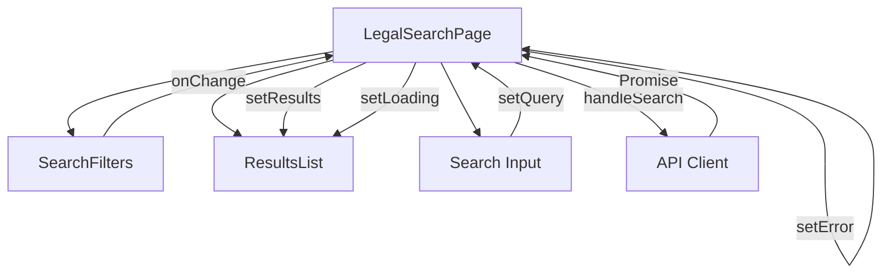
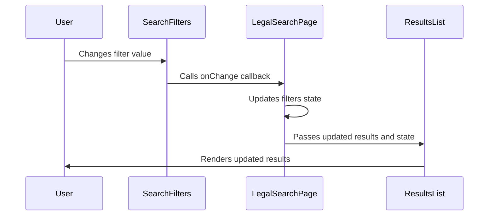
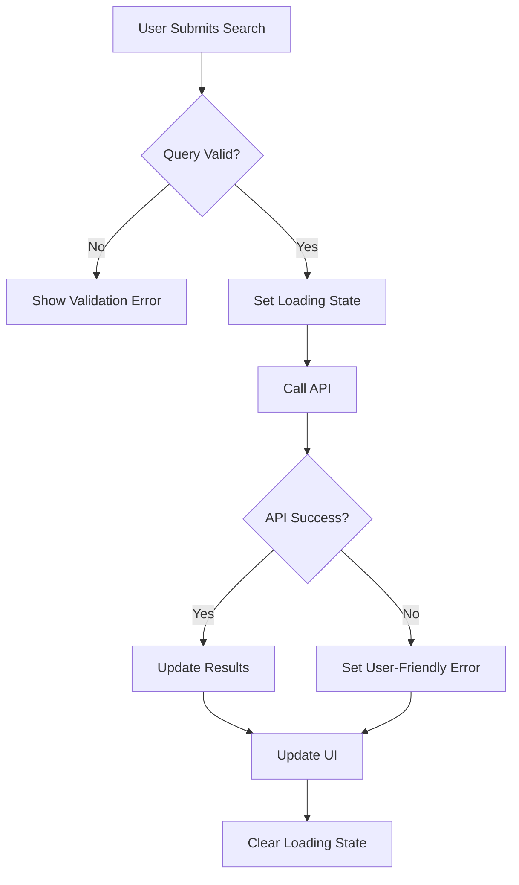
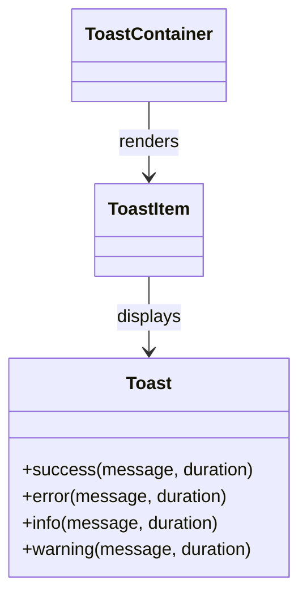
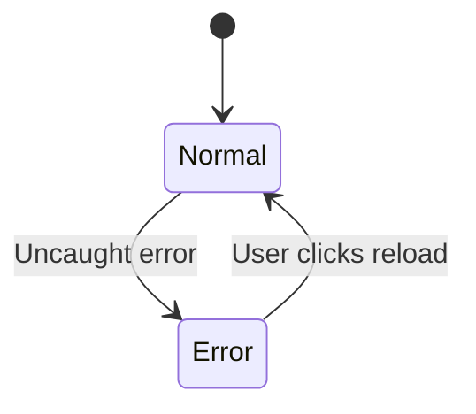
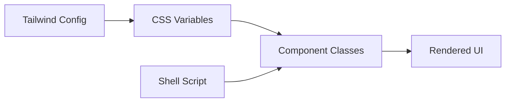

# State Management and UX Patterns

<cite>
**Referenced Files in This Document**   
- [SearchFilters.tsx](file://frontend/src/components/SearchFilters.tsx)
- [ResultsList.tsx](file://frontend/src/components/ResultsList.tsx)
- [Toast.tsx](file://frontend/src/components/Toast.tsx)
- [ErrorBoundary.tsx](file://frontend/src/components/ErrorBoundary.tsx)
- [dark-theme-replacements.sh](file://frontend/src/components/dark-theme-replacements.sh)
- [LegalSearchPage.tsx](file://frontend/src/components/LegalSearchPage.tsx)
- [App.tsx](file://frontend/src/App.tsx)
- [types.ts](file://frontend/src/api/types.ts)
- [client.ts](file://frontend/src/api/client.ts)
- [tailwind.config.js](file://frontend/tailwind.config.js)
- [index.css](file://frontend/src/index.css)
</cite>

## Table of Contents
1. [Introduction](#introduction)
2. [State Management in Document Search Workflow](#state-management-in-document-search-workflow)
3. [Data Flow Patterns](#data-flow-patterns)
4. [Asynchronous Operations and UI Responsiveness](#asynchronous-operations-and-ui-responsiveness)
5. [Reusable UX Components](#reusable-ux-components)
6. [Theming System](#theming-system)
7. [Conclusion](#conclusion)

## Introduction
This document details the state management and user experience patterns implemented in the frontend application of the MAHOUN legal search platform. The application follows React best practices for state management, with a focus on complex workflows like document search and filtering. The documentation covers component state management, data flow between parent and child components, error resilience through ErrorBoundary, notification patterns using Toast, and the theming system that supports visual customization. The implementation emphasizes maintainability, responsiveness, and accessibility, particularly for Persian-speaking users.

## State Management in Document Search Workflow

The document search workflow demonstrates sophisticated state management patterns using React's useState and useCallback hooks to manage complex interactions between SearchFilters and ResultsList components. The LegalSearchPage component serves as the container that orchestrates the search functionality, maintaining state for the search query, filters, results, loading status, and UI controls.

The state management follows the principle of state colocation, where state is kept as close as possible to where it's needed. The LegalSearchPage maintains the primary state for the search workflow, including:
- `query`: The search query string
- `filters`: LegalSearchFilters object containing various filter criteria
- `limit`: Number of results to display
- `results`: Array of LegalSearchHit objects from the API
- `hasSearched`: Boolean flag indicating if a search has been performed
- `isLoading`: Boolean flag for loading state during API calls
- `error`: Error message state for search failures

**Diagram sources**
- [LegalSearchPage.tsx](file://frontend/src/components/LegalSearchPage.tsx#L16-L27)
- [SearchFilters.tsx](file://frontend/src/components/SearchFilters.tsx#L3-L10)
- [ResultsList.tsx](file://frontend/src/components/ResultsList.tsx#L5-L9)

**Section sources**
- [LegalSearchPage.tsx](file://frontend/src/components/LegalSearchPage.tsx#L16-L27)
- [types.ts](file://frontend/src/api/types.ts#L12-L30)

## Data Flow Patterns

The application implements a unidirectional data flow pattern with callback propagation and state lifting to manage interactions between parent and child components. The parent component (LegalSearchPage) holds the state and passes down both the state values and callback functions to child components, enabling controlled updates while maintaining a single source of truth.

In the search workflow, the SearchFilters component receives the current filters state and an onChange callback from its parent. When a filter value changes, the child component calls the callback with the updated filter, which triggers a state update in the parent component. This pattern is implemented through the updateFilter utility function that uses the spread operator to create a new filters object with the updated value:

**Diagram sources**
- [SearchFilters.tsx](file://frontend/src/components/SearchFilters.tsx#L111-L116)
- [LegalSearchPage.tsx](file://frontend/src/components/LegalSearchPage.tsx#L17-L18)
- [ResultsList.tsx](file://frontend/src/components/ResultsList.tsx#L5-L9)

The SearchFilters component implements several specialized input components (FilterInput, FilterSelect, FilterCheckbox) that abstract the common patterns of handling different input types while maintaining consistent styling and behavior. These components follow the controlled component pattern, where the parent component controls their value through props and receives updates through callback functions.

**Section sources**
- [SearchFilters.tsx](file://frontend/src/components/SearchFilters.tsx#L15-L97)
- [LegalSearchPage.tsx](file://frontend/src/components/LegalSearchPage.tsx#L141-L148)

## Asynchronous Operations and UI Responsiveness

The application handles asynchronous operations through async/await syntax with proper error handling and loading state management to maintain UI responsiveness during API calls. The searchVerdicts function in the API client implements a robust pattern for handling network requests with error transformation and user-friendly error messages.

When a search is initiated, the LegalSearchPage component follows a specific sequence:
1. Prevents default form submission
2. Validates the search query
3. Sets isLoading to true and clears any previous error
4. Sets hasSearched to true to indicate a search has been performed
5. Calls the searchVerdicts API function with the search parameters
6. Handles the response by updating the results state
7. Handles errors by setting the error state with user-friendly messages
8. Finally sets isLoading to false regardless of success or failure

**Diagram sources**
- [LegalSearchPage.tsx](file://frontend/src/components/LegalSearchPage.tsx#L33-L71)
- [client.ts](file://frontend/src/api/client.ts#L71-L132)

The API client implements several best practices for handling asynchronous operations:
- Input validation and cleaning through the cleanFilters function
- Proper HTTP method and headers configuration
- Error handling with custom SearchAPIError class
- Network error detection and user-friendly messaging
- JSON response parsing with proper typing

**Section sources**
- [LegalSearchPage.tsx](file://frontend/src/components/LegalSearchPage.tsx#L33-L71)
- [client.ts](file://frontend/src/api/client.ts#L71-L132)

## Reusable UX Components

### Toast Notifications
The Toast component implements a global notification system that can be used throughout the application to provide feedback on user actions. The implementation uses a singleton pattern with global state management through module-level variables (currentToasts, toastListeners) rather than React context, providing a simple API for showing notifications without requiring prop drilling.

The Toast system exposes a simple API with four methods:
- `toast.success(message, duration)`: Shows a success notification
- `toast.error(message, duration)`: Shows an error notification
- `toast.info(message, duration)`: Shows an informational notification
- `toast.warning(message, duration)`: Shows a warning notification

**Diagram sources**
- [Toast.tsx](file://frontend/src/components/Toast.tsx#L73-L86)
- [Toast.tsx](file://frontend/src/components/Toast.tsx#L29-L67)

The ToastContainer component uses React's useState and useEffect hooks to subscribe to global toast events and re-render when new toasts are added. Each toast automatically dismisses after a configurable duration (default 5 seconds) and can be manually dismissed by clicking the close button.

**Section sources**
- [Toast.tsx](file://frontend/src/components/Toast.tsx#L6-L123)

### Error Boundary
The ErrorBoundary component implements React's error boundary pattern to catch JavaScript errors anywhere in the component tree and display a fallback UI instead of crashing the entire application. This component uses the class component pattern with the getDerivedStateFromError and componentDidCatch lifecycle methods to handle errors gracefully.

When an error occurs, the ErrorBoundary displays a user-friendly error screen with:
- An error icon and title
- A descriptive error message
- Expandable details showing the actual error
- A "Reload" button to refresh the application

**Diagram sources**
- [ErrorBoundary.tsx](file://frontend/src/components/ErrorBoundary.tsx#L17-L80)

The ErrorBoundary is implemented as a wrapper component that is placed high in the component tree (in App.tsx) to catch errors from all child components. It logs errors to the console for debugging purposes while presenting a clean recovery option to users.

**Section sources**
- [ErrorBoundary.tsx](file://frontend/src/components/ErrorBoundary.tsx#L17-L80)
- [App.tsx](file://frontend/src/App.tsx#L101-L102)

## Theming System

The application implements a comprehensive theming system using Tailwind CSS with a custom dark theme designed for optimal readability and user experience. The theming system consists of multiple layers:

1. **Tailwind Configuration**: The tailwind.config.js file defines a custom color palette with primary and accent colors that create a professional appearance suitable for a legal application.

2. **CSS Variables**: The index.css file defines CSS variables for the dark theme, including background colors (paper, paper-strong), text colors (ink, ink-muted), accent colors, and border colors.

3. **Dark Theme Script**: The dark-theme-replacements.sh script provides a programmatic way to convert light theme classes to dark theme equivalents by replacing Tailwind utility classes.

**Diagram sources**
- [tailwind.config.js](file://frontend/tailwind.config.js#L7-L38)
- [index.css](file://frontend/src/index.css#L27-L36)
- [dark-theme-replacements.sh](file://frontend/src/components/dark-theme-replacements.sh#L6-L41)

The dark-theme-replacements.sh script uses sed to perform find-and-replace operations on TypeScript React files (*.tsx), converting light theme classes to their dark theme equivalents:
- Background colors: bg-white → bg-slate-900, bg-slate-50 → bg-slate-800
- Text colors: text-slate-900 → text-slate-100, text-slate-800 → text-slate-200
- Border colors: border-slate-200 → border-slate-700, border-slate-300 → border-slate-600
- Hover states: hover:bg-slate-50 → hover:bg-slate-800

The theming system also includes RTL (right-to-left) support for Persian text, with the html element set to direction: rtl and appropriate font stack (Vazirmatn, Tahoma, Arial) for optimal Persian text rendering.

**Section sources**
- [tailwind.config.js](file://frontend/tailwind.config.js#L7-L38)
- [index.css](file://frontend/src/index.css#L22-L43)
- [dark-theme-replacements.sh](file://frontend/src/components/dark-theme-replacements.sh#L6-L41)

## Conclusion
The frontend application demonstrates robust state management and UX patterns that effectively handle complex workflows like document search and filtering. The implementation follows React best practices with proper state colocation, unidirectional data flow, and controlled components. The reusable UX components (Toast and ErrorBoundary) provide consistent user feedback and error resilience across the application. The theming system enables visual customization through a combination of Tailwind CSS configuration, CSS variables, and automated script-based replacements. These patterns collectively create a responsive, accessible, and maintainable user interface that meets the needs of legal professionals using the MAHOUN platform.