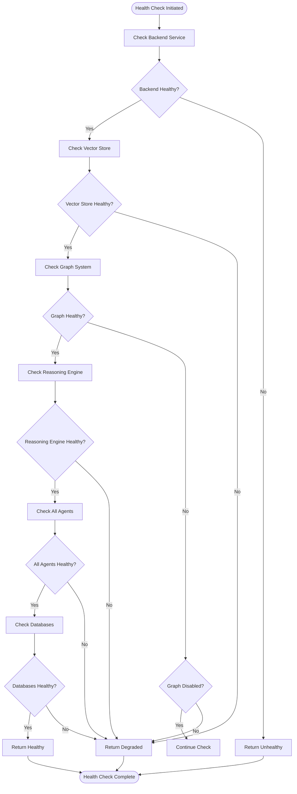

# Getting Started

<cite>
**Referenced Files in This Document**   
- [README.md](file://README.md)
- [docker-compose.yml](file://docker-compose.yml)
- [.env.example](file://.env.example)
- [scripts/docker/generate_env_example.sh](file://scripts/docker/generate_env_example.sh)
- [api/routers/health_v2.py](file://api/routers/health_v2.py)
- [demo_bank_scenario.py](file://demo_bank_scenario.py)
- [demos/healthcare_compliance.py](file://demos/healthcare_compliance.py)
- [frontend/.env.example](file://frontend/.env.example)
- [frontend/src/api/client.ts](file://frontend/src/api/client.ts)
- [docs/DEPLOYMENT.md](file://docs/DEPLOYMENT.md)
- [docs/DOCKER.md](file://docs/DOCKER.md)
- [requirements.txt](file://requirements.txt)
</cite>

## Table of Contents
1. [Introduction](#introduction)
2. [Project Overview](#project-overview)
3. [Environment Setup](#environment-setup)
4. [Configuration](#configuration)
5. [Starting Services](#starting-services)
6. [System Health Verification](#system-health-verification)
7. [Basic Workflow](#basic-workflow)
8. [Practical Examples](#practical-examples)
9. [Troubleshooting](#troubleshooting)
10. [Conclusion](#conclusion)

## Introduction

This guide provides comprehensive instructions for setting up and using the MAHOUN Platform, an advanced AI system designed for legal and contractual analysis with self-improvement capabilities. The platform guarantees zero hallucination by grounding every conclusion in a verifiable knowledge graph, making it suitable for high-stakes decision-making in regulated industries.

The guide covers the complete setup process, from environment configuration to executing practical examples, ensuring users can quickly get started with the platform's core functionality.

## Project Overview

The MAHOUN Platform is an audit-grade AI reasoning system that provides mathematically guaranteed zero hallucination through graph-based reasoning. It is designed for high-stakes decision-making in regulated industries such as healthcare, financial services, legal technology, aerospace, and pharmaceuticals.

Key features include:
- Zero hallucination guarantee through evidence-linked reasoning
- Full auditability with complete reasoning trails
- Deterministic contradiction handling
- Support for thousands of complex legal and compliance rules
- Integration with multiple databases and vector stores

The platform architecture consists of several core components:
- **Evidence-Linked Verdict Engine**: The main reasoning engine that ensures zero hallucination
- **Ultra Graph Builder**: Advanced knowledge graph construction and management
- **Legal Knowledge Graph**: Domain-specific rule and precedent storage
- **Runtime Invariants**: Four enforcement modes for different use cases
- **MCP Layer**: Model Context Protocol for LLM integration
- **Evidence Ledger**: Immutable audit trail

**Section sources**
- [README.md](file://README.md#L24-L34)
- [README.md](file://README.md#L164-L205)

## Environment Setup

### Prerequisites

Before installing the MAHOUN Platform, ensure your system meets the following requirements:

- **Python 3.11+**: The platform requires Python 3.11 or higher
- **Docker 20.10+**: Required for containerized deployment
- **Docker Compose 2.0+**: For managing multi-container applications
- **8GB RAM minimum**: Recommended for optimal performance
- **Git**: For cloning the repository

### Installation Steps

Follow these steps to set up the development environment:

```bash
# Clone the repository
git clone https://github.com/your-org/mahoun-platform.git
cd mahoun-platform

# Create virtual environment
python -m venv venv
source venv/bin/activate  # On Windows: venv\Scripts\activate

# Install Python dependencies
pip install -r requirements.txt
```

The requirements.txt file contains all necessary Python packages, including FastAPI for the web framework, Neo4j for the graph database, Pydantic for data validation, and various AI/ML libraries for the reasoning engine.

**Section sources**
- [README.md](file://README.md#L50-L69)
- [requirements.txt](file://requirements.txt#L1-L131)

## Configuration

### Environment Variables

The platform uses environment variables for configuration. A template file is provided to help set up the necessary variables.

#### Generating Environment File

Use the provided script to generate an example environment file:

```bash
./scripts/docker/generate_env_example.sh
```

This script creates a `.env.example` file with all required variables. Copy this file to `.env` and fill in your actual values:

```bash
cp .env.example .env
nano .env  # Edit with your values
```

**Section sources**
- [scripts/docker/generate_env_example.sh](file://scripts/docker/generate_env_example.sh#L1-L153)

#### Key Configuration Options

The environment file contains several important configuration sections:

**Application Settings**
```
MAHOUN_ENV=development
LOG_LEVEL=INFO
LOG_FORMAT=json
```

**Server Configuration**
```
BACKEND_PORT=8000
FRONTEND_PORT=80
```

**Database Connections**
```
NEO4J_URI=bolt://neo4j:7687
NEO4J_USER=neo4j
NEO4J_PASSWORD=changeme

POSTGRES_HOST=postgres
POSTGRES_PORT=5432
POSTGRES_DB=mahoun
POSTGRES_USER=mahoun
POSTGRES_PASSWORD=changeme
```

**Security Configuration**
```
JWT_SECRET_KEY=change-me-in-production-use-openssl-rand
API_KEY=
```

**Feature Flags**
```
ENABLE_NEO4J=false
ENABLE_POSTGRES=false
ENABLE_REDIS=false
```

**Frontend Configuration**
```
VITE_API_URL=http://localhost:8000
```

For production deployment, generate secure passwords using OpenSSL:

```bash
export NEO4J_PASSWORD="$(openssl rand -base64 32)"
export POSTGRES_PASSWORD="$(openssl rand -base64 32)"
export JWT_SECRET_KEY="$(openssl rand -base64 64)"
```

**Section sources**
- [.env.example](file://.env.example#L1-L153)
- [scripts/docker/generate_env_example.sh](file://scripts/docker/generate_env_example.sh#L24-L148)

## Starting Services

### Docker Deployment

The recommended way to run the MAHOUN Platform is using Docker Compose, which manages all required services.

#### Default Profile (Minimal)

Start the basic services (backend and frontend only):

```bash
docker-compose up -d
```

This starts the minimal configuration suitable for development and testing.

#### Full Profile (Complete Stack)

Start all services including databases and monitoring:

```bash
docker-compose --profile full up -d
```

This profile includes Neo4j, PostgreSQL, Redis, ChromaDB, and other components for a complete development environment.

#### Monitoring Profile

Add monitoring services to the full profile:

```bash
docker-compose --profile full --profile monitoring up -d
```

This adds Prometheus and Grafana for system monitoring and metrics visualization.

### Service Management Commands

```bash
# Check service status
docker-compose ps

# View logs
docker-compose logs -f mahoun-app

# Stop services
docker-compose down

# Stop and remove volumes
docker-compose down -v
```

The docker-compose.yml file defines all services with appropriate resource limits, health checks, and network configurations to ensure stable operation.

**Section sources**
- [docker-compose.yml](file://docker-compose.yml#L1-L434)
- [README.md](file://README.md#L125-L139)
- [docs/DOCKER.md](file://docs/DOCKER.md#L113-L151)

## System Health Verification

### Health Check Endpoints

The platform provides several endpoints to verify system health:

- **Basic Health Check**: `GET /health` - Quick pulse for load balancers
- **Detailed Health Check**: `GET /health/v2/detailed` - Comprehensive system check
- **Component Health Check**: `GET /health/v2/component/{component}` - Specific component check

### Health Check Implementation

The health checking system performs comprehensive validation of all components:



**Diagram sources**
- [api/routers/health_v2.py](file://api/routers/health_v2.py#L1-L158)
- [mahoun/core/health_checker.py](file://mahoun/core/health_checker.py#L1-L661)

### Verifying System Health

After starting the services, verify the system health:

```bash
# Check basic health
curl http://localhost:8000/health

# Check detailed health
curl http://localhost:8000/health/v2/detailed

# Check specific component
curl http://localhost:8000/health/v2/component/ollama
```

The health check system evaluates multiple components including:
- Ollama LLM Service
- ChromaDB/VectorStore
- Neo4j/Graph (if enabled)
- UltraReasoningService
- All registered agents
- PostgreSQL and Redis databases

**Section sources**
- [api/routers/health_v2.py](file://api/routers/health_v2.py#L1-L158)
- [mahoun/core/health_checker.py](file://mahoun/core/health_checker.py#L1-L661)
- [docs/DEPLOYMENT.md](file://docs/DEPLOYMENT.md#L69-L76)

## Basic Workflow

### Document Upload

The platform supports document analysis through both frontend and API interfaces.

#### Frontend Upload

1. Access the web interface at `http://localhost:80`
2. Navigate to the document upload section
3. Select the document file to analyze
4. Configure analysis parameters
5. Submit for processing

#### API Upload

Use the API to upload and analyze documents programmatically:

```bash
curl -X POST http://localhost:8000/v1/ingest \
  -H "Content-Type: multipart/form-data" \
  -F "file=@document.pdf" \
  -F "metadata={\"source\": \"user_upload\"}" 
```

### Analysis Process

Once a document is uploaded, the platform processes it through the following steps:

1. **Document Parsing**: Extract text and metadata from the document
2. **Knowledge Graph Construction**: Build a graph representation of the content
3. **Rule Application**: Apply relevant legal and compliance rules
4. **Reasoning Engine**: Generate evidence-linked verdicts
5. **Result Generation**: Compile findings and confidence scores

### Result Interpretation

The analysis results include:

- **Final Verdict**: The primary conclusion
- **Confidence Score**: Overall confidence level (0-1)
- **Reasoning Steps**: Detailed chain of thought with evidence links
- **Precedents**: Relevant case law or regulatory outcomes
- **Proof Pack**: Complete audit trail and supporting evidence

**Section sources**
- [README.md](file://README.md#L78-L121)
- [api/routers/ingest.py](file://api/routers/ingest.py)

## Practical Examples

### Banking Loan Risk Assessment

The `demo_bank_scenario.py` script demonstrates a banking loan risk assessment scenario:

```python
async def run_scenario():
    # 1. Setup Data
    applicant = {
        "name": "Sarah Connor",
        "income": 65000,
        "credit_score": 680,
        "collateral": "House (Value: $400k)",
        "history": "Clean"
    }
    
    # 2. Define the Conflict
    question = "Is Sarah Connor eligible for the $200k Innovation Loan?"
    facts = [
        f"Applicant Income is {applicant['income']}",
        f"Applicant Credit Score is {applicant['credit_score']}",
        f"Applicant Collateral is {applicant['collateral']}"
    ]
    
    # 3. Execution
    result = await engine.generate_verdict(question, facts)
```

This example shows how the platform handles conflicting rules (high income vs. low credit score) and generates a rejection decision based on specific evidence.

**Section sources**
- [demo_bank_scenario.py](file://demo_bank_scenario.py#L1-L103)

### Healthcare Compliance Analysis

The `healthcare_compliance.py` demo illustrates HIPAA compliance checking:

```python
def run_healthcare_demo():
    # Add HIPAA rules
    kg.add_legal_rule(
        rule_id="HIPAA_164_312_a_1",
        condition="DataType == PHI AND Encryption == NONE",
        conclusion="VIOLATION: PHI must be encrypted at rest",
        confidence=0.99
    )
    
    # Define test scenarios
    scenarios = [
        {
            "name": "Scenario 1: Unencrypted Database",
            "facts": [
                "DataType is PHI",
                "Encryption is NONE",
                "Storage is Database"
            ],
            "question": "Is there a HIPAA violation?"
        }
    ]
    
    # Run scenarios
    for scenario in scenarios:
        verdict = engine.generate_verdict(scenario['question'], scenario['facts'])
```

This demonstrates how the platform can validate medical decisions against regulatory requirements with full audit trails.

**Section sources**
- [demos/healthcare_compliance.py](file://demos/healthcare_compliance.py#L1-L169)

## Troubleshooting

### Common Setup Issues

#### Dependency Conflicts

If you encounter Python dependency conflicts:

1. Create a fresh virtual environment
2. Install dependencies with pip's resolver:

```bash
pip install --upgrade pip
pip install -r requirements.txt --force-reinstall
```

#### Docker Permission Errors

If Docker commands fail due to permission issues:

```bash
# Add user to docker group
sudo usermod -aG docker $USER

# Log out and log back in, or run:
newgrp docker
```

#### Connectivity Problems

If services cannot connect to each other:

1. Verify Docker network configuration
2. Check that all services are running:

```bash
docker-compose ps
```

3. Verify environment variables are correctly set
4. Check firewall settings if running on a restricted network

### Failed Health Checks

#### General Health Check Failures

If the health check returns unhealthy status:

1. Check service logs:
```bash
docker-compose logs backend
docker-compose logs neo4j
```

2. Verify database connections
3. Ensure all required environment variables are set
4. Check resource limits (CPU, memory)

#### Specific Component Failures

For Neo4j connection issues:
- Verify NEO4J_URI is correct
- Check Neo4j container health
- Ensure credentials are properly configured

For PostgreSQL issues:
- Verify connection parameters
- Check if the database is initialized
- Ensure the postgres user has proper permissions

For Redis connectivity problems:
- Verify Redis URL and port
- Check if Redis password is correctly set
- Ensure Redis is running and accepting connections

### Integration Point Issues

#### Frontend-Backend Communication

If the frontend cannot communicate with the backend:

1. Verify VITE_API_URL in frontend/.env
2. Check that the backend is running on the expected port
3. Verify CORS configuration in the backend
4. Test the API endpoint directly with curl

#### Database Integration Problems

For issues with database integration:

1. Verify database service health
2. Check connection strings and credentials
3. Ensure database containers are part of the same network
4. Verify that database initialization completed successfully

The platform includes a validation script to check Docker setup:

```bash
./scripts/docker/validate_docker_setup.sh
```

This script verifies Docker installation, file structure, Dockerfiles, and compose configuration.

**Section sources**
- [docs/DEPLOYMENT.md](file://docs/DEPLOYMENT.md#L70-L76)
- [docs/DOCKER.md](file://docs/DOCKER.md#L423-L477)
- [scripts/docker/validate_docker_setup.sh](file://scripts/docker/validate_docker_setup.sh#L1-L265)

## Conclusion

The MAHOUN Platform provides a robust foundation for AI-powered legal and contractual analysis with guaranteed zero hallucination. By following this guide, you can successfully set up the platform, configure it for your environment, and begin using its advanced reasoning capabilities.

Key takeaways:
- The platform uses Docker Compose for easy deployment
- Environment variables control all configuration aspects
- Comprehensive health checks ensure system reliability
- Practical examples demonstrate real-world use cases
- Detailed troubleshooting guidance helps resolve common issues

With the platform running, you can now explore its full capabilities for legal analysis, compliance checking, and high-stakes decision support in regulated industries.