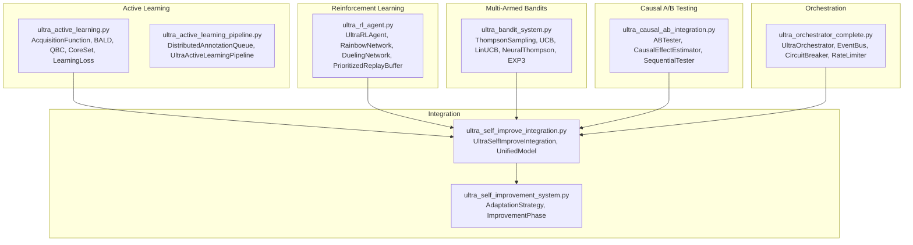
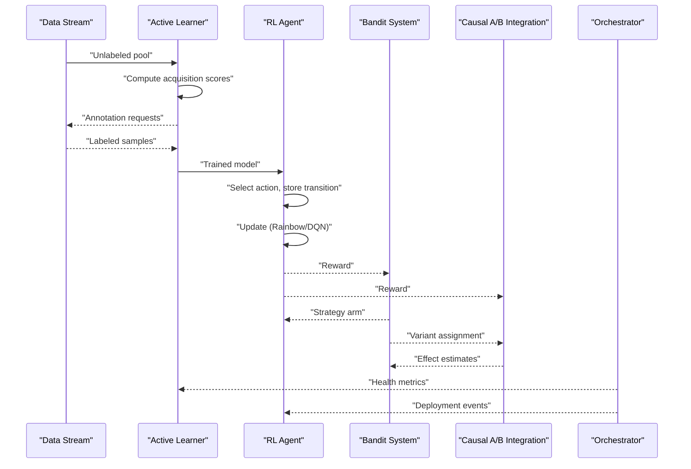
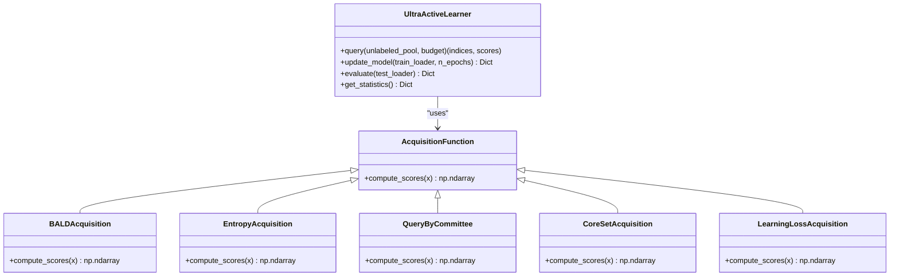
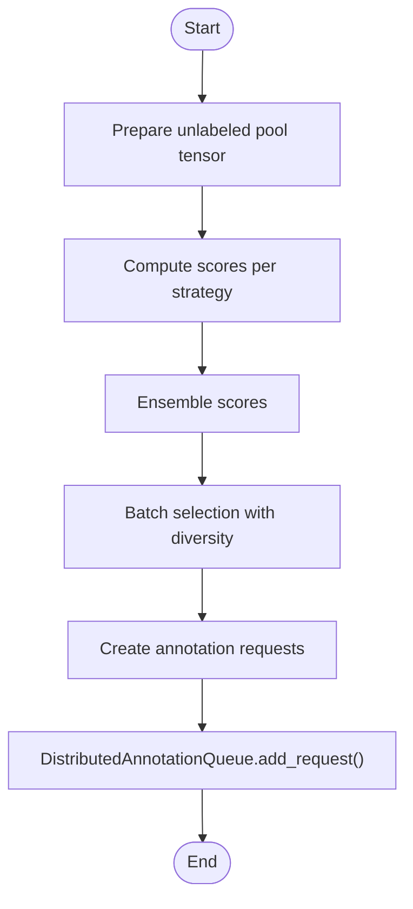
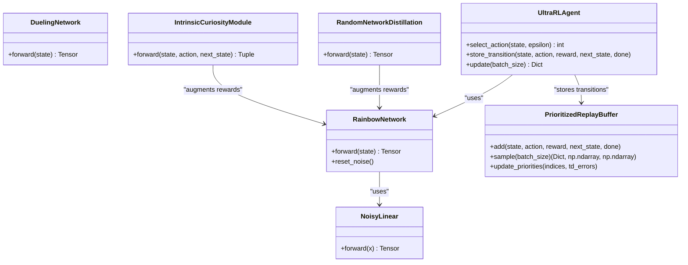
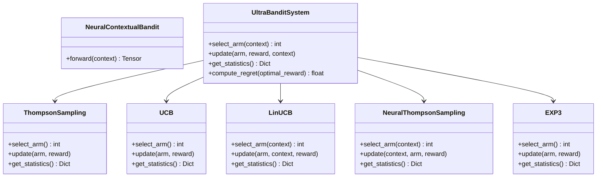
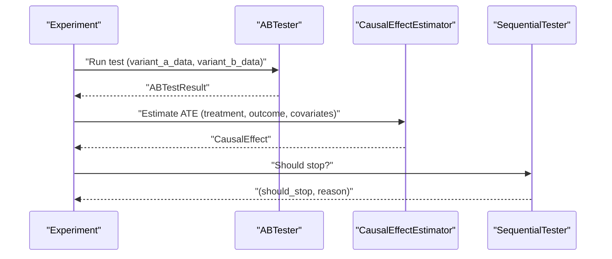
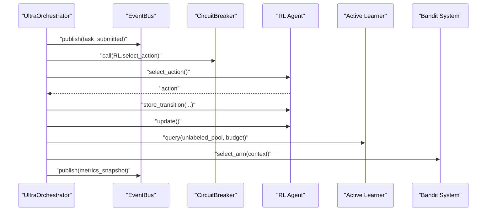
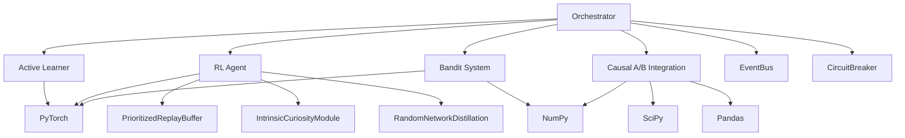

# Active Learning and Reinforcement Learning

<cite>
**Referenced Files in This Document**
- [ultra_active_learning.py](file://mahoun/self_improve/ultra_active_learning.py)
- [ultra_rl_agent.py](file://mahoun/self_improve/ultra_rl_agent.py)
- [ultra_bandit_system.py](file://mahoun/self_improve/ultra_bandit_system.py)
- [ultra_causal_ab_integration.py](file://mahoun/self_improve/ultra_causal_ab_integration.py)
- [ultra_orchestrator_complete.py](file://mahoun/self_improve/ultra_orchestrator_complete.py)
- [ultra_active_learning_pipeline.py](file://mahoun/self_improve/ultra_active_learning_pipeline.py)
- [ultra_self_improve_integration.py](file://mahoun/self_improve/ultra_self_improve_integration.py)
- [ultra_self_improvement_system.py](file://mahoun/self_improve/ultra_self_improvement_system.py)
</cite>

## Table of Contents
1. [Introduction](#introduction)
2. [Project Structure](#project-structure)
3. [Core Components](#core-components)
4. [Architecture Overview](#architecture-overview)
5. [Detailed Component Analysis](#detailed-component-analysis)
6. [Dependency Analysis](#dependency-analysis)
7. [Performance Considerations](#performance-considerations)
8. [Troubleshooting Guide](#troubleshooting-guide)
9. [Conclusion](#conclusion)
10. [Appendices](#appendices)

## Introduction
This document explains the active learning and reinforcement learning components that power intelligent data selection and policy optimization in the platform. It covers:
- Uncertainty sampling and Query-by-Committee for identifying high-value training samples
- A reinforcement learning agent that optimizes model selection and hyperparameters via reward shaping
- A multi-armed bandit system enabling A/B testing of model variants
- Causal A/B testing integration for measuring counterfactual improvements
- System-level orchestration via the ultra orchestrator coordinating these components

The goal is to make the implementation approachable while preserving technical depth and traceability to the source code.

## Project Structure
The active learning and RL ecosystem is organized around specialized modules under the self-improve subsystem:
- Active learning: acquisition functions, batch selection, and model updates
- RL agent: deep Q-networks, curiosity modules, prioritized replay, and updates
- Bandit system: classic and contextual bandits for exploration-exploitation
- Causal A/B integration: effect estimation, sequential testing, and experiment tracking
- Orchestrator: event-driven coordination, health monitoring, and deployment strategies
- Integration hubs: unified models and coordinated loops across components

**Diagram sources**
- [ultra_active_learning.py](file://mahoun/self_improve/ultra_active_learning.py#L1-L554)
- [ultra_rl_agent.py](file://mahoun/self_improve/ultra_rl_agent.py#L1-L633)
- [ultra_bandit_system.py](file://mahoun/self_improve/ultra_bandit_system.py#L1-L440)
- [ultra_causal_ab_integration.py](file://mahoun/self_improve/ultra_causal_ab_integration.py#L1-L655)
- [ultra_orchestrator_complete.py](file://mahoun/self_improve/ultra_orchestrator_complete.py#L1-L827)
- [ultra_self_improve_integration.py](file://mahoun/self_improve/ultra_self_improve_integration.py#L1-L428)
- [ultra_self_improvement_system.py](file://mahoun/self_improve/ultra_self_improvement_system.py#L1-L200)

**Section sources**
- [ultra_active_learning.py](file://mahoun/self_improve/ultra_active_learning.py#L1-L554)
- [ultra_rl_agent.py](file://mahoun/self_improve/ultra_rl_agent.py#L1-L633)
- [ultra_bandit_system.py](file://mahoun/self_improve/ultra_bandit_system.py#L1-L440)
- [ultra_causal_ab_integration.py](file://mahoun/self_improve/ultra_causal_ab_integration.py#L1-L655)
- [ultra_orchestrator_complete.py](file://mahoun/self_improve/ultra_orchestrator_complete.py#L1-L827)
- [ultra_self_improve_integration.py](file://mahoun/self_improve/ultra_self_improve_integration.py#L1-L428)
- [ultra_self_improvement_system.py](file://mahoun/self_improve/ultra_self_improvement_system.py#L1-L200)

## Core Components
- Active Learning: Implements uncertainty-based acquisition (BALD, entropy), diversity-aware selection (core-set), and committee disagreement (QBC). Supports batch-mode selection and updating models with new labels.
- RL Agent: Rainbow DQN with distributional RL, dueling architecture, prioritized experience replay, curiosity modules (ICM, RND), and HER. Provides action selection and training updates.
- Bandit System: Thompson sampling, UCB, LinUCB, neural contextual bandits, and EXP3. Tracks pulls, rewards, and regret.
- Causal A/B Integration: A/B testing, causal effect estimation (IPW, regression), sequential testing with early stopping, and experiment tracking.
- Orchestrator: Event-driven task scheduling, health monitoring, circuit breakers, rate limiting, and deployment strategies.
- Integration Hub: Unified model and coordinated loop integrating RL, AL, Bandits, and self-improvement.

**Section sources**
- [ultra_active_learning.py](file://mahoun/self_improve/ultra_active_learning.py#L207-L524)
- [ultra_rl_agent.py](file://mahoun/self_improve/ultra_rl_agent.py#L287-L615)
- [ultra_bandit_system.py](file://mahoun/self_improve/ultra_bandit_system.py#L346-L423)
- [ultra_causal_ab_integration.py](file://mahoun/self_improve/ultra_causal_ab_integration.py#L436-L585)
- [ultra_orchestrator_complete.py](file://mahoun/self_improve/ultra_orchestrator_complete.py#L299-L764)
- [ultra_self_improve_integration.py](file://mahoun/self_improve/ultra_self_improve_integration.py#L114-L391)

## Architecture Overview
The system coordinates multiple components to continuously improve performance:
- Data streams feed unlabeled pools to the active learner, which selects informative samples and records annotation requests.
- RL agent learns from environment interactions and intrinsic rewards, storing transitions and updating networks.
- Bandit system chooses among strategies or model variants, feeding rewards back into RL and AL.
- Causal A/B integration evaluates variant performance and estimates counterfactual effects.
- Orchestrator manages tasks, health, and deployments, publishing events for observability.

**Diagram sources**
- [ultra_active_learning.py](file://mahoun/self_improve/ultra_active_learning.py#L300-L353)
- [ultra_rl_agent.py](file://mahoun/self_improve/ultra_rl_agent.py#L364-L427)
- [ultra_bandit_system.py](file://mahoun/self_improve/ultra_bandit_system.py#L384-L423)
- [ultra_causal_ab_integration.py](file://mahoun/self_improve/ultra_causal_ab_integration.py#L469-L558)
- [ultra_orchestrator_complete.py](file://mahoun/self_improve/ultra_orchestrator_complete.py#L415-L579)

## Detailed Component Analysis

### Active Learning: Uncertainty Sampling and Query-by-Committee
The active learner supports multiple acquisition strategies:
- BALD (Bayesian Active Learning by Disagreement): Uses Monte Carlo dropout to estimate mutual information between predictions and model parameters.
- Entropy: Selects samples with highest predictive entropy.
- Query-by-Committee: Measures disagreement among committee members.
- Core-Set: Selects samples farthest from the current labeled set to maximize diversity.
- Learning Loss: Predicts loss for unlabeled samples using a learned loss predictor.

Key behaviors:
- Batch-mode selection with diversity-aware scoring
- Dynamic committee creation and loss predictor training
- Metrics tracking for queries, labeled samples, and accuracy history

**Diagram sources**
- [ultra_active_learning.py](file://mahoun/self_improve/ultra_active_learning.py#L41-L201)
- [ultra_active_learning.py](file://mahoun/self_improve/ultra_active_learning.py#L207-L524)

Implementation highlights:
- BALD uses Monte Carlo sampling to approximate mutual information between predictions and model parameters.
- QBC computes disagreement across committee members and returns vote entropy.
- Core-Set extracts features from the penultimate layer and selects samples with minimum Euclidean distance to the labeled set.
- Learning Loss trains a small MLP to predict per-sample loss from features.

Batch selection combines uncertainty scores with diversity to avoid redundant selections.

**Section sources**
- [ultra_active_learning.py](file://mahoun/self_improve/ultra_active_learning.py#L41-L201)
- [ultra_active_learning.py](file://mahoun/self_improve/ultra_active_learning.py#L300-L395)
- [ultra_active_learning.py](file://mahoun/self_improve/ultra_active_learning.py#L404-L524)

### Active Learning Pipeline: Distributed Annotation and Cost-Sensitive Selection
The pipeline extends the active learner with:
- Distributed annotation queue supporting priority-based scheduling, annotator skill matching, and quality control
- Async sample selection across multiple strategies
- Cost-sensitive batch selection and priority computation
- Real-time model updates and statistics

**Diagram sources**
- [ultra_active_learning_pipeline.py](file://mahoun/self_improve/ultra_active_learning_pipeline.py#L283-L505)

**Section sources**
- [ultra_active_learning_pipeline.py](file://mahoun/self_improve/ultra_active_learning_pipeline.py#L1-L678)

### Reinforcement Learning Agent: Policy Optimization with Reward Shaping
The RL agent supports:
- Rainbow DQN with distributional RL, dueling architecture, and noisy linear layers for exploration
- Curiosity modules (ICM and RND) to augment rewards for exploration
- Prioritized experience replay with importance-sampling weights
- Double DQN-style targets and periodic target network updates

**Diagram sources**
- [ultra_rl_agent.py](file://mahoun/self_improve/ultra_rl_agent.py#L40-L180)
- [ultra_rl_agent.py](file://mahoun/self_improve/ultra_rl_agent.py#L191-L341)
- [ultra_rl_agent.py](file://mahoun/self_improve/ultra_rl_agent.py#L342-L615)

Training flow:
- Sample batch from prioritized replay with importance weights
- Compute intrinsic rewards from ICM and RND and add to extrinsic rewards
- Compute distributional loss for Rainbow or DQN loss for standard DQN
- Update Q-network and curiosity modules, then update priorities

**Section sources**
- [ultra_rl_agent.py](file://mahoun/self_improve/ultra_rl_agent.py#L287-L615)

### Multi-Armed Bandit System: A/B Testing of Model Variants
The bandit system provides:
- Thompson Sampling (Beta-Bernoulli)
- Upper Confidence Bound (UCB)
- LinUCB for contextual decisions
- Neural Thompson Sampling with ensemble models
- EXP3 for adversarial environments

**Diagram sources**
- [ultra_bandit_system.py](file://mahoun/self_improve/ultra_bandit_system.py#L40-L168)
- [ultra_bandit_system.py](file://mahoun/self_improve/ultra_bandit_system.py#L170-L292)
- [ultra_bandit_system.py](file://mahoun/self_improve/ultra_bandit_system.py#L298-L423)

**Section sources**
- [ultra_bandit_system.py](file://mahoun/self_improve/ultra_bandit_system.py#L346-L423)

### Causal A/B Testing Integration: Counterfactual Improvements
The integration provides:
- A/B testing with two-sample t-tests and power calculations
- Causal effect estimation via IPW, regression, and matching
- Sequential testing with early stopping criteria
- Experiment tracking and statistics aggregation

**Diagram sources**
- [ultra_causal_ab_integration.py](file://mahoun/self_improve/ultra_causal_ab_integration.py#L296-L435)
- [ultra_causal_ab_integration.py](file://mahoun/self_improve/ultra_causal_ab_integration.py#L436-L585)

**Section sources**
- [ultra_causal_ab_integration.py](file://mahoun/self_improve/ultra_causal_ab_integration.py#L1-L655)

### System-Level Coordination: Orchestrator and Integration
The orchestrator coordinates tasks, health, and deployments:
- Event bus publishes task lifecycle and metrics snapshots
- Circuit breaker protects component calls
- Rate limiter throttles component throughput
- Deployment strategies include canary, blue-green, and shadow rollouts

**Diagram sources**
- [ultra_orchestrator_complete.py](file://mahoun/self_improve/ultra_orchestrator_complete.py#L210-L252)
- [ultra_orchestrator_complete.py](file://mahoun/self_improve/ultra_orchestrator_complete.py#L415-L579)

**Section sources**
- [ultra_orchestrator_complete.py](file://mahoun/self_improve/ultra_orchestrator_complete.py#L1-L827)

## Dependency Analysis
- Active Learning depends on PyTorch for model inference and training; acquisition functions encapsulate uncertainty and diversity measures.
- RL Agent depends on PyTorch for neural networks and experience replay; curiosity modules depend on fixed target networks and predictor networks.
- Bandit System uses NumPy for statistics and optional PyTorch for neural contextual bandits.
- Causal A/B Integration uses NumPy, SciPy, and Pandas for statistical computations and experiment tracking.
- Orchestrator integrates all components via event-driven messaging and health monitoring.

**Diagram sources**
- [ultra_active_learning.py](file://mahoun/self_improve/ultra_active_learning.py#L1-L554)
- [ultra_rl_agent.py](file://mahoun/self_improve/ultra_rl_agent.py#L1-L633)
- [ultra_bandit_system.py](file://mahoun/self_improve/ultra_bandit_system.py#L1-L440)
- [ultra_causal_ab_integration.py](file://mahoun/self_improve/ultra_causal_ab_integration.py#L1-L655)
- [ultra_orchestrator_complete.py](file://mahoun/self_improve/ultra_orchestrator_complete.py#L1-L827)

**Section sources**
- [ultra_active_learning.py](file://mahoun/self_improve/ultra_active_learning.py#L1-L554)
- [ultra_rl_agent.py](file://mahoun/self_improve/ultra_rl_agent.py#L1-L633)
- [ultra_bandit_system.py](file://mahoun/self_improve/ultra_bandit_system.py#L1-L440)
- [ultra_causal_ab_integration.py](file://mahoun/self_improve/ultra_causal_ab_integration.py#L1-L655)
- [ultra_orchestrator_complete.py](file://mahoun/self_improve/ultra_orchestrator_complete.py#L1-L827)

## Performance Considerations
- Online learning and real-time decision making:
  - Use prioritized experience replay to focus on informative transitions and reduce off-policy variance.
  - Employ curiosity modules to encourage exploration in sparse reward environments.
  - Batch-mode active learning reduces annotation overhead while maintaining diversity.
- Computational efficiency:
  - BALD uses Monte Carlo dropout; tune n_mc_samples to balance uncertainty estimation quality and speed.
  - Core-Set selection relies on Euclidean distances; consider approximate nearest neighbors for large pools.
  - Neural contextual bandits benefit from ensemble training with bootstrapped batches.
- Memory and stability:
  - Clip gradients during RL updates to prevent exploding gradients.
  - Use target networks and periodic resets for noisy layers to stabilize Rainbow DQN.
- Observability:
  - Publish metrics snapshots and component health events for monitoring and alerting.

[No sources needed since this section provides general guidance]

## Troubleshooting Guide
Common issues and mitigations:
- Reward hacking:
  - Use intrinsic rewards (ICM/RND) to diversify exploration and avoid trivial policy shortcuts.
  - Regularize curiosity modules to prevent overfitting to curiosity signals.
- Exploration vs. exploitation trade-off:
  - Rainbow DQN’s noisy layers naturally balance exploration/exploitation; adjust reset schedule to control noise decay.
  - Bandit algorithms (Thompson Sampling, UCB) provide principled exploration; tune parameters (e.g., UCB c) for environment dynamics.
- Cold-start problems:
  - Use optimistic initialization in bandits and neural contextual bandits.
  - Start with broad exploration (e.g., higher epsilon in RL) and gradually exploit learned policies.
  - Initialize active learner with diverse samples or curriculum learning to bootstrap uncertainty estimates.
- Stability and convergence:
  - Monitor training loss and accuracy history from the active learner; reduce learning rates if divergence occurs.
  - Validate causal effect estimates with multiple methods (IPW, regression) and check covariate overlap.
- Operational resilience:
  - Circuit breakers protect downstream components under failures; inspect error counts and heartbeats.
  - Rate limiters prevent overload; adjust capacities and refill rates according to workload.

**Section sources**
- [ultra_rl_agent.py](file://mahoun/self_improve/ultra_rl_agent.py#L342-L427)
- [ultra_bandit_system.py](file://mahoun/self_improve/ultra_bandit_system.py#L120-L168)
- [ultra_causal_ab_integration.py](file://mahoun/self_improve/ultra_causal_ab_integration.py#L396-L435)
- [ultra_orchestrator_complete.py](file://mahoun/self_improve/ultra_orchestrator_complete.py#L117-L164)

## Conclusion
The active learning and reinforcement learning stack provides a robust foundation for adaptive systems:
- Active learning identifies high-value samples using uncertainty and diversity
- RL agents optimize policies with reward shaping and curiosity-driven exploration
- Bandits enable safe A/B testing of model variants
- Causal inference ensures reliable measurement of counterfactual improvements
- The orchestrator coordinates these components with health monitoring and deployment strategies

Together, these components form a scalable, observable, and resilient self-improving system suitable for real-time, online learning scenarios.

[No sources needed since this section summarizes without analyzing specific files]

## Appendices
- Integration examples:
  - Unified model architecture and coordinated loop in the integration hub
  - Self-improvement system phases and strategies for adaptation cycles

**Section sources**
- [ultra_self_improve_integration.py](file://mahoun/self_improve/ultra_self_improve_integration.py#L114-L391)
- [ultra_self_improvement_system.py](file://mahoun/self_improve/ultra_self_improvement_system.py#L53-L108)