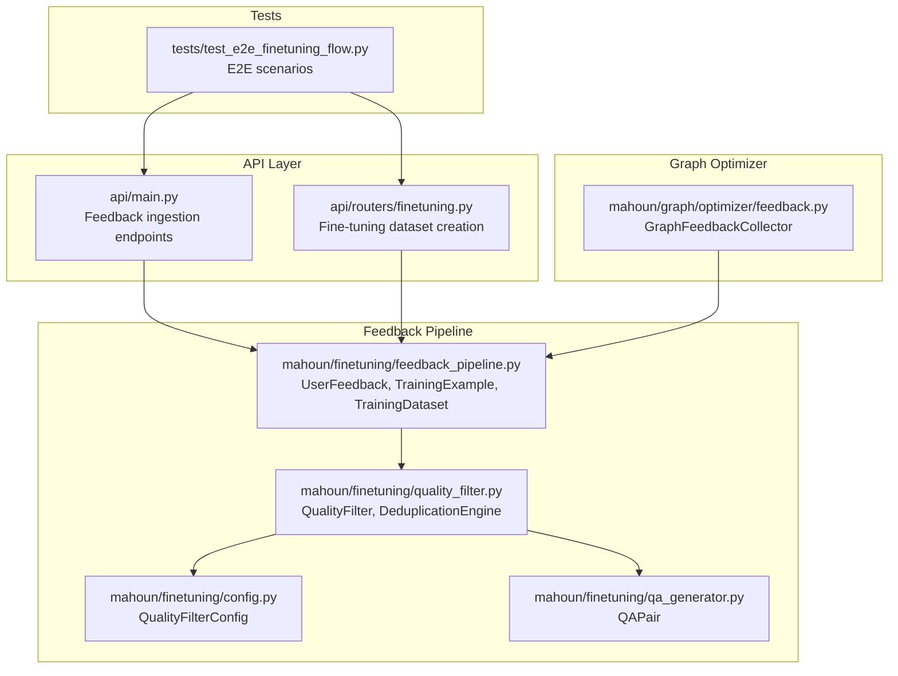
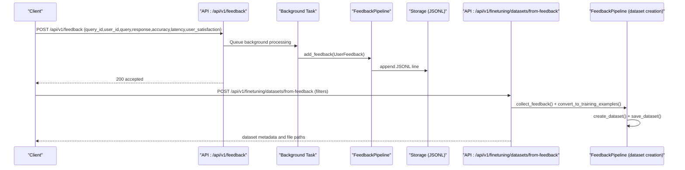
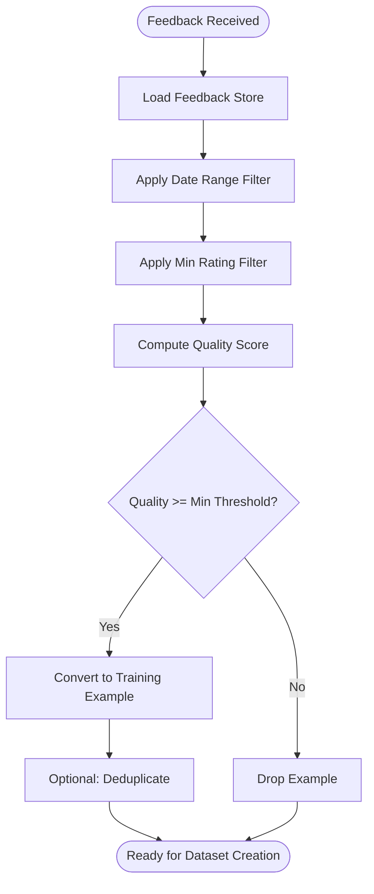
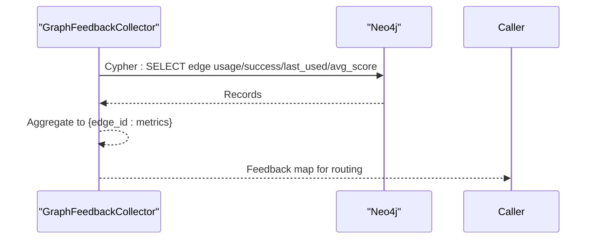
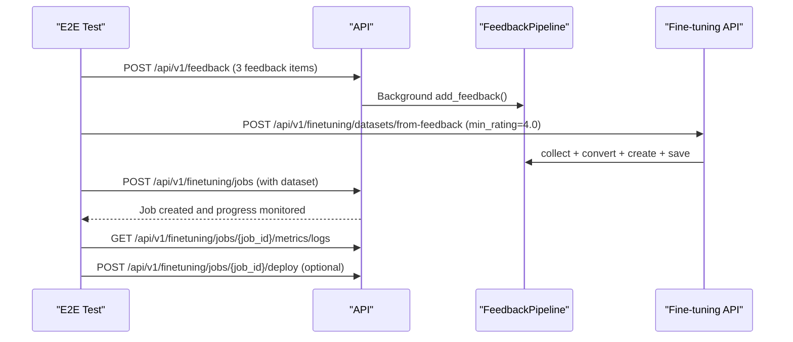
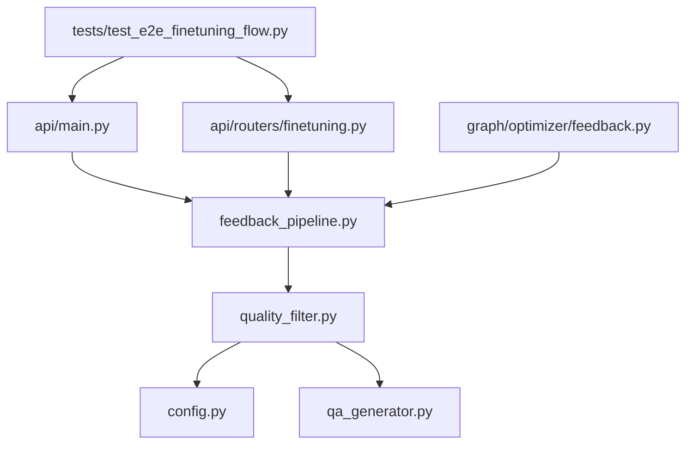

# Feedback Collection and Processing

<cite>
**Referenced Files in This Document**
- [feedback_pipeline.py](file://mahoun/finetuning/feedback_pipeline.py)
- [quality_filter.py](file://mahoun/finetuning/quality_filter.py)
- [test_e2e_finetuning_flow.py](file://tests/test_e2e_finetuning_flow.py)
- [feedback.py](file://mahoun/graph/optimizer/feedback.py)
- [finetuning.py](file://api/routers/finetuning.py)
- [main.py](file://api/main.py)
- [config.py](file://mahoun/finetuning/config.py)
- [qa_generator.py](file://mahoun/finetuning/qa_generator.py)
</cite>

## Table of Contents
1. [Introduction](#introduction)
2. [Project Structure](#project-structure)
3. [Core Components](#core-components)
4. [Architecture Overview](#architecture-overview)
5. [Detailed Component Analysis](#detailed-component-analysis)
6. [Dependency Analysis](#dependency-analysis)
7. [Performance Considerations](#performance-considerations)
8. [Troubleshooting Guide](#troubleshooting-guide)
9. [Conclusion](#conclusion)

## Introduction
This document explains the feedback collection and processing subsystem that powers continuous model improvement through user feedback. It covers:
- How user feedback is ingested and stored
- Metadata enrichment and quality scoring
- Routing to quality filtering and dataset creation
- Integration with the graph optimizer’s feedback module for A/B testing signals
- Real-world end-to-end scenarios from the test suite
- Data model for UserFeedback, validation rules, and storage mechanisms
- Solutions for common issues: feedback spam, low-quality inputs, and delayed processing
- Performance considerations for high-throughput ingestion and deduplication

## Project Structure
The feedback subsystem spans several modules:
- API ingestion and orchestration in the REST API
- Feedback pipeline for ingestion, scoring, and dataset creation
- Quality filtering for advanced validation and deduplication
- Graph optimizer feedback aggregation for A/B testing signals
- End-to-end tests demonstrating real-world usage

**Diagram sources**
- [main.py](file://api/main.py#L296-L357)
- [finetuning.py](file://api/routers/finetuning.py#L555-L641)
- [feedback_pipeline.py](file://mahoun/finetuning/feedback_pipeline.py#L1-L120)
- [quality_filter.py](file://mahoun/finetuning/quality_filter.py#L550-L763)
- [config.py](file://mahoun/finetuning/config.py#L101-L136)
- [qa_generator.py](file://mahoun/finetuning/qa_generator.py#L41-L110)
- [feedback.py](file://mahoun/graph/optimizer/feedback.py#L53-L104)
- [test_e2e_finetuning_flow.py](file://tests/test_e2e_finetuning_flow.py#L31-L128)

**Section sources**
- [main.py](file://api/main.py#L296-L357)
- [finetuning.py](file://api/routers/finetuning.py#L555-L641)
- [feedback_pipeline.py](file://mahoun/finetuning/feedback_pipeline.py#L1-L120)
- [quality_filter.py](file://mahoun/finetuning/quality_filter.py#L550-L763)
- [config.py](file://mahoun/finetuning/config.py#L101-L136)
- [qa_generator.py](file://mahoun/finetuning/qa_generator.py#L41-L110)
- [feedback.py](file://mahoun/graph/optimizer/feedback.py#L53-L104)
- [test_e2e_finetuning_flow.py](file://tests/test_e2e_finetuning_flow.py#L31-L128)

## Core Components
- Feedback ingestion and persistence: UserFeedback records are appended to a JSON Lines log and kept in memory for immediate access.
- Quality scoring: A composite score considers rating, response time, confidence, and feedback type to determine whether feedback qualifies for training.
- Dataset creation: Feedback is converted to training examples and split into train/eval/test sets with metadata.
- Quality filtering: An enterprise-grade filter validates Q&A pairs by relevance, coherence, groundedness, and completeness; performs deduplication; and produces a filtered dataset.
- Graph optimizer integration: Aggregates edge usage and success metrics from the graph for A/B testing signal routing.
- API endpoints: Expose feedback submission and dataset creation from feedback, with background processing and robust error handling.

**Section sources**
- [feedback_pipeline.py](file://mahoun/finetuning/feedback_pipeline.py#L111-L218)
- [feedback_pipeline.py](file://mahoun/finetuning/feedback_pipeline.py#L219-L356)
- [feedback_pipeline.py](file://mahoun/finetuning/feedback_pipeline.py#L357-L491)
- [quality_filter.py](file://mahoun/finetuning/quality_filter.py#L550-L763)
- [feedback.py](file://mahoun/graph/optimizer/feedback.py#L53-L104)
- [finetuning.py](file://api/routers/finetuning.py#L555-L641)
- [main.py](file://api/main.py#L296-L357)

## Architecture Overview
The feedback pipeline integrates user interactions with fine-tuning workflows and graph-based A/B testing signals.

**Diagram sources**
- [main.py](file://api/main.py#L296-L357)
- [feedback_pipeline.py](file://mahoun/finetuning/feedback_pipeline.py#L144-L182)
- [finetuning.py](file://api/routers/finetuning.py#L555-L641)

## Detailed Component Analysis

### Feedback Ingestion and Storage
- Data model: UserFeedback captures feedback_id, user_id, query, response, feedback_type, optional rating, corrected_response, preferred/rejected responses, timestamps, context metadata, and quality-related fields (response_time_ms, confidence_score).
- Persistence: Feedback is appended to a JSON Lines file and also maintained in memory for immediate access and filtering.
- Enrichment: Incoming API feedback is converted to UserFeedback with normalized rating (0–1 to 1–5 scale), response time in milliseconds, and confidence score.

Key behaviors:
- Append-only persistence with safe JSON serialization of datetime and enum fields.
- In-memory store supports efficient filtering by date range and minimum rating.

**Section sources**
- [feedback_pipeline.py](file://mahoun/finetuning/feedback_pipeline.py#L42-L68)
- [feedback_pipeline.py](file://mahoun/finetuning/feedback_pipeline.py#L144-L182)
- [main.py](file://api/main.py#L296-L357)

### Quality Scoring and Routing to Quality Filtering
- Quality score calculation factors:
  - Rating (normalized to a weighted component)
  - Response time (optimal range yields higher scores)
  - Confidence score
  - Feedback type bonuses (corrections and preferences receive higher weights)
  - Special case: corrections are treated as high-quality gold data
- Routing to quality filtering:
  - After converting feedback to training examples, the system can integrate with the QualityFilter to validate and deduplicate examples prior to dataset creation.
  - QualityFilterConfig controls thresholds and deduplication behavior.

**Diagram sources**
- [feedback_pipeline.py](file://mahoun/finetuning/feedback_pipeline.py#L183-L218)
- [feedback_pipeline.py](file://mahoun/finetuning/feedback_pipeline.py#L219-L356)
- [quality_filter.py](file://mahoun/finetuning/quality_filter.py#L550-L763)
- [config.py](file://mahoun/finetuning/config.py#L101-L136)

**Section sources**
- [feedback_pipeline.py](file://mahoun/finetuning/feedback_pipeline.py#L219-L356)
- [quality_filter.py](file://mahoun/finetuning/quality_filter.py#L550-L763)
- [config.py](file://mahoun/finetuning/config.py#L101-L136)

### Dataset Creation and Saving
- Conversion: Feedback types are mapped to training examples with appropriate weighting and source tagging.
- Splits: Random shuffling and deterministic train/eval/test splits based on configured ratios.
- Metadata: Average quality score, total examples, and split sizes recorded.
- Persistence: Saves train/eval/test splits and metadata to disk in multiple formats.

**Section sources**
- [feedback_pipeline.py](file://mahoun/finetuning/feedback_pipeline.py#L357-L491)

### Integration with Graph Optimizer for A/B Testing Signals
- GraphFeedbackCollector reads relationship properties from the graph (usage_count, success_count, last_used_at, avg_score) and aggregates per-edge feedback metrics.
- These metrics can inform A/B testing routing decisions and model selection in the broader system.

**Diagram sources**
- [feedback.py](file://mahoun/graph/optimizer/feedback.py#L53-L104)

**Section sources**
- [feedback.py](file://mahoun/graph/optimizer/feedback.py#L53-L104)

### End-to-End Feedback Scenarios from Tests
Real-world scenarios demonstrate:
- Submitting feedback via the API
- Creating a dataset from feedback with filters
- Starting a fine-tuning job and monitoring progress
- Deploying a model after successful training

**Diagram sources**
- [test_e2e_finetuning_flow.py](file://tests/test_e2e_finetuning_flow.py#L31-L128)
- [finetuning.py](file://api/routers/finetuning.py#L555-L641)
- [main.py](file://api/main.py#L296-L357)

**Section sources**
- [test_e2e_finetuning_flow.py](file://tests/test_e2e_finetuning_flow.py#L31-L128)
- [finetuning.py](file://api/routers/finetuning.py#L555-L641)
- [main.py](file://api/main.py#L296-L357)

## Dependency Analysis
- API depends on FeedbackPipeline for ingestion and dataset creation.
- FeedbackPipeline depends on dataclasses for UserFeedback and TrainingExample, and uses filesystem I/O for persistence.
- QualityFilter depends on QualityFilterConfig and integrates with QAPair structures (used in broader QA generation).
- GraphFeedbackCollector depends on Neo4j driver for graph metrics aggregation.
- End-to-end tests depend on FastAPI TestClient and the API routers.

**Diagram sources**
- [main.py](file://api/main.py#L296-L357)
- [finetuning.py](file://api/routers/finetuning.py#L555-L641)
- [feedback_pipeline.py](file://mahoun/finetuning/feedback_pipeline.py#L1-L120)
- [quality_filter.py](file://mahoun/finetuning/quality_filter.py#L550-L763)
- [config.py](file://mahoun/finetuning/config.py#L101-L136)
- [qa_generator.py](file://mahoun/finetuning/qa_generator.py#L41-L110)
- [feedback.py](file://mahoun/graph/optimizer/feedback.py#L53-L104)
- [test_e2e_finetuning_flow.py](file://tests/test_e2e_finetuning_flow.py#L31-L128)

**Section sources**
- [main.py](file://api/main.py#L296-L357)
- [finetuning.py](file://api/routers/finetuning.py#L555-L641)
- [feedback_pipeline.py](file://mahoun/finetuning/feedback_pipeline.py#L1-L120)
- [quality_filter.py](file://mahoun/finetuning/quality_filter.py#L550-L763)
- [config.py](file://mahoun/finetuning/config.py#L101-L136)
- [qa_generator.py](file://mahoun/finetuning/qa_generator.py#L41-L110)
- [feedback.py](file://mahoun/graph/optimizer/feedback.py#L53-L104)
- [test_e2e_finetuning_flow.py](file://tests/test_e2e_finetuning_flow.py#L31-L128)

## Performance Considerations
- High-throughput ingestion:
  - Append-only JSON Lines persistence is efficient for write-heavy workloads.
  - In-memory feedback store enables fast filtering and conversion without repeated disk reads.
- Deduplication strategies:
  - QualityFilter provides semantic deduplication using embeddings and fallback Jaccard similarity.
  - DeduplicationEngine uses exact hashing plus semantic clustering to reduce redundancy.
- Quality scoring:
  - Lightweight scoring avoids heavy computation; embedding-based components fall back gracefully when libraries are unavailable.
- Background processing:
  - Feedback ingestion is offloaded to background tasks to keep API latency low.

[No sources needed since this section provides general guidance]

## Troubleshooting Guide
Common issues and solutions:
- Feedback spam:
  - Use quality scoring to filter low-quality entries; adjust min_quality_score and min_rating thresholds.
  - Implement rate-limiting middleware at the API level.
- Low-quality inputs:
  - Leverage QualityFilter thresholds (relevance, coherence, groundedness) and enable deduplication.
  - Validate input lengths and formats at the API boundary.
- Delayed feedback processing:
  - Background tasks handle ingestion; monitor queue depth and worker capacity.
  - Persist feedback immediately to disk to prevent data loss during outages.
- Graph feedback integration failures:
  - Graceful degradation is implemented; log errors and continue operation.

**Section sources**
- [quality_filter.py](file://mahoun/finetuning/quality_filter.py#L550-L763)
- [feedback_pipeline.py](file://mahoun/finetuning/feedback_pipeline.py#L144-L182)
- [main.py](file://api/main.py#L73-L86)

## Conclusion
The feedback collection and processing subsystem provides a robust pipeline from user interactions to fine-tuned models. It emphasizes quality-aware ingestion, configurable thresholds, and scalable persistence. Integration with the graph optimizer enriches A/B testing signals, while the API exposes straightforward endpoints for dataset creation and model training. The end-to-end tests demonstrate realistic workflows, and the quality filter and deduplication strategies mitigate spam and low-quality inputs.