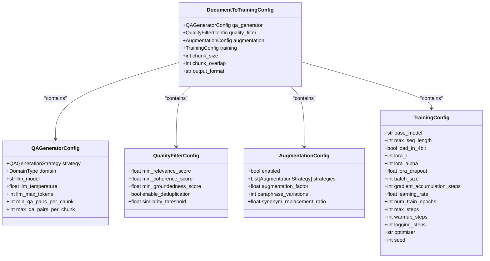
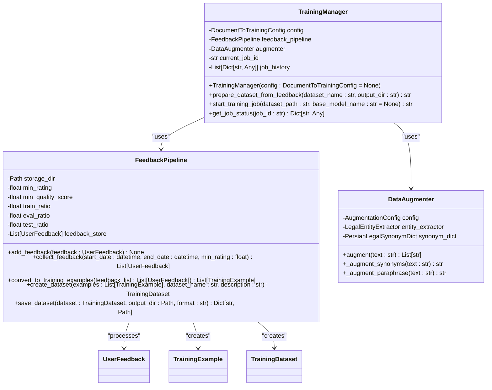
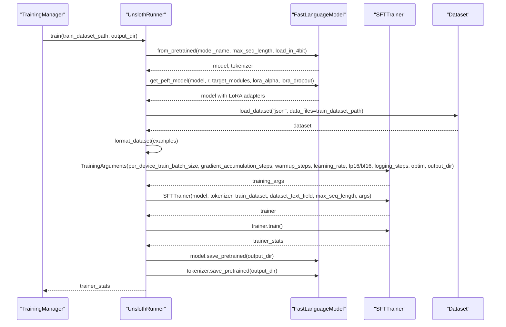
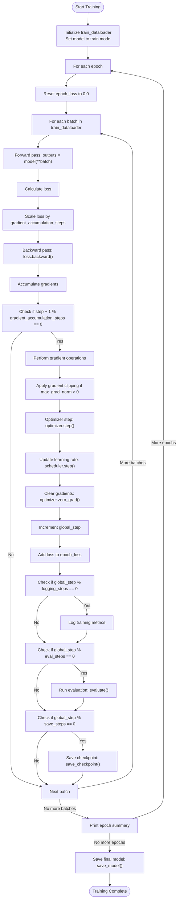

# Fine-Tuning Execution

<cite>
**Referenced Files in This Document**   
- [trainer.py](file://mahoun/finetuning/trainer.py)
- [config.py](file://mahoun/finetuning/config.py)
- [unsloth_runner.py](file://mahoun/finetuning/unsloth_runner.py)
- [data_augmentation.py](file://mahoun/finetuning/data_augmentation.py)
- [feedback_pipeline.py](file://mahoun/finetuning/feedback_pipeline.py)
- [run_gat_trainer.py](file://mahoun/graph/training/run_gat_trainer.py)
- [ultra_gat_trainer.py](file://mahoun/graph/ultra_gat_trainer.py)
- [trainer.py](file://mahoun/rag/training/trainer.py)
- [config.py](file://mahoun/rag/training/config.py)
- [stress_test_finetuning.py](file://tests/stress_test_finetuning.py)
</cite>

## Table of Contents
1. [Introduction](#introduction)
2. [Configuration Management](#configuration-management)
3. [Training Engine Implementation](#training-engine-implementation)
4. [Unsloth Integration](#unsloth-integration)
5. [Specialized Trainers](#specialized-trainers)
6. [Training Loop Mechanics](#training-loop-mechanics)
7. [Checkpointing and Early Stopping](#checkpointing-and-early-stopping)
8. [Hyperparameter Scheduling](#hyperparameter-scheduling)
9. [Performance Considerations](#performance-considerations)
10. [Common Issues and Solutions](#common-issues-and-solutions)

## Introduction
The fine-tuning execution engine provides a comprehensive framework for model adaptation through user feedback integration. The system orchestrates the entire fine-tuning process from dataset preparation to model training, with specialized components for different model types and training requirements. This document details the implementation of the trainer.py module, its integration with Unsloth for efficient fine-tuning, specialized trainers for RAG and graph-based models, and the various mechanisms for ensuring training stability and performance.

**Section sources**
- [trainer.py](file://mahoun/finetuning/trainer.py#L1-L195)
- [unsloth_runner.py](file://mahoun/finetuning/unsloth_runner.py#L1-L166)

## Configuration Management
The fine-tuning pipeline is configured through a hierarchical configuration system that allows for domain-specific settings and modular component configuration. The DocumentToTrainingConfig class serves as the master configuration, containing sub-configurations for different pipeline components.



**Diagram sources**
- [config.py](file://mahoun/finetuning/config.py#L1-L334)

**Section sources**
- [config.py](file://mahoun/finetuning/config.py#L1-L334)

## Training Engine Implementation
The TrainingManager class orchestrates the end-to-end training process, managing dataset preparation, job execution, and state tracking. It integrates with the feedback pipeline to convert user feedback into training datasets and manages the training job lifecycle.



**Diagram sources**
- [trainer.py](file://mahoun/finetuning/trainer.py#L1-L195)
- [feedback_pipeline.py](file://mahoun/finetuning/feedback_pipeline.py#L1-L598)
- [data_augmentation.py](file://mahoun/finetuning/data_augmentation.py#L1-L310)

**Section sources**
- [trainer.py](file://mahoun/finetuning/trainer.py#L1-L195)
- [feedback_pipeline.py](file://mahoun/finetuning/feedback_pipeline.py#L1-L598)
- [data_augmentation.py](file://mahoun/finetuning/data_augmentation.py#L1-L310)

## Unsloth Integration
The UnslothRunner class provides integration with the Unsloth library for efficient fine-tuning of large language models. It handles model loading, LoRA adapter configuration, dataset formatting, and training execution with mixed-precision support.



**Diagram sources**
- [unsloth_runner.py](file://mahoun/finetuning/unsloth_runner.py#L1-L166)

**Section sources**
- [unsloth_runner.py](file://mahoun/finetuning/unsloth_runner.py#L1-L166)

## Specialized Trainers
The system includes specialized trainers for different model types, including RAG models and graph-based models. The UltraAdvancedTrainer provides comprehensive support for various training modes and distributed training, while the UltraGATTrainer handles graph attention network training.

```mermaid
classDiagram
class UltraAdvancedTrainer {
-TrainingConfig config
-nn.Module model
-Dataset train_dataset
-Dataset eval_dataset
-Any tokenizer
-List[Any] callbacks
-int global_step
-int epoch
-float best_metric
+_setup_distributed() None
+_setup_model() None
+_setup_optimizer() None
+_setup_scheduler() None
+_setup_logging() None
+train() None
+evaluate() Dict[str, float]
+save_checkpoint() None
+save_model() None
}
class TrainingConfig {
+str output_dir
+str run_name
+int seed
+str model_name_or_path
+TrainingMode training_mode
+QuantizationConfig quantization
+LoRAConfig lora_config
+int num_train_epochs
+int per_device_train_batch_size
+int per_device_eval_batch_size
+int gradient_accumulation_steps
+float learning_rate
+float weight_decay
+float warmup_ratio
+float max_grad_norm
+str optimizer
+str lr_scheduler_type
+List[OptimizationStrategy] optimization_strategies
+bool fp16
+bool bf16
+bool fp8
+bool tf32
+DistributedBackend distributed_backend
+int local_rank
+int world_size
+Dict[str, Any] deepspeed_config
+int zero_stage
+bool gradient_checkpointing
+Dict[str, Any] gradient_checkpointing_kwargs
+int logging_steps
+int eval_steps
+int save_steps
+int save_total_limit
+List[str] report_to
+str wandb_project
+str wandb_entity
+str evaluation_strategy
+str metric_for_best_model
+bool greater_is_better
+bool load_best_model_at_end
+bool curriculum_learning
+str curriculum_strategy
+bool active_learning
+str active_learning_strategy
+int active_learning_budget
+bool multi_task
+Dict[str, float] task_weights
+bool distillation
+str teacher_model
+float distillation_alpha
+float distillation_temperature
+bool pruning
+float pruning_ratio
+str pruning_schedule
+bool continual_learning
+int replay_buffer_size
+float ewc_lambda
+bool rlhf
+str reward_model
+int ppo_epochs
+int max_seq_length
+bool packing
+str dataset_text_field
+bool data_augmentation
+List[str] augmentation_strategies
+int early_stopping_patience
+float early_stopping_threshold
+bool detect_anomaly
+float max_grad_norm
+int max_memory_MB
+bool cpu_offload
+bool pin_memory
+int dataloader_num_workers
+str resume_from_checkpoint
+bool save_safetensors
}
class GATConfig {
+GNNArchitecture architecture
+int hidden_dim
+int num_layers
+int num_heads
+float dropout
+float attention_dropout
+bool use_edge_features
+bool use_residual
+bool use_layer_norm
+bool use_batch_norm
+TaskType task_type
+int num_classes
+int num_epochs
+int batch_size
+float learning_rate
+float weight_decay
+int warmup_epochs
+str optimizer
+str scheduler
+float gradient_clip
+float label_smoothing
+float mixup_alpha
+bool enable_augmentation
+float drop_edge_rate
+float drop_node_rate
+float add_edge_rate
+bool enable_contrastive
+float contrastive_temperature
+float contrastive_weight
+bool enable_meta_learning
+float meta_lr
+int num_support
+int num_query
+bool distributed
+int world_size
+int eval_every
+int save_every
+int early_stopping_patience
+str output_dir
+str checkpoint_dir
}
class UltraGATTrainer {
-GATConfig config
-UltraGAT model
-Any train_data
-Any val_data
-Any test_data
-torch.device device
-torch.optim.Optimizer optimizer
-torch.optim.lr_scheduler scheduler
-torch.nn.Module criterion
-Dict stats
+_create_optimizer() torch.optim.Optimizer
+_create_scheduler() torch.optim.lr_scheduler
+_create_criterion() torch.nn.Module
+train() None
+_train_epoch(epoch : int) float
+_evaluate(data : Any) Tuple[float, float]
+_save_checkpoint(epoch : int, is_best : bool) None
}
UltraAdvancedTrainer --> TrainingConfig : "uses"
UltraGATTrainer --> GATConfig : "uses"
```



**Diagram sources**
- [trainer.py](file://mahoun/rag/training/trainer.py#L1-L386)
- [config.py](file://mahoun/rag/training/config.py#L1-L248)
- [ultra_gat_trainer.py](file://mahoun/graph/ultra_gat_trainer.py#L1-L537)
- [run_gat_trainer.py](file://mahoun/graph/training/run_gat_trainer.py#L1-L168)

**Section sources**
- [trainer.py](file://mahoun/rag/training/trainer.py#L1-L386)
- [config.py](file://mahoun/rag/training/config.py#L1-L248)
- [ultra_gat_trainer.py](file://mahoun/graph/ultra_gat_trainer.py#L1-L537)
- [run_gat_trainer.py](file://mahoun/graph/training/run_gat_trainer.py#L1-L168)

## Training Loop Mechanics
The training loop implements a comprehensive set of features for stable and efficient model training. The UltraAdvancedTrainer's training loop includes gradient accumulation, gradient clipping, learning rate scheduling, evaluation, checkpointing, and logging.



**Diagram sources**
- [trainer.py](file://mahoun/rag/training/trainer.py#L1-L386)

**Section sources**
- [trainer.py](file://mahoun/rag/training/trainer.py#L1-L386)

## Checkpointing and Early Stopping
The system implements robust checkpointing and early stopping mechanisms to ensure training stability and prevent overfitting. Checkpoints are saved at regular intervals, and the best model is preserved based on evaluation metrics.

```mermaid
flowchart TD
A[Training Loop] --> B{global_step % save_steps == 0?}
B --> |Yes| C[save_checkpoint()]
B --> |No| D{Evaluation Step?}
D --> |Yes| E[evaluate()]
E --> F{eval_metric better than best_metric?}
F --> |Yes| G[Update best_metric<br>Save best model checkpoint]
F --> |No| H{Patience exceeded?}
H --> |Yes| I[Early Stopping Triggered<br>Stop Training]
H --> |No| J[Continue Training]
G --> J
C --> D
I --> K[Training Complete]
J --> A
```

**Diagram sources**
- [trainer.py](file://mahoun/rag/training/trainer.py#L1-L386)
- [ultra_gat_trainer.py](file://mahoun/graph/ultra_gat_trainer.py#L1-L537)

**Section sources**
- [trainer.py](file://mahoun/rag/training/trainer.py#L1-L386)
- [ultra_gat_trainer.py](file://mahoun/graph/ultra_gat_trainer.py#L1-L537)

## Hyperparameter Scheduling
The training system supports comprehensive hyperparameter scheduling, including learning rate scheduling, mixed precision training, and various optimization strategies. The learning rate scheduler is configured based on the number of training steps and warmup ratio.

```mermaid
flowchart TD
A[Training Start] --> B[Calculate num_training_steps]
B --> C[Calculate num_warmup_steps]
C --> D[Initialize scheduler]
D --> E[Training Loop]
E --> F{Training Step}
F --> G[optimizer.step()]
G --> H[scheduler.step()]
H --> I{Evaluation Step?}
I --> |Yes| J[Update scheduler based on evaluation metric if plateau]
I --> |No| K{More steps?}
J --> K
K --> |Yes| E
K --> |No| L[Training Complete]
style B fill:#f9f,stroke:#333
style C fill:#f9f,stroke:#333
style D fill:#f9f,stroke:#333
```

**Diagram sources**
- [trainer.py](file://mahoun/rag/training/trainer.py#L1-L386)

**Section sources**
- [trainer.py](file://mahoun/rag/training/trainer.py#L1-L386)

## Performance Considerations
The fine-tuning system is designed with performance optimization in mind, supporting mixed-precision training, distributed data parallelism, and cluster orchestration. The configuration allows for various optimization strategies to maximize training efficiency.

```mermaid
graph TD
A[Performance Optimization] --> B[Mixed Precision Training]
A --> C[Distributed Training]
A --> D[Gradient Checkpointing]
A --> E[Optimizer Selection]
A --> F[Memory Optimization]
B --> B1[fp16/bf16/fp8 Support]
B --> B2[Automatic dtype Detection]
C --> C1[DDP - DistributedDataParallel]
C --> C2[FSDP - Fully Sharded Data Parallel]
C --> C3[DeepSpeed Integration]
C --> C4[ZeRO Optimization]
D --> D1[Gradient Checkpointing]
D --> D2[Memory-Efficient Backpropagation]
E --> E1[adamw_torch]
E --> E2[adamw_8bit]
E --> E3[Lion Optimizer]
E --> E4[Adafactor]
F --> F1[4-bit/8-bit Quantization]
F --> F2[CPU Offload]
F --> F3[Zero Redundancy Optimizer]
F --> F4[Parameter Offloading]
style A fill:#ccf,stroke:#333
style B fill:#f9f,stroke:#333
style C fill:#f9f,stroke:#333
style D fill:#f9f,stroke:#333
style E fill:#f9f,stroke:#333
style F fill:#f9f,stroke:#333
```



**Diagram sources**
- [trainer.py](file://mahoun/rag/training/trainer.py#L1-L386)
- [config.py](file://mahoun/rag/training/config.py#L1-L248)

**Section sources**
- [trainer.py](file://mahoun/rag/training/trainer.py#L1-L386)
- [config.py](file://mahoun/rag/training/config.py#L1-L248)

## Common Issues and Solutions
The system addresses common fine-tuning challenges such as GPU memory exhaustion, training instability, and convergence failures through various mechanisms including gradient clipping, learning rate warmup, and mixed precision training.

```mermaid
graph TD
A[Common Issues] --> B[GPU Memory Exhaustion]
A --> C[Training Instability]
A --> D[Convergence Failures]
A --> E[Slow Training]
B --> B1[4-bit/8-bit Quantization]
B --> B2[Gradient Checkpointing]
B --> B3[CPU Offload]
B --> B4[ZeRO Optimization]
C --> C1[Gradient Clipping]
C --> C2[Learning Rate Warmup]
C --> C3[Mixed Precision Training]
C --> C4[Weight Decay]
D --> D1[Learning Rate Scheduling]
D --> D2[Early Stopping]
D --> D3[Proper Weight Initialization]
D --> D4[Batch Size Optimization]
E --> E1[Gradient Accumulation]
E --> E2[Distributed Training]
E --> E3[Optimizer Selection]
E --> E4[Data Loading Optimization]
style A fill:#ccf,stroke:#333
style B fill:#f9f,stroke:#333
style C fill:#f9f,stroke:#333
style D fill:#f9f,stroke:#333
style E fill:#f9f,stroke:#333
```



**Diagram sources**
- [trainer.py](file://mahoun/finetuning/trainer.py#L1-L195)
- [unsloth_runner.py](file://mahoun/finetuning/unsloth_runner.py#L1-L166)
- [trainer.py](file://mahoun/rag/training/trainer.py#L1-L386)

**Section sources**
- [trainer.py](file://mahoun/finetuning/trainer.py#L1-L195)
- [unsloth_runner.py](file://mahoun/finetuning/unsloth_runner.py#L1-L166)
- [trainer.py](file://mahoun/rag/training/trainer.py#L1-L386)