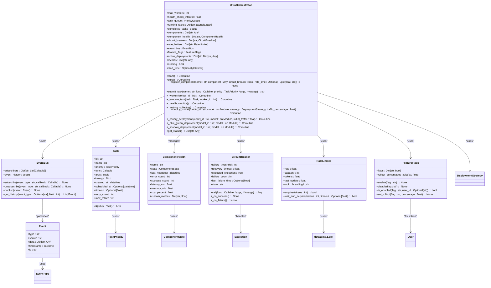
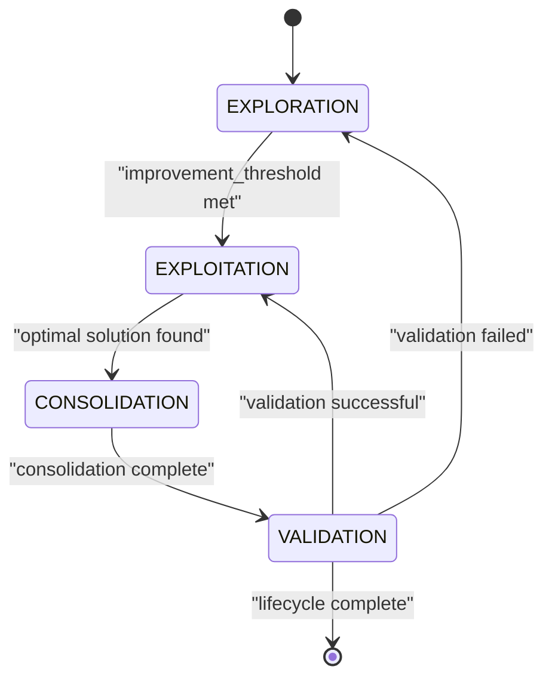
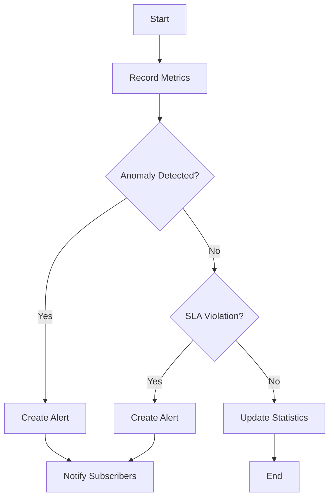
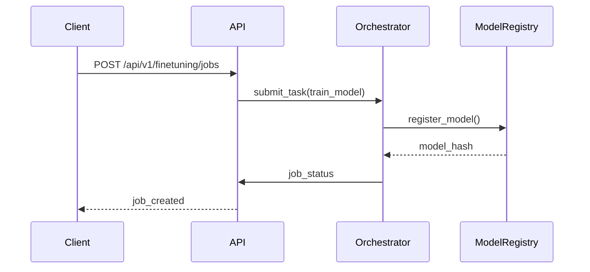
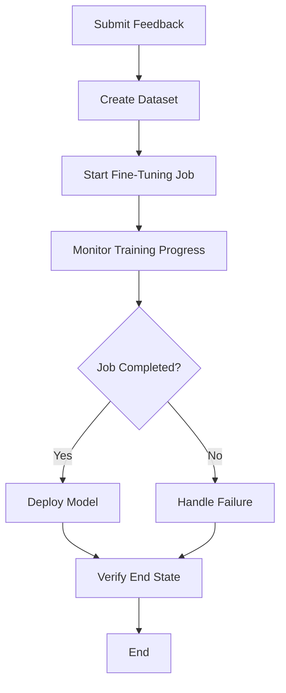
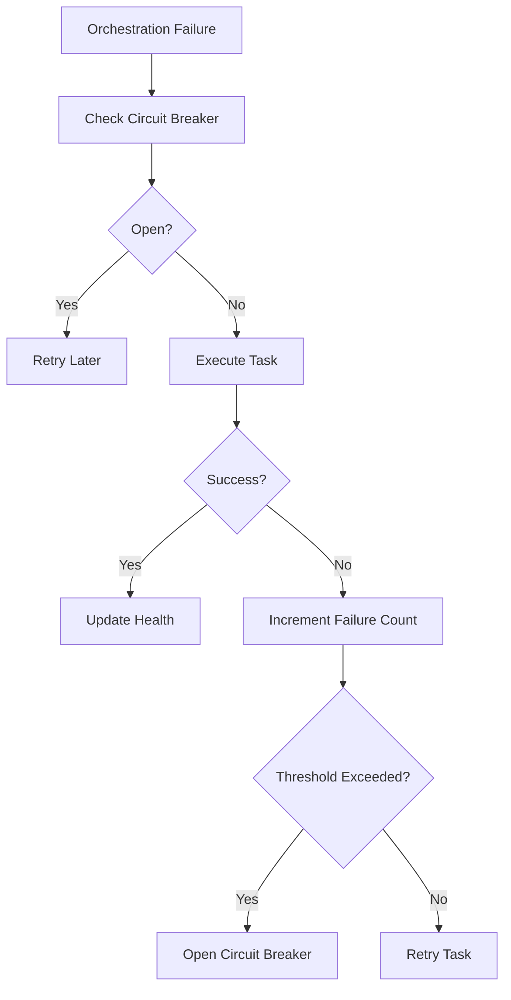
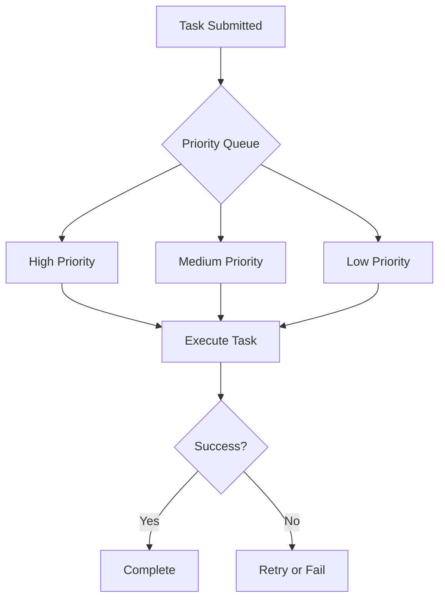

# Self-Improvement Orchestration

<cite>
**Referenced Files in This Document**   
- [ultra_orchestrator_complete.py](file://mahoun/self_improve/ultra_orchestrator_complete.py)
- [ultra_performance_monitoring.py](file://mahoun/self_improve/ultra_performance_monitoring.py)
- [self_improvement_system_v2.py](file://mahoun/self_improve/self_improvement_system_v2.py)
- [ultra_self_improve_integration.py](file://mahoun/self_improve/ultra_self_improve_integration.py)
- [finetuning/trainer.py](file://mahoun/finetuning/trainer.py)
- [api/routers/finetuning.py](file://api/routers/finetuning.py)
- [test_e2e_finetuning_flow.py](file://tests/test_e2e_finetuning_flow.py)
- [core/paths.py](file://mahoun/core/paths.py)
- [ledger/models.py](file://mahoun/ledger/models.py)
</cite>

## Table of Contents
1. [Introduction](#introduction)
2. [State Machine in Ultra Orchestrator](#state-machine-in-ultra-orchestrator)
3. [Self-Improvement System v2 Lifecycle](#self-improvement-system-v2-lifecycle)
4. [Performance Monitoring and Trigger Conditions](#performance-monitoring-and-trigger-conditions)
5. [Integration with API Layer and Model Registry](#integration-with-api-layer-and-model-registry)
6. [End-to-End Improvement Cycle Examples](#end-to-end-improvement-cycle-examples)
7. [Common Issues and Solutions](#common-issues-and-solutions)
8. [Performance Considerations](#performance-considerations)
9. [Conclusion](#conclusion)

## Introduction
The Self-Improvement Orchestration framework is a comprehensive system designed to automate the continuous improvement of AI models through feedback collection, data generation, training, and deployment. This document details the architecture and operation of the ultra_orchestrator_complete.py state machine, which coordinates these processes. The system integrates performance monitoring via ultra_performance_monitoring.py, automatic trigger conditions, and seamless integration with the API layer and model registry. The framework ensures robustness through mechanisms for handling orchestration failures, version drift, and rollback procedures, while optimizing pipeline scheduling, resource allocation, and failure recovery.

## State Machine in Ultra Orchestrator
The state machine in ultra_orchestrator_complete.py manages the lifecycle of self-improvement tasks through a series of well-defined states and transitions. It coordinates feedback collection, data generation, training, and deployment by utilizing a priority-based task queue, health monitoring, circuit breakers, and rate limiting. The orchestrator employs an event-driven architecture with a pub/sub event bus to facilitate real-time coordination and alerting.

**Diagram sources**
- [ultra_orchestrator_complete.py](file://mahoun/self_improve/ultra_orchestrator_complete.py#L1-L827)

**Section sources**
- [ultra_orchestrator_complete.py](file://mahoun/self_improve/ultra_orchestrator_complete.py#L1-L827)

## Self-Improvement System v2 Lifecycle
The self_improvement_system_v2.py implements a lifecycle that includes exploration, exploitation, consolidation, and validation phases. It uses multi-objective evolutionary optimization (NSGA-III), causal discovery with the PC algorithm, gradient-based fine-tuning, and anomaly detection with Isolation Forest. The system ensures thread-safe checkpointing and provides explainable adaptations.

**Diagram sources**
- [self_improvement_system_v2.py](file://mahoun/self_improve/self_improvement_system_v2.py#L1-L1492)

**Section sources**
- [self_improvement_system_v2.py](file://mahoun/self_improve/self_improvement_system_v2.py#L1-L1492)

## Performance Monitoring and Trigger Conditions
The ultra_performance_monitoring.py module provides real-time metrics collection, ML-based anomaly detection, distributed tracing, and SLA monitoring. It uses statistical methods and Isolation Forest for anomaly detection, with intelligent alert management that includes deduplication. The system triggers self-improvement cycles based on performance degradation, error rate increases, or user satisfaction drops.

**Diagram sources**
- [ultra_performance_monitoring.py](file://mahoun/self_improve/ultra_performance_monitoring.py#L1-L746)

**Section sources**
- [ultra_performance_monitoring.py](file://mahoun/self_improve/ultra_performance_monitoring.py#L1-L746)

## Integration with API Layer and Model Registry
The framework integrates with the API layer through the finetuning.py router, which exposes endpoints for managing fine-tuning jobs, datasets, and deployments. The model registry, implemented in ultra_self_improve_integration.py, uses a blockchain-inspired immutable ledger to track model versions, ensuring auditability and rollback capabilities.

**Diagram sources**
- [api/routers/finetuning.py](file://api/routers/finetuning.py#L1-L724)
- [ultra_self_improve_integration.py](file://mahoun/self_improve/ultra_self_improve_integration.py#L1-L428)

**Section sources**
- [api/routers/finetuning.py](file://api/routers/finetuning.py#L1-L724)
- [ultra_self_improve_integration.py](file://mahoun/self_improve/ultra_self_improve_integration.py#L1-L428)

## End-to-End Improvement Cycle Examples
The end-to-end tests in test_e2e_finetuning_flow.py demonstrate the complete improvement cycle, from feedback submission to model deployment. The tests validate the golden path, error handling, concurrent job processing, and input validation.

**Diagram sources**
- [test_e2e_finetuning_flow.py](file://tests/test_e2e_finetuning_flow.py#L1-L455)

**Section sources**
- [test_e2e_finetuning_flow.py](file://tests/test_e2e_finetuning_flow.py#L1-L455)

## Common Issues and Solutions
Common issues include orchestration failures, version drift, and rollback procedures. The system addresses these through circuit breakers, rate limiting, and a thread-safe checkpoint manager. The blockchain-inspired model registry prevents version drift by maintaining an immutable history of model versions.

**Diagram sources**
- [ultra_orchestrator_complete.py](file://mahoun/self_improve/ultra_orchestrator_complete.py#L1-L827)
- [self_improvement_system_v2.py](file://mahoun/self_improve/self_improvement_system_v2.py#L1-L1492)

**Section sources**
- [ultra_orchestrator_complete.py](file://mahoun/self_improve/ultra_orchestrator_complete.py#L1-L827)
- [self_improvement_system_v2.py](file://mahoun/self_improve/self_improvement_system_v2.py#L1-L1492)

## Performance Considerations
Performance considerations include pipeline scheduling, resource allocation, and failure recovery. The orchestrator uses a priority queue to schedule tasks, ensuring critical tasks are executed first. Resource allocation is managed through rate limiting and circuit breakers, preventing resource exhaustion. Failure recovery is achieved through retry logic, circuit breakers, and checkpointing.

**Diagram sources**
- [ultra_orchestrator_complete.py](file://mahoun/self_improve/ultra_orchestrator_complete.py#L1-L827)

**Section sources**
- [ultra_orchestrator_complete.py](file://mahoun/self_improve/ultra_orchestrator_complete.py#L1-L827)

## Conclusion
The Self-Improvement Orchestration framework provides a robust and scalable solution for automating the continuous improvement of AI models. By integrating feedback collection, data generation, training, and deployment into a cohesive system, it ensures that models remain accurate and reliable over time. The use of advanced techniques such as multi-objective evolutionary optimization, causal discovery, and anomaly detection enhances the system's ability to adapt to changing conditions. The framework's emphasis on performance monitoring, fault tolerance, and auditability makes it suitable for production environments where reliability and accountability are paramount.