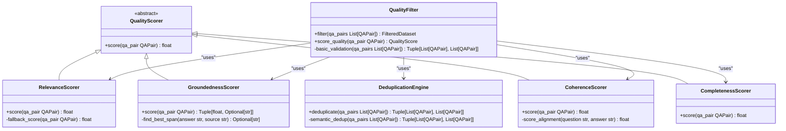
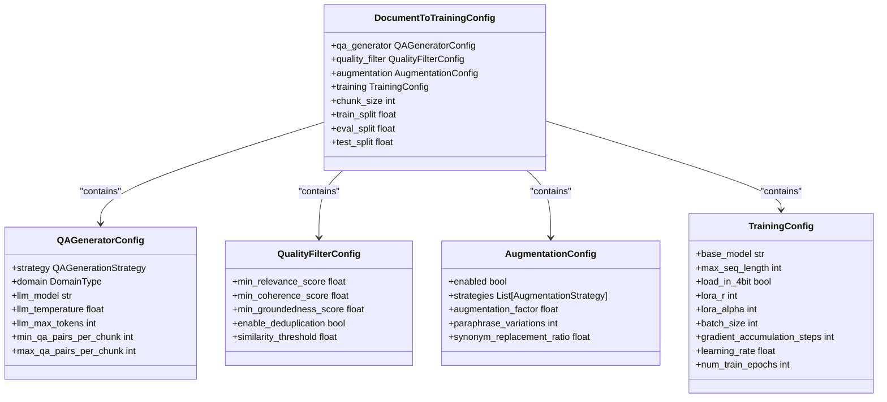
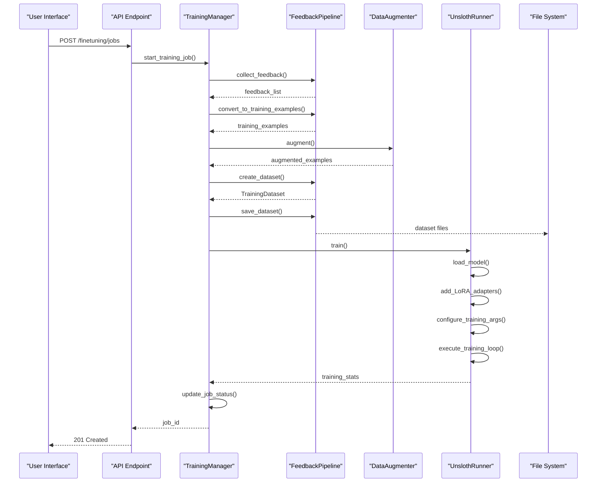

# Self-Improvement System

<cite>
**Referenced Files in This Document**   
- [finetuning/config.py](file://mahoun/finetuning/config.py)
- [finetuning/quality_filter.py](file://mahoun/finetuning/quality_filter.py)
- [finetuning/trainer.py](file://mahoun/finetuning/trainer.py)
- [finetuning/feedback_pipeline.py](file://mahoun/finetuning/feedback_pipeline.py)
- [finetuning/data_augmentation.py](file://mahoun/finetuning/data_augmentation.py)
- [finetuning/unsloth_runner.py](file://mahoun/finetuning/unsloth_runner.py)
- [self_improve/ultra_active_learning.py](file://mahoun/self_improve/ultra_active_learning.py)
- [self_improve/ultra_rl_agent.py](file://mahoun/self_improve/ultra_rl_agent.py)
- [tests/reproduce_finetuning.py](file://tests/reproduce_finetuning.py)
- [tests/stress_test_finetuning.py](file://tests/stress_test_finetuning.py)
</cite>

## Table of Contents
1. [Introduction](#introduction)
2. [Feedback Collection and Processing](#feedback-collection-and-processing)
3. [Quality Filtering and Data Augmentation](#quality-filtering-and-data-augmentation)
4. [Training Configuration and Runtime Controls](#training-configuration-and-runtime-controls)
5. [Fine-Tuning Job Execution](#fine-tuning-job-execution)
6. [Active Learning and Reinforcement Learning Components](#active-learning-and-reinforcement-learning-components)
7. [Model Deployment and Versioning](#model-deployment-and-versioning)
8. [Common Issues and Solutions](#common-issues-and-solutions)
9. [Performance Considerations](#performance-considerations)
10. [Practical Examples](#practical-examples)
11. [Conclusion](#conclusion)

## Introduction
The Self-Improvement System is a comprehensive framework designed to continuously enhance model performance through user feedback and automated learning mechanisms. This system implements a closed-loop pipeline that collects user feedback, processes it into high-quality training data, executes fine-tuning jobs, and deploys improved models. The architecture integrates advanced machine learning techniques including active learning and reinforcement learning to optimize the improvement process. The system is designed with enterprise-grade quality controls, ensuring that only high-quality, grounded data is used for model improvement while maintaining strict performance and reliability standards.

## Feedback Collection and Processing
The feedback pipeline forms the foundation of the self-improvement system, capturing user interactions and converting them into actionable training data. The system supports multiple feedback types including ratings, corrections, preferences, and rejections, each with different quality implications. The FeedbackPipeline class orchestrates the entire process, beginning with feedback collection from users through the API endpoints. Feedback is stored persistently in JSONL format, enabling reliable recovery and auditability. The pipeline applies sophisticated quality scoring that considers multiple factors: user rating, response time, confidence score, and feedback type. Corrections and preference feedback receive higher quality weights as they represent explicit user guidance. The system implements temporal filtering, allowing selection of feedback within specific date ranges for targeted improvement cycles. Feedback is converted into training examples with appropriate weighting, where corrections receive higher training weights (1.5) compared with ratings (normalized to 0-1 based on rating). The pipeline ensures that all training examples are properly attributed to their source feedback, maintaining traceability throughout the improvement process.

**Section sources**
- [finetuning/feedback_pipeline.py](file://mahoun/finetuning/feedback_pipeline.py#L1-L598)

## Quality Filtering and Data Augmentation
The quality filtering system implements a multi-dimensional assessment framework to ensure training data integrity. The QualityFilter class evaluates each Q&A pair across several dimensions: relevance, coherence, groundedness, and completeness. Groundedness validation is particularly critical, enforcing the Mahoun I1 invariant that requires all answers to be explicitly linked to evidence in the source material. This is implemented through the GroundednessScorer, which checks for exact substring matches, evidence span validation, and n-gram overlap analysis. The system employs a multi-stage filtering process that begins with basic validation (length and format checks), followed by comprehensive quality scoring, threshold filtering, and finally deduplication. The DeduplicationEngine uses both exact hash matching and semantic similarity based on sentence embeddings to identify and remove duplicate entries. For data augmentation, the system implements entity-preserving techniques specifically designed for legal text. The DataAugmenter applies synonym replacement using a domain-specific Persian legal synonym dictionary while protecting critical entities like article numbers, court names, and monetary values. Paraphrasing is performed through context-aware template-based transformations that maintain legal precision while introducing variation. Augmentation strategies can be configured to achieve a specific dataset expansion factor, with different strategies applied at configurable ratios.

**Diagram sources**
- [finetuning/quality_filter.py](file://mahoun/finetuning/quality_filter.py#L1-L763)

**Section sources**
- [finetuning/quality_filter.py](file://mahoun/finetuning/quality_filter.py#L1-L763)
- [finetuning/data_augmentation.py](file://mahoun/finetuning/data_augmentation.py#L1-L310)

## Training Configuration and Runtime Controls
The system provides comprehensive configuration options through the DocumentToTrainingConfig class, which organizes settings into logical groups for different pipeline stages. The configuration system supports domain-specific presets for legal, healthcare, financial, and general domains, automatically adjusting parameters like groundedness thresholds based on domain requirements. Legal and healthcare domains have higher groundedness requirements (0.85-0.9) compared to general domains (0.7), reflecting their stricter accuracy needs. The QAGeneratorConfig controls question-answer generation with multiple strategies: LLM-based, template-based, extractive, and hybrid approaches. Runtime controls include batch processing parameters, parallel worker limits, and caching options to optimize performance. The system implements a hierarchical configuration structure where domain-specific overrides are applied to a base configuration, ensuring consistent defaults while allowing specialization. Configuration parameters include detailed constraints with validation (e.g., temperature between 0.0-2.0, chunk size between 128-2048). The system supports dynamic configuration updates during runtime, allowing operators to adjust parameters without service interruption. Dataset splitting ratios are configurable with constraints ensuring valid distributions (train split 50-95%, eval split 5-30%, test split 0-20%). The configuration system is designed for both programmatic access and API integration, enabling external systems to control the fine-tuning process.

**Diagram sources**
- [finetuning/config.py](file://mahoun/finetuning/config.py#L1-L334)

**Section sources**
- [finetuning/config.py](file://mahoun/finetuning/config.py#L1-L334)

## Fine-Tuning Job Execution
The fine-tuning execution pipeline is orchestrated by the TrainingManager class, which coordinates dataset preparation, job execution, and status tracking. The process begins with dataset preparation, where feedback is converted to training examples, augmented, and split into train, evaluation, and test sets according to configurable ratios. The TrainingManager integrates with the FeedbackPipeline to collect and process feedback, then applies data augmentation to expand the dataset according to the specified augmentation factor. When a training job is initiated, the system creates a unique job ID and records all configuration parameters for reproducibility. The actual training is handled by the UnslothRunner, which manages the deep learning framework dependencies and training loop. The system implements graceful degradation, falling back to mock training when required dependencies (Unsloth, Torch) are not available, allowing development and testing without full ML infrastructure. Training arguments are configured according to the TrainingConfig, including optimizer selection, learning rate, batch size, and LoRA parameters for efficient fine-tuning. The system monitors training progress and captures metrics including loss values and training speed. Job status is tracked in memory with a history of all executed jobs, including their configuration, start/end times, and outcomes. Error handling is comprehensive, capturing and reporting any exceptions during the training process while ensuring the system remains available for subsequent jobs.

**Diagram sources**
- [finetuning/trainer.py](file://mahoun/finetuning/trainer.py#L1-L195)
- [finetuning/unsloth_runner.py](file://mahoun/finetuning/unsloth_runner.py#L1-L166)

**Section sources**
- [finetuning/trainer.py](file://mahoun/finetuning/trainer.py#L1-L195)
- [finetuning/unsloth_runner.py](file://mahoun/finetuning/unsloth_runner.py#L1-L166)

## Active Learning and Reinforcement Learning Components
The system incorporates advanced machine learning components for optimized self-improvement. The UltraActiveLearner implements state-of-the-art active learning strategies including BALD (Bayesian Active Learning by Disagreement), Query-by-Committee, Core-Set selection, and Learning Loss acquisition. These strategies identify the most informative samples for labeling, maximizing improvement per annotation effort. The BALDAcquisition function uses Monte Carlo dropout to estimate model uncertainty, while QueryByCommittee measures disagreement among an ensemble of models. Core-SetAcquisition selects samples that maximize diversity by measuring distance to the labeled set in feature space. The UltraRLAgent implements reinforcement learning with support for multiple algorithms including Rainbow DQN, which combines several improvements: double DQN, dueling networks, distributional RL, and noisy networks for exploration. The agent incorporates curiosity-driven exploration through IntrinsicCuriosityModule (ICM) and RandomNetworkDistillation (RND), generating intrinsic rewards for novel states. Hindsight Experience Replay (HER) is used to improve sample efficiency by relabeling past experiences with achieved goals as desired goals. The RainbowNetwork architecture combines dueling streams for value and advantage with distributional outputs represented as probability distributions over possible returns. Prioritized experience replay is implemented with the PrioritizedReplayBuffer, which samples transitions based on TD error magnitude, focusing learning on surprising experiences.

```mermaid
classDiagram
class UltraActiveLearner {
+query(unlabeled_pool torch.Tensor, budget int) Tuple[np.ndarray, np.ndarray]
+update_model(train_loader DataLoader, n_epochs int) Dict[str, float]
+evaluate(test_loader DataLoader) Dict[str, float]
}
class AcquisitionFunction {
<<abstract>>
+compute_scores(x torch.Tensor) np.ndarray
}
class BALDAcquisition {
+compute_scores(x torch.Tensor) np.ndarray
}
class EntropyAcquisition {
+compute_scores(x torch.Tensor) np.ndarray
}
class QueryByCommittee {
+compute_scores(x torch.Tensor) np.ndarray
}
class CoreSetAcquisition {
+compute_scores(x torch.Tensor) np.ndarray
}
class LearningLossAcquisition {
+compute_scores(x torch.Tensor) np.ndarray
}
class UltraRLAgent {
+select_action(state np.ndarray, epsilon float) int
+update(batch_size int) Dict[str, float]
+store_transition(state np.ndarray, action int, reward float, next_state np.ndarray, done bool)
}
class RainbowNetwork {
+forward(state torch.Tensor) torch.Tensor
+reset_noise()
}
class DuelingNetwork {
+forward(state torch.Tensor) torch.Tensor
}
class NoisyLinear {
+forward(x torch.Tensor) torch.Tensor
+reset_noise()
}
class IntrinsicCuriosityModule {
+forward(state torch.Tensor, action torch.Tensor, next_state torch.Tensor) Tuple[torch.Tensor, torch.Tensor, torch.Tensor]
}
class RandomNetworkDistillation {
+forward(state torch.Tensor) torch.Tensor
}
class PrioritizedReplayBuffer {
+add(state, action, reward, next_state, done)
+sample(batch_size int) Tuple[Dict, np.ndarray, np.ndarray]
+update_priorities(indices np.ndarray, td_errors np.ndarray)
}
UltraActiveLearner --> AcquisitionFunction : "uses"
AcquisitionFunction <|-- BALDAcquisition
AcquisitionFunction <|-- EntropyAcquisition
AcquisitionFunction <|-- QueryByCommittee
AcquisitionFunction <|-- CoreSetAcquisition
AcquisitionFunction <|-- LearningLossAcquisition
UltraRLAgent --> RainbowNetwork : "uses"
UltraRLAgent --> DuelingNetwork : "base"
RainbowNetwork --> NoisyLinear : "uses"
RainbowNetwork --> DuelingNetwork : "extends"
UltraRLAgent --> IntrinsicCuriosityModule : "uses"
UltraRLAgent --> RandomNetworkDistillation : "uses"
UltraRLAgent --> PrioritizedReplayBuffer : "uses"
```

**Diagram sources**
- [self_improve/ultra_active_learning.py](file://mahoun/self_improve/ultra_active_learning.py#L1-L554)
- [self_improve/ultra_rl_agent.py](file://mahoun/self_improve/ultra_rl_agent.py#L1-L633)

**Section sources**
- [self_improve/ultra_active_learning.py](file://mahoun/self_improve/ultra_active_learning.py#L1-L554)
- [self_improve/ultra_rl_agent.py](file://mahoun/self_improve/ultra_rl_agent.py#L1-L633)

## Model Deployment and Versioning
The system implements robust model versioning and deployment controls to ensure safe and reliable model updates. Each fine-tuning job produces a uniquely identified model version with complete provenance tracking, including the training dataset, configuration parameters, and job metadata. The deployment process supports multiple strategies including shadow deployment (running new and old models in parallel for comparison), canary releases (gradual traffic rollout), and A/B testing. Versioning is implemented through timestamp-based job IDs and comprehensive metadata storage, enabling full reproducibility of any model version. The system maintains a history of all deployed models, allowing for quick rollback in case of issues. Model artifacts are stored in organized directory structures with clear naming conventions, facilitating management and auditability. The deployment API supports traffic percentage controls, allowing operators to gradually increase traffic to new models while monitoring performance metrics. Health checks are integrated with the deployment process, automatically detecting and reporting model degradation. The system also implements model registry functionality, cataloging all available models with their performance characteristics, domain specialization, and compatibility information. Version compatibility checks prevent deployment of models that are incompatible with current system requirements or data schemas.

## Common Issues and Solutions
The system addresses several common challenges in the fine-tuning pipeline. Training stability issues are mitigated through multiple mechanisms: gradient clipping in the UnslothRunner, learning rate scheduling, and 4-bit quantization to reduce memory requirements. The quality filtering system prevents training on low-quality or hallucinated content by enforcing strict groundedness requirements through the GroundednessScorer. Data quality issues are addressed through multi-stage filtering that removes short, incoherent, or irrelevant Q&A pairs before training. The system handles model versioning challenges through comprehensive metadata tracking and provenance recording, ensuring that each model version can be fully reproduced. For distributed training scenarios, the system provides configuration options for batch size, gradient accumulation, and parallel processing to optimize resource utilization. The feedback pipeline includes mechanisms to handle feedback spam or abuse through quality scoring that downweights low-confidence or inconsistent feedback. Training job failures are handled gracefully with detailed error logging and status reporting, allowing operators to diagnose and resolve issues. The system also implements timeout controls and resource limits to prevent runaway training jobs from consuming excessive resources. Configuration validation prevents invalid parameter combinations that could lead to training failures or suboptimal results.

## Performance Considerations
The system is designed with performance optimization in mind for both training efficiency and inference quality. Distributed training is supported through configuration parameters that control batch size, gradient accumulation, and parallel worker counts. The LoRA (Low-Rank Adaptation) approach enables efficient fine-tuning by modifying only a small subset of model parameters, significantly reducing memory requirements and training time. 4-bit quantization is used to minimize GPU memory usage while maintaining model quality. The system implements caching at multiple levels, including intermediate processing results and model components, to avoid redundant computation. For large-scale operations, the system supports batch processing of feedback and parallel dataset processing to maximize throughput. The quality filtering system uses efficient algorithms for similarity calculation, including optimized cosine similarity computations and Jaccard index calculations for deduplication. The active learning components are designed to minimize computational overhead during inference while providing accurate uncertainty estimates. The reinforcement learning agent uses prioritized experience replay to focus learning on the most informative transitions, improving sample efficiency. The system also provides monitoring and profiling tools to identify performance bottlenecks and optimize resource allocation based on actual usage patterns.

## Practical Examples
The system includes practical examples that demonstrate its usage patterns and capabilities. The reproduce_finetuning.py script provides a template for reproducing fine-tuning experiments with proper path handling and package installation instructions. This script demonstrates the importance of installing the package in editable mode (pip install -e .) to ensure proper module resolution. The stress_test_finetuning.py script illustrates how to perform stress testing of the fine-tuning pipeline, helping identify performance bottlenecks and reliability issues under load. These test scripts follow best practices for portable path resolution, using pathlib to dynamically determine the repository root. The example usage in feedback_pipeline.py demonstrates the complete workflow: creating a pipeline instance, adding sample feedback of different types, running the complete pipeline to generate a dataset, and verifying the results. The ultra_rl_agent.py example shows how to initialize and use the reinforcement learning agent with Rainbow DQN configuration. The ultra_active_learning.py example demonstrates active learner initialization with BALD acquisition. These practical examples serve as both documentation and test cases, ensuring that the system remains functional and usable as it evolves.

**Section sources**
- [tests/reproduce_finetuning.py](file://tests/reproduce_finetuning.py#L1-L14)
- [tests/stress_test_finetuning.py](file://tests/stress_test_finetuning.py#L1-L14)

## Conclusion
The Self-Improvement System provides a comprehensive framework for continuous model enhancement through user feedback and automated learning. By integrating sophisticated quality controls, advanced machine learning techniques, and robust operational practices, the system enables reliable and efficient model improvement. The modular architecture separates concerns between feedback processing, quality filtering, training execution, and deployment, allowing each component to be optimized independently. The system's emphasis on groundedness and quality assurance ensures that model improvements are based on valid, evidence-linked data, maintaining high standards of accuracy and reliability. The inclusion of active learning and reinforcement learning components enables intelligent data selection and policy optimization, maximizing the effectiveness of the improvement process. With comprehensive configuration options, detailed monitoring, and robust error handling, the system is suitable for production deployment in demanding environments. The practical examples and test coverage provide confidence in the system's reliability and usability, making it a powerful tool for organizations seeking to continuously improve their AI systems.