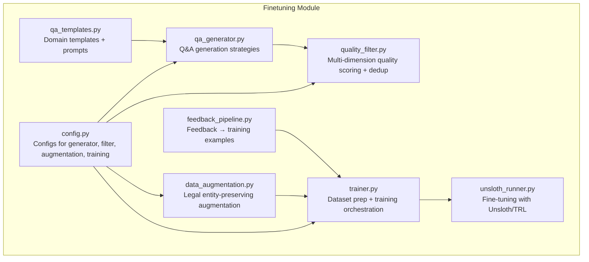
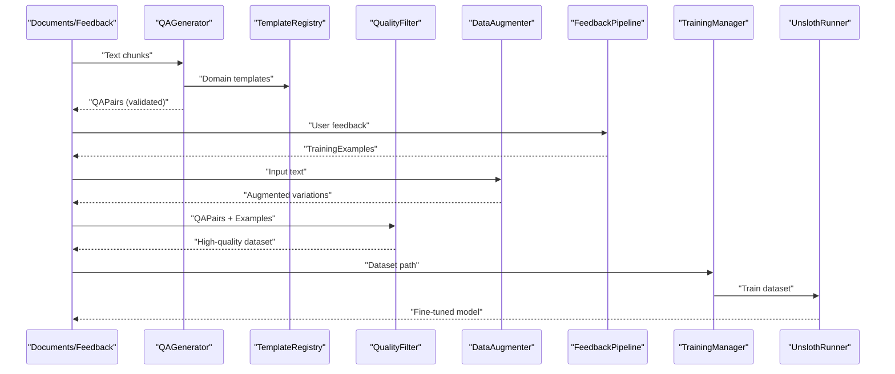
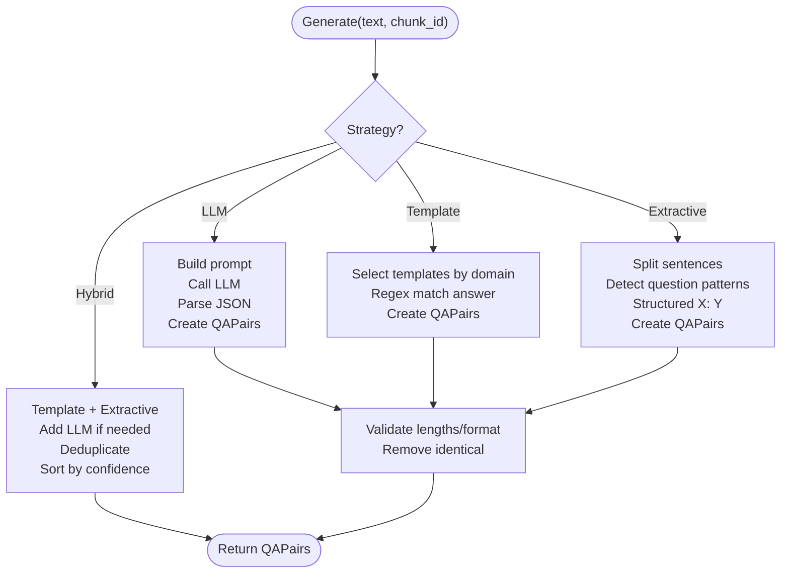
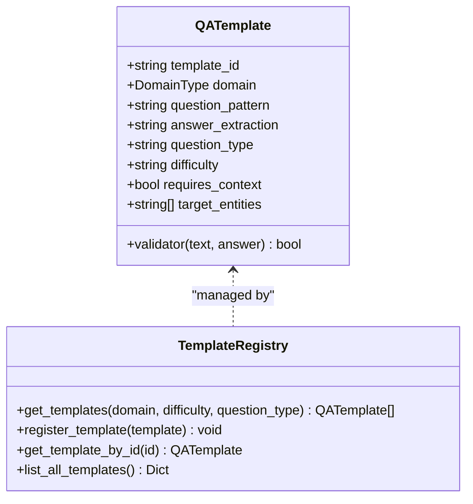
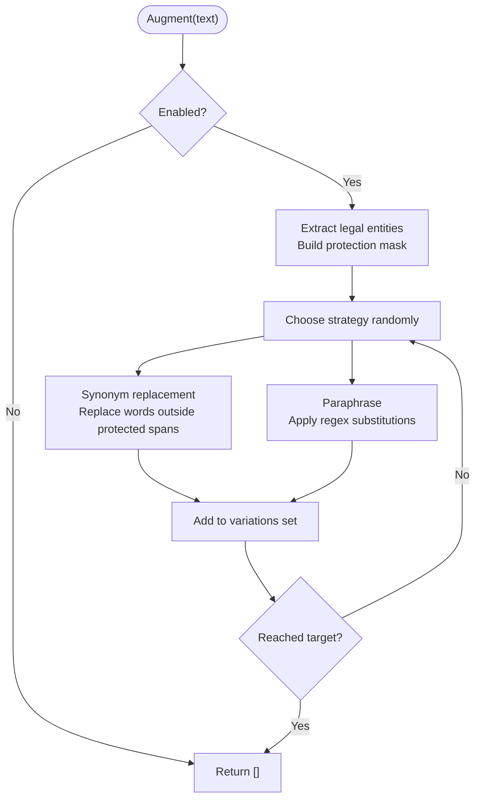
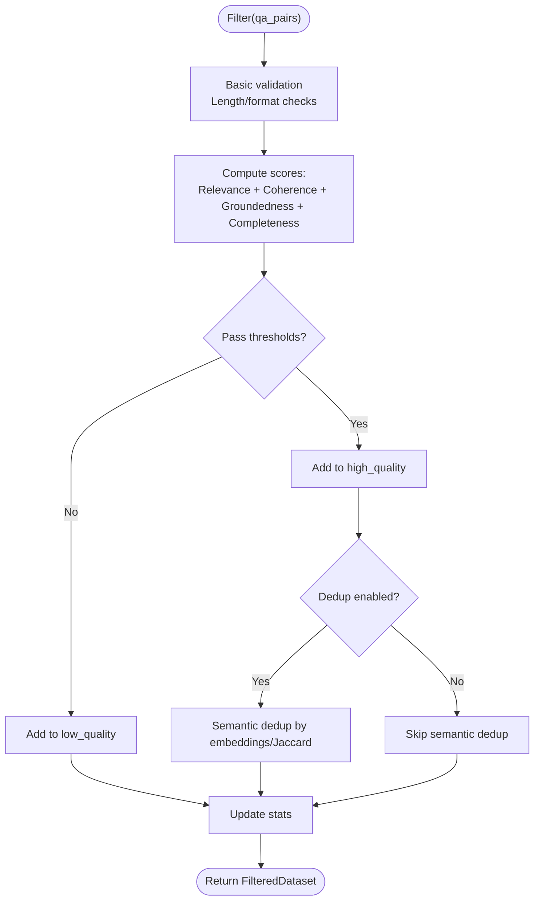
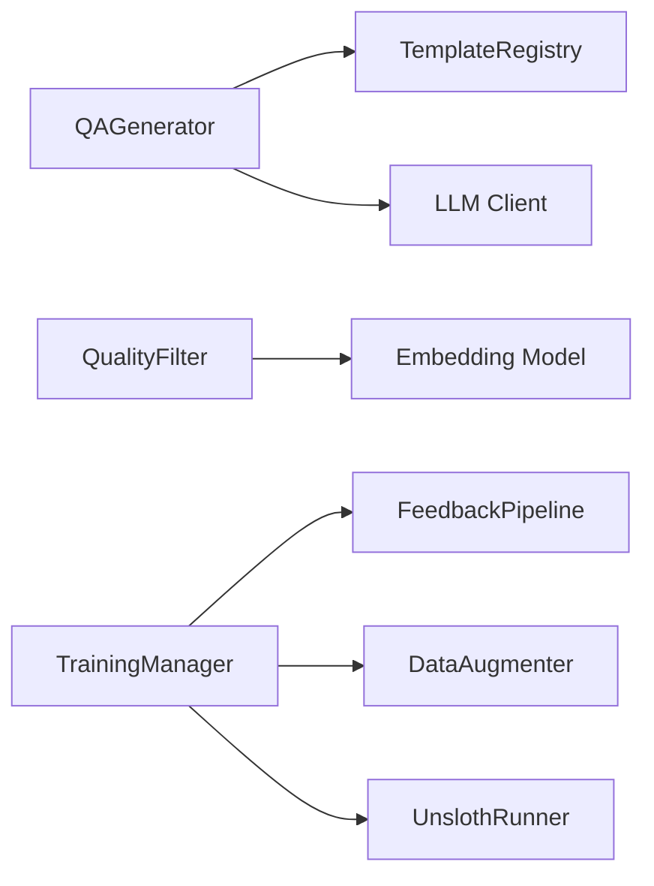

# Training Data Generation

<cite>
**Referenced Files in This Document**
- [qa_generator.py](file://mahoun/finetuning/qa_generator.py)
- [qa_templates.py](file://mahoun/finetuning/qa_templates.py)
- [data_augmentation.py](file://mahoun/finetuning/data_augmentation.py)
- [quality_filter.py](file://mahoun/finetuning/quality_filter.py)
- [config.py](file://mahoun/finetuning/config.py)
- [feedback_pipeline.py](file://mahoun/finetuning/feedback_pipeline.py)
- [trainer.py](file://mahoun/finetuning/trainer.py)
- [unsloth_runner.py](file://mahoun/finetuning/unsloth_runner.py)
- [reproduce_finetuning.py](file://tests/reproduce_finetuning.py)
</cite>

## Table of Contents
1. [Introduction](#introduction)
2. [Project Structure](#project-structure)
3. [Core Components](#core-components)
4. [Architecture Overview](#architecture-overview)
5. [Detailed Component Analysis](#detailed-component-analysis)
6. [Dependency Analysis](#dependency-analysis)
7. [Performance Considerations](#performance-considerations)
8. [Troubleshooting Guide](#troubleshooting-guide)
9. [Conclusion](#conclusion)
10. [Appendices](#appendices)

## Introduction
This document explains the training data generation pipeline used to produce high-quality, grounded, and diverse synthetic and feedback-derived examples for fine-tuning. It covers:
- Synthetic QA pair generation using templates and LLM prompts for legal and contractual reasoning
- Data augmentation techniques that preserve legal entities
- Quality filtering to ensure groundedness, diversity, and non-redundancy
- Input-output transformations for fine-tuning training
- Mitigations for template overfitting, answer hallucination, and class imbalance
- Performance considerations for batch generation and distributed processing

## Project Structure
The training data generation pipeline lives under the finetuning module and integrates with the broader platform’s LLM infrastructure and training runners.

**Diagram sources**
- [config.py](file://mahoun/finetuning/config.py#L1-L334)
- [qa_generator.py](file://mahoun/finetuning/qa_generator.py#L1-L437)
- [qa_templates.py](file://mahoun/finetuning/qa_templates.py#L1-L377)
- [data_augmentation.py](file://mahoun/finetuning/data_augmentation.py#L1-L310)
- [quality_filter.py](file://mahoun/finetuning/quality_filter.py#L1-L763)
- [feedback_pipeline.py](file://mahoun/finetuning/feedback_pipeline.py#L1-L598)
- [trainer.py](file://mahoun/finetuning/trainer.py#L1-L195)
- [unsloth_runner.py](file://mahoun/finetuning/unsloth_runner.py#L1-L166)

**Section sources**
- [config.py](file://mahoun/finetuning/config.py#L1-L334)

## Core Components
- QAGenerator: Implements multiple strategies (LLM-based, template-based, extractive, hybrid) to generate Q&A pairs with quality metadata and validation.
- TemplateRegistry and QATemplate: Provide domain-specific templates for legal, healthcare, financial, and general domains, enabling prompt engineering for contractual and legal reasoning.
- DataAugmenter: Generates paraphrases and synonym replacements while preserving legal entities to expand training coverage.
- QualityFilter: Applies multi-dimensional scoring (relevance, coherence, groundedness, completeness), deduplication, and threshold filtering to retain high-confidence, diverse, and non-redundant samples.
- FeedbackPipeline: Converts user feedback into training examples with quality weighting and dataset creation.
- TrainingManager and UnslothRunner: Orchestrate dataset preparation and fine-tuning using Unsloth/TRL.

**Section sources**
- [qa_generator.py](file://mahoun/finetuning/qa_generator.py#L1-L437)
- [qa_templates.py](file://mahoun/finetuning/qa_templates.py#L1-L377)
- [data_augmentation.py](file://mahoun/finetuning/data_augmentation.py#L1-L310)
- [quality_filter.py](file://mahoun/finetuning/quality_filter.py#L1-L763)
- [feedback_pipeline.py](file://mahoun/finetuning/feedback_pipeline.py#L1-L598)
- [trainer.py](file://mahoun/finetuning/trainer.py#L1-L195)
- [unsloth_runner.py](file://mahoun/finetuning/unsloth_runner.py#L1-L166)

## Architecture Overview
The pipeline transforms raw documents and feedback into a high-quality training dataset, then fine-tunes a model using Unsloth.

**Diagram sources**
- [qa_generator.py](file://mahoun/finetuning/qa_generator.py#L102-L330)
- [qa_templates.py](file://mahoun/finetuning/qa_templates.py#L268-L377)
- [quality_filter.py](file://mahoun/finetuning/quality_filter.py#L590-L763)
- [data_augmentation.py](file://mahoun/finetuning/data_augmentation.py#L156-L310)
- [feedback_pipeline.py](file://mahoun/finetuning/feedback_pipeline.py#L219-L491)
- [trainer.py](file://mahoun/finetuning/trainer.py#L40-L104)
- [unsloth_runner.py](file://mahoun/finetuning/unsloth_runner.py#L32-L155)

## Detailed Component Analysis

### Synthetic QA Pair Generation (qa_generator.py)
- Strategies:
  - LLM-based: Builds a domain-aware prompt and parses JSON responses into QAPair objects with confidence and evidence spans.
  - Template-based: Uses domain templates to extract answers via regex patterns and assigns question types and difficulties.
  - Extractive: Identifies question-like sentences and structured “X: Y” patterns to form factual pairs.
  - Hybrid: Combines template-based and extractive results, then adds LLM-based pairs to fill gaps, deduplicates, and sorts by confidence.
- Validation and deduplication:
  - Validates question/answer length/format and removes identical question/answer pairs.
  - Uses a simple Jaccard similarity threshold to remove near-duplicates.
- Domain awareness:
  - Detects Persian vs English text and adapts prompts accordingly.
  - Limits LLM prompt length and dynamically sets number of pairs based on chunk size.

**Diagram sources**
- [qa_generator.py](file://mahoun/finetuning/qa_generator.py#L102-L330)
- [qa_templates.py](file://mahoun/finetuning/qa_templates.py#L268-L377)

**Section sources**
- [qa_generator.py](file://mahoun/finetuning/qa_generator.py#L102-L330)
- [qa_templates.py](file://mahoun/finetuning/qa_templates.py#L268-L377)

### Domain-Specific Prompt Engineering (qa_templates.py)
- Legal domain templates:
  - Factual: parties, verdict, date, case number
  - Reasoning: court reasoning, evidence, law references
  - Comparative/complex: precedent alignment, legal implications
- Healthcare and financial templates follow similar patterns for domain-specific facts and reasoning.
- TemplateRegistry:
  - Filters templates by difficulty and question type.
  - Supports registration of custom templates and listing available templates per domain.
- LLM prompts:
  - Explicit groundedness requirement: answers must be directly supported by the text.
  - Diversity requirement: mix of factual, reasoning, and comparison questions.
  - JSON output format enforced for structured parsing.

**Diagram sources**
- [qa_templates.py](file://mahoun/finetuning/qa_templates.py#L20-L129)
- [qa_templates.py](file://mahoun/finetuning/qa_templates.py#L268-L377)

**Section sources**
- [qa_templates.py](file://mahoun/finetuning/qa_templates.py#L1-L377)

### Data Augmentation (data_augmentation.py)
- Legal entity preservation:
  - Extracts legal entities using regex rules and creates a boolean mask to protect spans during synonym replacement.
- Strategies:
  - Synonym replacement: replaces replaceable words with domain-appropriate synonyms while avoiding protected spans.
  - Paraphrasing: applies targeted regex substitutions to vary phrasing while preserving meaning.
- Controls:
  - Configurable augmentation factor and replacement ratio.
  - Attempts to generate sufficient variations with bounded retries.

**Diagram sources**
- [data_augmentation.py](file://mahoun/finetuning/data_augmentation.py#L156-L310)

**Section sources**
- [data_augmentation.py](file://mahoun/finetuning/data_augmentation.py#L1-L310)

### Quality Filtering (quality_filter.py)
- Scoring dimensions:
  - Relevance: embedding-based similarity between question, answer, and source.
  - Coherence: question/answer quality and alignment heuristics.
  - Groundedness: exact substring match, evidence span linkage, and n-gram overlap; Mahoun I1 invariant emphasis.
  - Completeness: answer length, sentence count, lexical diversity, and keyword coverage.
- Deduplication:
  - Exact hashing to remove duplicates.
  - Semantic deduplication via embeddings or fallback Jaccard similarity.
- Threshold filtering:
  - Applies configurable thresholds for relevance, coherence, and groundedness.
  - Produces high-quality and low-quality splits with statistics.

**Diagram sources**
- [quality_filter.py](file://mahoun/finetuning/quality_filter.py#L590-L763)

**Section sources**
- [quality_filter.py](file://mahoun/finetuning/quality_filter.py#L1-L763)

### Input-Output Transformations (examples from reproduce_finetuning.py)
- The test script demonstrates importing the repository root to run tests in a portable way, ensuring the training pipeline modules are discoverable.
- The feedback pipeline converts feedback into training examples with fields suitable for fine-tuning:
  - input_text: query
  - target_text: response or corrected/preferred response
  - quality_score and weight: derived from feedback quality
- These examples are saved as JSONL with standardized keys for downstream training.

**Section sources**
- [reproduce_finetuning.py](file://tests/reproduce_finetuning.py#L1-L14)
- [feedback_pipeline.py](file://mahoun/finetuning/feedback_pipeline.py#L219-L491)

## Dependency Analysis
- Cohesion and coupling:
  - QAGenerator depends on TemplateRegistry and LLM client abstraction; it is cohesive around generation strategies.
  - QualityFilter composes multiple scorers and dedup engines, maintaining separation of concerns.
  - DataAugmenter encapsulates legal entity extraction and synonym dictionaries.
  - Trainer orchestrates feedback pipeline and augmentation, delegating training to UnslothRunner.
- External dependencies:
  - Embedding models (sentence-transformers) for relevance and semantic dedup.
  - Unsloth/TRL for fine-tuning; optional fallback when unavailable.
- Potential circular dependencies:
  - None observed among the analyzed files; imports are top-down.

**Diagram sources**
- [qa_generator.py](file://mahoun/finetuning/qa_generator.py#L81-L101)
- [quality_filter.py](file://mahoun/finetuning/quality_filter.py#L90-L144)
- [trainer.py](file://mahoun/finetuning/trainer.py#L24-L40)
- [unsloth_runner.py](file://mahoun/finetuning/unsloth_runner.py#L32-L155)

**Section sources**
- [qa_generator.py](file://mahoun/finetuning/qa_generator.py#L1-L120)
- [quality_filter.py](file://mahoun/finetuning/quality_filter.py#L90-L144)
- [trainer.py](file://mahoun/finetuning/trainer.py#L24-L40)
- [unsloth_runner.py](file://mahoun/finetuning/unsloth_runner.py#L32-L155)

## Performance Considerations
- Batch generation:
  - Use chunked processing with configurable chunk size and overlap to balance coverage and cost.
  - Parallelize generation across chunks using async LLM calls and worker pools.
- Distributed processing:
  - Offload heavy embedding computations to dedicated nodes or GPU clusters.
  - Use message queues for asynchronous training job submission and progress tracking.
- Memory and I/O:
  - Enable caching for intermediate results and dataset metadata.
  - Stream JSONL writes to reduce memory footprint.
- LLM inference:
  - Tune temperature and max tokens to balance quality and throughput.
  - Prefer template-based and extractive strategies for initial coverage; reserve LLM-based generation for filling gaps.
- Deduplication:
  - Use approximate nearest neighbors for large-scale semantic deduplication to reduce latency.

[No sources needed since this section provides general guidance]

## Troubleshooting Guide
- Template overfitting:
  - Mitigation: Use hybrid strategy; add LLM-based generation to diversify question types and phrasings.
  - Ensure templates are registered and filtered by difficulty/type to avoid dominance of easy patterns.
- Answer hallucination:
  - Mitigation: Enforce groundedness scoring and require evidence spans; reject pairs without strong evidence linkage.
  - Increase groundedness threshold for legal domain.
- Class imbalance:
  - Mitigation: Weight examples by quality score and feedback type; apply stratified sampling when creating datasets.
  - Use feedback pipeline weights to emphasize corrections and preferences.
- Deduplication inefficiency:
  - Mitigation: Switch to embedding-based semantic dedup; adjust similarity thresholds based on domain.
- LLM failures:
  - Mitigation: Fallback to template-based generation; log and monitor LLM availability.

**Section sources**
- [qa_generator.py](file://mahoun/finetuning/qa_generator.py#L136-L198)
- [quality_filter.py](file://mahoun/finetuning/quality_filter.py#L696-L727)
- [feedback_pipeline.py](file://mahoun/finetuning/feedback_pipeline.py#L234-L282)

## Conclusion
The training data generation pipeline combines domain-aware template engineering, robust quality filtering, and legal entity-preserving augmentation to produce high-confidence, diverse, and grounded examples. By leveraging hybrid generation strategies and careful quality controls, it mitigates common pitfalls like template overfitting and hallucinations while preparing datasets ready for efficient fine-tuning.

[No sources needed since this section summarizes without analyzing specific files]

## Appendices

### Configuration Highlights
- QAGeneratorConfig: strategy, domain, LLM settings, and quality thresholds.
- QualityFilterConfig: thresholds for relevance, coherence, groundedness; dedup settings.
- AugmentationConfig: enabled strategies, augmentation factor, and replacement ratio.
- TrainingConfig: base model, LoRA parameters, training loop settings.
- DocumentToTrainingConfig: master config aggregating sub-configs, chunking, splits, and parallelism.

**Section sources**
- [config.py](file://mahoun/finetuning/config.py#L18-L334)