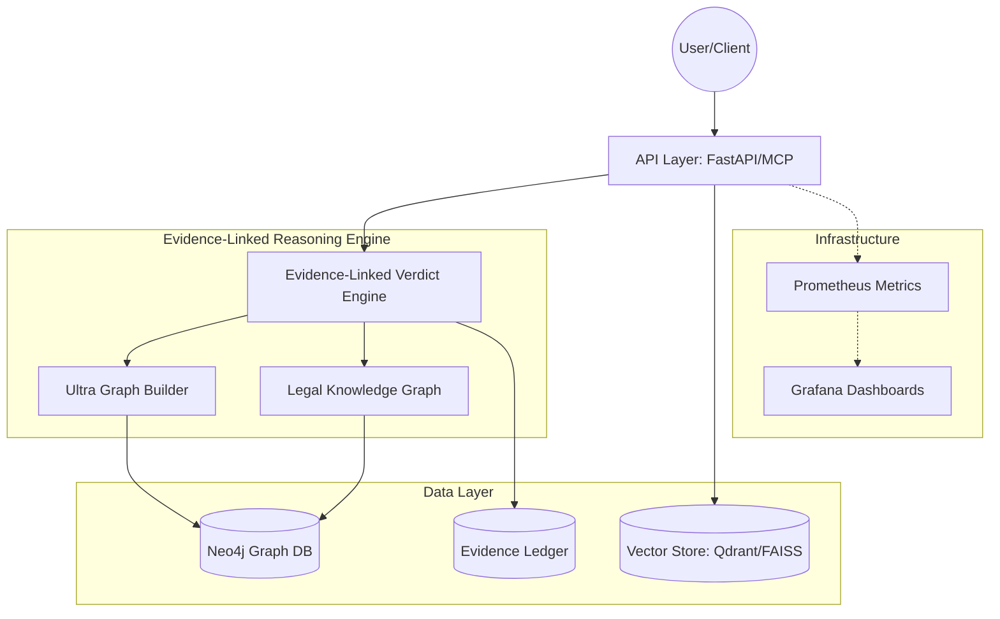

# Mahoun Platform Architecture 🏗️

This document describes the high-level architecture of the Mahoun platform, a zero-hallucination AI reasoning system.

## 1. System Overview

Mahoun follows a modular, layered architecture designed for auditability, scalability, and deterministic reasoning.



## 2. Core Components

### 🧠 Evidence-Linked Verdict Engine (ELVE)
The heart of Mahoun. It generates verdicts where every single reasoning step is explicitly linked to evidence in the Knowledge Graph. It ensures 100% groundedness (Invariant I1).

### 🕸️ Ultra Graph Builder (UGB)
Responsible for constructing and maintaining the Knowledge Graph. It handles multi-source data ingestion, entity resolution, and relationship extraction.

### 📚 Legal Knowledge Graph (LKG)
A domain-specific graph containing rules, precedents, and facts. It structured knowledge to enable deterministic reasoning.

### 🔌 MCP Layer (Model Context Protocol)
A production-grade interface that allows LLMs to interact with Mahoun's reasoning capabilities securely and robustly.

## 3. Data Flow

1. **Ingestion**: Documents are processed, vectorized, and converted into graph nodes/edges.
2. **Retrieval**: When a query comes in, the system performs a hybrid search (Dense + Sparse + Graph) to find relevant context.
3. **Reasoning**: The ELVE takes the retrieved context and question, finds applicable rules in the KG, and builds a reasoning chain.
4. **Verification**: Every step is checked for contradictions and evidence links.
5. **Output**: A final verdict is generated with a complete audit trail.

## 4. Security & Isolation

- **API Authentication**: X-API-Key based authentication.
- **Rate Limiting**: IP-based rate limiting via SlowAPI.
- **Network Isolation**: Docker networks separate public APIs from internal databases.
- **Audit Logging**: Every major action is logged in a structured format for forensic analysis.

## 5. Deployment Architecture

Mahoun is containerized using Docker and can be deployed via Docker Compose or Kubernetes.

| Service | Port | Description |
|---------|------|-------------|
| `mahoun-mcp` | 8000 | Main MCP / API Interface |
| `neo4j` | 7474/7687 | Knowledge Graph Database |
| `prometheus` | 9090 | Metrics Collection |
| `grafana` | 3000 | Monitoring Dashboards |
```
