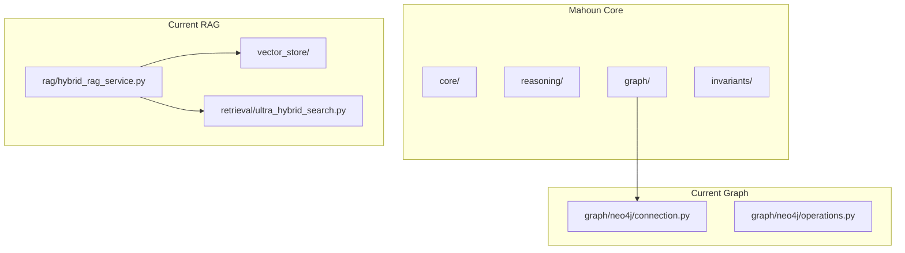
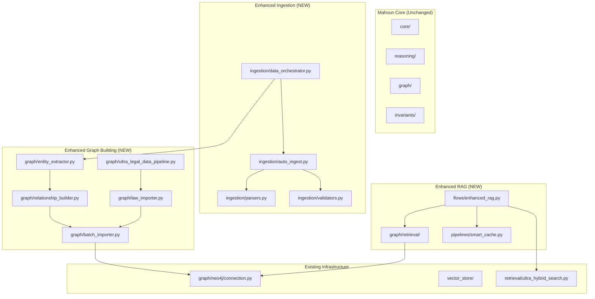

# Design Document: Domain Modules Integration (Ingestion, Graph, RAG)

## Overview

این سند طراحی فنی برای یکپارچه‌سازی ماژول‌های **data ingestion, knowledge graph building, و RAG** از `domain_modules/` به هسته Mahoun است. تمرکز فقط روی این سه بخش است و سایر ماژول‌ها (monitoring, security, etc.) در این فاز integrate نمی‌شوند.

**محدوده دقیق**:
- ✅ Data Ingestion Pipeline (document parsing, validation, orchestration)
- ✅ Knowledge Graph Building (entity extraction, relationship building, graph construction)
- ✅ RAG Enhancement (enhanced retrieval, graph-aware RAG)
- ❌ Monitoring, Security, Training, Fine-tuning (خارج از scope)

**Key Constraints**:
- حفظ معماری clean (zero boundary violations)
- فقط ENTERPRISE_FULL mode
- تست‌های جامع برای همه ماژول‌های جدید
- backward compatibility برای APIهای موجود

---

## Architecture

### Current State: Mahoun Platform



### Target State: Enhanced Platform



---

## Component Specifications

### 1. Data Ingestion Pipeline

#### 1.1 Auto Ingest (`mahoun/pipelines/ingestion/auto_ingest.py`)

**Purpose**: خودکارسازی ingestion اسناد حقوقی با پشتیبانی از فرمت‌های مختلف

**Source**: `domain_modules/pipelines/ingestion/auto_ingest.py`

**Key Features**:
- Multi-format support (PDF, DOCX, TXT, JSON)
- Automatic document classification
- Metadata extraction
- Error handling and retry logic
- Progress tracking

**Interface**:
```python
class AutoIngestPipeline:
    def __init__(
        self,
        parsers: Dict[str, DocumentParser],
        validators: List[Validator],
        output_dir: str
    ):
        """Initialize auto-ingest pipeline"""
        
    async def ingest_document(
        self,
        file_path: str,
        metadata: Optional[Dict] = None
    ) -> IngestResult:
        """Ingest single document"""
        
    async def ingest_batch(
        self,
        file_paths: List[str],
        batch_size: int = 10
    ) -> List[IngestResult]:
        """Ingest multiple documents in parallel"""
```

**Dependencies**:
- `mahoun.pipelines.ingestion.parsers`
- `mahoun.pipelines.ingestion.validators`
- `mahoun.schemas.legal_struct_schema`

**Testing Requirements**:
- Unit tests for each document format
- Integration tests with real legal documents
- Error handling tests (corrupted files, unsupported formats)
- Performance tests (large documents, batch processing)

---

#### 1.2 Document Parsers (`mahoun/pipelines/ingestion/parsers.py`)

**Purpose**: پارس کردن فرمت‌های مختلف اسناد حقوقی

**Source**: `domain_modules/pipelines/ingestion/parsers.py`

**Key Features**:
- PDF parser (with OCR support)
- DOCX parser (preserving structure)
- TXT parser (with encoding detection)
- JSON parser (structured legal data)
- HTML parser (web scraping)

**Interface**:
```python
class DocumentParser(ABC):
    @abstractmethod
    def parse(self, file_path: str) -> ParsedDocument:
        """Parse document and extract content"""

class PDFParser(DocumentParser):
    def parse(self, file_path: str) -> ParsedDocument:
        """Parse PDF with OCR fallback"""

class DOCXParser(DocumentParser):
    def parse(self, file_path: str) -> ParsedDocument:
        """Parse DOCX preserving structure"""
```

**Dependencies**:
- `PyPDF2` or `pdfplumber` for PDF
- `python-docx` for DOCX
- `chardet` for encoding detection
- `mahoun.schemas.text_schema`

---

#### 1.3 Data Validators (`mahoun/pipelines/ingestion/validators.py`)

**Purpose**: اعتبارسنجی داده‌های ingested

**Source**: `domain_modules/pipelines/ingestion/validators.py`

**Key Features**:
- Schema validation
- Content quality checks
- Metadata completeness validation
- Legal document structure validation

**Interface**:
```python
class Validator(ABC):
    @abstractmethod
    def validate(self, document: ParsedDocument) -> ValidationResult:
        """Validate document"""

class SchemaValidator(Validator):
    def validate(self, document: ParsedDocument) -> ValidationResult:
        """Validate against schema"""

class QualityValidator(Validator):
    def validate(self, document: ParsedDocument) -> ValidationResult:
        """Check content quality"""
```

---

#### 1.4 Data Orchestrator (`mahoun/pipelines/ingestion/data_orchestrator.py`)

**Purpose**: هماهنگی کل pipeline از ingestion تا graph building

**Source**: `domain_modules/pipelines/ingestion/data_orchestrator.py`

**Key Features**:
- End-to-end pipeline orchestration
- Parallel processing
- Error recovery
- Progress monitoring
- Checkpoint/resume support

**Interface**:
```python
class DataOrchestrator:
    def __init__(
        self,
        ingest_pipeline: AutoIngestPipeline,
        entity_extractor: EntityExtractor,
        graph_builder: GraphBuilder
    ):
        """Initialize orchestrator"""
        
    async def process_documents(
        self,
        file_paths: List[str],
        build_graph: bool = True
    ) -> OrchestrationResult:
        """Process documents end-to-end"""
```

---

### 2. Knowledge Graph Building

#### 2.1 Entity Extractor (`mahoun/graph/entity_extractor.py`)

**Purpose**: استخراج entities حقوقی از متن

**Source**: `domain_modules/graph/entity_extractor.py`

**Key Features**:
- NER for legal entities (laws, articles, cases, courts)
- Persian legal text support
- Entity linking and disambiguation
- Confidence scoring

**Interface**:
```python
class EntityExtractor:
    def __init__(
        self,
        model_name: str = "HooshvareLab/bert-fa-base-uncased-ner",
        entity_types: List[str] = None
    ):
        """Initialize entity extractor"""
        
    def extract_entities(
        self,
        text: str,
        min_confidence: float = 0.7
    ) -> List[Entity]:
        """Extract entities from text"""
        
    def batch_extract(
        self,
        texts: List[str]
    ) -> List[List[Entity]]:
        """Extract entities from multiple texts"""
```

**Entity Types**:
- LAW (قانون)
- ARTICLE (ماده)
- CASE (پرونده)
- COURT (دادگاه)
- PERSON (شخص)
- ORGANIZATION (سازمان)
- DATE (تاریخ)
- LOCATION (مکان)

---

#### 2.2 Relationship Builder (`mahoun/graph/relationship_builder.py`)

**Purpose**: ساخت روابط بین entities

**Source**: `domain_modules/graph/relationship_builder.py`

**Key Features**:
- Relation extraction from text
- Rule-based and ML-based approaches
- Relation type classification
- Confidence scoring

**Interface**:
```python
class RelationshipBuilder:
    def __init__(
        self,
        relation_types: List[str] = None,
        use_ml: bool = True
    ):
        """Initialize relationship builder"""
        
    def extract_relationships(
        self,
        text: str,
        entities: List[Entity]
    ) -> List[Relationship]:
        """Extract relationships between entities"""
        
    def build_graph_structure(
        self,
        documents: List[ParsedDocument]
    ) -> GraphStructure:
        """Build complete graph structure"""
```

**Relationship Types**:
- REFERENCES (ارجاع)
- AMENDS (اصلاح)
- REPEALS (نسخ)
- CITES (استناد)
- APPLIES_TO (اعمال)
- CONTRADICTS (تناقض)

---

#### 2.3 Batch Importer (`mahoun/graph/batch_importer.py`)

**Purpose**: import batch داده‌ها به Neo4j

**Source**: `domain_modules/graph/batch_importer.py`

**Key Features**:
- Efficient batch import (UNWIND queries)
- Transaction management
- Duplicate detection
- Progress tracking
- Error recovery

**Interface**:
```python
class BatchImporter:
    def __init__(
        self,
        neo4j_connection: Neo4jConnection,
        batch_size: int = 1000
    ):
        """Initialize batch importer"""
        
    async def import_entities(
        self,
        entities: List[Entity]
    ) -> ImportResult:
        """Import entities in batches"""
        
    async def import_relationships(
        self,
        relationships: List[Relationship]
    ) -> ImportResult:
        """Import relationships in batches"""
        
    async def import_graph(
        self,
        graph_structure: GraphStructure
    ) -> ImportResult:
        """Import complete graph structure"""
```

---

#### 2.4 Law Importer (`mahoun/graph/law_importer.py`)

**Purpose**: import تخصصی قوانین و مقررات

**Source**: `domain_modules/graph/law_importer.py`

**Key Features**:
- Structured law import (قانون → فصل → ماده)
- Hierarchy preservation
- Cross-reference resolution
- Amendment tracking

**Interface**:
```python
class LawImporter:
    def __init__(
        self,
        batch_importer: BatchImporter
    ):
        """Initialize law importer"""
        
    async def import_law(
        self,
        law_data: LawStructure
    ) -> ImportResult:
        """Import complete law with hierarchy"""
        
    async def import_amendments(
        self,
        amendments: List[Amendment]
    ) -> ImportResult:
        """Import law amendments"""
```

---

#### 2.5 Ultra Legal Data Pipeline (`mahoun/graph/ultra_legal_data_pipeline.py`)

**Purpose**: pipeline یکپارچه برای پردازش داده‌های حقوقی

**Source**: `domain_modules/graph/ultra_legal_data_pipeline.py`

**Key Features**:
- End-to-end legal data processing
- Multi-stage pipeline (parse → extract → build → import)
- Quality assurance at each stage
- Comprehensive logging

**Interface**:
```python
class UltraLegalDataPipeline:
    def __init__(
        self,
        orchestrator: DataOrchestrator,
        law_importer: LawImporter
    ):
        """Initialize ultra pipeline"""
        
    async def process_legal_corpus(
        self,
        corpus_path: str,
        corpus_type: str = "laws"
    ) -> PipelineResult:
        """Process complete legal corpus"""
```

---

### 3. Enhanced RAG

#### 3.1 Enhanced RAG Flow (`mahoun/flows/enhanced_rag.py`)

**Purpose**: RAG پیشرفته با graph-aware retrieval

**Source**: `domain_modules/flows/enhanced_rag.py`

**Key Features**:
- Graph-aware retrieval (traverse relationships)
- Multi-hop reasoning
- Context expansion via graph
- Hybrid retrieval (vector + graph + BM25)

**Interface**:
```python
class EnhancedRAGFlow:
    def __init__(
        self,
        hybrid_rag: HybridRAGService,
        graph_retriever: GraphRetriever,
        smart_cache: SmartCache
    ):
        """Initialize enhanced RAG"""
        
    async def retrieve(
        self,
        query: str,
        use_graph: bool = True,
        max_hops: int = 2,
        top_k: int = 10
    ) -> EnhancedRAGResult:
        """Retrieve with graph enhancement"""
        
    async def retrieve_with_reasoning(
        self,
        query: str,
        reasoning_depth: int = 2
    ) -> ReasoningResult:
        """Retrieve with multi-hop reasoning"""
```

**Retrieval Strategy**:
1. Vector search (initial candidates)
2. Graph expansion (related entities/documents)
3. BM25 re-ranking
4. Context assembly
5. Cache result

---

#### 3.2 Graph Retriever (`mahoun/graph/retrieval/graph_retriever.py`)

**Purpose**: retrieval مبتنی بر graph

**Source**: `domain_modules/graph/retrieval/` (multiple files)

**Key Features**:
- Cypher query generation
- Graph traversal strategies
- Relationship-aware retrieval
- Subgraph extraction

**Interface**:
```python
class GraphRetriever:
    def __init__(
        self,
        neo4j_connection: Neo4jConnection
    ):
        """Initialize graph retriever"""
        
    async def retrieve_by_entity(
        self,
        entity_id: str,
        max_hops: int = 2
    ) -> List[GraphNode]:
        """Retrieve nodes related to entity"""
        
    async def retrieve_by_relationship(
        self,
        relationship_type: str,
        source_entity: str
    ) -> List[GraphNode]:
        """Retrieve via specific relationship"""
        
    async def extract_subgraph(
        self,
        entity_ids: List[str],
        max_depth: int = 2
    ) -> Subgraph:
        """Extract subgraph around entities"""
```

---

#### 3.3 Smart Cache (`mahoun/pipelines/smart_cache.py`)

**Purpose**: caching چند سطحی با semantic matching

**Source**: `domain_modules/pipelines/smart_cache.py`

**Key Features**:
- L1 (memory) + L2 (Redis) cache
- Semantic similarity matching
- Adaptive TTL
- Cache analytics

**Interface**:
```python
class SmartCache:
    def __init__(
        self,
        max_l1_size: int = 1000,
        similarity_threshold: float = 0.92,
        enable_redis: bool = True
    ):
        """Initialize smart cache"""
        
    async def get(
        self,
        query: str,
        use_semantic: bool = True
    ) -> Tuple[Optional[List[Dict]], CacheLevel]:
        """Get from cache with semantic matching"""
        
    async def put(
        self,
        query: str,
        results: List[Dict],
        metadata: Optional[Dict] = None
    ):
        """Put in cache with adaptive TTL"""
```

---

## Integration Strategy

### Phase 1: Data Ingestion (Week 1)

**Tasks**:
1. Copy ingestion modules to `mahoun/pipelines/ingestion/`
2. Fix imports (relative → absolute)
3. Add type hints and docstrings
4. Write unit tests (parsers, validators)
5. Write integration tests (end-to-end ingestion)
6. Update `mahoun/__init__.py` exports

**Deliverables**:
- `mahoun/pipelines/ingestion/` (fully tested)
- Integration tests passing
- Documentation updated

---

### Phase 2: Knowledge Graph Building (Week 2)

**Tasks**:
1. Copy graph modules to `mahoun/graph/`
2. Integrate with existing Neo4j connection
3. Fix imports and dependencies
4. Add comprehensive tests
5. Validate with real legal data
6. Performance optimization (batch operations)

**Deliverables**:
- `mahoun/graph/entity_extractor.py`
- `mahoun/graph/relationship_builder.py`
- `mahoun/graph/batch_importer.py`
- `mahoun/graph/law_importer.py`
- `mahoun/graph/ultra_legal_data_pipeline.py`
- All tests passing

---

### Phase 3: Enhanced RAG (Week 3)

**Tasks**:
1. Copy RAG enhancement modules
2. Integrate with existing HybridRAGService
3. Add graph retrieval capabilities
4. Integrate smart cache
5. Write comprehensive tests
6. Performance benchmarking

**Deliverables**:
- `mahoun/flows/enhanced_rag.py`
- `mahoun/graph/retrieval/graph_retriever.py`
- `mahoun/pipelines/smart_cache.py`
- Integration with existing RAG
- Performance benchmarks

---

### Phase 4: End-to-End Testing & Documentation (Week 4)

**Tasks**:
1. End-to-end integration tests
2. Performance testing (large corpus)
3. Documentation (API docs, usage examples)
4. Migration guide
5. Deployment preparation

**Deliverables**:
- Complete test suite passing
- Performance benchmarks documented
- API documentation
- Usage examples
- Migration guide

---

## Testing Strategy

### Unit Tests

**Coverage Target**: 90%+

**Test Categories**:
1. **Parsers**: Each format (PDF, DOCX, TXT, JSON)
2. **Validators**: Schema, quality, metadata
3. **Entity Extraction**: Each entity type
4. **Relationship Building**: Each relationship type
5. **Graph Import**: Batch operations, transactions
6. **Cache**: L1/L2, semantic matching, TTL

**Test Framework**: pytest

---

### Integration Tests

**Test Scenarios**:
1. **Ingestion Pipeline**: Document → Parsed → Validated
2. **Graph Building**: Entities → Relationships → Neo4j
3. **Enhanced RAG**: Query → Retrieve (vector + graph) → Cache
4. **End-to-End**: Document → Graph → RAG → Answer

**Test Data**: Real legal documents (anonymized)

---

### Performance Tests

**Benchmarks**:
1. **Ingestion**: Documents/second
2. **Entity Extraction**: Entities/second
3. **Graph Import**: Nodes+Relationships/second
4. **RAG Retrieval**: Queries/second, latency (p50, p95, p99)
5. **Cache Hit Rate**: L1, L2, semantic

**Tools**: pytest-benchmark, locust (load testing)

---

## File Structure

```
mahoun/
├── pipelines/
│   └── ingestion/
│       ├── __init__.py
│       ├── auto_ingest.py
│       ├── parsers.py
│       ├── validators.py
│       └── data_orchestrator.py
│
├── graph/
│   ├── entity_extractor.py
│   ├── relationship_builder.py
│   ├── batch_importer.py
│   ├── law_importer.py
│   ├── ultra_legal_data_pipeline.py
│   └── retrieval/
│       ├── __init__.py
│       └── graph_retriever.py
│
├── flows/
│   ├── __init__.py
│   └── enhanced_rag.py
│
└── pipelines/
    └── smart_cache.py

tests/
├── test_ingestion/
│   ├── test_parsers.py
│   ├── test_validators.py
│   └── test_auto_ingest.py
│
├── test_graph/
│   ├── test_entity_extractor.py
│   ├── test_relationship_builder.py
│   ├── test_batch_importer.py
│   └── test_law_importer.py
│
└── test_rag/
    ├── test_enhanced_rag.py
    ├── test_graph_retriever.py
    └── test_smart_cache.py
```

---

## Dependencies

### New Dependencies

```toml
# Document parsing
PyPDF2 = "^3.0.0"
pdfplumber = "^0.10.0"
python-docx = "^1.0.0"
chardet = "^5.0.0"

# NER for entity extraction
transformers = "^4.35.0"
torch = "^2.1.0"

# Caching
redis = "^5.0.0"

# Existing (already in requirements.txt)
neo4j = "^5.14.0"
sentence-transformers = "^2.2.0"
```

---

## Risks & Mitigations

### Risk 1: Performance Degradation

**Risk**: Graph operations might slow down RAG retrieval

**Mitigation**:
- Implement smart caching (L1/L2)
- Optimize Cypher queries
- Add query timeouts
- Make graph retrieval optional (fallback to vector-only)

---

### Risk 2: Data Quality Issues

**Risk**: Ingested data might have quality issues

**Mitigation**:
- Multi-stage validation
- Quality scoring
- Manual review workflow for low-confidence extractions
- Comprehensive logging

---

### Risk 3: Integration Complexity

**Risk**: Integration with existing code might break functionality

**Mitigation**:
- Comprehensive test suite
- Backward compatibility checks
- Feature flags for gradual rollout
- Rollback plan

---

## Success Criteria

### Functional

- ✅ Ingest 1000+ legal documents successfully
- ✅ Extract entities with 85%+ accuracy
- ✅ Build knowledge graph with 100K+ nodes
- ✅ Enhanced RAG retrieval working end-to-end
- ✅ Cache hit rate > 60%

### Non-Functional

- ✅ Test coverage > 90%
- ✅ Zero boundary violations (clean architecture maintained)
- ✅ RAG latency < 500ms (p95)
- ✅ Graph import > 1000 nodes/sec
- ✅ Documentation complete

---

## Timeline

| Week | Phase | Deliverables |
|------|-------|--------------|
| 1 | Data Ingestion | Ingestion pipeline integrated & tested |
| 2 | Knowledge Graph | Graph building integrated & tested |
| 3 | Enhanced RAG | RAG enhancement integrated & tested |
| 4 | Testing & Docs | End-to-end tests, docs, deployment ready |

**Total Duration**: 4 weeks

---

## Appendix

### A. Module Mapping

| Domain Module | Target Location | Status |
|---------------|-----------------|--------|
| `domain_modules/pipelines/ingestion/auto_ingest.py` | `mahoun/pipelines/ingestion/auto_ingest.py` | Planned |
| `domain_modules/pipelines/ingestion/parsers.py` | `mahoun/pipelines/ingestion/parsers.py` | Planned |
| `domain_modules/pipelines/ingestion/validators.py` | `mahoun/pipelines/ingestion/validators.py` | Planned |
| `domain_modules/pipelines/ingestion/data_orchestrator.py` | `mahoun/pipelines/ingestion/data_orchestrator.py` | Planned |
| `domain_modules/graph/entity_extractor.py` | `mahoun/graph/entity_extractor.py` | Planned |
| `domain_modules/graph/relationship_builder.py` | `mahoun/graph/relationship_builder.py` | Planned |
| `domain_modules/graph/batch_importer.py` | `mahoun/graph/batch_importer.py` | Planned |
| `domain_modules/graph/law_importer.py` | `mahoun/graph/law_importer.py` | Planned |
| `domain_modules/graph/ultra_legal_data_pipeline.py` | `mahoun/graph/ultra_legal_data_pipeline.py` | Planned |
| `domain_modules/flows/enhanced_rag.py` | `mahoun/flows/enhanced_rag.py` | Planned |
| `domain_modules/graph/retrieval/*` | `mahoun/graph/retrieval/` | Planned |
| `domain_modules/pipelines/smart_cache.py` | `mahoun/pipelines/smart_cache.py` | Planned |

### B. Excluded Modules

این ماژول‌ها در این فاز integrate نمی‌شوند:
- Monitoring modules (alerting, anomaly detection, metrics)
- Security modules (PII scrubber, RBAC)
- Training modules (LoRA, fine-tuning)
- Advanced ML modules (GNN, active learning)
- Self-improvement modules

---

**Document Version**: 1.0  
**Last Updated**: 2026-05-06  
**Author**: Kiro AI Agent  
**Status**: Ready for Requirements Phase
